[TOC]

# SpringBoot

> B站狂神视频


## 1  微服务阶段

1. JavaSE：OOP
2. Mysql：持久化
3. html + css + js + jquery + 框架：视图
4. javaweb：独立开发MVC三层架构的网站
5. SSM：框架，，简化了开发流程，但配置较复杂
6. Spring再简化：SpringBoot；微服务架构
7. 服务越来越多：SpringCloud
8. 微服务架构问题：
	* 这么多服务，客户端如何去访问
	* 这么多服务，服务之间怎么通信
	* 这么多服务，怎么治理
	* 服务挂了，怎么办
	* 解决方案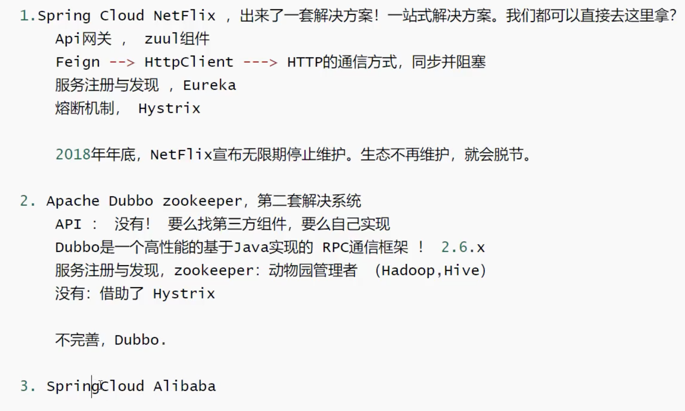


## 2  构建


### 2.1 网站构建

* https://spring.io/projects/spring-boot

* 

* controller

	```java
	@RestController
	public class HelloController {
	    @RequestMapping("/hello")
	    public String Hello(){
	        return "hello";
	    }
	}
	```

### 2.2 使用IDEA创建


* **HelloController.java**

```java
@Controller
@RequestMapping("/t1")
public class HelloController {
    @RequestMapping("/hello")
    @ResponseBody
    public String hello(){
        return "hello";
    }
}
```

* 改端口号 **application.properties**

	```properties
	server.port=8081
	```

* 更改启动时显示的 **banner 图案**；

	到项目下的 resources 目录下新建一个banner.txt 即可。

	图案可以到：https://www.bootschool.net/ascii 这个网站生成，然后拷贝到文件中即可！


## 3 原理

**自动装配pom.xml**：

* Spring-boot-dependenties.pom：核心依赖在父工程中
* 在写或引入一些springboot依赖的时候，不需要指定版本，因为有版本仓库

**启动器**：

* ```xml
	<dependency>
	    <groupId>org.springframework.boot</groupId>
	    <artifactId>spring-boot-starter-web</artifactId>
	</dependency>
	```

* 就是SpringBoot的启动场景

	* web就是自动导入web环境所有的依赖

* SpringBoot将所有的功能场景，变成对应的启动器；要使用的功能只需要对应的启动器

**主程序**：

```java
// @SpringBootApplication 标注这个类是springboot的应用
@SpringBootApplication
public class Springboot01HelloworldApplication {

    public static void main(String[] args) {
        // 将springboot的应用启动
        SpringApplication.run(Springboot01HelloworldApplication.class, args);
    }

}
```

**注解SpringBootApplication**

* ```java
	@SpringBootConfiguration：springboot的配置
	    @Configuration：spring配置类
	    	@Component：说明这也是一个spring的组件
	
	@EnableAutoConfiguration：自动配置
	    @AutoConfigurationPackage：自动配置包
	    	@Import(AutoConfigurationPackages.Registrar.class)：自动配置，包注册
	    @Import(AutoConfigurationImportSelector.class)：自动导入选择
	    	// 获取所有的配置
	    	List<String> configurations = getCandidateConfigurations(annotationMetadata, attributes);
	```

* 获取候选的配置 

	```java
	/**
		 * Return the auto-configuration class names that should be considered. By default
		 * this method will load candidates using {@link SpringFactoriesLoader} with
		 * {@link #getSpringFactoriesLoaderFactoryClass()}.
		 * @param metadata the source metadata
		 * @param attributes the {@link #getAttributes(AnnotationMetadata) annotation
		 * attributes}
		 * @return a list of candidate configurations
		 */
		protected List<String> getCandidateConfigurations(AnnotationMetadata metadata, AnnotationAttributes attributes) {
			List<String> configurations = SpringFactoriesLoader.loadFactoryNames(getSpringFactoriesLoaderFactoryClass(),
					getBeanClassLoader());
			Assert.notEmpty(configurations, "No auto configuration classes found in META-INF/spring.factories. If you "
					+ "are using a custom packaging, make sure that file is correct.");
			return configurations;
		}
	```

* META-INF/spring.factories：自动配置的核心文件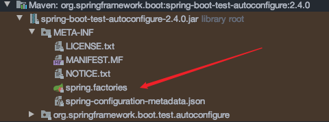

**注解结论：**

​        springboot所有自动配置类都是在启动的时候扫描并加载：spring.factories所有的自动配置类都在这里，但不一定生效，要判断条件是否成立，只要导入了对于的start，就有对应的启动器了，有了启动器，自动装配生效，就配置成功

1. SpringBoot在启动的时候从类路径下的**META-INF/spring.factories**中获取EnableAutoConfiguration指定的值
2. 将这些值作为自动配置类导入容器，自动配置类就生效，帮我们进行自动配置工作
3. 整个J2EE的整体解决方案和自动配置都在springboot-autoconfigure的jar包中
4. 它会给容器中导入非常多的自动配置类 （xxxAutoConfiguration）, 就是给容器中导入这个场景需要的所有组件，并配置好这些组件 
5. 有了自动配置类，免去了我们手动编写配置注入功能组件等的工作

**SpringApplication.run分析**

分析该方法主要分两部分，一部分是SpringApplication的实例化，二是run方法的执行；

**SpringApplication这个类主要做了以下四件事情：**

1、推断应用的类型是普通的项目还是Web项目

2、查找并加载所有可用初始化器 ， 设置到initializers属性中

3、找出所有的应用程序监听器，设置到listeners属性中

4、推断并设置main方法的定义类，找到运行的主类

**run方法**


## 4 yaml语法

* 删除properties，用yaml

	* application.properties : 语法结构 ：key=value

* - application.yml：语法结构 ：key：空格 value，**对空格要求高**，可以注入到配置类中

* properties只能存key-value对，yaml可以存对象

	```yaml
	# k-v
	name: komorebi
	
	# 对象
	student:
	  name: komorebi
	  age: 3
	
	# 行内写法
	student: {name: komorebi, age: 3}
	
	# 数组
	pets:
	  - cat
	  - dog
	
	pet: [cat, dog, pig]
	```

* ```xml
	<!-- 配置文件自动映射 -->
	<dependency>
	    <groupId>org.springframework.boot</groupId>
	    <artifactId>spring-boot-configuration-processor</artifactId>
	    <optional>true</optional>
	</dependency>
	```

### 4.1 yaml存对象

* 1 dog.java

	```java
	@Component  //注册bean到容器中
	public class Dog {
	    @Value("wang")
	    private String name;
	    @Value("3")
	    private Integer age;
	    
	    //有参无参构造、get、set方法、toString()方法  
	}
	```

* 2 person.java

	```java
	@Component //注册bean
	@ConfigurationProperties(prefix = "person")
	public class Person {
	    private String name;
	    private Integer age;
	    private Boolean happy;
	    private Date birth;
	    private Map<String, Object> maps;
	    private List<Object> lists;
	    private Dog dog;
	    //有参无参构造、get、set方法、toString()方法 
	}
	```

* 3 yaml

	```yaml
	person:
	  name: komorebi
	  age: 18
	  happy: false
	  birth: 2020/12/12
	  maps: {k1: v1, k2: v2}
	  lists:
	    - code
	    - girl
	  dog:
	    name: wang
	    age: 4
	```

* 4 test

	```java
	@SpringBootTest
	class Springboot02ConfigApplicationTests {
	    @Autowired
	    private Person person;
	
	    @Test
	    void contextLoads() {
	        System.out.println(person);
	    }
	}
	```

* 如果用properties配置的写法
	* 设置File Encodings
	* 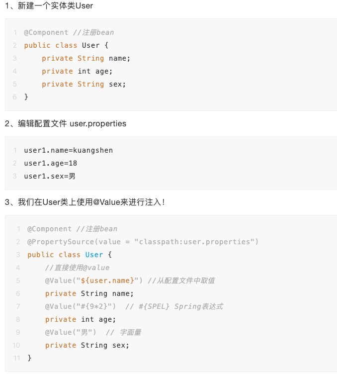

### 4.2 配置文件占位符

```yaml
person:
    name: qinjiang${random.uuid} # 随机uuid
    age: ${random.int}  # 随机int
    happy: false
    birth: 2000/01/01
    maps: {k1: v1,k2: v2}
    lists:
      - code
      - girl
      - music
    dog:
      name: ${person.hello:other}_旺财
      age: 1
```


### 4.3 数据校验

```java
@NotNull(message="名字不能为空")
private String userName;
@Max(value=120,message="年龄最大不能查过120")
private int age;
@Email(message="邮箱格式错误")
private String email;

空检查
@Null       验证对象是否为null
@NotNull    验证对象是否不为null, 无法查检长度为0的字符串
@NotBlank   检查约束字符串是不是Null还有被Trim的长度是否大于0,只对字符串,且会去掉前后空格.
@NotEmpty   检查约束元素是否为NULL或者是EMPTY.
    
Booelan检查
@AssertTrue     验证 Boolean 对象是否为 true  
@AssertFalse    验证 Boolean 对象是否为 false  
    
长度检查
@Size(min=, max=) 验证对象（Array,Collection,Map,String）长度是否在给定的范围之内  
@Length(min=, max=) string is between min and max included.

日期检查
@Past       验证 Date 和 Calendar 对象是否在当前时间之前  
@Future     验证 Date 和 Calendar 对象是否在当前时间之后  
@Pattern    验证 String 对象是否符合正则表达式的规则
```

```java
@Component  //注册bean
@Validated  //数据校验
@ConfigurationProperties(prefix = "person")
public class Person {
    @Email()
    private String name;
    private Integer age;
    private Boolean happy;
    private Date birth;
    private Map<String, Object> maps;
    private List<Object> lists;
    private Dog dog;
}
```

* 源码位置

### 4.4 多环境配置及配置文件位置

* yaml文件位置
	* 默认的是第四个，优先级**最低**的
* 多环境配置
	* 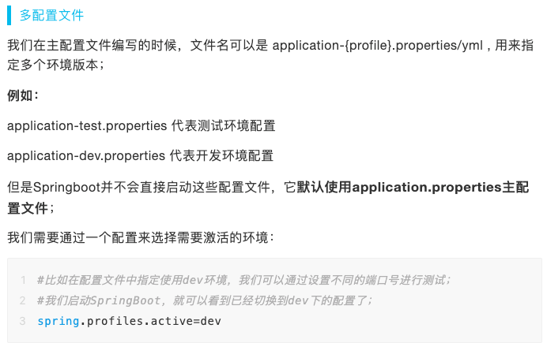
	* 

## 5 springboot web开发

### 5.1 静态资源

SpringBoot中，SpringMVC的web配置都在 **WebMvcAutoConfiguration** 这个配置类里面；

我们可以去看看 WebMvcAutoConfigurationAdapter 中有很多配置方法；

有一个方法：addResourceHandlers 添加资源处理

```java
@Override
public void addResourceHandlers(ResourceHandlerRegistry registry) {
    if (!this.resourceProperties.isAddMappings()) {
        logger.debug("Default resource handling disabled");
        return;
    }
    Duration cachePeriod = this.resourceProperties.getCache().getPeriod();
    CacheControl cacheControl = this.resourceProperties.getCache().getCachecontrol().toHttpCacheControl();
    if (!registry.hasMappingForPattern("/webjars/**")) {
        customizeResourceHandlerRegistration(registry.addResourceHandler("/webjars/**")
        .addResourceLocations("classpath:/META-INF/resources/webjars/")
        .setCachePeriod(getSeconds(cachePeriod)).setCacheControl(cacheControl)
        .setUseLastModified(this.resourceProperties.getCache().isUseLastModified()));
    }
    String staticPathPattern = this.mvcProperties.getStaticPathPattern();
	if (!registry.hasMappingForPattern(staticPathPattern)) {
		customizeResourceHandlerRegistration(registry.addResourceHandler(staticPathPattern)
		.addResourceLocations(getResourceLocations(this.resourceProperties.getStaticLocations()))
		.setCachePeriod(getSeconds(cachePeriod)).setCacheControl(cacheControl)
		.setUseLastModified(this.resourceProperties.getCache().isUseLastModified()));
	}
}
```

* 什么是webjars？一个可以帮助导入的包，包括jquery[https://www.webjars.org/]

* 静态资源目录

	```java
	// resources > static > public
	"classpath:/META-INF/resources/",
	"classpath:/resources/", 
	"classpath:/static/", 
	"classpath:/public/" 
	```

* 总结：

	* 可以使用一下方式处理静态资源
		* webjars         localhost:8080/webjars/
		* public      static       /**     resources    localhost:8080/
	* 

### 5.2 定制首页

* 方式一：在静态资源目录下放index.html

* 方式二：在templates目录下放，然后通过controller访问，需要模板引擎的支持

	```java
	@Controller
	public class IndexController {
	    @RequestMapping("/index")
	    public String index(){
	        return "index";
	    }
	}
	```

* 网站图标：favicon.ico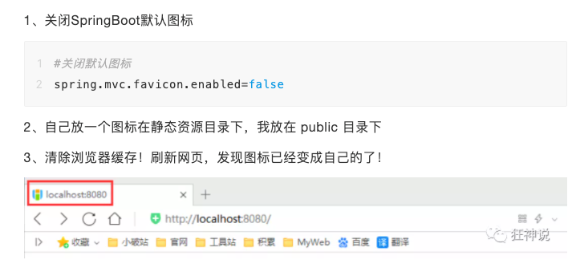

### 5.3 Thymeleaf

```xml
<!--thymeleaf-->
<dependency>
    <groupId>org.springframework.boot</groupId>
    <artifactId>spring-boot-starter-thymeleaf</artifactId>
</dependency>
```

​        前端交给我们的页面，是html页面。如果是我们以前开发，我们需要把他们转成jsp页面，jsp好处就是当我们查出一些数据转发到JSP页面以后，我们可以用jsp轻松实现数据的显示及交互等。

​		jsp支持非常强大的功能，包括能写Java代码，但是呢，我们现在的这种情况，SpringBoot这个项目首先是以jar的方式，不是war，第二，我们用的还是嵌入式的Tomcat，所以呢，**他现在默认是不支持jsp的**。

​		那不支持jsp，如果我们直接用纯静态页面的方式，那给我们开发会带来非常大的麻烦，那怎么办呢？

**SpringBoot推荐你可以来使用模板引擎：**

​		模板引擎，我们其实大家听到很多，其实jsp就是一个模板引擎，还有用的比较多的freemarker，包括SpringBoot给我们推荐的Thymeleaf，模板引擎有非常多，但再多的模板引擎，他们的思想都是一样的，什么样一个思想呢我们来看一下这张图：


* Thymeleaf 官网：https://www.thymeleaf.org/

	Thymeleaf 在Github 的主页：https://github.com/thymeleaf/thymeleaf

	Spring官方文档：找到我们对应的版本

	https://docs.spring.io/spring-boot/docs/2.2.5.RELEASE/reference/htmlsingle/#using-boot-starter 

	找到对应的pom依赖：可以适当点进源码看下本来的包！

* 只需要把我们的html页面放在类路径下的templates下，thymeleaf就可以帮我们自动渲染了。

* 测试

	* 1 修改测试请求，增加数据传输；

		```java
		@RequestMapping("/t1")
		public String test1(Model model){
		    //存入数据
		    model.addAttribute("msg","Hello,Thymeleaf");
		    //classpath:/templates/test.html
		    return "test";
		}
		```

	* 2 前端（注意命名空间）

		```html
		<!DOCTYPE html>
		<html lang="en" xmlns:th="http://www.thymeleaf.org">
		<head>
		    <meta charset="UTF-8">
		    <title>Title</title>
		</head>
		<body>
		
		<h1>test</h1>
		
		<!--th:text就是将div中的内容设置为它指定的值，和之前学习的Vue一样-->
		<div th:text="${msg}"></div>
		
		</body>
		</html>
		```

### 5.4 Thymeleaf语法

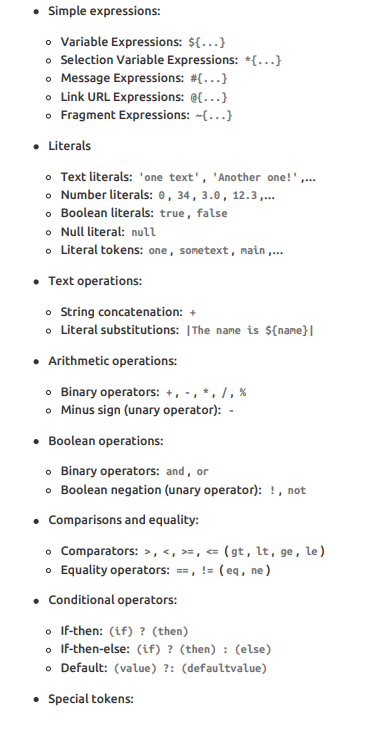

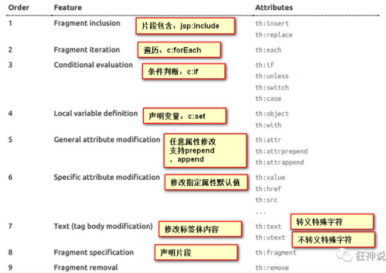

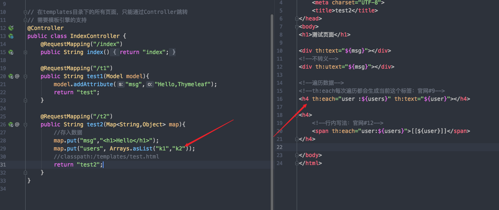


## 6 MVC配置原理

* https://mp.weixin.qq.com/s?__biz=Mzg2NTAzMTExNg==&mid=2247483819&idx=1&sn=b9009aaa2a9af9d681a131b3a49d8848&scene=19#wechat_redirect

* ```java
	// 如果想DIY一些定制化的功能，只需要写这个组件，springboot会自动装配
	// 扩展springmvc
	@Configuration
	public class MyMvcConfig implements WebMvcConfigurer {
	
	    @Bean
	    public ViewResolver myViewResolver(){
	        return new MyViewResolver();
	    }
	
	    // 自定义一个自己的视图解析器
	    public static class MyViewResolver implements ViewResolver{
	        @Override
	        public View resolveViewName(String viewName, Locale locale) throws Exception {
	            return null;
	        }
	    }
	
	    // 视图跳转
	    @Override
	    public void addViewControllers(ViewControllerRegistry registry) {
	        registry.addViewController("/komorebi").setViewName("test");
	    }
	}
	```

* 


## 7 员工管理系统

### 7.1 准备

1. 导入静态资源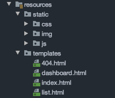

2. **新建实体类**

	(1) Department

	```java
	// 部门表
	@Data
	@NoArgsConstructor
	@AllArgsConstructor
	public class Department {
	    private Integer id;
	    private String departmentName;
	}
	```

	(2) Employee

	```java
	// 员工表
	@Data
	@NoArgsConstructor
	@AllArgsConstructor
	public class Employee {
	    private Integer id;
	    private String lastName;
	    private String email;
	    private Integer gender; // 0:女 1:男
	    private Department department;
	    private Date birth;
	
	    public Employee(Integer id, String lastName, String email, Integer gender, Department department) {
	        this.id = id;
	        this.lastName = lastName;
	        this.email = email;
	        this.gender = gender;
	        this.department = department;
	        this.birth = new Date();
	    }
	}
	```

3. **新建Dao层**
	（1）DepartmentDao

	```java
	// 部门Dao
	@Repository
	public class DepartmentDao {
	    // 模拟数据库中的数据
	    private static Map<Integer, Department> departments = null;
	    static {
	        departments = new HashMap<Integer, Department>();   // 创建一个部门表
	        departments.put(101, new Department(101, "教学部"));
	        departments.put(102, new Department(102, "市场部"));
	        departments.put(103, new Department(103, "教研部"));
	        departments.put(104, new Department(104, "研发部"));
	        departments.put(105, new Department(105, "组织部"));
	    }
	
	    // 数据库操作
	    public Collection<Department> getDepartments(){
	        return departments.values();
	    }
	
	    // 通过id得到部门
	    public Department getDepartmentById(Integer id){
	        return departments.get(id);
	    }
	}
	```

	（2）EmployeeDao

	```java
	// 员工Dao
	@Repository
	public class EmployeeDao {
	    // 模拟数据库中的数据
	    private static Map<Integer, Employee> employees = null;
	    // 员工有所属的部门
	    @Autowired
	    private DepartmentDao departmentDao;
	
	    static {
	        employees = new HashMap<Integer, Employee>();   // 创建一个部门表
	        employees.put(1001, new Employee(1001, "A", "a123@qq.com", 1, new Department(101, "教学部")));
	        employees.put(1002, new Employee(1002, "B", "b123@qq.com", 0, new Department(102, "市场部")));
	        employees.put(1003, new Employee(1003, "C", "c123@qq.com", 1, new Department(103, "教研部")));
	        employees.put(1004, new Employee(1004, "D", "d123@qq.com", 0, new Department(104, "研发部")));
	        employees.put(1005, new Employee(1005, "E", "e123@qq.com", 1, new Department(105, "组织部")));
	    }
	
	    // 增加一个员工，主键自增
	    private static Integer initId = 1006;
	    public void save(Employee employee){
	        if (employee.getId() == null) {
	            employee.setId(initId++);
	        }
	        employee.setDepartment(departmentDao.getDepartmentById(employee.getDepartment().getId()));
	        employees.put(employee.getId(), employee);
	    }
	
	    // 查询所有员工
	    public Collection<Employee> getAll(){
	        return employees.values();
	    }
	
	    // 通过ID查询员工
	    public Employee getEmployeeById(Integer id){
	        return employees.get(id);
	    }
	
	    // 通过ID删除员工
	    public void deleteEmployee(Integer id){
	        employees.remove(id);
	    }
	}
	```

### 7.2 首页设计

1. MyMvcConfig

	```java
	@Configuration
	public class MyMvcConfig implements WebMvcConfigurer {
	    @Override
	    public void addViewControllers(ViewControllerRegistry registry) {
	        registry.addViewController("/").setViewName("index");
	        registry.addViewController("/index.html").setViewName("index");
	    }
	}
	```

2. Index.html中先加入命名空间，然后链接处前面加th:

3. 页面国际化
	（1）新建文件夹i18n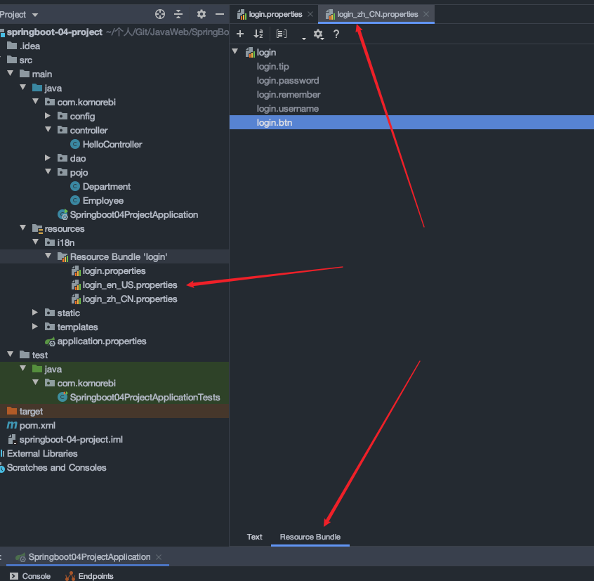
	（2）按钮自动切换，需要自定义组件**MyLocalResolver**，最后在**MyMvcConfig**中设置

	```java
	public class MyLocalResolver implements LocaleResolver {
	    // 解析请求
	    @Override
	    public Locale resolveLocale(HttpServletRequest request) {
	        // 获取请求中语言参数
	        String language = request.getParameter("l");
	
	        Locale locale = Locale.getDefault(); // 如果没有就使用默认的
	
	        //如果请求的链接携带了国际化的参数
	        if (!StringUtils.isEmpty(language)){
	            // zh_CN
	            String[] split = language.split("_");
	            // 国家，地区
	            locale = new Locale(split[0], split[1]);
	        }
	        return locale;
	    }
	
	    @Override
	    public void setLocale(HttpServletRequest request, HttpServletResponse response, Locale locale) {
	
	    }
	}
	```

	（3）将组件配置到容器中@Bean

	```java
	@Configuration
	public class MyMvcConfig implements WebMvcConfigurer {
	    @Override
	    public void addViewControllers(ViewControllerRegistry registry) {
	        registry.addViewController("/").setViewName("index");
	        registry.addViewController("/index.html").setViewName("index");
	    }
	
	    // 自定义的国际化组件就生效了
	    @Bean
	    public LocaleResolver localeResolver(){
	        return new MyLocalResolver();
	    }
	}
	```

### 7.3 登录

* 1 修改index

	```html
	<body class="text-center">
	    <form class="form-signin" th:action="@{/user/login}">
	        
	        <h1 class="h3 mb-3 font-weight-normal" th:text="#{login.tip}">Please sign in</h1>
	
	        <!--如果msg的值为空，则不显示消息-->
	        <p style="color: red" th:text="${msg}" th:if="${not #strings.isEmpty(msg)}"></p>
	
	        <label class="sr-only" th:text="#{login.username}">Username</label>
	        <input type="text" name="username" class="form-control" th:placeholder="#{login.username}" required="" autofocus="">
	        <label class="sr-only" th:text="#{login.password}">Password</label>
	        <input type="password" name="password" class="form-control" th:placeholder="#{login.password}" required="">
	        <div class="checkbox mb-3">
	            <label>
	                <input type="checkbox" value="remember-me">[[#{login.remember}]]
	            </label>
	        </div>
	        <button class="btn btn-lg btn-primary btn-block" type="submit" th:text="#{login.btn}">Sign in</button>
	        <p class="mt-5 mb-3 text-muted">© 2017-2018</p>
	        <a class="btn btn-sm" th:href="@{/index.html(l='zh_CN')}">中文</a>
	        <a class="btn btn-sm" th:href="@{/index.html(l='en_US')}">English</a>
	    </form>
	</body>
	```

* 2 controller

	```java
	@Controller
	public class LoginController {
	    @RequestMapping("/user/login")
	    public String login(@RequestParam("username") String username, @RequestParam("password") String password, Model model){
	        // 具体业务，判定用户密码是否正确
	        if ("admin".equals(username) &&"123456".equals(password)){
	            return "redirect:/main.html";
	        }
	        else {
	            // 告诉用户失败了
	            model.addAttribute("msg", "用户名或密码错误");
	            return "index";
	        }
	    }
	}
	```


### 7.4 拦截器

1. LoginHandlerInterceptor

	```java
	public class LoginHandlerInterceptor implements HandlerInterceptor {
	    @Override
	    public boolean preHandle(HttpServletRequest request, HttpServletResponse response, Object handler) throws Exception {
	        // 登录成功后，应该有用户的Session
	        Object loginUser = request.getSession().getAttribute("loginUser");
	
	        if (loginUser == null) {
	            request.setAttribute("msg", "没有权限，请先登录");
	            request.getRequestDispatcher("/index.html").forward(request, response);
	            return false;
	        }
	        else {
	            return true;
	        }
	    }
	}
	```

2. 设置Session

	```java
	@Controller
	public class LoginController {
	    @RequestMapping("/user/login")
	    public String login(@RequestParam("username") String username, @RequestParam("password") String password, Model model, HttpSession session){
	        // 具体业务，判定用户密码是否正确
	        if ("admin".equals(username) &&"123456".equals(password)){
	            session.setAttribute("loginUser", username);
	            return "redirect:/main.html";
	        }
	        else {
	            // 告诉用户失败了
	            model.addAttribute("msg", "用户名或密码错误");
	            return "index";
	        }
	    }
	}
	```

3. MvcConfig

	```java
	@Configuration
	public class MyMvcConfig implements WebMvcConfigurer {
	    @Override
	    public void addViewControllers(ViewControllerRegistry registry) {
	        registry.addViewController("/").setViewName("index");
	        registry.addViewController("/index.html").setViewName("index");
	        registry.addViewController("/main.html").setViewName("dashboard");
	    }
	
	    // 自定义的国际化组件就生效了
	    @Bean
	    public LocaleResolver localeResolver(){
	        return new MyLocalResolver();
	    }
	
	    // 配置拦截器
	    @Override
	    public void addInterceptors(InterceptorRegistry registry) {
	        registry.addInterceptor(new LoginHandlerInterceptor()).addPathPatterns("/**").excludePathPatterns("/index.html", "/", "/user/login", "/css/**", "/js/**", "/img/**");
	    }
	}
	```

### 7.5 展示员工列表

* 主要修改前端html代码


* EmployeeController

	```java
	@Controller
	public class EmployeeController {
	    @Autowired
	    EmployeeDao employeeDao;
	
	    @RequestMapping("/emps")
	    public String list(Model model){
	        Collection<Employee> employees = employeeDao.getAll();
	        model.addAttribute("emps", employees);
	        return "emp/list";
	    }
	}
	```

### 7.6 添加员工

1. List.html中添加按钮，这里是get传输

	```HTML
	<h3>
	    <a class="btn btn-sm btn-success" th:href="@{/addEmplyee}">Add Employee</a>
	</h3>
	```

2. EmployeeController.java

	```java
	@GetMapping("/addEmplyee")
	public String toAddPage(Model model){
	    // 查出所有部门的信息
	    Collection<Department> departments = departmentDao.getDepartments();
	    model.addAttribute("departments", departments);
	    return "emp/add";
	}
	```

3. 新建add.html，对照list修改显示的那部分，写一个form表单

	```HTML
	<form th:action="@{/addEmplyee}" method="post">
	    <div class="form-group">
	        <label>LastName</label>
	        <input type="text" name="lastName" class="form-control" placeholder="username">
	    </div>
	    <div class="form-group">
	        <label>Email</label>
	        <input type="email" name="email" class="form-control" placeholder="email address">
	    </div>
	    <div class="form-group">
	        <label>Gender</label><br>
	        <div class="form-check form-check-inline">
	            <input class="form-check-input" type="radio" name="gender" value="1">
	            <label class="form-check-label">男</label>
	        </div>
	        <div class="form-check form-check-inline">
	            <input class="form-check-input" type="radio" name="gender" value="0">
	            <label class="form-check-label">女</label>
	        </div>
	    </div>
	    <div class="form-group">
	        <label>department</label>
	        <select class="form-control" name="department.id" >
	            <option th:each="dept:${departments}" th:text="${dept.getDepartmentName()}" th:value="${dept.getId()}"></option>
	        </select>
	    </div>
	    <div class="form-group">
	        <label>Birth</label>
	        <input type="text" name="birth" class="form-control" placeholder="xxxx-xx-xx">
	    </div>
	    <button type="submit" class="btn btn-primary">添加</button>
	</form>
	```

4. EmployeeController.java

	```java
	@PostMapping("/addEmplyee")
	public String AddEmployee(Model model, Employee employee){
	// 添加操作
	employeeDao.save(employee);
	return "redirect:/emps";
	}
	```

### 7.7 修改员工信息

1. 修改list.html中的modificate

	```html
	<td>
	    <a class="btn btn-sm btn-primary" th:href="@{updateEmployee/{id}(id=${emp.getId()})}">modificate</a>
	    <button class="btn btn-sm btn-danger">delete</button>
	</td>
	```

2. EmployeeController.java

	```java
	@GetMapping("/updateEmployee/{id}")
	public String toUpdatePage(@PathVariable("id")Integer id, Model model){
	// 查出原来的数据
	Employee employee = employeeDao.getEmployeeById(id);
	model.addAttribute("emp", employee);
	// 查出所有部门的信息
	Collection<Department> departments = departmentDao.getDepartments();
	model.addAttribute("departments", departments);
	return "emp/update";
	}
	```

3. 新建update.html，对照add修改显示的那部分，修改form表单

	```html
	<main role="main" class="col-md-9 ml-sm-auto col-lg-10 pt-3 px-4">
	    <form th:action="@{/updateEmplyee}" method="post">
	        <input type="hidden" name="id" th:value="${emp.getId()}">
	        <div class="form-group">
	            <label>LastName</label>
	            <input th:value="${emp.getLastName()}" type="text" name="lastName" class="form-control" placeholder="username">
	        </div>
	        <div class="form-group">
	            <label>Email</label>
	            <input th:value="${emp.getEmail()}" type="email" name="email" class="form-control" placeholder="email address">
	        </div>
	        <div class="form-group">
	            <label>Gender</label><br>
	            <div class="form-check form-check-inline">
	                <input th:checked="${emp.getGender()==1}" class="form-check-input" type="radio" name="gender" value="1">
	                <label class="form-check-label">男</label>
	            </div>
	            <div class="form-check form-check-inline">
	                <input th:checked="${emp.getGender()==0}" class="form-check-input" type="radio" name="gender" value="0">
	                <label class="form-check-label">女</label>
	            </div>
	        </div>
	        <div class="form-group">
	            <label>department</label>
	            <select class="form-control" name="department.id" >
	                <option th:selected="${dept.getId()==emp.getDepartment().getId()}" th:each="dept:${departments}"
	                        th:text="${dept.getDepartmentName()}" th:value="${dept.getId()}"></option>
	            </select>
	        </div>
	        <div class="form-group">
	            <label>Birth</label>
	            <input th:value="${#dates.format(emp.getBirth(), 'yyyy-MM-dd')}" type="text" name="birth" class="form-control" placeholder="xxxx-xx-xx">
	        </div>
	        <button type="submit" class="btn btn-primary">Save</button>
	    </form>
	```

4. EmployeeController.java

	```java
	@PostMapping("/updateEmplyee")
	public String updateEmployee(Employee employee){
	    employeeDao.save(employee);
	    return "redirect:/emps";
	}
	```

### 7.8 删除员工

1. 修改按钮

	```html
	<td>
	    <a class="btn btn-sm btn-primary" th:href="@{updateEmployee/{id}(id=${emp.getId()})}">modificate</a>
	    <a class="btn btn-sm btn-danger" th:href="@{deleteEmployee/{id}(id=${emp.getId()})}">delete</a>
	</td>
	```

2. EmployeeController.java

	```java
	@GetMapping("/deleteEmployee/{id}")
	public String deleteEmployee(@PathVariable("id")Integer id){
	    employeeDao.deleteEmployee(id);
	    return "redirect:/emps";
	}
	```

### 7.9 404

* 在template目录下新建一个error文件夹，在放入404.html

### 7.10 注销

* 1 修改list.html中的注销按钮

* 2 LoginController.java

	```java
	@RequestMapping("/user/logout")
	public String logout(HttpSession session){
	    session.invalidate();
	    return "redirect:/index.html";
	}
	```


## 8 结合JDBC

1. 新建一个springboot项目

2. 新建application.yml，在里面配置数据库

	```yml
	spring:
	  datasource:
	    username: root
	    password: 123456
	    url: jdbc:mysql://localhost:3306/mybatis?useUnicode=true&characterEncoding=utf-8&serverTimezone=UTC
	    driver-class-name: com.mysql.cj.jdbc.Driver
	```

3. JDBCController.java

	```java
	@Controller
	public class JDBCController {
	    @Autowired
	    JdbcTemplate jdbcTemplate;
	
	    // 查询数据库的所有信息
	    @GetMapping("/userlist")
	    @ResponseBody
	    public List<Map<String, Object>> userList(){
	        String sql = "select * from mybatis.user";
	        List<Map<String, Object>> listMaps = jdbcTemplate.queryForList(sql);
	        return listMaps;
	    }
	
	    // 增加用户
	    @GetMapping("/addUser")
	    public String addUser(){
	        String sql = "insert into mybatis.user(id,name,pwd) values(5, 'kk', '123')";
	        jdbcTemplate.update(sql);
	        return "redirect:/userlist";
	    }
	
	    // 修改用户
	    @GetMapping("/updateUser/{id}")
	    public String updateUser(@PathVariable("id") int id){
	        String sql = "update mybatis.user set name=?,pwd=? where id=" + id;
	        Object[] objects = new Object[2];
	        objects[0] = "ming1";
	        objects[1] = "123123";
	        jdbcTemplate.update(sql, objects);
	        return "redirect:/userlist";
	    }
	
	    // 删除用户
	    @GetMapping("/deleteUser/{id}")
	    public String deleteUser(@PathVariable("id") int id){
	        String sql = "delete from mybatis.user where id=?";
	        jdbcTemplate.update(sql, id);
	        return "redirect:/userlist";
	    }
	}
	```


## 9 整合Druid数据源

* Java程序很大一部分要操作数据库，为了提高性能操作数据库的时候，又不得不使用数据库连接池。

* Druid 是阿里巴巴开源平台上一个数据库连接池实现，结合了 C3P0、DBCP 等 DB 池的优点，同时加入了日志监控。

* Druid 可以很好的监控 DB 池连接和 SQL 的执行情况，天生就是针对监控而生的 DB 连接池。

* Spring Boot 2.0 以上默认使用 Hikari 数据源，可以说 Hikari 与 Driud 都是当前 Java Web 上最优秀的数据源，我们来重点介绍 Spring Boot 如何集成 Druid 数据源，如何实现数据库监控。

* 步骤：

	* 1 yml文件 

		```yml
		spring:
		  datasource:
		    username: root
		    password: 123456
		    url: jdbc:mysql://localhost:3306/mybatis?useUnicode=true&characterEncoding=utf-8&serverTimezone=UTC
		    driver-class-name: com.mysql.cj.jdbc.Driver
		    type: com.alibaba.druid.pool.DruidDataSource
		
		    #Spring Boot 默认是不注入这些属性值的，需要自己绑定
		    #druid 数据源专有配置
		    initialSize: 5
		    minIdle: 5
		    maxActive: 20
		    maxWait: 60000
		    timeBetweenEvictionRunsMillis: 60000
		    minEvictableIdleTimeMillis: 300000
		    validationQuery: SELECT 1 FROM DUAL
		    testWhileIdle: true
		    testOnBorrow: false
		    testOnReturn: false
		    poolPreparedStatements: true
		
		    #配置监控统计拦截的filters，stat:监控统计、log4j：日志记录、wall：防御sql注入
		    #如果允许时报错  java.lang.ClassNotFoundException: org.apache.log4j.Priority
		    #则导入 log4j 依赖即可，Maven 地址：https://mvnrepository.com/artifact/log4j/log4j
		    filters: stat,wall,log4j
		    maxPoolPreparedStatementPerConnectionSize: 20
		    useGlobalDataSourceStat: true
		    connectionProperties: druid.stat.mergeSql=true;druid.stat.slowSqlMillis=500
		```

	* 2 DruidConfig.java

		```java
		@Configuration
		public class DruidConfig {
		    @ConfigurationProperties(prefix = "spring.datasource")
		    @Bean
		    public DataSource druidDataSource(){
		        return new DruidDataSource();
		    }
		
		    // 后台监控功能
		    // 配置 Druid 监控管理后台的Servlet；
		    // 内置 Servlet 容器时没有web.xml文件，所以使用 Spring Boot 的注册 Servlet 方式
		    @Bean
		    public ServletRegistrationBean statViewServlet(){
		        ServletRegistrationBean<StatViewServlet> bean = new ServletRegistrationBean<>(new StatViewServlet(), "/druid/*");
		
		        // 后台需要有人登陆，账号密码配置
		        HashMap<String, String> initParameters = new HashMap<>();
		
		        // 增加配置
		        initParameters.put("loginUsername", "admin");
		        initParameters.put("loginPassword", "12345");
		
		        // 允许谁可以访问
		        initParameters.put("allow", "localhost");
		
		        // 禁止谁不能访问
		//        initParameters.put("xxx", "192.168.11.123");
		
		        bean.setInitParameters(initParameters); // 设置初始化参数
		        return bean;
		    }
		}
		```

	* 访问http://localhost:8080/druid/

	* **配置 Druid web 监控 filter 过滤器**

		```java
		//配置 Druid 监控 之  web 监控的 filter
		//WebStatFilter：用于配置Web和Druid数据源之间的管理关联监控统计
		@Bean
		public FilterRegistrationBean webStatFilter() {
		    FilterRegistrationBean bean = new FilterRegistrationBean();
		    bean.setFilter(new WebStatFilter());
		
		    //exclusions：设置哪些请求进行过滤排除掉，从而不进行统计
		    Map<String, String> initParams = new HashMap<>();
		    initParams.put("exclusions", "*.js,*.css,/druid/*,/jdbc/*");
		    bean.setInitParameters(initParams);
		
		    //"/*" 表示过滤所有请求
		    bean.setUrlPatterns(Arrays.asList("/*"));
		    return bean;
		}
		```


## 10 整合Mybatis

1. 新建springboot项目，预设web jdbc mysql-driver

2. 导入MyBatis Spring Boot Starter 

3. 新建实体类和对应的mapper

4. 新建mapper.xml

	```xml
	<?xml version="1.0" encoding="UTF-8" ?>
	<!DOCTYPE mapper
	        PUBLIC "-//mybatis.org//DTD Mapper 3.0//EN"
	        "http://mybatis.org/dtd/mybatis-3-mapper.dtd">
	<!--命名空间 绑定一个对应的Mapper接口-->
	<mapper namespace="com.komorebi.mapper.UserMapper">
	    <select id="queryUserList" resultType="User">
	        select * from mybatis.user;
	    </select>
	
	    <select id="queryUserById" resultType="User">
	        select * from mybatis.user where id=#{id};
	    </select>
	
	    <insert id="addUser" parameterType="User">
	        insert into mybatis.user(id, name, pwd) values (#{id}, #{name}, #{pwd});
	    </insert>
	
	    <update id="updateUser" parameterType="User">
	        update mybatis.user set name=#{name}, pwd=#{pwd} where id=#{id};
	    </update>
	
	    <delete id="deleteUser" parameterType="int">
	        delete from mybatis.user where id=#{id};
	    </delete>
	</mapper>
	```

	

5. 配置文件

	```properties
	spring.datasource.username=root
	spring.datasource.password=123456
	spring.datasource.url=jdbc:mysql://localhost:3306/mybatis?useUnicode=true&characterEncoding=utf-8&serverTimezone=UTC
	spring.datasource.driver-class-name=com.mysql.cj.jdbc.Driver
	
	# 整合mybatis
	mybatis.type-aliases-package=com.komorebi.pojo
	mybatis.mapper-locations=classpath:mybatis/mapper/*.xml
	```

6. UserController.java

	```java
	@RestController
	public class UserController {
	    @Autowired
	    private UserMapper userMapper;
	
	    @GetMapping("/queryUserList")
	    public List<User> queryUserList(){
	        List<User> userList = userMapper.queryUserList();
	        return userList;
	    }
	
	    @GetMapping("/queryUserById/{id}")
	    public User queryUserById(@PathVariable("id") int id){
	        User user = userMapper.queryUserById(id);
	        return user;
	    }
	
	    @GetMapping("/addUser")
	    public String addUser(){
	        userMapper.addUser(new User(5, "k5", "345"));
	        return "add ok";
	    }
	
	    @GetMapping("/updateUser")
	    public String updateUser(){
	        userMapper.updateUser(new User(5, "k6", "345"));
	        return "update ok";
	    }
	
	    @GetMapping("/deleteUser/{id}")
	    public String deleteUser(@PathVariable("id") int id){
	        userMapper.deleteUser(id);
	        return "delete ok";
	    }
	}
	```

	

## 11 SpringSecurity


* Shiro、SpringSecurity：很像，除了类不一样；功能：认证、授权

* 步骤

	* 1 导入pom

		```xml
		<!--thymeleaf-->
		<dependency>
		    <groupId>org.thymeleaf</groupId>
		    <artifactId>thymeleaf-spring5</artifactId>
		</dependency>
		<dependency>
		    <groupId>org.thymeleaf.extras</groupId>
		    <artifactId>thymeleaf-extras-java8time</artifactId>
		</dependency>
		```

	* 2 复制静态资源，并测试

	* 3 导包

	* 4 SecurityConfig.java

		```java
		@EnableWebSecurity
		public class SecurityConfig extends WebSecurityConfigurerAdapter {
		    // 授权
		    @Override
		    protected void configure(HttpSecurity http) throws Exception {
		        // 首页所有人可以访问，功能页只有对应有权限的人才能访问
		        // 请求授权的规则
		        http.authorizeRequests()
		                .antMatchers("/").permitAll()
		                .antMatchers("/level1/**").hasRole("vip1")
		                .antMatchers("/level2/**").hasRole("vip2")
		                .antMatchers("/level3/**").hasRole("vip3");
		
		        // 没有权限默认到登录页
		        http.formLogin().loginPage("/toLogin");
		
		        // 开启记住我功能
		        http.rememberMe().rememberMeParameter("remember");
		
		        // 注销，跳到首页
		        http.csrf().disable();
		        http.logout().logoutSuccessUrl("/");
		    }
		
		    // 认证，Springboot 2.1.X 可以直接使用
		    // 密码编码：PasswordEncoder
		    // 在Spring Security 5.0+ 新增了很多的加密方法
		    @Override
		    protected void configure(AuthenticationManagerBuilder auth) throws Exception {
		        // 正常应该在数据库中读
		        auth.inMemoryAuthentication().passwordEncoder(new BCryptPasswordEncoder())
		                .withUser("komorebi").password(new BCryptPasswordEncoder().encode("123456")).roles("vip2", "vip3")
		                .and()
		                .withUser("root").password(new BCryptPasswordEncoder().encode("123456")).roles("vip1", "vip2", "vip3");
		    }
		}
		```

	* 4 修改对应的html，先导包

		```html
		<!DOCTYPE html>
		<html lang="en" xmlns:th="http://www.thymeleaf.org"
		      xmlns:sec="http://www.thymeleaf.org/thymeleaf-extras-springsecurity4">
		<head>
		    <meta charset="UTF-8">
		    <meta name="viewport" content="width=device-width, initial-scale=1, maximum-scale=1">
		    <title>首页</title>
		    <!--semantic-ui-->
		    <link href="https://cdn.bootcss.com/semantic-ui/2.4.1/semantic.min.css" rel="stylesheet">
		    <link th:href="@{/komorebi/css/qinstyle.css}" rel="stylesheet">
		</head>
		<body>
		
		<!--主容器-->
		<div class="ui container">
		    <div class="ui segment" id="index-header-nav" th:fragment="nav-menu">
		        <div class="ui secondary menu">
		            <a class="item"  th:href="@{/index}">首页</a>
		
		            <!--登录注销-->
		            <div class="right menu">
		                <!--如果未登录-->
		                <div sec:authorize="!isAuthenticated()">
		                    <a class="item" th:href="@{/toLogin}">
		                        <i class="address card icon"></i> 登录
		                    </a>
		                </div>
		                <!--如果登录，显示：用户名+注销-->
		                <div sec:authorize="isAuthenticated()">
		                    <a class="item">
		                        用户名：<span sec:authentication="name"></span>
		                        角色：<span sec:authentication="principal.authorities"></span>
		                    </a>
		                </div>
		                <div sec:authorize="isAuthenticated()">
		                    <a class="item" th:href="@{/logout}">
		                        <i class="sign-out icon"></i> 注销
		                    </a>
		                </div>
		                <!--已登录
		                <a th:href="@{/usr/toUserCenter}">
		                    <i class="address card icon"></i> admin
		                </a>
		                -->
		            </div>
		        </div>
		    </div>
		
		    <div class="ui segment" style="text-align: center">
		        <h3>Spring Security Study by 秦疆</h3>
		    </div>
		
		    <div>
		        <br>
		        <div class="ui three column stackable grid">
		            <div class="column" sec:authorize="hasRole('vip1')">
		                <div class="ui raised segment">
		                    <div class="ui">
		                        <div class="content">
		                            <h5 class="content">Level 1</h5>
		                            <hr>
		                            <div><a th:href="@{/level1/1}"><i class="bullhorn icon"></i> Level-1-1</a></div>
		                            <div><a th:href="@{/level1/2}"><i class="bullhorn icon"></i> Level-1-2</a></div>
		                            <div><a th:href="@{/level1/3}"><i class="bullhorn icon"></i> Level-1-3</a></div>
		                        </div>
		                    </div>
		                </div>
		            </div>
		
		            <div class="column" sec:authorize="hasRole('vip2')">
		                <div class="ui raised segment">
		                    <div class="ui">
		                        <div class="content">
		                            <h5 class="content">Level 2</h5>
		                            <hr>
		                            <div><a th:href="@{/level2/1}"><i class="bullhorn icon"></i> Level-2-1</a></div>
		                            <div><a th:href="@{/level2/2}"><i class="bullhorn icon"></i> Level-2-2</a></div>
		                            <div><a th:href="@{/level2/3}"><i class="bullhorn icon"></i> Level-2-3</a></div>
		                        </div>
		                    </div>
		                </div>
		            </div>
		
		            <div class="column" sec:authorize="hasRole('vip3')">
		                <div class="ui raised segment">
		                    <div class="ui">
		                        <div class="content">
		                            <h5 class="content">Level 3</h5>
		                            <hr>
		                            <div><a th:href="@{/level3/1}"><i class="bullhorn icon"></i> Level-3-1</a></div>
		                            <div><a th:href="@{/level3/2}"><i class="bullhorn icon"></i> Level-3-2</a></div>
		                            <div><a th:href="@{/level3/3}"><i class="bullhorn icon"></i> Level-3-3</a></div>
		                        </div>
		                    </div>
		                </div>
		            </div>
		
		        </div>
		    </div>
		    
		</div>
		
		
		<script th:src="@{/komorebi/js/jquery-3.1.1.min.js}"></script>
		<script th:src="@{/komorebi/js/semantic.min.js}"></script>
		
		</body>
		</html>
		```


## 12 Shiro

* java安全框架，功能：认证，授权，加密，会话管理，Web集成，缓存

### 12.1 架构（外部）


* subject：应用代码直接交互的对象是subject，也就是说Shiro的对外API核心是Subject，Subject代表了当前的用户，这个用户不一定是一个具体的人，与当前应用交互的任何东西都是Subject，如网络爬虫、机器人等。与Subject的所有交互都会委托给SecurityManager；Subject其实是一个门面，SecurityManager才是真正的执行者
* SecurityManager：安全管理器，即所有与安全有关的操作都会与SecurityManager交互，并且他管理着所有的Subject，可以看出他是Shiro的核心，负责与Shiro的其他组件进行交互，相当于MVC中的DispatcherServlet的角色
* Realm：Shiro从Realm获取安全数据（用户、角色、权限），也就是说SecurityManager要验证用户身份，那么他需要从Realm获取相应的用户进行比较，来确定用户的身份是否合法，也需要从Realm得到用户相应的角色、权限，进行验证用户的操作是否能够进行，可以把Realm看出DataSource

### 12.2 步骤

1. 导入依赖

2. 配置文件

3. QuickStart

	```java
	Subject currentUser = SecurityUtils.getSubject();
	
	Session session = currentUser.getSession();
	
	currentUser.isAuthenticated()
	
	currentUser.getPrincipal()
	    
	currentUser.hasRole("schwartz")
	
	currentUser.isPermitted("lightsaber:wield")
	
	currentUser.logout();
	```

### 12.3 SpringBoot集成

1. 新建springboot项目，导包

	```xml
	<!--thymeleaf-->
	<dependency>
	    <groupId>org.thymeleaf</groupId>
	    <artifactId>thymeleaf-spring5</artifactId>
	</dependency>
	<dependency>
	    <groupId>org.thymeleaf.extras</groupId>
	    <artifactId>thymeleaf-extras-java8time</artifactId>
	</dependency>
	
	<!--shiro整合SpringBoot的包-->
	<dependency>
	    <groupId>org.apache.shiro</groupId>
	    <artifactId>shiro-spring</artifactId>
	    <version>1.7.0</version>
	</dependency>
	```

2. 新建首页index.html和MyController.java

3. UserRealm.java

	```java
	public class UserRealm extends AuthorizingRealm {
	    // 授权
	    @Override
	    protected AuthorizationInfo doGetAuthorizationInfo(PrincipalCollection principalCollection) {
	        System.out.println("执行了授权");
	        return null;
	    }
	
	    // 认证
	    @Override
	    protected AuthenticationInfo doGetAuthenticationInfo(AuthenticationToken authenticationToken) throws AuthenticationException {
	        System.out.println("执行了认证");
	        return null;
	    }
	}
	```

5. ShiroConfig

	```java
	@Configuration
	public class ShiroConfig {
	    // 3 ShiroFilterFactoryBean
	    @Bean
	    public ShiroFilterFactoryBean ShiroFilterFactoryBean(@Qualifier("getDefaultWebSecurityManager")DefaultWebSecurityManager defaultWebSecurityManager){
	        ShiroFilterFactoryBean bean = new ShiroFilterFactoryBean();
	        // 设置安全管理器
	        bean.setSecurityManager(defaultWebSecurityManager);
	        return bean;
	    }
	    
	    // 2 DefaultWebSecurityManager
	    @Bean
	    public DefaultWebSecurityManager getDefaultWebSecurityManager(@Qualifier("userRealm") UserRealm userRealm){
	        DefaultWebSecurityManager securityManager = new DefaultWebSecurityManager();
	        // 关联UserRealm
	        securityManager.setRealm(userRealm);
	        return securityManager;
	    }
	
	    // 1 创建 Realm 对象，需要自定义
	    @Bean
	    public UserRealm userRealm(){
	        return new UserRealm();
	    }
	}
	```

### 12.4 实现登录拦截

ShrioConfig中修改

```java
@Bean
public ShiroFilterFactoryBean ShiroFilterFactoryBean(@Qualifier("getDefaultWebSecurityManager")DefaultWebSecurityManager defaultWebSecurityManager){
    ShiroFilterFactoryBean bean = new ShiroFilterFactoryBean();
    // 设置安全管理器
    bean.setSecurityManager(defaultWebSecurityManager);

    // 添加shiro的内置过滤器
    /*
            anno: 无需认证就可以访问
            authc：必须认证才能访问
            user：必须拥有记住我才能访问
            perms：拥有对某个资源的权限才能访问
            role：拥有某个角色权限才能访问
         */
    Map<String, String> filterMap = new LinkedHashMap<>();
    filterMap.put("/user/add", "authc");
    filterMap.put("/user/update", "authc");

    bean.setFilterChainDefinitionMap(filterMap);

    // 设置登录的请求
    bean.setLoginUrl("/toLogin");

    return bean;
}
```

### 12.5 用户认证

1. 在Controller中写login方法

	```java
	@RequestMapping("/login")
	public String login(String username, String password, Model model){
	    // 获取当前用户
	    Subject subject = SecurityUtils.getSubject();
	    // 封装用户的登录数据
	    UsernamePasswordToken token = new UsernamePasswordToken(username, password);
	
	    try{
	        subject.login(token);   // 执行登录的方法
	        return "index";
	    }catch (UnknownAccountException e){     // 用户名不存在
	        model.addAttribute("msg", "用户名错误");
	        return "login";
	    } catch (IncorrectCredentialsException e) { // 密码不存在
	        model.addAttribute("msg", "密码错误");
	        return "login";
	    }
	}
	```

2. UserRealm

	```java
	// 认证
	@Override
	protected AuthenticationInfo doGetAuthenticationInfo(AuthenticationToken authenticationToken) throws AuthenticationException {
	    System.out.println("执行了认证");
	
	    // 认证
	    String name = "root";
	    String password = "123456";
	    UsernamePasswordToken userToken = (UsernamePasswordToken) authenticationToken;
	    if (!userToken.getUsername().equals(name)){
	        return null;    // 抛出异常  UnknownAccountException
	    }
	
	    // 密码认证：自动完成
	    return new SimpleAuthenticationInfo("", password, "");
	}
	```

### 12.6 shiro整合Mybatis

1. 导包

	```xml
	<!--lombok-->
	<dependency>
	    <groupId>org.projectlombok</groupId>
	    <artifactId>lombok</artifactId>
	    <version>1.18.12</version>
	</dependency>
	
	<!--MySQL-->
	<dependency>
	    <groupId>mysql</groupId>
	    <artifactId>mysql-connector-java</artifactId>
	</dependency>
	
	<!--Druid-->
	<dependency>
	    <groupId>com.alibaba</groupId>
	    <artifactId>druid</artifactId>
	    <version>1.1.12</version>
	</dependency>
	
	<!--log4j-->
	<dependency>
	    <groupId>log4j</groupId>
	    <artifactId>log4j</artifactId>
	    <version>1.2.17</version>
	</dependency>
	
	<!--mybatis-spring-boot-starter-->
	<dependency>
	    <groupId>org.mybatis.spring.boot</groupId>
	    <artifactId>mybatis-spring-boot-starter</artifactId>
	    <version>2.1.3</version>
	</dependency>
	```

2. 新建application.yml，同Druid那里

3. Application.properties中配置mybatis

	```properties
	# 整合mybatis
	mybatis.type-aliases-package=com.komorebi.pojo
	mybatis.mapper-locations=classpath:mapper/*.xml
	```

4. 新建实体类，以及对应的mapper和service
	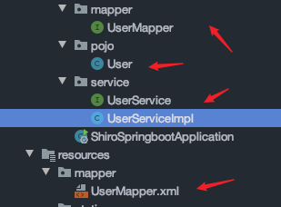

5. 后台测试成功后，修改UserRealm

	```java
	public class UserRealm extends AuthorizingRealm {
	    @Autowired
	    UserService userService;
	
	    // 授权
	    @Override
	    protected AuthorizationInfo doGetAuthorizationInfo(PrincipalCollection principalCollection) {
	        System.out.println("执行了授权");
	        return null;
	    }
	
	    // 认证
	    @Override
	    protected AuthenticationInfo doGetAuthenticationInfo(AuthenticationToken authenticationToken) throws AuthenticationException {
	        System.out.println("执行了认证");
	
	        // 连接真实数据库
	        UsernamePasswordToken userToken = (UsernamePasswordToken) authenticationToken;
	        User user = userService.queryUserByName(userToken.getUsername());
	
	        if (user == null){
	            return null;    // 抛出异常  UnknownAccountException
	        }
	
	        // 密码认证：自动完成
	        return new SimpleAuthenticationInfo("", user.getPwd(), "");
	    }
	}
	```

### 12.7 shiro请求授权

1 修改ShiroConfig，写明授权检测和未授权跳转

```java
// 3 ShiroFilterFactoryBean
@Bean
public ShiroFilterFactoryBean ShiroFilterFactoryBean(@Qualifier("getDefaultWebSecurityManager")DefaultWebSecurityManager defaultWebSecurityManager){
    ShiroFilterFactoryBean bean = new ShiroFilterFactoryBean();
    // 设置安全管理器
    bean.setSecurityManager(defaultWebSecurityManager);

    // 添加shiro的内置过滤器
    /*
            anno: 无需认证就可以访问
            authc：必须认证才能访问
            user：必须拥有记住我才能访问
            perms：拥有对某个资源的权限才能访问
            role：拥有某个角色权限才能访问
         */
    // 拦截
    Map<String, String> filterMap = new LinkedHashMap<>();
    // 授权，正常情况下，没有授权会跳到未授权页面
    filterMap.put("/user/add", "perms[user:add]");
    filterMap.put("/user/update", "perms[user:update]");
    filterMap.put("/user/*", "authc");

    bean.setFilterChainDefinitionMap(filterMap);

    // 设置登录的请求
    bean.setLoginUrl("/toLogin");

    // 未授权请求
    bean.setUnauthorizedUrl("/noauth");

    return bean;
}
```

2 UserRealm 写用户授权部分

```java
public class UserRealm extends AuthorizingRealm {
    @Autowired
    UserService userService;

    // 授权
    @Override
    protected AuthorizationInfo doGetAuthorizationInfo(PrincipalCollection principalCollection) {
        System.out.println("执行了授权");
        SimpleAuthorizationInfo info = new SimpleAuthorizationInfo();

        // 拿到当前登录的这个对象
        Subject subject = SecurityUtils.getSubject();
        User currentUser = (User) subject.getPrincipal();

        info.addStringPermission(currentUser.getPerms());

        return info;
    }

    // 认证
    @Override
    protected AuthenticationInfo doGetAuthenticationInfo(AuthenticationToken authenticationToken) throws AuthenticationException {
        System.out.println("执行了认证");

        // 连接真实数据库
        UsernamePasswordToken userToken = (UsernamePasswordToken) authenticationToken;
        User user = userService.queryUserByName(userToken.getUsername());

        if (user == null){
            return null;    // 抛出异常  UnknownAccountException
        }

        // 密码认证：自动完成
        return new SimpleAuthenticationInfo(user, user.getPwd(), "");
    }
}
```

### 12.8 shiro整合thymeleaf

1. 导包

	```xml
	<!-- shiro整合thymeleaf -->
	<dependency>
	    <groupId>com.github.theborakompanioni</groupId>
	    <artifactId>thymeleaf-extras-shiro</artifactId>
	    <version>2.0.0</version>
	</dependency>
	```

2. ShiroConfig

	```java
	// 整合ShiroDialect，用来整合shiro 和 thymeleaf
	@Bean
	public ShiroDialect getShiroDialect(){
	    return new ShiroDialect();
	}
	```

3. 认证中加入代码

	```java
	Subject currentSubject = SecurityUtils.getSubject();
	Session session = currentSubject.getSession();
	session.setAttribute("loginUser", user);
	```


## 13 Swagger


* RestFul API 文档在线自动生成工具，API文档与API定义同步更新https://swagger.io/
* 直接运行，在线测试API接口

### 13.1 SpringBoot集成Swagger

1. 导包

	```xml
	<!-- springfox-swagger2 -->
	<dependency>
	    <groupId>io.springfox</groupId>
	    <artifactId>springfox-swagger2</artifactId>
	    <version>2.9.2</version>
	</dependency>
	<!-- springfox-swagger-ui -->
	<dependency>
	    <groupId>io.springfox</groupId>
	    <artifactId>springfox-swagger-ui</artifactId>
	    <version>2.9.2</version>
	</dependency>
	```

2. 配置Swagger--> config

	```java
	@Configuration
	@EnableSwagger2
	public class SwaggerConfig {
	    
	}
	```

3. http://localhost:8080/swagger-ui.html

### 13.2 配置

Swagger的bean实例Docket，配置Config

```java
@Configuration
@EnableSwagger2
public class SwaggerConfig {
    @Bean
    public Docket docket(){
        return new Docket(DocumentationType.SWAGGER_2)
                .apiInfo(apiInfo());
    }

    // 配置Swagger信息 apiInfo
    private ApiInfo apiInfo(){
        // 作者信息
        Contact contact = new Contact("komorebi", "http://www.baidu.com", "240553516");
        return new ApiInfo(
                "Komorebi API Document",
                "be the best",
                "v1.0",
                "http://www.baidu.com",
                contact,
                "Apache 2.0",
                "http://www.apache.org/licenses/LICENSE-2.0",
                new ArrayList<VendorExtension>()
        );
    }
}
```

### 13.3 配置扫描接口

Docket.select()

```java
@Bean
public Docket docket(){
    return new Docket(DocumentationType.SWAGGER_2)
        .apiInfo(apiInfo())
        .select()
        // RequestHandlerSelectors 配置要扫描接口的方式
        //   basePackage:指定要扫描的包
        //   any()：扫描全部
        //   none()：不扫描
        //   withClassAnnotation：扫描类上的注解
        //   withMethodAnnotation：扫描方法上的注解
        .apis(RequestHandlerSelectors.basePackage("com.komorebi.controller"))
        // 过滤
        .paths(PathSelectors.ant("/komorebi/**"))
        .build();
}
```

* 若希望Swagger在生成环境中使用，在发布的时候不使用
	* 判断是否为生成环境
	* 注入enable(flag)

### 13.4 配置文档分组

```java
public class SwaggerConfig {
    @Bean
    public Docket docket1(){
        return new Docket(DocumentationType.SWAGGER_2)
                .groupName("A");
    }

    @Bean
    public Docket docket(){
        return new Docket(DocumentationType.SWAGGER_2)
                .apiInfo(apiInfo())
//                .enable(false)            // 是否启动Swagger
                .groupName("komorebi")
                .select()
                // RequestHandlerSelectors 配置要扫描接口的方式
                //   basePackage:指定要扫描的包
                //   any()：扫描全部
                //   none()：不扫描
                //   withClassAnnotation：扫描类上的注解
                //   withMethodAnnotation：扫描方法上的注解
                .apis(RequestHandlerSelectors.basePackage("com.komorebi.controller"))
                // 过滤
//                .paths(PathSelectors.ant("/komorebi/**"))
                .build();
    }

    // 配置Swagger信息 apiInfo
    private ApiInfo apiInfo(){
        // 作者信息
        Contact contact = new Contact("komorebi", "http://www.baidu.com", "240553516");
        return new ApiInfo(
                "Komorebi API Document",
                "be the best",
                "v1.0",
                "http://www.baidu.com",
                contact,
                "Apache 2.0",
                "http://www.apache.org/licenses/LICENSE-2.0",
                new ArrayList<VendorExtension>()
        );
    }
}
```

### 13.5 实体类配置

* 实体类

```java
// @Api("用户实体类")
@ApiModel("用户实体类")
public class User {
    @ApiModelProperty("用户名")
    public String username;
    @ApiModelProperty("密码")
    public String password;
}
```

* controller

```java
@RestController
public class HelloController {
    // 默认请求：/error
    @GetMapping(value = "/hello")
    public String hello(){
        return "hello";
    }

    // 只要接口中返回值存在实体类，就会被扫描到swagger中
    @PostMapping(value = "/user")
    public User user(){
        return new User();
    }

    @ApiOperation("hello控制类")
    @GetMapping(value = "/hello2")
    public String hello2(@ApiParam("用户名") String username){
        return "hello" + username;
    }

    @ApiOperation("post控制类")
    @PostMapping(value = "/postTest")
    public String postTest(@ApiParam("用户") User user){
        return "hello" + user;
    }
}
```

* 总结：
	* 可以通过Swagger给一些比较难理解的属性或者接口，增加注释信息
	* 接口文档实时更新
	* 可以在线测试


## 14 任务

### 14.1 异步任务

* Service

	```java
	@Service
	public class AsyncService {
	    // 告诉Spring这是一个异步的方法
	    @Async
	    public void hello(){
	        try {
	            Thread.sleep(3000);
	        } catch (InterruptedException e) {
	            e.printStackTrace();
	        }
	
	        System.out.println("数据正在处理...");
	    }
	}
	```

* Controller

	```java
	@RestController
	public class AsyncController {
	    @Autowired
	    AsyncService asyncService;
	
	    @RequestMapping("/hello")
	    public String hello(){
	        asyncService.hello();
	        return "OK";
	    }
	}
	```

* 主函数加上**@EnableAsync**注解

### 14.2 邮件任务

* 导入依赖

	```xml
	<dependency>
	    <groupId>org.springframework.boot</groupId>
	    <artifactId>spring-boot-starter-mail</artifactId>
	</dependency>
	```

* 配置properties

	```properties
	spring.mail.username=nihaopeng1997
	spring.mail.password=GDONFUPUUKPOUAGN
	spring.mail.host=smtp.126.com
	```

* Test

	```java
	@SpringBootTest
	class Springboot10TestApplicationTests {
	    @Autowired
	    JavaMailSenderImpl mailSender;
	
	    // 简单邮件
	    @Test
	    void contextLoads() {
	        SimpleMailMessage mailMessage = new SimpleMailMessage();
	
	        mailMessage.setSubject("nihao~");
	        mailMessage.setText("123123");
	        mailMessage.setTo("240553516@qq.com");
	        mailMessage.setFrom("nihaopeng1997@126.com");
	
	        mailSender.send(mailMessage);
	    }
	
	    // 复杂邮件
	    @Test
	    void contextLoads2() throws MessagingException {
	        MimeMessage mimeMessage = mailSender.createMimeMessage();
	
	        // 组装
	        MimeMessageHelper helper = new MimeMessageHelper(mimeMessage, true, "utf-8");
	        helper.setSubject("nihao2~");
	        helper.setText("<p style='color:red'>321321</p>", true);
	
	        // 附件
	        helper.addAttachment("dog.jpg", new File("/Users/nihaopeng/Pictures/DynamicWallpaperClub壁纸/dog.jpg"));
	
	        helper.setTo("240553516@qq.com");
	        helper.setFrom("nihaopeng1997@126.com");
	
	        mailSender.send(mimeMessage);
	    }
	}
	```


### 14.3 定时任务

* TaskScheduler(调度)、TaskExecutor(执行)

* ```java
	@EnableScheduling   // 开启定时功能的注解
	@Scheduled 			// 什么时候执行
	```

* cron表达式，新建一个ScheduledService

	```java
	@Service
	public class ScheduledService {
	    // 在一个特定的时间执行这个方法
	    // cron表达式
	    // 秒 分 时 日 月 星期
	    @Scheduled(cron = "0 50 10 * * 0-7")
	    public void hello(){
	        System.out.println("hello");
	    }
	}
	```


## 15 分布式Dubbo和Zookeeper

* 分布式系统


* RPC
	* 通信
	* 序列化


### 15.1 Dubbo

* Apache Dubbo 是一款高性能、轻量级的开源 Java 服务框架(RPC框架)
* 三大核心能力
	* 面向接口的远程方法调用
	* 智能容错和负载均衡
	* 服务自动注册和发现
* 
* 

### 15.2 安装zookeeper

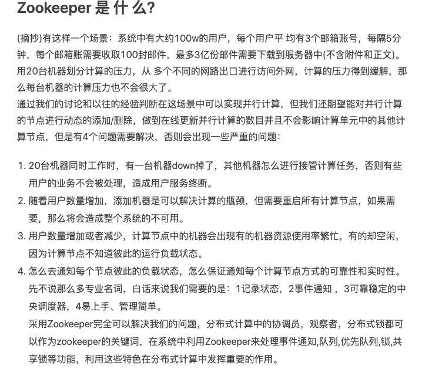

* 安装

	* 1 下载http://archive.apache.org/dist/zookeeper/

	* 2 解压tar.gz，放到Library目录下

	* 3 配置conf下的zoo.cfg

		```cfg
		# 服务器与客户端之间交互的基本时间单元（ms） 
		tickTime=2000   
		# zookeeper所能接受的客户端数量 
		initLimit=10  
		# 服务器和客户端之间请求和应答之间的时间间隔 
		syncLimit=5
		# zookeeper中使用的基本时间单位, 毫秒值.
		tickTime=2000
		# 数据目录. 可以是任意目录.
		dataDir=/Library/zookeeper-3.4.14/data
		# log目录, 同样可以是任意目录. 如果没有设置该参数, 将使用和#dataDir相同的设置.
		dataLogDir=/Library/zookeeper-3.4.14/log
		# t监听client连接的端口号.
		clientPort=2181
		```

	* 3 基本操作

		* 启动：/zkServer.sh start

		* 停止：/zkServer.sh stop

		* Cli连接

			```sh
			> cd zookeeper-3.4.10/bin //切换到 bin目录
			> ./zkCli.sh -server 127.0.0.1:2181
			[zk: 127.0.0.1:2181(CONNECTED) 0] help //输入help命令
			ZooKeeper -server host:port cmd args
			    stat path [watch]
			    set path data [version]
			    ls path [watch]
			    delquota [-n|-b] path
			    ls2 path [watch]
			    setAcl path acl
			    setquota -n|-b val path
			    history
			    redo cmdno
			    printwatches on|off
			    delete path [version]
			    sync path
			    listquota path
			    rmr path
			    get path [watch]
			    create [-s] [-e] path data acl
			    addauth scheme auth
			    quit
			    getAcl path
			    close
			    connect host:port
			
			/////////////////////官方测试命令////////////////////////
			
			[zk: 127.0.0.1:2181(CONNECTED) 2] ls /
			[zookeeper]
			[zk: 127.0.0.1:2181(CONNECTED) 3] create /zk_test my_data
			Created /zk_test
			[zk: 127.0.0.1:2181(CONNECTED) 4] ls /
			[zookeeper, zk_test]
			[zk: 127.0.0.1:2181(CONNECTED) 5] get /zk_test
			my_data
			cZxid = 0x2
			ctime = Wed Feb 28 15:18:45 CST 2018
			mZxid = 0x2
			mtime = Wed Feb 28 15:18:45 CST 2018
			pZxid = 0x2
			cversion = 0
			dataVersion = 0
			aclVersion = 0
			ephemeralOwner = 0x0
			dataLength = 7
			numChildren = 0
			[zk: 127.0.0.1:2181(CONNECTED) 6] set /zk_test junk
			cZxid = 0x2
			ctime = Wed Feb 28 15:18:45 CST 2018
			mZxid = 0x3
			mtime = Wed Feb 28 15:20:23 CST 2018
			pZxid = 0x2
			cversion = 0
			dataVersion = 1
			aclVersion = 0
			ephemeralOwner = 0x0
			dataLength = 4
			numChildren = 0
			[zk: 127.0.0.1:2181(CONNECTED) 7] get /zk_test
			junk
			cZxid = 0x2
			ctime = Wed Feb 28 15:18:45 CST 2018
			mZxid = 0x3
			mtime = Wed Feb 28 15:20:23 CST 2018
			pZxid = 0x2
			cversion = 0
			dataVersion = 1
			aclVersion = 0
			ephemeralOwner = 0x0
			dataLength = 4
			numChildren = 0
			[zk: 127.0.0.1:2181(CONNECTED) 8] delete /zk_test
			[zk: 127.0.0.1:2181(CONNECTED) 9] ls
			[zk: 127.0.0.1:2181(CONNECTED) 10] ls /
			[zookeeper]
			```

### 15.3 安装Dubbo

* dubbo是一个监控管理后台，查看我们注册了哪些服务，哪些服务被消费了
* 步骤
	* 1 下载，复制到Library目录https://github.com/apache/dubbo-admin/tree/master
	* 2 导入idea，打包
	* 3 java -jar dubbo-admin-0.0.1-SNAPSHOT.jar （此时zookeeper一定要打开）
	* 4 执行完毕，我们去访问一下 http://localhost:7001/ ， 这时候我们需要输入登录账户和密码，我们都是默认的root-root；

### 15.4 SpringBoot集成

1. 启动zookeeper ！

2. IDEA创建一个空项目；

3. 创建一个模块，实现服务提供者：provider-server ， 选择web依赖即可

4. 项目创建完毕，写一个服务，比如卖票的服务；

```java
// zookeeper：服务注册与发现
@Component          // 使用了Dubbo后尽量不用Service注解
@DubboService       // 可以被扫描到，在项目一启动就自动注册到注册中心
public class TicketServiceImpl implements TicketService {
    @Override
    public String getTicket() {
        return "komorebi";
    }
}
```

5. 再新建一个模块，实现服务消费者，

6. 提供者导包

	```xml
	<!--导入依赖，dubbo + zookeeper-->
	<!-- dubbo-spring-boot-starter -->
	<dependency>
	    <groupId>org.apache.dubbo</groupId>
	    <artifactId>dubbo-spring-boot-starter</artifactId>
	    <version>2.7.8</version>
	</dependency>
	<!-- zkclient -->
	<dependency>
	    <groupId>com.github.sgroschupf</groupId>
	    <artifactId>zkclient</artifactId>
	    <version>0.1</version>
	</dependency>
	<!-- 引入zookeeper -->
	<dependency>
	    <groupId>org.apache.curator</groupId>
	    <artifactId>curator-framework</artifactId>
	    <version>2.12.0</version>
	</dependency>
	<dependency>
	    <groupId>org.apache.curator</groupId>
	    <artifactId>curator-recipes</artifactId>
	    <version>2.12.0</version>
	</dependency>
	<dependency>
	    <groupId>org.apache.zookeeper</groupId>
	    <artifactId>zookeeper</artifactId>
	    <version>3.4.14</version>
	    <!--排除这个slf4j-log4j12-->
	    <exclusions>
	        <exclusion>
	            <groupId>org.slf4j</groupId>
	            <artifactId>slf4j-log4j12</artifactId>
	        </exclusion>
	    </exclusions>
	</dependency>
	```

7. 在springboot配置文件中配置dubbo相关属性！

	```properties
	server.port=8001
	
	# 服务应用名字
	dubbo.application.name=provider-server
	# 注册中心地址
	dubbo.registry.address=zookeeper://127.0.0.1:2181
	# 哪些服务要被注册 
	dubbo.scan.base-packages=com.komorebi.service
	```

8. 运行Dubbo-admin，进7001先测试提供者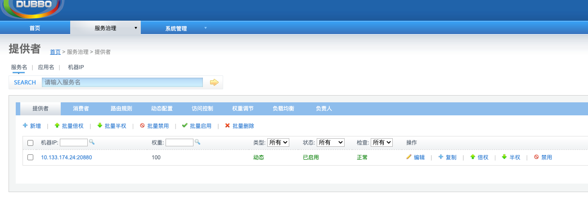

9. 消费者导包

	```xml
	<!--dubbo-->
	<!-- Dubbo Spring Boot Starter -->
	<dependency>
	   <groupId>org.apache.dubbo</groupId>
	   <artifactId>dubbo-spring-boot-starter</artifactId>
	   <version>2.7.3</version>
	</dependency>
	<!--zookeeper-->
	<!-- https://mvnrepository.com/artifact/com.github.sgroschupf/zkclient -->
	<dependency>
	   <groupId>com.github.sgroschupf</groupId>
	   <artifactId>zkclient</artifactId>
	   <version>0.1</version>
	</dependency>
	<!-- 引入zookeeper -->
	<dependency>
	   <groupId>org.apache.curator</groupId>
	   <artifactId>curator-framework</artifactId>
	   <version>2.12.0</version>
	</dependency>
	<dependency>
	   <groupId>org.apache.curator</groupId>
	   <artifactId>curator-recipes</artifactId>
	   <version>2.12.0</version>
	</dependency>
	<dependency>
	   <groupId>org.apache.zookeeper</groupId>
	   <artifactId>zookeeper</artifactId>
	   <version>3.4.14</version>
	   <!--排除这个slf4j-log4j12-->
	   <exclusions>
	       <exclusion>
	           <groupId>org.slf4j</groupId>
	           <artifactId>slf4j-log4j12</artifactId>
	       </exclusion>
	   </exclusions>
	</dependency>
	```

10. 配置参数

	```properties
	server.port=8002
	
	#当前应用名字
	dubbo.application.name=consumer-server
	#注册中心地址
	dubbo.registry.address=zookeeper://127.0.0.1:2181
	```

11. 写服务类

	```java
	@Service
	public class UserService {
	    @Reference //远程引用指定的服务，他会按照全类名进行匹配，看谁给注册中心注册了这个全类名
	    TicketService ticketService;
	
	    public void bugTicket(){
	        String ticket = ticketService.getTicket();
	        System.out.println("在注册中心买到" + ticket);
	    }
	}
	```

12. 测试

	```java
	@SpringBootTest
	class ConsumerServerApplicationTests {
		@Autowired
		UserService userService;
	
		@Test
		void contextLoads() {
			userService.bugTicket();
		}
	
	}
	```

	

