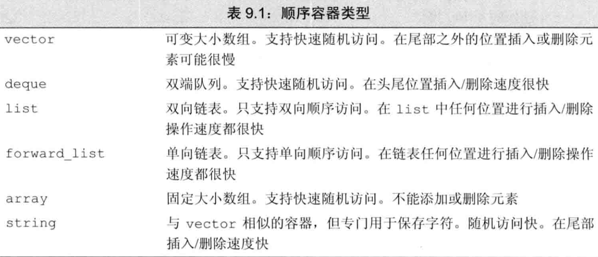
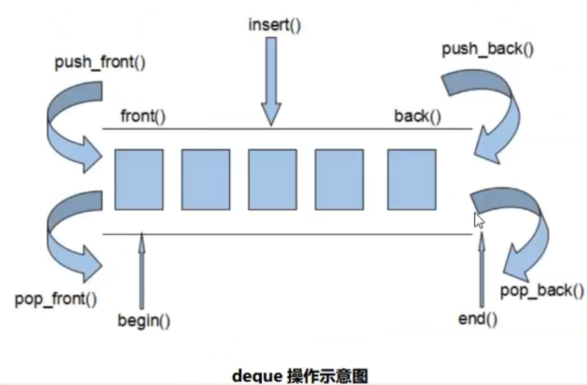
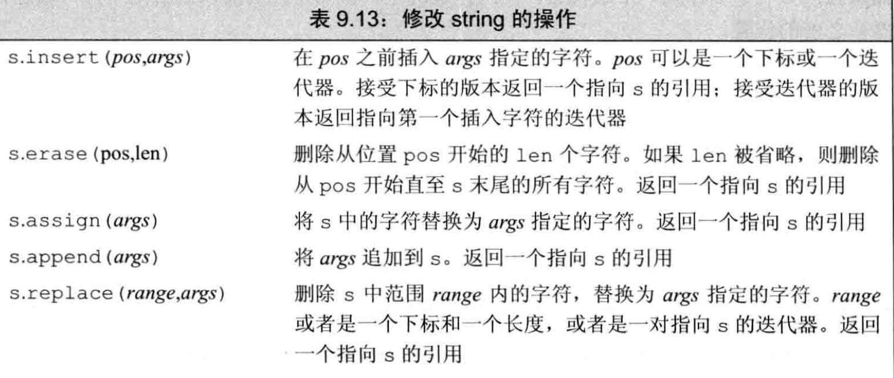
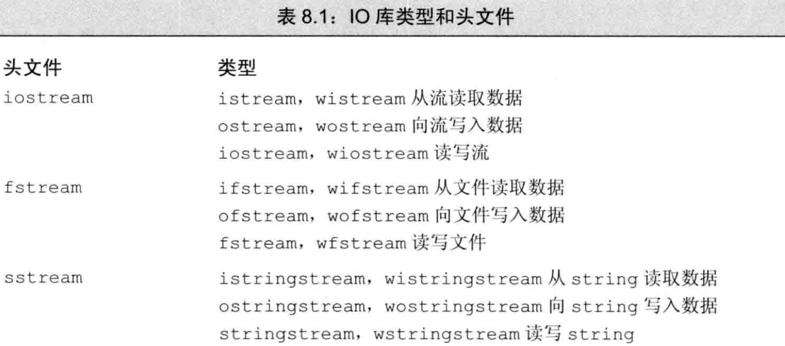

# C++笔记

* 头文件： **#include<stdio.h>**，C++中等价写法**cstdio**
* 对浮点型而言，不要使用float，一般都使用double
* ASCII码：0（48），A（65），a（97）
* 单引号：字符常量，双引号：字符串常量

|  类型  |     存储     |          取值           |
| :----: | :----------: | :---------------------: |
|  int   | 32bit(4字节) |         2^31-1          |
|  long  |    64bit     |         2^63-1          |
| float  |    32bit     |  2^128(6-7位有效精度)   |
| Double |    64bit     | 2^1024(15-16位有效精度) |
|  Char  |     8bit     |                         |
|  Bool  |              |                         |

## 1 常用函数

* **fabs(double x)**：取绝对值
* **floor(double x)  ceil(double x)**：向下、向上取整
* **pow(double r, double p)**：取幂
* **sqrt(double x)**：取算数平方根
* **log(double x)**：取以自然对数为底的对数
* **round(double x)**：将x四舍五入

## 2 顺序容器

### Vector容器

### deque容器

### list容器

### string容器

### 容器使用时机

## 3 IO库

* istream：输入流类型，提供输入条件
* ostream：输出流类型，提供输出条件

* IO对象无拷贝和赋值

