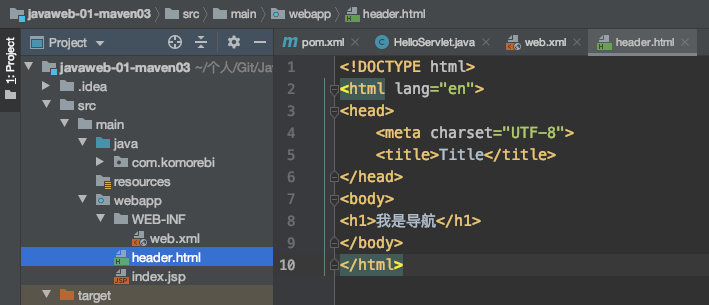

# JavaWeb

* web开发

	* 静态web
		* 缺点：
			* 不能动态更新，所有用户看到的都是同一个页面
			* 无法和数据库交互（数据无法持久化）

	

	* 动态web
		* 提供给所有人看的数据始终会发生变化
		* 技术栈：Servlet/JSP，ASP，PHP
		* **缺点**：若服务器动态web资源出现错误，需要重新编写后台程序，重新发布（停机维护）
		* **优点**：
			* 可以动态更新
			* 可以与数据库交互
		* 
	* 在Java中，动态web资源开发的技术统称为javaweb

* 一个web应用组成

	* html, css, js
	* Jsp, servlet
	* Java
	* jar
	* 配置文件(Properties)


## 1. 技术讲解

* **ASP**

	* 微软，维护成本高

	* 在html中嵌入了VB的脚本，ASP+COM

	* ASP开发中，基本一个页面

	* ```html
		<h1>
		  <h1>
		    <h1>
		      <%
		         System.out.println("hello")
		      %>
		      <h1>
		```

* **PHP**

	* 速度快，功能强大，跨平台，代码简单（70%， WP）
	* 无法承载**大访问量**的情况下（局限性）

* **JSP/Servlet**

	* sun公司主推的B/S架构（B/S：浏览和服务器，C/S：客户端和服务器）
	* 基于Java，语法像ASP
	* 可以承载三高（高并发、高可用、高性能）问题


## 2. web服务器

* 服务器是一种被动的操作，用来处理用户的一些请求和给用户一些相应信息
* **IIS**：
	* 微软；ASP；Windows中自带
* **Tomcat**：
	* Tomcat是Apache 软件基金会（Apache Software Foundation）的Jakarta 项目中的一个核心项目，由Apache、Sun 和其他一些公司及个人共同开发而成。由于有了Sun 的参与和支持，最新的Servlet 和JSP 规范总是能在Tomcat 中得到体现，Tomcat 5支持最新的Servlet 2.4 和JSP 2.0 规范。因为Tomcat 技术先进、性能稳定，而且免费，因而深受Java 爱好者的喜爱并得到了部分软件开发商的认可，成为目前比较流行的Web 应用服务器。


## 3. Tomcat

* [官网](https://tomcat.apache.org)下载tar.gz，解压后改名Tomcat放到资源库

	* ```shell
		cd /Library/Tomcat/bin 
		sudo chmod 755 *.sh
		sudo sh ./startup.sh
		sh ./shutdown.sh
		# http://localhost:8080 注意端口号要写
		```

	* 

* 配置

	* 核心配置文件

	* 可以配置启动的端口号、主机名称

		* **默认端口**

			* Tomcat：8080
			* MySQL：3306
			* http：80
			* Https：443

		* ```xml
			    <Connector port="8081" protocol="HTTP/1.1"
			               connectionTimeout="20000"
			               redirectPort="8443" />
			```

		* ```xml
			      <Host name="localhost"  appBase="webapps"
			            unpackWARs="true" autoDeploy="true">
			```

* **聊聊网站是如何进行访问的**

	* 输入域名，检查本机的hosts配置文件下有没有这个域名的映射（/etc/hosts）
		* 有，则直接返回对应的IP地址，这个地址中有我们需要的web程序，可以直接访问
		* 无，去DNS服务器找
		* 

* 网站发布

	* 将自己写的网站，放到服务器（Tomcat）中指定的web应用的文件夹下，就可以访问了

	* 网站应该有的结构

		```shell
		--webapps:
				-ROOT
				-komrebi
						-WEB-INF
								-classes
								-lib
								-web.xml
						-index.html		默认的首页
						-static
								-css
								-js
								-img
		```

	* localhost:8081/docs


## 4. HTTP

* **http**（超文本传输协议）是一个简单的请求-响应**协议**，它通常运行在TCP之上。它指定了客户端可能发送给服务器什么样的消息以及得到什么样的响应。请求和响应消息的头以**ASCII码**形式给出；而消息内容则具有一个类似MIME的格式。

* **变化**

	* HTTP/1.0：客户端与web服务器连接后，只能获得一个web资源，断开连接
	* HTTP/1.1：客户端与web服务器连接后，可以获得多个web资源

* **请求**

	* 客户端--发请求--服务器

	* 百度

	* 请求行

		* 请求方式：GET
		* GET：请求能够携带的参数比较少，大小有限制，会在浏览器的URL地址栏显示数据内容，不安全，但是高效
		* POST：请求能够携带的参数没有限制，大小没有限制，安全，但不高效

		```Java
		Request URL: https://www.baidu.com/		// 请求地址
		Request Method: GET										// get方法/post方法
		Status Code: 200 OK										// 状态码：200，404则是代表找不到资源
		Remote Address: 39.156.66.14:443
		Referrer Policy: strict-origin-when-cross-origin
		```

	* 消息头：

	* ```Java
		Accept: text/html											// 告诉浏览器所支持的数据类型
		Accept-Encoding: gzip, deflate, br		// 支持哪种编码格式  GBK UTF-8 GB2312 ISO8859-1
		Accept-Language: zh-CN,zh;q=0.9,en;q=0.8 // 告诉浏览器它的语言环境
		Connection: keep-alive								// 告诉浏览器，请求完成是断开还是保持连接
		```

* **响应**

	* 服务器--响应--客户端

	* 百度

		```Java
		Cache-Control: private								// 缓存控制
		Connection: keep-alive								// 连接
		Content-Encoding: gzip								// 编码
		Content-Type: text/html								// 类型
		```

* **当浏览器中地址栏输入地址并回车，到页面展示回来，经历了什么**？


## 5. Maven

* 在Javaweb开发中，需要导入很多jar包，自动帮我导入和配置这个jar包，Maven是**项目架构管理工具**

* 核心思想：**约定大于配置**

	* 有约束，不要去违反

* Maven会规定如何编写Java，[官网](http://maven.apache.org)

* [Mac配置Maven](https://blog.csdn.net/winstonlau/article/details/95605557)

	* M2_HOME：Maven目录下的bin目录

	* MAVEN_HOME：Maven目录

	* 修改镜像settings.xml

		```xml
		    <mirror>
		      <id>nexus-aliyun</id>
		      <mirrorOf>*,!jeecg,!jeecg-snapshots</mirrorOf>
		      <name>Nexus aliyun</name>
		      <url>http://maven.aliyun.com/nexus/content/groups/public</url> 
		    </mirror>
		```

* 建立一个仓库

	```xml
	<localRepository>/Library/Maven/maven-repo</localRepository>
	```

	

## 6. IDEA使用Maven

### 6.1 使用模板创建

* 
* 
* 

### 6.2 Maven创建普通Maven项目

* 

* 


### 6.3 IDEA中配置Tomcat

* 
* 
* **解决警告问题：我们访问一个网站，需要指定一个文件夹的名字**
* 
* 
* 

### 6.4 pom文件

* pom.xml是Maven的核心配置文件

* Maven由于**约定大于配置**，我们之后可能遇到我们写的配置文件(读取资源文件)，无法被导出或者生效的问题

	```xml
	<!--在build中配置resources,来防止我们资源导出失败的问题-->
	    <build>
	        <resources>
	            <resource>
	                <directory>src/main/resources</directory>
	                <excludes>
	                    <exclude>**/*.properties</exclude>
	                    <exclude>**/*.xml</exclude>
	                </excludes>
	                <filtering>false</filtering>
	            </resource>
	            <resource>
	                <directory>src/main/java</directory>
	                <includes>
	                    <include>**/*.properties</include>
	                    <include>**/*.xml</include>
	                </includes>
	                <filtering>false</filtering>
	            </resource>
	        </resources>
	    </build>
	```


### 6.5 Maven仓库使用

* [网站](https://mvnrepository.com/)
* 


* 替换为webapp4.0版本，和Tomcat保持一致

```xml
<?xml version="1.0" encoding="UTF-8"?>
<web-app xmlns="http://xmlns.jcp.org/xml/ns/javaee"
         xmlns:xsi="http://www.w3.org/2001/XMLSchema-instance"
         xsi:schemaLocation="http://xmlns.jcp.org/xml/ns/javaee
                      http://xmlns.jcp.org/xml/ns/javaee/web-app_4_0.xsd"
         version="4.0"
         metadata-complete="true">
</web-app>
```

### 6.6 用Java写函数映射到网站

* Java实现函数，继承Servlet接口

```Java
import javax.servlet.ServletException;
import javax.servlet.http.HttpServlet;
import javax.servlet.http.HttpServletRequest;
import javax.servlet.http.HttpServletResponse;
import java.io.IOException;
import java.io.PrintWriter;

public class HelloServlet extends HttpServlet {
    @Override
    protected void doGet(HttpServletRequest req, HttpServletResponse response) throws ServletException, IOException {
        // 响应的类型：html
        response.setContentType("text/html");
        // 获取响应的输出流
        PrintWriter out = response.getWriter();
        out.println("<html>");
        out.println("<head>");
        out.println("<title>Hello World!</title>");
        out.println("</head>");
        out.println("<body>");
        out.println("<h1>Hello World!</h1>");
        out.println("</body>");
        out.println("</html>");
    }

    @Override
    protected void doPost(HttpServletRequest req, HttpServletResponse resp) throws ServletException, IOException {
        doGet(req, resp);
    }
}
```

* 配置web.xml文件


```xml
<?xml version="1.0" encoding="UTF-8"?>
<web-app xmlns="http://xmlns.jcp.org/xml/ns/javaee"
         xmlns:xsi="http://www.w3.org/2001/XMLSchema-instance"
         xsi:schemaLocation="http://xmlns.jcp.org/xml/ns/javaee
                      http://xmlns.jcp.org/xml/ns/javaee/web-app_4_0.xsd"
         version="4.0"
         metadata-complete="true">

    <!--web.xml中是配置web的核心应用-->
    <!--注册Servlet-->
    <servlet>
        <servlet-name>helloServlet</servlet-name>
        <servlet-class>com.komorebi.HelloServlet</servlet-class>
    </servlet>
    <!--一个Servlet对应一个Mapping-->
    <servlet-mapping>
        <servlet-name>helloServlet</servlet-name>
        <!--请求路径-->
        <url-pattern>/komorebi</url-pattern>
    </servlet-mapping>
</web-app>
```

* 重写一个header.html




## 7. Servlet

* Servlet是开发**动态web**的一门技术，有两个默认的实现类：HttpServlet，GenericServlet
* Sun在这些API中提供了一个接口：Servlet，如果想开发一个Servlet程序，只需要2个步骤
	* 编写一个类，实现Servlet接口
	* 把开发好的Java类部署到web服务器中

### 7.1 基本构建

* 构建一个普通的Maven项目，删除src目录，以后就在里面建立Module；这个空的工程就是主工程

* 关于Maven父子工程的理解

	*  父项目中会有

		```xml
		<modules>
		        <module>servlet-01</module>
		</modules>
		```

	* 父项目中的Java子项目可以直接使用

* **Maven环境优化**

	* 修改web.xml
	* 将Maven的结构搭建完整
	* 编写Servlet程序
	* 编写Servlet的映射：我们写的是java程序，但是要通过浏览器访问，而浏览器需要连接web服务器，所以需要在web服务中注册写的servlet，还需要一个浏览器访问的路径
	* 配置Tomcat：注意配置路径
	* 测试

* 原理：

	* 是由web服务器调用，web服务器在收到浏览器请求之后，会产生2个对象（请求和响应）

	* **Mapping问题**

		* 一个请求可以指定一个映射路径

			```xml
			<servlet-mapping>
			    <servlet-name>hello</servlet-name>
			    <url-pattern>/hello</url-pattern>
			</servlet-mapping>
			```

		* 一个Servlet可以指定多个映射路径

			```xml
			<servlet-mapping>
			    <servlet-name>hello</servlet-name>
			    <url-pattern>/hello</url-pattern>
			</servlet-mapping>
			<servlet-mapping>
			    <servlet-name>hello</servlet-name>
			    <url-pattern>/hello1</url-pattern>
			</servlet-mapping>
			<servlet-mapping>
			    <servlet-name>hello</servlet-name>
			    <url-pattern>/hello2</url-pattern>
			</servlet-mapping>
			```

		* 一个Servlet可以指定通用映射路径

			```xml
					<servlet-mapping>
			        <servlet-name>hello</servlet-name>
			        <url-pattern>/hello/*</url-pattern>
			  	</servlet-mapping>
			```

		* 指定一些前缀或者后缀等，如果是***.komorebi**则前面不能加**/**

		* **优先级**：指定了固定的映射路径优先级最高，如果找不到就会走默认的处理机制

* **ServletContext**

	* web容器在启动的时候，会为每个web程序创建一个对应的ServletContext对象，它代表了当前的web应用

		* 共享数据

			```Java
			public class HelloServlet extends HttpServlet {
			    @Override
			    protected void doGet(HttpServletRequest req, HttpServletResponse resp) throws ServletException, IOException {
			        System.out.println("hello");
			
			        ServletContext context = this.getServletContext();
			        String username = "komorebi";
			        context.setAttribute("username", username);
			    }
			}
			```

			```java
			public class GetServlet extends HttpServlet {
			    @Override
			    protected void doGet(HttpServletRequest req, HttpServletResponse resp) throws ServletException, IOException {
			        ServletContext context = this.getServletContext();
			        String username = (String)context.getAttribute("username");
			
			        resp.setContentType("text/html");
			        resp.setCharacterEncoding("utf-8");
			        resp.getWriter().print(username);
			    }
			}
			```

		* 获取初始化参数
		
			```xml
			<!--配置一些web应用初始化参数-->
			<context-param>
			    <param-name>url</param-name>
			    <param-value>jdbc:mysql://localhost:3306/mybatis</param-value>
			</context-param>
			<servlet>
			    <servlet-name>gp</servlet-name>
			    <servlet-class>com.komorebi.servlet.ServletDemo03</servlet-class>
			</servlet>
			<servlet-mapping>
			    <servlet-name>gp</servlet-name>
			    <url-pattern>/gp</url-pattern>
			</servlet-mapping>
			```
		
		* 请求转发
		
			```Java
			protected void doGet(HttpServletRequest req, HttpServletResponse resp) throws ServletException, IOException {
			    System.out.println("in ServletDemo04");
			    ServletContext context = this.getServletContext();
			    RequestDispatcher requestDispatcher = context.getRequestDispatcher("/gp");      // 转发的请求路径
			    requestDispatcher.forward(req, resp);                  // 调用forward实现请求转发
			    // context.getRequestDispatcher("/gp").forward(req, resp);
			}
			```
		
		* 读取资源文件(如果在Java中，就需要pom配置)
		
			* 在Java目录下新建properties
			* 在resources目录下新建properties
		
			都会被打包到classes，俗称类路径
		
			```Java
			protected void doGet(HttpServletRequest req, HttpServletResponse resp) throws ServletException, IOException {
			    InputStream is = this.getServletContext().getResourceAsStream("/WEB-INF/classes/db.properties");
			    Properties properties = new Properties();
			    properties.load(is);
			    String username = properties.getProperty("username");
			    String pwd = properties.getProperty("passward");
			
			    resp.getWriter().print(username + " " + pwd);
			}
			```
		
			* 思路：需要一个文件流

### 7.2 HttpServletResponse

* web服务器接收到客户端的HTTP请求，会针对这个请求，分别创建一个代表请求的HttpServletRequest对象和代表响应的HttpServletResponse对象

	* 如果要获取客户端请求过来的参数，找HttpServletRequest
	* 如果要给客户端响应一些信息，找HttpServletResponse

* 简单分类：

	* 负责向浏览器发送数据的方法：

		```Java
		ServletOutputStream getOutputStream() throws IOException;
		PrintWriter getWriter() throws IOException;
		```
		
	* 负责向浏览器发送响应头的方法：
	
		```Java
		void setCharacterEncoding(String var1);
		void setContentLength(int var1);
		void setContentLengthLong(long var1);
		void setContentType(String var1);
		```
	
	* 响应的状态码
	
* 常见应用

	* 向浏览器输出消息

	* 下载文件

		* 要获取下载文件的路径

		* 下载的文件名

		* 设置让浏览器支持下载所需的东西

		* 获取下载文件的输入流

		* 创建缓冲区

		* 获取OutputStream对象

		* 将FileOutputStream流写入到buffer缓冲区

		* 使用OutputStream将缓冲区中的数据输出到客户端

		* ```Java
			public class FileServlet extends HttpServlet {
			    @Override
			    protected void doGet(HttpServletRequest req, HttpServletResponse resp) throws ServletException, IOException {
			        //1 要获取下载文件的路径
			        String realPath = this.getServletContext().getRealPath("/WEB-INF/classes/dog.jpg");
			        System.out.println("路径： " + realPath);
			        //2 下载的文件名
			        String fileName = realPath.substring(realPath.lastIndexOf("/") + 1);
			        System.out.println("filename: " + fileName);
			        //3 设置让浏览器支持下载所需的东西，encode是为了中文文件名
			        resp.setHeader("Content-Disposition", "attachment;filename=" + URLEncoder.encode(fileName, "UTF-8"));
			        //4 获取下载文件的输入流
			        FileInputStream in = new FileInputStream(realPath);
			        //5 创建缓冲区
			        int len = 0;
			        byte[] buffer = new byte[1024];
			        //6 获取OutputStream对象
			        ServletOutputStream out = resp.getOutputStream();
			        //7 将FileOutputStream流写入到buffer缓冲区
			        while ((len = in.read(buffer)) > 0) {
			            out.write(buffer, 0, len);
			        }
			        in.close();
			        out.close();
			    }
			}
			```

	* 验证码功能

		* 后端实现，用到Java的图片类，生成一个图片

### 7.3 HttpServletRequest

