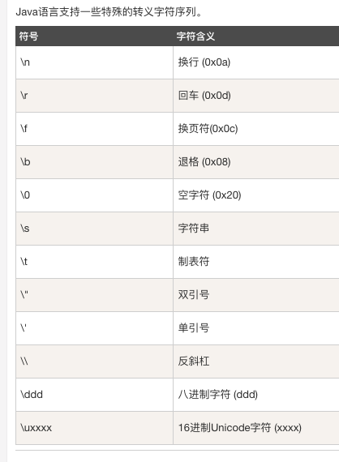
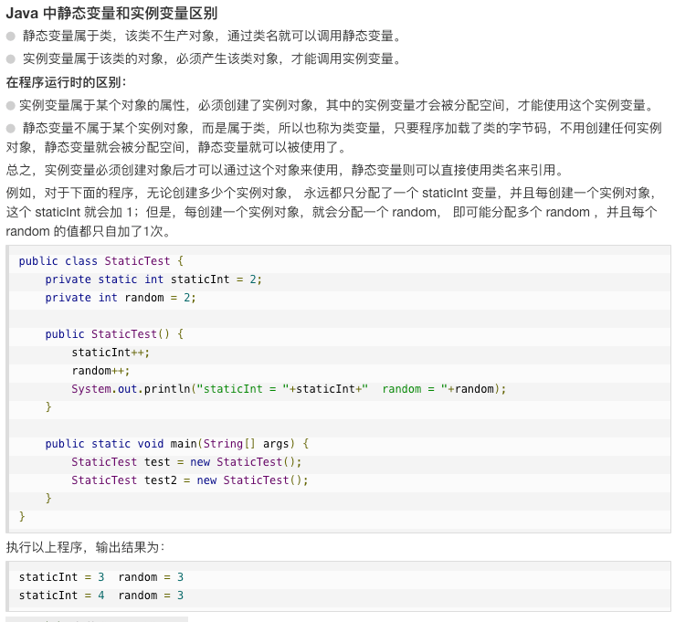

# Java笔记

## 1. 基本数据类型

### 转义字符序列




### 自动类型转换


* 不能对**boolean**类型进行转换
* 不能把对象类型转化为不相关类的对象
* 把容量大的类型转化为容量小的类型时必须使用强制类型转化
* 转换过程中可能会损失精度
* 浮点数到整数的转换通过**舍弃小数**得到，而不是四舍五入

```Java
char a = "a";
int b = a;
System.out.println(b)

int c = 1;
byte d = (byte)c;							    //强制类型转换
```


### 变量类型




## 2. 修饰符

* default：在同一包内可见，不使用任何修饰符。使用对象：类、接口、变量、方法
* Private：在同一类内可见。使用对象：变量、方法
* Public：对所有类可见。使用对象：类、接口、变量、方法
* Protected：对同一包内的类和所有子类可见。使用对象：变量、方法


