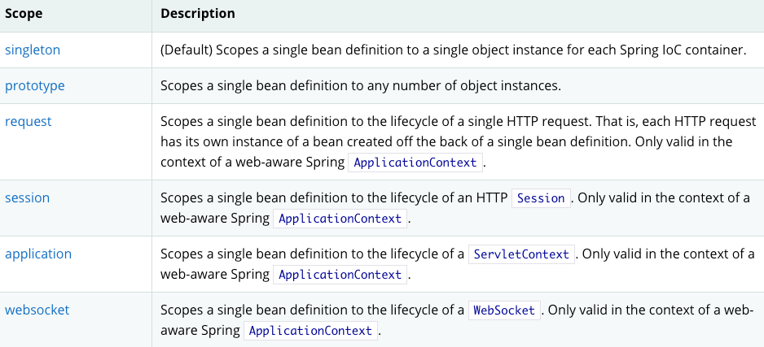
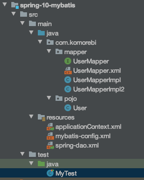

# Spring

```xml
<!-- https://mvnrepository.com/artifact/org.springframework/spring-webmvc -->
<dependency>
    <groupId>org.springframework</groupId>
    <artifactId>spring-webmvc</artifactId>
    <version>5.3.1</version>
</dependency>
<!-- https://mvnrepository.com/artifact/org.springframework/spring-jdbc -->
<dependency>
    <groupId>org.springframework</groupId>
    <artifactId>spring-jdbc</artifactId>
    <version>5.3.1</version>
</dependency>
```

## 1 简介

* 02年，首次推出了Spring框架的雏形：interface21
* 04年3月24日，Spring框架以interface21为基础，经过重新设计，发布了1.0正式版
* Spring理念：使现有的技术更加容易使用，本身是一个大杂烩

### 1.1 优点

* 是一个开源的免费容器
* 是一个轻量级的、非入侵式的框架
* **控制反转（IOC），面向切面编程（AOP）**
* 支持事务的处理，对框架整合的支持

==Spring是一个轻量级的控制反转（IOC）和面向切面编程的框架！==

### 1.2 组成


### 1.3 拓展

现代化的java开发! 就是基于Spring的开发


* Spring Boot：
	* 一个快速开发的脚手架
	* 基于Spring Boot可以快速开发单个微服务
	* 约定大于配置！
* Spring Cloud
	* 基于Spring Boot实现的
* **弊端：发展得太久，配置十分繁琐，江湖人称“配置地狱”**


## 2 IOC理论推导

```java
public class UserServiceImpl implements UserService{
    private UserDao userDao;

    //利用set进行动态实现值的注入
    public void setUserDao(UserDao userDao) {
        this.userDao = userDao;
    }

    public void getUser() {
        userDao.getUser();
    }
}
```

```java
public class MyTest {
    public static void main(String[] args) {
        // 用户实际调用的是业务层，Dao层不需要接触
        UserServiceImpl userService = new UserServiceImpl();

        userService.setUserDao(new UserDaoMysqlImpl());

        userService.getUser();
    }
}
```

* 之前，程序是主动创建对象，控制权在程序员手中
* 使用set注入后，**程序不再具有主动性，而是被动的接受对象，系统的耦合性大大降低，可以更加专注在业务上**
* 这是IOC的原型


### 2.1 IOC本质

* **控制反转（IOC）是一种设计思想，DI（依赖注入）是实现IOC的一种方法**。没有IOC的程序中，我们使用面向对象编程，对象的创建与对象间的依赖关系完全硬编码在程序中，对象的创建由程序自己控制，控制反转后将对象的创建转移给第三方，个人认为所谓控制反转就是：**获得依赖对象的方式反转了**
* Spring容器在初始化时先读取配置文件，根据配置文件或元数据创建与组织对象存入容器中，程序使用时再从IOC容器中取出需要的对象
* 采用XML方式配置Bean的时候，Bean的定义信息是和实现分离的，而采用注解的方式可以把两者合为一体，Bean的定义信息直接以注解的形式定义在实现类中，从而达到了零配置的目的
* **控制反转是一种通过描述（XML或注解）并通过第三方去生产或获取特定对象的方式。在Spring中实现控制反转的是IOC容器，其实现方法是依赖注入（Dependency Injection, DI）。**


## 3 HelloSpring

* 1 实体类

* 2 **beans.xml**

	```xml
	<?xml version="1.0" encoding="UTF-8"?>
	<beans xmlns="http://www.springframework.org/schema/beans"
	       xmlns:xsi="http://www.w3.org/2001/XMLSchema-instance"
	       xsi:schemaLocation="http://www.springframework.org/schema/beans http://www.springframework.org/schema/beans/spring-beans.xsd">
	
	    <!--使用Spring来创建对象，在Spring这些都称为Bean
	        bean = 对象  new Hello()
	    -->
	    <bean id="hello" class="com.komorebi.pojo.Hello">
	        <property name="str" value="spring"/>
	    </bean>
	</beans>
	```

* 3 test

	```java
	public class MyTest {
	    public static void main(String[] args) {
	        // 获取Spring的上下文对象
	        ApplicationContext context = new ClassPathXmlApplicationContext("beans.xml");
	
	        // 对象都在Spring中管理，要使用就取出来
	        Hello hello = (Hello) context.getBean("hello");
	        System.out.println(hello.toString());
	    }
	}
	```


## 4 IOC创建对象的方式

* 1 **使用无参构造创建对象，默认**

* 2 若要使用**有参**

	* ```xml
		<bean id="user" class="com.komorebi.pojo.User">
		    <!--1 下标赋值-->
		    <constructor-arg index="0" value="komorebi"/>
		</bean>
		```

	* ```xml
		<bean id="user" class="com.komorebi.pojo.User">
		    <!--2 类型赋值,不建议使用，若两个参数都为String则无效-->
		    <constructor-arg type="java.lang.String" value="komorebi"/>
		</bean>
		```

	* ```xml
		<bean id="user" class="com.komorebi.pojo.User">
		    <!--3 直接通过参数名设置-->
		    <constructor-arg name="name" value="komorebi"/>
		</bean>
		```

* **总结：在配置文件加载的时候，容器中管理的对象就已经初始化了**


## 5 Spring配置

### 5.1 别名

```xml
<!--别名，如果添加，也可以用别名获取-->
<alias name="user" alias="userAlias"/>
```

### 5.2 Bean配置

```xml
<!--
	id: Bean的唯一标识符，相当于对象名
	class：Bean对象所对应的全限定名：包名+类名
	name：别名，可以同时取多个别名 name="user2 u2, u3; u4"
-->
<bean id="user2" class="com.komorebi.pojo.UserT"></bean>
```

### 5.3 Import

* 一般用于团队开发使用，可以将多个配置配置文件导入合并为一个

```xml
<?xml version="1.0" encoding="UTF-8"?>
<beans xmlns="http://www.springframework.org/schema/beans"
       xmlns:xsi="http://www.w3.org/2001/XMLSchema-instance"
       xsi:schemaLocation="http://www.springframework.org/schema/beans http://www.springframework.org/schema/beans/spring-beans.xsd">

    <import resource="beans.xml"/>
</beans>
```


## 6 依赖注入(DI)

### 6.1 构造器注入

已讲(第4节)

### 6.2 Set方式注入【重点】

* 依赖注入：Set注入！

	* 依赖：bean对象的创建依赖于容器
	* 注入：Bean对象中的所有属性由容器来注入

* 环境搭建

	* 1 address

		```java
		@Data
		public class Address {
		    private String address;
		}
		```

	* 2 student

		```java
		@Data
		public class Student {
		    private String name;
		    private Address address;
		    private String[] books;
		    private List<String> hobbies;
		    private Map<String, String> card;
		    private Set<String> games;
		    private Properties info;
		    private String wife;
		}
		```

	* 3 **beans.xml**

	  ```xml
	  <bean id="address" class="com.komorebi.pojo.Address">
	      <property name="address" value="nanjing"/>
	  </bean>
	  
	  <bean id="student" class="com.komorebi.pojo.Student">
	      <!--第一种，普通值注入，value-->
	      <property name="name" value="komorebi"/>
	  
	      <!--第二种，bean注入，ref-->
	      <property name="address" ref="address"/>
	  
      <!--第三种，数组注入-->
	      <property name="books">
          <array>
	              <value>A</value>
	              <value>B</value>
	              <value>C</value>
	          </array>
	      </property>
	  
	      <!--第四种，List注入-->
	      <property name="hobbies">
	          <list>
                <value>a</value>
	              <value>b</value>
	              <value>c</value>
	          </list>
	      </property>
	  
	      <!--第五种，Map注入-->
	      <property name="card">
	          <map>
	              <entry key="1" value="v1"/>
	              <entry key="2" value="v2"/>
	          </map>
	      </property>
	  
	      <!--第六种，Set注入-->
	      <property name="games">
	          <set>
	              <value>LOL</value>
	          </set>
	      </property>
	  
	      <!--第七种，NULL注入-->
	      <property name="wife">
	          <null/>
	      </property>
	  
	      <!--第八种-->
	      <property name="info">
	          <props>
	              <prop key="学号">20190001</prop>
	              <prop key="性别">1</prop>
	          </props>
	      </property>
	  </bean>
	  ```
	
	* 4 测试
	
		```java
		public class MyTest {
		    public static void main(String[] args) {
		        ApplicationContext context = new ClassPathXmlApplicationContext("beans.xml");
		        Student student = (Student) context.getBean("student");
		        System.out.println(student.getName());
		    }
		}
		```
	

### 6.3 拓展方式注入

官方解释：

```xml
<?xml version="1.0" encoding="UTF-8"?>
<beans xmlns="http://www.springframework.org/schema/beans"
       xmlns:xsi="http://www.w3.org/2001/XMLSchema-instance"
       xmlns:p="http://www.springframework.org/schema/p"
       xmlns:c="http://www.springframework.org/schema/c"
       xsi:schemaLocation="http://www.springframework.org/schema/beans http://www.springframework.org/schema/beans/spring-beans.xsd">

    <!--p命名空间注入，可以直接注入属性的值：property-->
    <bean id="user" class="com.komorebi.pojo.User" p:name="komorebi" p:age="18"/>

    <!--c命名空间注入，可以通过构造器注入属性的值：construct-args-->
    <bean id="user2" class="com.komorebi.pojo.User" c:name="komorebi" c:age="18"/>
</beans>
```

注意点：

* p命名和c命名空间不能直接使用，需要使用xml约束 

### 6.4 Bean作用域



* 单例模式（默认）：只创建一个对象

```xml
<bean id="user2" class="com.komorebi.pojo.User" c:age="18" c:name="komorebi" scope="singleton"/>
```

* 原型模式：每次从容器中get的时候，都创建一个对象

```xml
<bean id="user2" class="com.komorebi.pojo.User" c:age="18" c:name="komorebi" scope="singleton"/>
```

* 其余的只有在web情况下才需要使用


## 7 Bean自动装配（重点）

* 自动装配是Spring满足Bean依赖的一种方式
* Spring会在上下文中自动寻找，并自动给Bean装配属性！

在Spring中有三种装配方式

1. 在xml中显式配置
2. 在java中显式配置
3. 隐式的自动装配（**重点**）
	* 环境搭建：一个人有两个宠物

### 7.1 ByName自动装配

```xml
<bean id="cat" class="com.komorebi.pojo.Cat"/>
<bean id="dog" class="com.komorebi.pojo.Dog"/>

<!--ByName会自动在上下文中查找，和自己对象Set方法后面的值对应的BeanID-->
<bean id="person" class="com.komorebi.pojo.Person" autowire="byName">
    <property name="name" value="komorebi"/>
</bean>
```

* 缺点：ID名必须一致

### 7.2 ByType自动装配

```xml
<bean class="com.komorebi.pojo.Cat"/>
<bean class="com.komorebi.pojo.Dog"/>

<!--ByType会自动在上下文中查找，和自己对象属性类型相同的bean-->
<bean id="person" class="com.komorebi.pojo.Person" autowire="byType">
    <property name="name" value="komorebi"/>
</bean>
```

* 这种方式可以在dog处不写id
* 缺点：这种类型在对象里面必须唯一
* 小结：
	* ByName需要保证所有Bean的ID唯一，并且Bean必须和自动注入属性的set方法的值一致
	* ByType需要保证所有Bean的class唯一，并且这个Bean必须和自动注入的属性的类型一致

### 7.3 注解实现自动装配 

* JDK1.5支持的注解，Spring2.5支持注解

* 使用要求

	* 1 导入约束：context约束

		```xml
		xmlns:context="http://www.springframework.org/schema/context"
		```

	* 2 配置注解的支持

		```xml
		<?xml version="1.0" encoding="UTF-8"?>
		<beans xmlns="http://www.springframework.org/schema/beans"
		    xmlns:xsi="http://www.w3.org/2001/XMLSchema-instance"
		    xmlns:context="http://www.springframework.org/schema/context"
		    xsi:schemaLocation="http://www.springframework.org/schema/beans
		        https://www.springframework.org/schema/beans/spring-beans.xsd
		        http://www.springframework.org/schema/context
		        https://www.springframework.org/schema/context/spring-context.xsd">
		
		    <context:annotation-config/>
		    
		    <bean id="cat" class="com.komorebi.pojo.Cat"/>
		    <bean id="dog" class="com.komorebi.pojo.Dog"/>
		    <bean id="person" class="com.komorebi.pojo.Person"/>
		</beans>
		```

* **@Autowired**：直接在属性上使用即可，也可以在set方式上使用（可以不编写set方法）

	* 若**@Autowired**自动装配的环境比较复杂，自动装配无法通过一个注解@Autowired完成的时候，我们可以使用**@Qualifier(value = "xx")**去配合使用，指定一个唯一的bean对象注入

	```java
	@Data
	public class Person {
	    @Autowired
	    @Qualifier(value = "cat")			// 用来搭配使用，当type和name都无法匹配时指定
	    private Cat cat;
	    @Autowired
	    @Qualifier(value = "dog")
	    private Dog dog;
	    private String name;
	}
	```

* **@Nullable**：字段标记了这个注解，这个字段可以为null

* **@Resource**：java的原生注解，类似于type和name的组合

	```java
	@Resource(name = "cat2")
	private Cat cat;
	```

* @Resource和@Autowired区别

	* 相同：都是用来自动装配，都可以放在属性字段上
	* @Autowired通过**ByType**的方式实现
	* @Resource通过**ByName**的方式实现

**@Resource装配顺序**：

①如果同时指定了name和type，则从Spring上下文中找到唯一匹配的bean进行装配，找不到则抛出异常。

②如果指定了name，则从上下文中查找名称（id）匹配的bean进行装配，找不到则抛出异常。

③如果指定了type，则从上下文中找到类似匹配的唯一bean进行装配，找不到或是找到多个，都会抛出异常。

④如果既没有指定name，又没有指定type，则自动按照byName方式进行装配；如果没有匹配，则回退为一个原始类型进行匹配，如果匹配则自动装配。

**@Resource的作用相当于@Autowired，只不过@Autowired按照byType自动注入。**


## 8 使用注解开发

* 在Spring4之后，要使用注解开发，必须要保证AOP的包导入了

	```xml
	<?xml version="1.0" encoding="UTF-8"?>
	<beans xmlns="http://www.springframework.org/schema/beans"
	       xmlns:xsi="http://www.w3.org/2001/XMLSchema-instance"
	       xmlns:context="http://www.springframework.org/schema/context"
	       xsi:schemaLocation="http://www.springframework.org/schema/beans
	        http://www.springframework.org/schema/beans/spring-beans.xsd
	        http://www.springframework.org/schema/context
	        https://www.springframework.org/schema/context/spring-context.xsd">
	    <!--指定要扫描的包，这个包下的注解会生效-->
	    <context:component-scan base-package="com.komorebi.pojo"/>
	    <context:annotation-config/>
	
	</beans>
	```

1. Bean

2. 属性如何注入

	```java 
	// 等价于注册了一个bean
	@Component
	public class User {
	    @Value("komorebi")
	    public String name;
	}
	```

3. 衍生的注解
	@Component 有几个衍生注解，在web开发中，会按照MVC三层架构分层，这四个注解功能都是一样的，**都是代表将某个类装配到Spring中，装配Bean**
	

4. 自动装配注解（Chapter 7）

5. 作用域

	```java
	// 等价于注册了一个bean
	@Component
	@Scope("prototype")
	public class User {
	    @Value("komorebi")
	    public String name;
	}
	```

6. 小结

	xml与注解：

	* xml更加万能，适用于任何场合！维护简单方便
	* 注解不是自己类使用不了，维护相对复杂
	* **最佳实践：xml用来管理Bean，注解只负责属性的注入**


## 9 使用Java的方式配置Spring

我们现在要完全不使用Spring的xml配置，全部交给Java做！

JavaConfig是Spring的子项目，在Spring4之后成为了一个核心功能

* User.java

	```java
	@Data
	@Component
	public class User {
	    @Value("komorebi2")
	    private String name;
	}
	```

* KomorebiConfig.java

	```java
	// 这个也会被Spring容器托管，注册到容器中，因为其本身就是一个Component，@Configuration代表这是一个配置类（beans.xml）
	@Configuration
	@ComponentScan("com.komorebi.pojo")
	@Import(KomorebiConfig2.class)    			// 当不止一个Bean的情况时
	public class KomorebiConfig {
	    // 注册一个Bean，就相当于我们之前写的一个Bean标签
	    // 这个方法的名字，就相当于Bean标签中的ID属性
	    // 这个方法的返回值，就相当于Bean标签中的class属性
	    @Bean
	    public User getUser(){
	        return new User();      // 就是返回要注入到Bean中的对象
	    }
	}
	```

* MyTest.java

	```java
	public class MyTest {
	    public static void main(String[] args) {
	        // 如果完全使用了配置类方式去做，就只能通过AnnotationConfig上下文来获取容器，通过配置类的class对象加载
	        ApplicationContext context = new AnnotationConfigApplicationContext(KomorebiConfig.class);
	        User user = context.getBean("getUser", User.class);
	        System.out.println(user.getName());
	    }
	}
	```


## 10 代理模式

代理模式就是SpringAOP的底层[SpringAOP 和 SpringMVC]

代理模式的分类：

* 静态代理
* 动态代理


### 10.1 静态代理模式

角色分析：

* 抽象角色：一般会使用接口或者抽象类来解决
* 真实角色：被代理的角色
* 代理角色：代理真实角色，代理真实角色后，我们一般会做一些附属操作
* 客户：访问代理对象的人

代理模式的**好处**：

* 可以使真实角色的操作更加纯粹，不用去关注一些公共的业务
* 公共业务交给代理角色，实现了业务的分工
* 公共业务发生拓展的时候，方便集中管理

代理模式的**缺点**：

* 一个真实角色会产生一个代理角色，代码量会翻倍，开发效率会变低

代码步骤：

1. 接口

	```java
	public interface Rent {
	    public void rent();
	}
	```

2. 真实角色

	```java
	public class Host implements Rent{
	    public void rent(){
	        System.out.println("Host wants to rent.");
	    }
	}
	```

3. 代理角色

	```java
	@Data
	@NoArgsConstructor
	@AllArgsConstructor
	public class Proxy implements Rent {
	    private Host host;
	
	    public void rent(){
	        host.rent();
	    }
	
	    public void seeHouse(){
	        System.out.println("See the house.");
	    }
	}
	```

4. 客户端访问代理角色

	```java
	public class Client {
	    public static void main(String[] args) {
	        Host host = new Host();
	
	        Proxy proxy = new Proxy(host);
	        proxy.rent();
	        proxy.seeHouse();       // 附属操作
	    }
	}
	```

### 10.2 AOP实现机制


### 10.3 动态代理

* 动态代理和静态代理角色一样
* 动态代理的代理类是动态生成的，而不是直接写好的
* 动态代理分为两大类：
	* 基于接口的动态代理
		* JDK动态代理
	* 基于类的动态代理
		* cglib
	* java字节码 JAVAssist（JBoss应用服务器）

需要了解两个类：**Proxy**，**InvocationHandler**

#### 10.3.1 InvocationHandler

* **ProxyInvocationHandler.java**

	```java
	// 会用这个类，自动生成代理类
	public class ProxyInvocationHandler implements InvocationHandler {
	    // 被代理的接口
	    private Object target;
	
	    public void setTarget(Object target) {
	        this.target = target;
	    }
	
	    // 生成得到代理类
	    public Object getProxy(){
	        return Proxy.newProxyInstance(this.getClass().getClassLoader(), target.getClass().getInterfaces(), this);
	    }
	
	    // 处理代理实例，并返回结果
	    public Object invoke(Object proxy, Method method, Object[] args) throws Throwable {
	        // 动态代理的本质就是使用反射机制实现
	        Object result = method.invoke(target, args);
	        return result;
	    }
	}
	```

* **Client.java**

	```java
	public class Client {
	    public static void main(String[] args) {
	        // 真实角色
	        UserServiceImpl userService = new UserServiceImpl();
	
	        // 代理角色
	        ProxyInvocationHandler pih = new ProxyInvocationHandler();
	        pih.setTarget(userService); // 设置要代理的对象
	
	        // 动态生成代理类
	        UserService proxy = (UserService) pih.getProxy();
	        proxy.add();
	      
	//        Host host = new Host();
	//
	//        ProxyInvocationHandler pih = new ProxyInvocationHandler();
	//        pih.setTarget(host);
	//
	//        Rent proxy = (Rent) pih.getProxy();
	//        proxy.rent();
	    }
	}
	```

**动态代理的好处**：

* 一个动态代理类代理的是一个接口，一般就是对应的一类业务
* 一个动态代理类可以代理多个类，只要是实现了同一个接口即可


## 11 AOP(重点)

### 11.1 什么是AOP

​		AOP（Aspect Oriented Programming）意为：面向切面编程，通过**预编译方式**和**运行期动态代理**实现程序功能统一维护的一种技术。AOP是OOP的延续，是软件开发中的一个热点，也是Spring框架中的一个重要内容，是函数式编程的一种衍生笵型。利用AOP可以对业务逻辑的各个部分进行隔离，从而使得业务逻辑各部分之间的耦合度降低，提高程序的可重用性，同时提高了开发的效率。


### 11.2 AOP在Spring中的作用

==提供声明式事务；允许用户自定义切面==

* 横切关注点：跨越应用程序多个模块的方法或功能，即是，与业务逻辑无关的，但是需要关注的部分，就是横切关注点。如日志、安全、缓存、事务等等
* 切面（Aspect）：横切关注点，被模块化的特殊对象。即，是一个类
* 通知（Advice）：切面必须要完成的工作。即，类中的一个方法
* 目标（Target）：被通知对象
* 代理（Proxy）：想目标对象应用通知后创建的对象
* 切入点（PointCut）：切面通知执行的“地点”的定义
* 连接点（JointPoint）：与切入点匹配的执行点


### 11.3 使用Spring实现AOP

【重点】使用AOP织入，需要导入一个依赖包

```xml
<!--织入包-->
<dependency>
    <groupId>org.aspectj</groupId>
    <artifactId>aspectjweaver</artifactId>
    <version>1.9.4</version>
</dependency>
```

**方式一：使用Spring的API接口**（接口）

* applicationContext.xml

```xml
<?xml version="1.0" encoding="UTF-8"?>
<beans xmlns="http://www.springframework.org/schema/beans"
       xmlns:xsi="http://www.w3.org/2001/XMLSchema-instance"
       xmlns:aop="http://www.springframework.org/schema/aop"
       xsi:schemaLocation="http://www.springframework.org/schema/beans
       https://www.springframework.org/schema/beans/spring-beans.xsd
       http://www.springframework.org/schema/aop
       https://www.springframework.org/schema/aop/spring-aop.xsd">

    <bean id="userService" class="com.komorebi.service.UserServiceImpl"/>
    <bean id="log" class="com.komorebi.log.log"/>
    <bean id="afterLog" class="com.komorebi.log.AfterLog"/>

    <!--方式一：使用原生Spring API接口-->
    <!--配置aop:需要导入AOP的约束-->
    <aop:config>
        <!--切入点-->
        <aop:pointcut id="pointcut" expression="execution(* com.komorebi.service.UserServiceImpl.*(..))"/>
        <!--执行环绕增强-->
        <aop:advisor advice-ref="log" pointcut-ref="pointcut"/>
        <aop:advisor advice-ref="afterLog" pointcut-ref="pointcut"/>
    </aop:config>
</beans>
```

* MyTest.java

```java
public class MyTest {
    public static void main(String[] args) {
        ApplicationContext context = new ClassPathXmlApplicationContext("applicationContext.xml");

        // 动态代理
        UserService userService = context.getBean("userService", UserService.class);

        userService.add();
    }
}

```

**方式二：使用自定义类来实现**（切面）

* 相对简单，但是功能少

* applicationContext.xml

```xml
<!--方式二：自定义类-->
<bean id="diy" class="com.komorebi.diy.DiyPointCut"/>
<aop:config>
    <!--自定义切面，ref要引用的类-->
    <aop:aspect ref="diy">
        <!--切入点-->
        <aop:pointcut id="point" expression="execution(* com.komorebi.service.UserServiceImpl.*(..))"/>
        <!--通知-->
        <aop:before method="before" pointcut-ref="point"/>
        <aop:after method="after" pointcut-ref="point"/>
    </aop:aspect>
</aop:config>
```

**方式三：使用注解实现**

* AnnotationPointCut.java

```java
package com.komorebi.diy;

import org.aspectj.lang.ProceedingJoinPoint;
import org.aspectj.lang.annotation.After;
import org.aspectj.lang.annotation.Around;
import org.aspectj.lang.annotation.Aspect;
import org.aspectj.lang.annotation.Before;

// 方式三：使用注解方式实现
@Aspect     // 标注一个类是切面
public class AnnotationPointCut {
    @Before("execution(* com.komorebi.service.UserServiceImpl.*(..))")
    public void before(){
        System.out.println("Before the method");
    }

    @After("execution(* com.komorebi.service.UserServiceImpl.*(..))")
    public void after(){
        System.out.println("After the method");
    }

    @Around("execution(* com.komorebi.service.UserServiceImpl.*(..))")
    public void around(ProceedingJoinPoint jp) throws Throwable {
        System.out.println("before around");
        Object proceed = jp.proceed();              // 执行方法
        System.out.println("after around");
    }
}

// before around
// Before the method
// delete.
// After the method
// after around
```

* applicationContext.xml

```xml
<!--方式三：注解-->
<bean id="annotationPointCut" class="com.komorebi.diy.AnnotationPointCut"/>
<aop:aspectj-autoproxy/>
```


## 12 整合Mybatis

步骤：

1. 导入相关jar包
	* junit mybatis mysql spring aop织入 
	* mybatis-spring ( new )
2. 编写配置文件
3. 测试

### 12.1 复习

流程：

1. 编写实体类

	```java
	@Data
	@NoArgsConstructor
	@AllArgsConstructor
	public class User {
	    private int id;
	    private String name;
	    private String pwd;
	}
	```

2. 编写核心配置文件

	```xml
	<?xml version="1.0" encoding="UTF-8" ?>
	<!DOCTYPE configuration
	        PUBLIC "-//mybatis.org//DTD Config 3.0//EN"
	        "http://mybatis.org/dtd/mybatis-3-config.dtd">
	<!--configuration核心配置文件-->
	<configuration>
	    <typeAliases>
	        <package name="com.komorebi.pojo"/>
	    </typeAliases>
	
	    <environments default="development">
	        <environment id="development">
	            <transactionManager type="JDBC"/>
	            <dataSource type="POOLED">
	                <property name="driver" value="com.mysql.jdbc.Driver"/>
	                <property name="url" value="jdbc:mysql://localhost:3306/mybatis?useSSL=true&amp;useUnicode=true&amp;characterEncoding=UTF-8"/>
	                <property name="username" value="root"/>
	                <property name="password" value="123456"/>
	            </dataSource>
	        </environment>
	    </environments>
	
	    <mappers>
	        <mapper class="com.komorebi.mapper.UserMapper"/>
	    </mappers>
	
	</configuration>
	```

3. 编写接口

	```java
	public interface UserMapper {
	    public List<User> selectUser();
	}
	```

4. 编写Mapper

	```xml
	<?xml version="1.0" encoding="UTF-8" ?>
	<!DOCTYPE mapper
	        PUBLIC "-//mybatis.org//DTD Config 3.0//EN"
	        "http://mybatis.org/dtd/mybatis-3-mapper.dtd">
	
	<mapper namespace="com.komorebi.mapper.UserMapper">
	    <select id="selectUser" resultType="user">
	        select * from mybatis.user;
	    </select>
	</mapper>
	```

5. 测试

	```java
	@Test
	public void testSelectUser() throws IOException {
	    String resource = "mybatis-config.xml";
	    InputStream inputStream = Resources.getResourceAsStream(resource);
	    SqlSessionFactory sqlSessionFactory = new SqlSessionFactoryBuilder().build(inputStream);
	    SqlSession sqlSession = sqlSessionFactory.openSession(true);
	
	    UserMapper mapper = sqlSession.getMapper(UserMapper.class);
	    List<User> users = mapper.selectUser();
	    for (User user : users) {
	        System.out.println(user);
	    }
	}
	```

### 12.2 mybatis-spring

步骤：

1. 编写数据源
2. 编写sqlSessionFactory
3. 编写SqlSessionTemplate
4. 编写实现类
5. 将自己的实现类，注入到Spring中


* Spring-dao.xml

	```xml
	<?xml version="1.0" encoding="UTF-8"?>
	<beans xmlns="http://www.springframework.org/schema/beans"
	       xmlns:xsi="http://www.w3.org/2001/XMLSchema-instance"
	       xmlns:aop="http://www.springframework.org/schema/aop"
	       xsi:schemaLocation="http://www.springframework.org/schema/beans
	       https://www.springframework.org/schema/beans/spring-beans.xsd
	       http://www.springframework.org/schema/aop
	       https://www.springframework.org/schema/aop/spring-aop.xsd">
	
	    <!--DataSource:使用Spring的数据源替换Mybatis的配置-->
	    <bean id="dataSource" class="org.springframework.jdbc.datasource.DriverManagerDataSource">
	        <property name="driverClassName" value="com.mysql.jdbc.Driver"/>
	        <property name="url" value="jdbc:mysql://localhost:3306/mybatis?useSSL=true&amp;useUnicode=true&amp;characterEncoding=UTF-8"/>
	        <property name="username" value="root"/>
	        <property name="password" value="123456"/>
	    </bean>
	
	    <!--SqlSessionFactory-->
	    <bean id="sqlSessionFactory" class="org.mybatis.spring.SqlSessionFactoryBean">
	        <property name="dataSource" ref="dataSource" />
	        <!--绑定Mybatis配置文件-->
	        <property name="configLocation" value="classpath:mybatis-config.xml"/>
	        <property name="mapperLocations" value="classpath:com/komorebi/mapper/*.xml"/>
	    </bean>
	
	    <!--SqlSessionTemplate: 就是使用的SqlSession-->
	    <bean id="sqlSession" class="org.mybatis.spring.SqlSessionTemplate">
	        <!--只能使用构造器注入，因为没有Set方法-->
	        <constructor-arg index="0" ref="sqlSessionFactory"/>
	    </bean>
	</beans>
	```

* Mybatis-config.xml

	```xml
	<?xml version="1.0" encoding="UTF-8" ?>
	<!DOCTYPE configuration
	        PUBLIC "-//mybatis.org//DTD Config 3.0//EN"
	        "http://mybatis.org/dtd/mybatis-3-config.dtd">
	
	<configuration>
	    <typeAliases>
	        <package name="com.komorebi.pojo"/>
	    </typeAliases>
	    
	<!--    <settings>-->
	<!--        <setting name="" value=""/>-->
	<!--    </settings>-->
	</configuration>
	```

* applicationContext.xml

	```xml
	<?xml version="1.0" encoding="UTF-8"?>
	<beans xmlns="http://www.springframework.org/schema/beans"
	       xmlns:xsi="http://www.w3.org/2001/XMLSchema-instance"
	       xmlns:aop="http://www.springframework.org/schema/aop"
	       xsi:schemaLocation="http://www.springframework.org/schema/beans
	       https://www.springframework.org/schema/beans/spring-beans.xsd
	       http://www.springframework.org/schema/aop
	       https://www.springframework.org/schema/aop/spring-aop.xsd">
	
	    <import resource="spring-dao.xml"/>
	    
	    <!--需要写一个实现类-->
	    <bean id="userMapper" class="com.komorebi.mapper.UserMapperImpl">
	        <property name="sqlSession" ref="sqlSession"/>
	    </bean>
	</beans>
	```

* Spring需要一个实现类

	```java
	public class UserMapperImpl implements UserMapper {
	    // 我们的所有操作，原来都是用sqlSession来执行，现在都使用SqlSessionTemplate
	    private SqlSessionTemplate sqlSession;
	
	    public void setSqlSession(SqlSessionTemplate sqlSession) {
	        this.sqlSession = sqlSession;
	    }
	
	    public List<User> selectUser() {
	        UserMapper mapper = sqlSession.getMapper(UserMapper.class);
	        return mapper.selectUser();
	    }
	}
	```

* Test.java

	```java
	public class MyTest {
	    @Test
	    public void testSelectUser() throws IOException {
	        ApplicationContext context = new ClassPathXmlApplicationContext("applicationContext.xml");
	        UserMapper userMapper = context.getBean("userMapper", UserMapper.class);
	        for (User user : userMapper.selectUser()) {
	            System.out.println(user);
	        }
	    }
	}
	```

###  12.3 整合

* 实现类简化，这种方式在Spring.xml中可以不写sqlSession

	```java
	public class UserMapperImpl2 extends SqlSessionDaoSupport implements UserMapper {
	    public List<User> selectUser() {
	        return getSqlSession().getMapper(UserMapper.class).selectUser();
	    }
	}
	```

* applicationContext.xml

	```xml
	<?xml version="1.0" encoding="UTF-8"?>
	<beans xmlns="http://www.springframework.org/schema/beans"
	       xmlns:xsi="http://www.w3.org/2001/XMLSchema-instance"
	       xmlns:aop="http://www.springframework.org/schema/aop"
	       xsi:schemaLocation="http://www.springframework.org/schema/beans
	       https://www.springframework.org/schema/beans/spring-beans.xsd
	       http://www.springframework.org/schema/aop
	       https://www.springframework.org/schema/aop/spring-aop.xsd">
	
	    <import resource="spring-dao.xml"/>
	
	    <!--需要写一个实现类-->
	    <bean id="userMapper" class="com.komorebi.mapper.UserMapperImpl">
	        <property name="sqlSession" ref="sqlSession"/>
	    </bean>
	
	    <!--这种方式在Spring.xml中可以不写sqlSession-->
	    <bean id="userMapper2" class="com.komorebi.mapper.UserMapperImpl2">
	        <property name="sqlSessionFactory" ref="sqlSessionFactory"/>
	    </bean>
	</beans>
	```


## 13 声明式事务

### 13.1 事务

* 要么都成功，要么都失败
* 设计到数据的一致性问题，不能马虎
* 确保一致性和完整性

**为什么需要事务**：

* 如果不配置事务，可能存在数据提交不一致的情况
* 如果不在Spring中配置声明式事务，需要在代码中手动配置事务
* 事务在项目的开发中十分重要，涉及到数据的一致性和完整性问题，不容马虎。

**事务的ACID原则**：

* 原子性
* 一致性
* 隔离性：多个业务可能操作同一个资源，防止数据损坏
* 持久性：事务一旦提交，无论系统发送什么问题，结果都不会再被影响，被持久化的写到存储器中

### 13.2 Spring中的事务管理

* 声明式事务：AOP，在Spring-dao.xml中配置

	```xml
	<!--配置声明式事务-->
	<bean id="transactionManager" class="org.springframework.jdbc.datasource.DataSourceTransactionManager">
	    <constructor-arg ref="dataSource" />
	</bean>
	
	<!--结合AOP实现事务的织入-->
	<!--配置事务通知-->
	<tx:advice id="txAdvice" transaction-manager="transactionManager">
	    <!--给哪些方法配置事务-->
	    <!--配置事务的传播特性-->
	    <tx:attributes>
	        <tx:method name="add" propagation="REQUIRED"/>
	        <tx:method name="delete" propagation="REQUIRED"/>
	        <tx:method name="update" propagation="REQUIRED"/>
	        <tx:method name="query" read-only="true"/>
	        <tx:method name="*" propagation="REQUIRED"/>
	    </tx:attributes>
	</tx:advice>
	
	<!--配置事务切入-->
	<aop:config>
	    <aop:pointcut id="txPointCut" expression="execution(* com.komorebi.mapper.*.*(..))"/>
	    <aop:advisor advice-ref="txAdvice" pointcut-ref="txPointCut"/>
	</aop:config>
	```

* 编程式事务：需要在代码中，进行事务的管理（需要改代码，不看）

