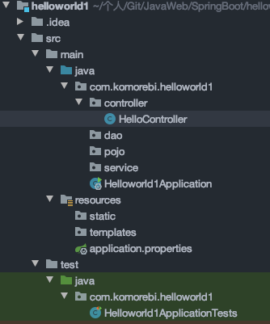
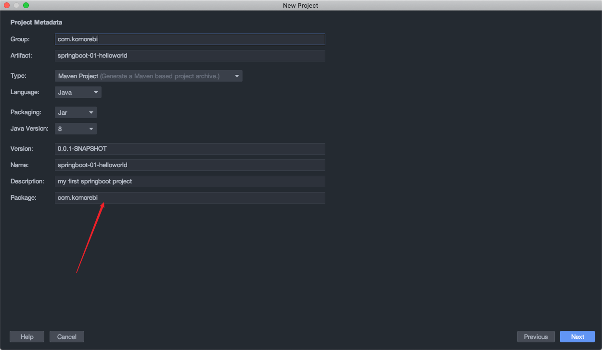
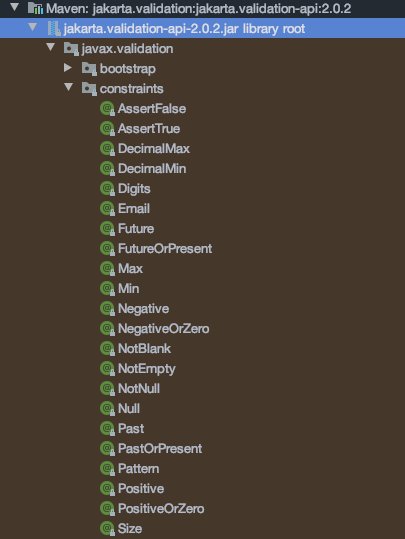
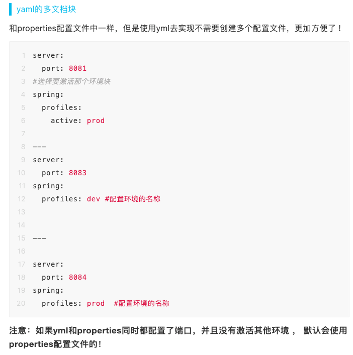

# SpringBoot


## 1 微服务阶段

1. JavaSE：OOP
2. Mysql：持久化
3. html + css + js + jquery + 框架：视图
4. javaweb：独立开发MVC三层架构的网站
5. SSM：框架，，简化了开发流程，但配置较复杂
6. Spring再简化：SpringBoot；微服务架构
7. 服务越来越多：SpringCloud


## 2 构建



### 2.1 网站构建

* https://spring.io/projects/spring-boot

* 

* controller

	```java
	@RestController
	public class HelloController {
	    @RequestMapping("/hello")
	    public String Hello(){
	        return "hello";
	    }
	}
	```

### 2.2 使用IDEA创建



* **HelloController.java**

```java
@Controller
@RequestMapping("/t1")
public class HelloController {
    @RequestMapping("/hello")
    @ResponseBody
    public String hello(){
        return "hello";
    }
}
```

* 改端口号 **application.properties**

	```properties
	server.port=8081
	```

* 更改启动时显示的 banner 图案；

	到项目下的 resources 目录下新建一个banner.txt 即可。

	图案可以到：https://www.bootschool.net/ascii 这个网站生成，然后拷贝到文件中即可！


## 3 原理

**自动装配pom.xml**：

* Spring-boot-dependenties.pom：核心依赖在父工程中
* 在写或引入一些springboot依赖的时候，不需要指定版本，因为有版本仓库

**启动器**：

* ```xml
	<dependency>
	    <groupId>org.springframework.boot</groupId>
	    <artifactId>spring-boot-starter-web</artifactId>
	</dependency>
	```

* 就是SpringBoot的启动场景

	* web就是自动导入web环境所有的依赖

* SpringBoot将所有的功能场景，变成对应的启动器；要使用的功能只需要对应的启动器

**主程序**：

```java
// @SpringBootApplication 标注这个类是springboot的应用
@SpringBootApplication
public class Springboot01HelloworldApplication {

    public static void main(String[] args) {
        // 将springboot的应用启动
        SpringApplication.run(Springboot01HelloworldApplication.class, args);
    }

}
```

**注解SpringBootApplication**

* ```java
	@SpringBootConfiguration：springboot的配置
	    @Configuration：spring配置类
	    	@Component：说明这也是一个spring的组件
	
	@EnableAutoConfiguration：自动配置
	    @AutoConfigurationPackage：自动配置包
	    	@Import(AutoConfigurationPackages.Registrar.class)：自动配置，包注册
	    @Import(AutoConfigurationImportSelector.class)：自动导入选择
	    	// 获取所有的配置
	    	List<String> configurations = getCandidateConfigurations(annotationMetadata, attributes);
	```

* 获取候选的配置 

	```java
	/**
		 * Return the auto-configuration class names that should be considered. By default
		 * this method will load candidates using {@link SpringFactoriesLoader} with
		 * {@link #getSpringFactoriesLoaderFactoryClass()}.
		 * @param metadata the source metadata
		 * @param attributes the {@link #getAttributes(AnnotationMetadata) annotation
		 * attributes}
		 * @return a list of candidate configurations
		 */
		protected List<String> getCandidateConfigurations(AnnotationMetadata metadata, AnnotationAttributes attributes) {
			List<String> configurations = SpringFactoriesLoader.loadFactoryNames(getSpringFactoriesLoaderFactoryClass(),
					getBeanClassLoader());
			Assert.notEmpty(configurations, "No auto configuration classes found in META-INF/spring.factories. If you "
					+ "are using a custom packaging, make sure that file is correct.");
			return configurations;
		}
	```

* META-INF/spring.factories：自动配置的核心文件

**注解结论：**

​        springboot所有自动配置类都是在启动的时候扫描并加载：spring.factories所有的自动配置类都在这里，但不一定生效，要判断条件是否成立，只要导入了对于的start，就有对应的启动器了，有了启动器，自动装配生效，就配置成功

1. SpringBoot在启动的时候从类路径下的**META-INF/spring.factories**中获取EnableAutoConfiguration指定的值
2. 将这些值作为自动配置类导入容器，自动配置类就生效，帮我们进行自动配置工作
3. 整个J2EE的整体解决方案和自动配置都在springboot-autoconfigure的jar包中
4. 它会给容器中导入非常多的自动配置类 （xxxAutoConfiguration）, 就是给容器中导入这个场景需要的所有组件，并配置好这些组件 
5. 有了自动配置类，免去了我们手动编写配置注入功能组件等的工作

**SpringApplication.run分析**

分析该方法主要分两部分，一部分是SpringApplication的实例化，二是run方法的执行；

**SpringApplication这个类主要做了以下四件事情：**

1、推断应用的类型是普通的项目还是Web项目

2、查找并加载所有可用初始化器 ， 设置到initializers属性中

3、找出所有的应用程序监听器，设置到listeners属性中

4、推断并设置main方法的定义类，找到运行的主类

**run方法**


## 4 yaml语法

* 删除properties，用yaml

	* application.properties : 语法结构 ：key=value

* - application.yml：语法结构 ：key：空格 value，**对空格要求高**，可以注入到配置类中

* properties只能存key-value对，yaml可以存对象

	```yaml
	# k-v
	name: komorebi
	
	# 对象
	student:
	  name: komorebi
	  age: 3
	
	# 行内写法
	student: {name: komorebi, age: 3}
	
	# 数组
	pets:
	  - cat
	  - dog
	
	pet: [cat, dog, pig]
	```

* ```xml
	<!-- 配置文件自动映射 -->
	<dependency>
	    <groupId>org.springframework.boot</groupId>
	    <artifactId>spring-boot-configuration-processor</artifactId>
	    <optional>true</optional>
	</dependency>
	```

### 4.1 yaml存对象

* 1 dog.java

	```java
	@Component  //注册bean到容器中
	public class Dog {
	    @Value("wang")
	    private String name;
	    @Value("3")
	    private Integer age;
	    
	    //有参无参构造、get、set方法、toString()方法  
	}
	```

* 2 person.java

	```java
	@Component //注册bean
	@ConfigurationProperties(prefix = "person")
	public class Person {
	    private String name;
	    private Integer age;
	    private Boolean happy;
	    private Date birth;
	    private Map<String, Object> maps;
	    private List<Object> lists;
	    private Dog dog;
	    //有参无参构造、get、set方法、toString()方法 
	}
	```

* 3 yaml

	```yaml
	person:
	  name: komorebi
	  age: 18
	  happy: false
	  birth: 2020/12/12
	  maps: {k1: v1, k2: v2}
	  lists:
	    - code
	    - girl
	  dog:
	    name: wang
	    age: 4
	```

* 4 test

	```java
	@SpringBootTest
	class Springboot02ConfigApplicationTests {
	    @Autowired
	    private Person person;
	
	    @Test
	    void contextLoads() {
	        System.out.println(person);
	    }
	}
	```

* 如果用properties配置的写法
	* 设置File Encodings
	* 

### 4.2 配置文件占位符

```yaml
person:
    name: qinjiang${random.uuid} # 随机uuid
    age: ${random.int}  # 随机int
    happy: false
    birth: 2000/01/01
    maps: {k1: v1,k2: v2}
    lists:
      - code
      - girl
      - music
    dog:
      name: ${person.hello:other}_旺财
      age: 1
```


### 4.3 数据校验

```java
@NotNull(message="名字不能为空")
private String userName;
@Max(value=120,message="年龄最大不能查过120")
private int age;
@Email(message="邮箱格式错误")
private String email;

空检查
@Null       验证对象是否为null
@NotNull    验证对象是否不为null, 无法查检长度为0的字符串
@NotBlank   检查约束字符串是不是Null还有被Trim的长度是否大于0,只对字符串,且会去掉前后空格.
@NotEmpty   检查约束元素是否为NULL或者是EMPTY.
    
Booelan检查
@AssertTrue     验证 Boolean 对象是否为 true  
@AssertFalse    验证 Boolean 对象是否为 false  
    
长度检查
@Size(min=, max=) 验证对象（Array,Collection,Map,String）长度是否在给定的范围之内  
@Length(min=, max=) string is between min and max included.

日期检查
@Past       验证 Date 和 Calendar 对象是否在当前时间之前  
@Future     验证 Date 和 Calendar 对象是否在当前时间之后  
@Pattern    验证 String 对象是否符合正则表达式的规则
```

```java
@Component  //注册bean
@Validated  //数据校验
@ConfigurationProperties(prefix = "person")
public class Person {
    @Email()
    private String name;
    private Integer age;
    private Boolean happy;
    private Date birth;
    private Map<String, Object> maps;
    private List<Object> lists;
    private Dog dog;
}
```

* 源码位置

### 4.4 多环境配置及配置文件位置

* yaml文件位置
	* 默认的是第四个，优先级最低的
* 多环境配置
	* 
	* 

