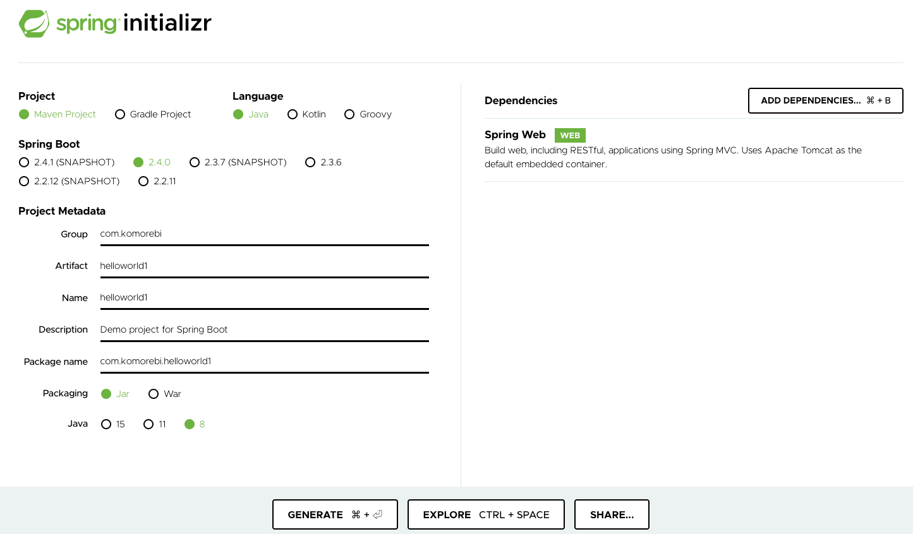
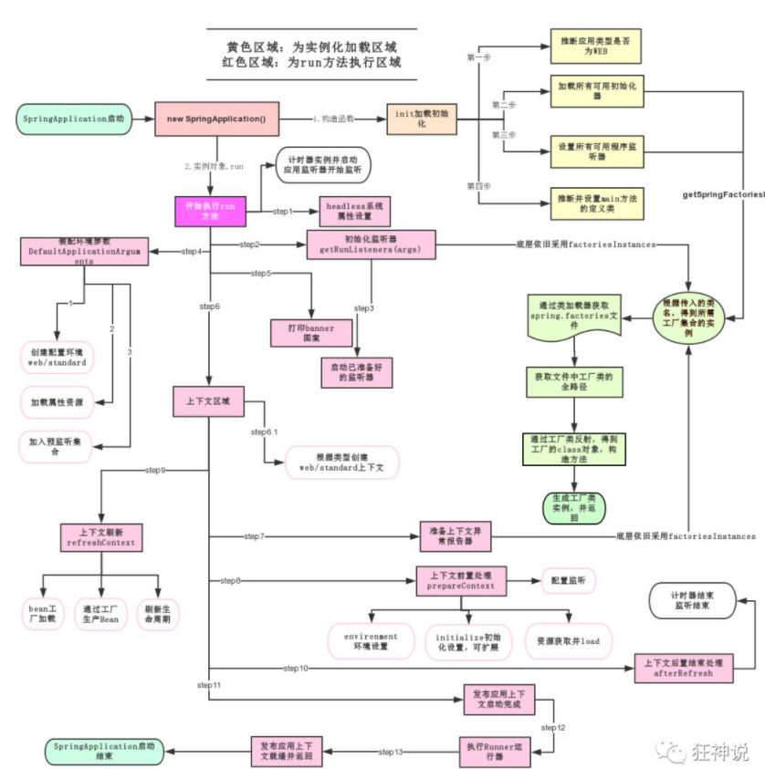
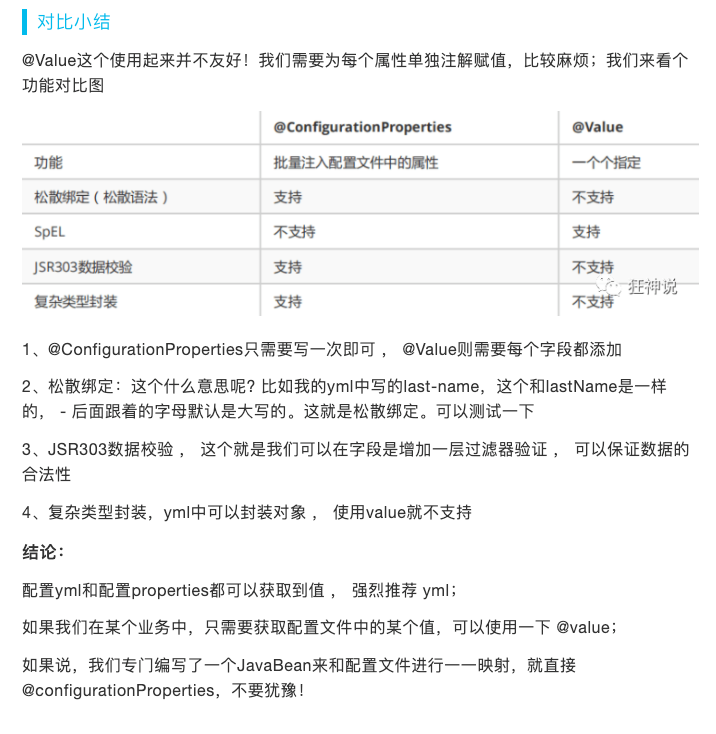
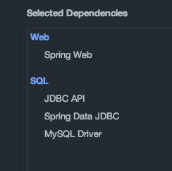

# SpringBoot


## 1 微服务阶段

1. JavaSE：OOP
2. Mysql：持久化
3. html + css + js + jquery + 框架：视图
4. javaweb：独立开发MVC三层架构的网站
5. SSM：框架，，简化了开发流程，但配置较复杂
6. Spring再简化：SpringBoot；微服务架构
7. 服务越来越多：SpringCloud


## 2 构建


### 2.1 网站构建

* https://spring.io/projects/spring-boot

* 

* controller

	```java
	@RestController
	public class HelloController {
	    @RequestMapping("/hello")
	    public String Hello(){
	        return "hello";
	    }
	}
	```

### 2.2 使用IDEA创建


* **HelloController.java**

```java
@Controller
@RequestMapping("/t1")
public class HelloController {
    @RequestMapping("/hello")
    @ResponseBody
    public String hello(){
        return "hello";
    }
}
```

* 改端口号 **application.properties**

	```properties
	server.port=8081
	```

* 更改启动时显示的 **banner 图案**；

	到项目下的 resources 目录下新建一个banner.txt 即可。

	图案可以到：https://www.bootschool.net/ascii 这个网站生成，然后拷贝到文件中即可！


## 3 原理

**自动装配pom.xml**：

* Spring-boot-dependenties.pom：核心依赖在父工程中
* 在写或引入一些springboot依赖的时候，不需要指定版本，因为有版本仓库

**启动器**：

* ```xml
	<dependency>
	    <groupId>org.springframework.boot</groupId>
	    <artifactId>spring-boot-starter-web</artifactId>
	</dependency>
	```

* 就是SpringBoot的启动场景

	* web就是自动导入web环境所有的依赖

* SpringBoot将所有的功能场景，变成对应的启动器；要使用的功能只需要对应的启动器

**主程序**：

```java
// @SpringBootApplication 标注这个类是springboot的应用
@SpringBootApplication
public class Springboot01HelloworldApplication {

    public static void main(String[] args) {
        // 将springboot的应用启动
        SpringApplication.run(Springboot01HelloworldApplication.class, args);
    }

}
```

**注解SpringBootApplication**

* ```java
	@SpringBootConfiguration：springboot的配置
	    @Configuration：spring配置类
	    	@Component：说明这也是一个spring的组件
	
	@EnableAutoConfiguration：自动配置
	    @AutoConfigurationPackage：自动配置包
	    	@Import(AutoConfigurationPackages.Registrar.class)：自动配置，包注册
	    @Import(AutoConfigurationImportSelector.class)：自动导入选择
	    	// 获取所有的配置
	    	List<String> configurations = getCandidateConfigurations(annotationMetadata, attributes);
	```

* 获取候选的配置 

	```java
	/**
		 * Return the auto-configuration class names that should be considered. By default
		 * this method will load candidates using {@link SpringFactoriesLoader} with
		 * {@link #getSpringFactoriesLoaderFactoryClass()}.
		 * @param metadata the source metadata
		 * @param attributes the {@link #getAttributes(AnnotationMetadata) annotation
		 * attributes}
		 * @return a list of candidate configurations
		 */
		protected List<String> getCandidateConfigurations(AnnotationMetadata metadata, AnnotationAttributes attributes) {
			List<String> configurations = SpringFactoriesLoader.loadFactoryNames(getSpringFactoriesLoaderFactoryClass(),
					getBeanClassLoader());
			Assert.notEmpty(configurations, "No auto configuration classes found in META-INF/spring.factories. If you "
					+ "are using a custom packaging, make sure that file is correct.");
			return configurations;
		}
	```

* META-INF/spring.factories：自动配置的核心文件

**注解结论：**

​        springboot所有自动配置类都是在启动的时候扫描并加载：spring.factories所有的自动配置类都在这里，但不一定生效，要判断条件是否成立，只要导入了对于的start，就有对应的启动器了，有了启动器，自动装配生效，就配置成功

1. SpringBoot在启动的时候从类路径下的**META-INF/spring.factories**中获取EnableAutoConfiguration指定的值
2. 将这些值作为自动配置类导入容器，自动配置类就生效，帮我们进行自动配置工作
3. 整个J2EE的整体解决方案和自动配置都在springboot-autoconfigure的jar包中
4. 它会给容器中导入非常多的自动配置类 （xxxAutoConfiguration）, 就是给容器中导入这个场景需要的所有组件，并配置好这些组件 
5. 有了自动配置类，免去了我们手动编写配置注入功能组件等的工作

**SpringApplication.run分析**

分析该方法主要分两部分，一部分是SpringApplication的实例化，二是run方法的执行；

**SpringApplication这个类主要做了以下四件事情：**

1、推断应用的类型是普通的项目还是Web项目

2、查找并加载所有可用初始化器 ， 设置到initializers属性中

3、找出所有的应用程序监听器，设置到listeners属性中

4、推断并设置main方法的定义类，找到运行的主类

**run方法**




## 4 yaml语法

* 删除properties，用yaml

	* application.properties : 语法结构 ：key=value

* - application.yml：语法结构 ：key：空格 value，**对空格要求高**，可以注入到配置类中

* properties只能存key-value对，yaml可以存对象

	```yaml
	# k-v
	name: komorebi
	
	# 对象
	student:
	  name: komorebi
	  age: 3
	
	# 行内写法
	student: {name: komorebi, age: 3}
	
	# 数组
	pets:
	  - cat
	  - dog
	
	pet: [cat, dog, pig]
	```

* ```xml
	<!-- 配置文件自动映射 -->
	<dependency>
	    <groupId>org.springframework.boot</groupId>
	    <artifactId>spring-boot-configuration-processor</artifactId>
	    <optional>true</optional>
	</dependency>
	```

### 4.1 yaml存对象

* 1 dog.java

	```java
	@Component  //注册bean到容器中
	public class Dog {
	    @Value("wang")
	    private String name;
	    @Value("3")
	    private Integer age;
	    
	    //有参无参构造、get、set方法、toString()方法  
	}
	```

* 2 person.java

	```java
	@Component //注册bean
	@ConfigurationProperties(prefix = "person")
	public class Person {
	    private String name;
	    private Integer age;
	    private Boolean happy;
	    private Date birth;
	    private Map<String, Object> maps;
	    private List<Object> lists;
	    private Dog dog;
	    //有参无参构造、get、set方法、toString()方法 
	}
	```

* 3 yaml

	```yaml
	person:
	  name: komorebi
	  age: 18
	  happy: false
	  birth: 2020/12/12
	  maps: {k1: v1, k2: v2}
	  lists:
	    - code
	    - girl
	  dog:
	    name: wang
	    age: 4
	```

* 4 test

	```java
	@SpringBootTest
	class Springboot02ConfigApplicationTests {
	    @Autowired
	    private Person person;
	
	    @Test
	    void contextLoads() {
	        System.out.println(person);
	    }
	}
	```

* 如果用properties配置的写法
	* 设置File Encodings
	* 

### 4.2 配置文件占位符

```yaml
person:
    name: qinjiang${random.uuid} # 随机uuid
    age: ${random.int}  # 随机int
    happy: false
    birth: 2000/01/01
    maps: {k1: v1,k2: v2}
    lists:
      - code
      - girl
      - music
    dog:
      name: ${person.hello:other}_旺财
      age: 1
```



### 4.3 数据校验

```java
@NotNull(message="名字不能为空")
private String userName;
@Max(value=120,message="年龄最大不能查过120")
private int age;
@Email(message="邮箱格式错误")
private String email;

空检查
@Null       验证对象是否为null
@NotNull    验证对象是否不为null, 无法查检长度为0的字符串
@NotBlank   检查约束字符串是不是Null还有被Trim的长度是否大于0,只对字符串,且会去掉前后空格.
@NotEmpty   检查约束元素是否为NULL或者是EMPTY.
    
Booelan检查
@AssertTrue     验证 Boolean 对象是否为 true  
@AssertFalse    验证 Boolean 对象是否为 false  
    
长度检查
@Size(min=, max=) 验证对象（Array,Collection,Map,String）长度是否在给定的范围之内  
@Length(min=, max=) string is between min and max included.

日期检查
@Past       验证 Date 和 Calendar 对象是否在当前时间之前  
@Future     验证 Date 和 Calendar 对象是否在当前时间之后  
@Pattern    验证 String 对象是否符合正则表达式的规则
```

```java
@Component  //注册bean
@Validated  //数据校验
@ConfigurationProperties(prefix = "person")
public class Person {
    @Email()
    private String name;
    private Integer age;
    private Boolean happy;
    private Date birth;
    private Map<String, Object> maps;
    private List<Object> lists;
    private Dog dog;
}
```

* 源码位置

### 4.4 多环境配置及配置文件位置

* yaml文件位置
	* 默认的是第四个，优先级最低的
* 多环境配置
	* 
	* 

## 5 springboot web开发

### 5.1 静态资源

SpringBoot中，SpringMVC的web配置都在 **WebMvcAutoConfiguration** 这个配置类里面；

我们可以去看看 WebMvcAutoConfigurationAdapter 中有很多配置方法；

有一个方法：addResourceHandlers 添加资源处理

```java
@Override
public void addResourceHandlers(ResourceHandlerRegistry registry) {
    if (!this.resourceProperties.isAddMappings()) {
        logger.debug("Default resource handling disabled");
        return;
    }
    Duration cachePeriod = this.resourceProperties.getCache().getPeriod();
    CacheControl cacheControl = this.resourceProperties.getCache().getCachecontrol().toHttpCacheControl();
    if (!registry.hasMappingForPattern("/webjars/**")) {
        customizeResourceHandlerRegistration(registry.addResourceHandler("/webjars/**")
        .addResourceLocations("classpath:/META-INF/resources/webjars/")
        .setCachePeriod(getSeconds(cachePeriod)).setCacheControl(cacheControl)
        .setUseLastModified(this.resourceProperties.getCache().isUseLastModified()));
    }
    String staticPathPattern = this.mvcProperties.getStaticPathPattern();
	if (!registry.hasMappingForPattern(staticPathPattern)) {
		customizeResourceHandlerRegistration(registry.addResourceHandler(staticPathPattern)
		.addResourceLocations(getResourceLocations(this.resourceProperties.getStaticLocations()))
		.setCachePeriod(getSeconds(cachePeriod)).setCacheControl(cacheControl)
		.setUseLastModified(this.resourceProperties.getCache().isUseLastModified()));
	}
}
```

* 什么是webjars？一个可以帮助导入的包，包括jquery[https://www.webjars.org/]

* 静态资源目录

	```java
	// resources > static > public
	"classpath:/META-INF/resources/",
	"classpath:/resources/", 
	"classpath:/static/", 
	"classpath:/public/" 
	```

* 总结：

	* 可以使用一下方式处理静态资源
		* webjars         localhost:8080/webjars/
		* public      static       /**     resources    localhost:8080/
	* 

### 5.2 定制首页

* 方式一：在静态资源目录下放index.html

* 方式二：在templates目录下放，然后通过controller访问，需要模板引擎的支持

	```java
	@Controller
	public class IndexController {
	    @RequestMapping("/index")
	    public String index(){
	        return "index";
	    }
	}
	```

* 网站图标：favicon.ico

### 5.3 Thymeleaf

```xml
<!--thymeleaf-->
<dependency>
    <groupId>org.springframework.boot</groupId>
    <artifactId>spring-boot-starter-thymeleaf</artifactId>
</dependency>
```

​        前端交给我们的页面，是html页面。如果是我们以前开发，我们需要把他们转成jsp页面，jsp好处就是当我们查出一些数据转发到JSP页面以后，我们可以用jsp轻松实现数据的显示，及交互等。

​		jsp支持非常强大的功能，包括能写Java代码，但是呢，我们现在的这种情况，SpringBoot这个项目首先是以jar的方式，不是war，第二，我们用的还是嵌入式的Tomcat，所以呢，**他现在默认是不支持jsp的**。

​		那不支持jsp，如果我们直接用纯静态页面的方式，那给我们开发会带来非常大的麻烦，那怎么办呢？

**SpringBoot推荐你可以来使用模板引擎：**

​		模板引擎，我们其实大家听到很多，其实jsp就是一个模板引擎，还有用的比较多的freemarker，包括SpringBoot给我们推荐的Thymeleaf，模板引擎有非常多，但再多的模板引擎，他们的思想都是一样的，什么样一个思想呢我们来看一下这张图：


* Thymeleaf 官网：https://www.thymeleaf.org/

	Thymeleaf 在Github 的主页：https://github.com/thymeleaf/thymeleaf

	Spring官方文档：找到我们对应的版本

	https://docs.spring.io/spring-boot/docs/2.2.5.RELEASE/reference/htmlsingle/#using-boot-starter 

	找到对应的pom依赖：可以适当点进源码看下本来的包！

* 只需要把我们的html页面放在类路径下的templates下，thymeleaf就可以帮我们自动渲染了。

* 测试

	* 1 修改测试请求，增加数据传输；

		```java
		@RequestMapping("/t1")
		public String test1(Model model){
		    //存入数据
		    model.addAttribute("msg","Hello,Thymeleaf");
		    //classpath:/templates/test.html
		    return "test";
		}
		```

	* 2 前端（注意命名空间）

		```html
		<!DOCTYPE html>
		<html lang="en" xmlns:th="http://www.thymeleaf.org">
		<head>
		    <meta charset="UTF-8">
		    <title>Title</title>
		</head>
		<body>
		
		<h1>test</h1>
		
		<!--th:text就是将div中的内容设置为它指定的值，和之前学习的Vue一样-->
		<div th:text="${msg}"></div>
		
		</body>
		</html>
		```

### 5.4 Thymeleaf语法


## 6 MVC配置原理

* https://mp.weixin.qq.com/s?__biz=Mzg2NTAzMTExNg==&mid=2247483819&idx=1&sn=b9009aaa2a9af9d681a131b3a49d8848&scene=19#wechat_redirect

* ```java
	// 如果想DIY一些定制化的功能，只需要写这个组件，springboot会自动装配
	// 扩展springmvc
	@Configuration
	public class MyMvcConfig implements WebMvcConfigurer {
	
	    @Bean
	    public ViewResolver myViewResolver(){
	        return new MyViewResolver();
	    }
	
	    // 自定义一个自己的视图解析器
	    public static class MyViewResolver implements ViewResolver{
	        @Override
	        public View resolveViewName(String viewName, Locale locale) throws Exception {
	            return null;
	        }
	    }
	
	    // 视图跳转
	    @Override
	    public void addViewControllers(ViewControllerRegistry registry) {
	        registry.addViewController("/komorebi").setViewName("test");
	    }
	}
	```

* 


## 7 员工管理系统

### 7.1 准备

1. 导入静态资源

2. **新建实体类**

	(1) Department

	```java
	// 部门表
	@Data
	@NoArgsConstructor
	@AllArgsConstructor
	public class Department {
	    private Integer id;
	    private String departmentName;
	}
	```

	(2) Employee

	```java
	// 员工表
	@Data
	@NoArgsConstructor
	@AllArgsConstructor
	public class Employee {
	    private Integer id;
	    private String lastName;
	    private String email;
	    private Integer gender; // 0:女 1:男
	    private Department department;
	    private Date birth;
	
	    public Employee(Integer id, String lastName, String email, Integer gender, Department department) {
	        this.id = id;
	        this.lastName = lastName;
	        this.email = email;
	        this.gender = gender;
	        this.department = department;
	        this.birth = new Date();
	    }
	}
	```

3. **新建Dao层**
	（1）DepartmentDao

	```java
	// 部门Dao
	@Repository
	public class DepartmentDao {
	    // 模拟数据库中的数据
	    private static Map<Integer, Department> departments = null;
	    static {
	        departments = new HashMap<Integer, Department>();   // 创建一个部门表
	        departments.put(101, new Department(101, "教学部"));
	        departments.put(102, new Department(102, "市场部"));
	        departments.put(103, new Department(103, "教研部"));
	        departments.put(104, new Department(104, "研发部"));
	        departments.put(105, new Department(105, "组织部"));
	    }
	
	    // 数据库操作
	    public Collection<Department> getDepartments(){
	        return departments.values();
	    }
	
	    // 通过id得到部门
	    public Department getDepartmentById(Integer id){
	        return departments.get(id);
	    }
	}
	```

	（2）EmployeeDao

	```java
	// 员工Dao
	@Repository
	public class EmployeeDao {
	    // 模拟数据库中的数据
	    private static Map<Integer, Employee> employees = null;
	    // 员工有所属的部门
	    @Autowired
	    private DepartmentDao departmentDao;
	
	    static {
	        employees = new HashMap<Integer, Employee>();   // 创建一个部门表
	        employees.put(1001, new Employee(1001, "A", "a123@qq.com", 1, new Department(101, "教学部")));
	        employees.put(1002, new Employee(1002, "B", "b123@qq.com", 0, new Department(102, "市场部")));
	        employees.put(1003, new Employee(1003, "C", "c123@qq.com", 1, new Department(103, "教研部")));
	        employees.put(1004, new Employee(1004, "D", "d123@qq.com", 0, new Department(104, "研发部")));
	        employees.put(1005, new Employee(1005, "E", "e123@qq.com", 1, new Department(105, "组织部")));
	    }
	
	    // 增加一个员工，主键自增
	    private static Integer initId = 1006;
	    public void save(Employee employee){
	        if (employee.getId() == null) {
	            employee.setId(initId++);
	        }
	        employee.setDepartment(departmentDao.getDepartmentById(employee.getDepartment().getId()));
	        employees.put(employee.getId(), employee);
	    }
	
	    // 查询所有员工
	    public Collection<Employee> getAll(){
	        return employees.values();
	    }
	
	    // 通过ID查询员工
	    public Employee getEmployeeById(Integer id){
	        return employees.get(id);
	    }
	
	    // 通过ID删除员工
	    public void deleteEmployee(Integer id){
	        employees.remove(id);
	    }
	}
	```

### 7.2 首页设计

1. MyMvcConfig

	```java
	@Configuration
	public class MyMvcConfig implements WebMvcConfigurer {
	    @Override
	    public void addViewControllers(ViewControllerRegistry registry) {
	        registry.addViewController("/").setViewName("index");
	        registry.addViewController("/index.html").setViewName("index");
	    }
	}
	```

2. Index.html中先加入命名空间，然后链接处前面加th:

3. 页面国际化
	（1）新建文件夹i18n
	（2）按钮自动切换，需要自定义组件**MyLocalResolver**，最后在**MyMvcConfig**中设置

	```java
	public class MyLocalResolver implements LocaleResolver {
	    // 解析请求
	    @Override
	    public Locale resolveLocale(HttpServletRequest request) {
	        // 获取请求中语言参数
	        String language = request.getParameter("l");
	
	        Locale locale = Locale.getDefault(); // 如果没有就使用默认的
	
	        //如果请求的链接携带了国际化的参数
	        if (!StringUtils.isEmpty(language)){
	            // zh_CN
	            String[] split = language.split("_");
	            // 国家，地区
	            locale = new Locale(split[0], split[1]);
	        }
	        return locale;
	    }
	
	    @Override
	    public void setLocale(HttpServletRequest request, HttpServletResponse response, Locale locale) {
	
	    }
	}
	```

	（3）将组件配置到容器中@Bean

	```java
	@Configuration
	public class MyMvcConfig implements WebMvcConfigurer {
	    @Override
	    public void addViewControllers(ViewControllerRegistry registry) {
	        registry.addViewController("/").setViewName("index");
	        registry.addViewController("/index.html").setViewName("index");
	    }
	
	    // 自定义的国际化组件就生效了
	    @Bean
	    public LocaleResolver localeResolver(){
	        return new MyLocalResolver();
	    }
	}
	```

### 7.3 登录

* 1 修改index

	```html
	<body class="text-center">
	    <form class="form-signin" th:action="@{/user/login}">
	        
	        <h1 class="h3 mb-3 font-weight-normal" th:text="#{login.tip}">Please sign in</h1>
	
	        <!--如果msg的值为空，则不显示消息-->
	        <p style="color: red" th:text="${msg}" th:if="${not #strings.isEmpty(msg)}"></p>
	
	        <label class="sr-only" th:text="#{login.username}">Username</label>
	        <input type="text" name="username" class="form-control" th:placeholder="#{login.username}" required="" autofocus="">
	        <label class="sr-only" th:text="#{login.password}">Password</label>
	        <input type="password" name="password" class="form-control" th:placeholder="#{login.password}" required="">
	        <div class="checkbox mb-3">
	            <label>
	                <input type="checkbox" value="remember-me">[[#{login.remember}]]
	            </label>
	        </div>
	        <button class="btn btn-lg btn-primary btn-block" type="submit" th:text="#{login.btn}">Sign in</button>
	        <p class="mt-5 mb-3 text-muted">© 2017-2018</p>
	        <a class="btn btn-sm" th:href="@{/index.html(l='zh_CN')}">中文</a>
	        <a class="btn btn-sm" th:href="@{/index.html(l='en_US')}">English</a>
	    </form>
	</body>
	```

* 2 controller

	```java
	@Controller
	public class LoginController {
	    @RequestMapping("/user/login")
	    public String login(@RequestParam("username") String username, @RequestParam("password") String password, Model model){
	        // 具体业务，判定用户密码是否正确
	        if ("admin".equals(username) &&"123456".equals(password)){
	            return "redirect:/main.html";
	        }
	        else {
	            // 告诉用户失败了
	            model.addAttribute("msg", "用户名或密码错误");
	            return "index";
	        }
	    }
	}
	```


### 7.4 拦截器

1. LoginHandlerInterceptor

	```java
	public class LoginHandlerInterceptor implements HandlerInterceptor {
	    @Override
	    public boolean preHandle(HttpServletRequest request, HttpServletResponse response, Object handler) throws Exception {
	        // 登录成功后，应该有用户的Session
	        Object loginUser = request.getSession().getAttribute("loginUser");
	
	        if (loginUser == null) {
	            request.setAttribute("msg", "没有权限，请先登录");
	            request.getRequestDispatcher("/index.html").forward(request, response);
	            return false;
	        }
	        else {
	            return true;
	        }
	    }
	}
	```

2. 设置Session

	```java
	@Controller
	public class LoginController {
	    @RequestMapping("/user/login")
	    public String login(@RequestParam("username") String username, @RequestParam("password") String password, Model model, HttpSession session){
	        // 具体业务，判定用户密码是否正确
	        if ("admin".equals(username) &&"123456".equals(password)){
	            session.setAttribute("loginUser", username);
	            return "redirect:/main.html";
	        }
	        else {
	            // 告诉用户失败了
	            model.addAttribute("msg", "用户名或密码错误");
	            return "index";
	        }
	    }
	}
	```

3. MvcConfig

	```java
	@Configuration
	public class MyMvcConfig implements WebMvcConfigurer {
	    @Override
	    public void addViewControllers(ViewControllerRegistry registry) {
	        registry.addViewController("/").setViewName("index");
	        registry.addViewController("/index.html").setViewName("index");
	        registry.addViewController("/main.html").setViewName("dashboard");
	    }
	
	    // 自定义的国际化组件就生效了
	    @Bean
	    public LocaleResolver localeResolver(){
	        return new MyLocalResolver();
	    }
	
	    // 配置拦截器
	    @Override
	    public void addInterceptors(InterceptorRegistry registry) {
	        registry.addInterceptor(new LoginHandlerInterceptor()).addPathPatterns("/**").excludePathPatterns("/index.html", "/", "/user/login", "/css/**", "/js/**", "/img/**");
	    }
	}
	```

### 7.5 展示员工列表

* 主要修改前端html代码


* EmployeeController

	```java
	@Controller
	public class EmployeeController {
	    @Autowired
	    EmployeeDao employeeDao;
	
	    @RequestMapping("/emps")
	    public String list(Model model){
	        Collection<Employee> employees = employeeDao.getAll();
	        model.addAttribute("emps", employees);
	        return "emp/list";
	    }
	}
	```

### 7.6 添加员工

1. List.html中添加按钮，这里是get传输

	```HTML
	<h3>
	    <a class="btn btn-sm btn-success" th:href="@{/addEmplyee}">Add Employee</a>
	</h3>
	```

2. EmployeeController.java

	```java
	@GetMapping("/addEmplyee")
	public String toAddPage(Model model){
	    // 查出所有部门的信息
	    Collection<Department> departments = departmentDao.getDepartments();
	    model.addAttribute("departments", departments);
	    return "emp/add";
	}
	```

3. 新建add.html，对照list修改显示的那部分，写一个form表单

	```HTML
	<form th:action="@{/addEmplyee}" method="post">
	    <div class="form-group">
	        <label>LastName</label>
	        <input type="text" name="lastName" class="form-control" placeholder="username">
	    </div>
	    <div class="form-group">
	        <label>Email</label>
	        <input type="email" name="email" class="form-control" placeholder="email address">
	    </div>
	    <div class="form-group">
	        <label>Gender</label><br>
	        <div class="form-check form-check-inline">
	            <input class="form-check-input" type="radio" name="gender" value="1">
	            <label class="form-check-label">男</label>
	        </div>
	        <div class="form-check form-check-inline">
	            <input class="form-check-input" type="radio" name="gender" value="0">
	            <label class="form-check-label">女</label>
	        </div>
	    </div>
	    <div class="form-group">
	        <label>department</label>
	        <select class="form-control" name="department.id" >
	            <option th:each="dept:${departments}" th:text="${dept.getDepartmentName()}" th:value="${dept.getId()}"></option>
	        </select>
	    </div>
	    <div class="form-group">
	        <label>Birth</label>
	        <input type="text" name="birth" class="form-control" placeholder="xxxx-xx-xx">
	    </div>
	    <button type="submit" class="btn btn-primary">添加</button>
	</form>
	```

4. EmployeeController.java

	```java
	@PostMapping("/addEmplyee")
	public String AddEmployee(Model model, Employee employee){
	// 添加操作
	employeeDao.save(employee);
	return "redirect:/emps";
	}
	```

### 7.7 修改员工信息

1. 修改list.html中的modificate

	```html
	<td>
	    <a class="btn btn-sm btn-primary" th:href="@{updateEmployee/{id}(id=${emp.getId()})}">modificate</a>
	    <button class="btn btn-sm btn-danger">delete</button>
	</td>
	```

2. EmployeeController.java

	```java
	@GetMapping("/updateEmployee/{id}")
	public String toUpdatePage(@PathVariable("id")Integer id, Model model){
	// 查出原来的数据
	Employee employee = employeeDao.getEmployeeById(id);
	model.addAttribute("emp", employee);
	// 查出所有部门的信息
	Collection<Department> departments = departmentDao.getDepartments();
	model.addAttribute("departments", departments);
	return "emp/update";
	}
	```

3. 新建update.html，对照add修改显示的那部分，修改form表单

	```html
	<main role="main" class="col-md-9 ml-sm-auto col-lg-10 pt-3 px-4">
	    <form th:action="@{/updateEmplyee}" method="post">
	        <input type="hidden" name="id" th:value="${emp.getId()}">
	        <div class="form-group">
	            <label>LastName</label>
	            <input th:value="${emp.getLastName()}" type="text" name="lastName" class="form-control" placeholder="username">
	        </div>
	        <div class="form-group">
	            <label>Email</label>
	            <input th:value="${emp.getEmail()}" type="email" name="email" class="form-control" placeholder="email address">
	        </div>
	        <div class="form-group">
	            <label>Gender</label><br>
	            <div class="form-check form-check-inline">
	                <input th:checked="${emp.getGender()==1}" class="form-check-input" type="radio" name="gender" value="1">
	                <label class="form-check-label">男</label>
	            </div>
	            <div class="form-check form-check-inline">
	                <input th:checked="${emp.getGender()==0}" class="form-check-input" type="radio" name="gender" value="0">
	                <label class="form-check-label">女</label>
	            </div>
	        </div>
	        <div class="form-group">
	            <label>department</label>
	            <select class="form-control" name="department.id" >
	                <option th:selected="${dept.getId()==emp.getDepartment().getId()}" th:each="dept:${departments}"
	                        th:text="${dept.getDepartmentName()}" th:value="${dept.getId()}"></option>
	            </select>
	        </div>
	        <div class="form-group">
	            <label>Birth</label>
	            <input th:value="${#dates.format(emp.getBirth(), 'yyyy-MM-dd')}" type="text" name="birth" class="form-control" placeholder="xxxx-xx-xx">
	        </div>
	        <button type="submit" class="btn btn-primary">Save</button>
	    </form>
	```

4. EmployeeController.java

	```java
	@PostMapping("/updateEmplyee")
	public String updateEmployee(Employee employee){
	    employeeDao.save(employee);
	    return "redirect:/emps";
	}
	```

### 7.8 删除员工

1. 修改按钮

	```html
	<td>
	    <a class="btn btn-sm btn-primary" th:href="@{updateEmployee/{id}(id=${emp.getId()})}">modificate</a>
	    <a class="btn btn-sm btn-danger" th:href="@{deleteEmployee/{id}(id=${emp.getId()})}">delete</a>
	</td>
	```

2. EmployeeController.java

	```java
	@GetMapping("/deleteEmployee/{id}")
	public String deleteEmployee(@PathVariable("id")Integer id){
	    employeeDao.deleteEmployee(id);
	    return "redirect:/emps";
	}
	```

### 7.9 404

* 在template目录下新建一个error文件夹，在放入404.html

### 7.10 注销

* 1 修改list.html中的注销按钮

* 2 LoginController.java

	```java
	@RequestMapping("/user/logout")
	public String logout(HttpSession session){
	    session.invalidate();
	    return "redirect:/index.html";
	}
	```


## 8 结合JDBC

1. 新建一个springboot项目

2. 新建application.yml，在里面配置数据库

	```yml
	spring:
	  datasource:
	    username: root
	    password: 123456
	    url: jdbc:mysql://localhost:3306/mybatis?useUnicode=true&characterEncoding=utf-8&serverTimezone=UTC
	    driver-class-name: com.mysql.cj.jdbc.Driver
	```

3. JDBCController.java

	```java
	@Controller
	public class JDBCController {
	    @Autowired
	    JdbcTemplate jdbcTemplate;
	
	    // 查询数据库的所有信息
	    @GetMapping("/userlist")
	    @ResponseBody
	    public List<Map<String, Object>> userList(){
	        String sql = "select * from mybatis.user";
	        List<Map<String, Object>> listMaps = jdbcTemplate.queryForList(sql);
	        return listMaps;
	    }
	
	    // 增加用户
	    @GetMapping("/addUser")
	    public String addUser(){
	        String sql = "insert into mybatis.user(id,name,pwd) values(5, 'kk', '123')";
	        jdbcTemplate.update(sql);
	        return "redirect:/userlist";
	    }
	
	    // 修改用户
	    @GetMapping("/updateUser/{id}")
	    public String updateUser(@PathVariable("id") int id){
	        String sql = "update mybatis.user set name=?,pwd=? where id=" + id;
	        Object[] objects = new Object[2];
	        objects[0] = "ming1";
	        objects[1] = "123123";
	        jdbcTemplate.update(sql, objects);
	        return "redirect:/userlist";
	    }
	
	    // 删除用户
	    @GetMapping("/deleteUser/{id}")
	    public String deleteUser(@PathVariable("id") int id){
	        String sql = "delete from mybatis.user where id=?";
	        jdbcTemplate.update(sql, id);
	        return "redirect:/userlist";
	    }
	}
	```


## 9 整合Druid数据源

* Java程序很大一部分要操作数据库，为了提高性能操作数据库的时候，又不得不使用数据库连接池。
* Druid 是阿里巴巴开源平台上一个数据库连接池实现，结合了 C3P0、DBCP 等 DB 池的优点，同时加入了日志监控。
* Druid 可以很好的监控 DB 池连接和 SQL 的执行情况，天生就是针对监控而生的 DB 连接池。
* Spring Boot 2.0 以上默认使用 Hikari 数据源，可以说 Hikari 与 Driud 都是当前 Java Web 上最优秀的数据源，我们来重点介绍 Spring Boot 如何集成 Druid 数据源，如何实现数据库监控。

