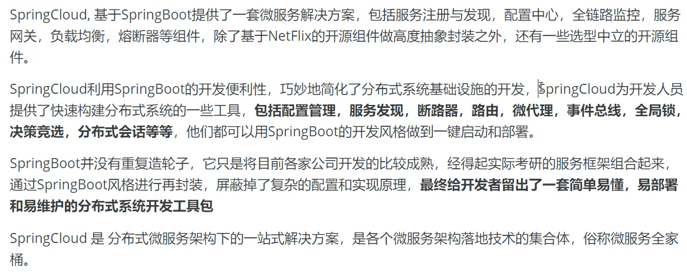
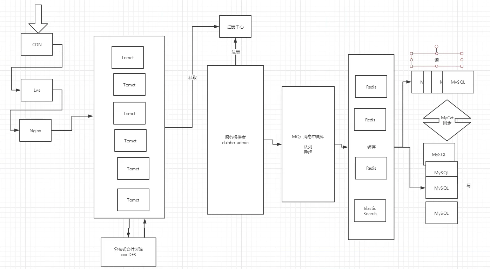
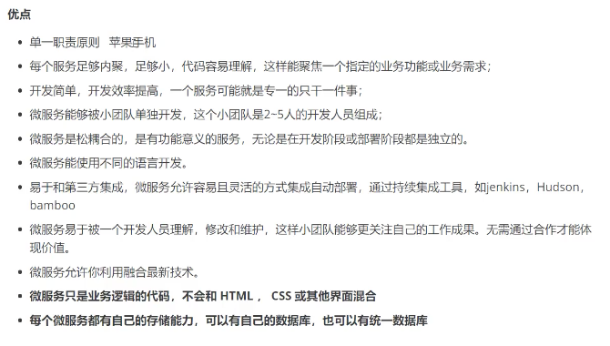
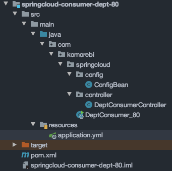

[TOC]

# SpringCloud



微服务架构4个问题：

* 服务很多，客户端该怎么访问
* 这么多服务，服务之间如何通信
* 这么多服务，如何治理
* 服务挂了怎么办

解决方案：

* Spring Cloud Netflix（一站式解决方案）
	* API网关，zuul组件
	* Feign ---HttpClinet：Http通信方式，同步，阻塞
	* 服务注册发现：Eureka
	* 熔断机制：Hystrix
* Apache Dubbo Zookeeper（半自动，需要整合别人的）
	* API：没有，找第三方组件，或者自己实现
	* Dubbo：RPC通信框架
	* Zookeeper：
	* 没有：借助第三方
* Spring Cloud Alibaba（一站式解决方案）

## 1 常见问题

### 1.1 什么是微服务

* **微服务**：强调的是服务的大小，关注的是某一个点，是具体解决某一个问题并提供落地对应服务的一个服务应用，狭义的看，可以看作是IDEA里面的一个个module
* **微服务架构**：微服务架构是一种架构模式，它提倡将单一应用程序划分成一组小的服务，服务之间互相协调，互相配合，为用户提供最终价值。每个服务运行在其独立的进程中，服务于服务间采用轻量级的通信机制相互协作，每个服务都围绕着具体的业务进行构建，并且能够被独立的部署到生产环境中，另外，应尽量避免统一的，集中式的服务管理机制，对具体的一个服务而言，应根据业务上下文，选择合适的语言、工具对其进行构建
* **微服务化核心**：就是将传统的一站式应用，根据业务拆分成一个一个的服务，彻底的去耦合，每一个微服务提供单个业务功能的服务，一个服务做一件事情，从技术角度看就是一种小而独立的处理过程，类似进程的概念，能够自行单独启动或销毁，拥有自己独立的数据库。



### 1.2 微服务之间是如何独立通讯的

### 1.3 SpringCloud和Dubbo有哪些区别

|              |     Dubbo     |           Spring            |
| :----------: | :-----------: | :-------------------------: |
| 服务注册中心 |   ZooKeeper   | SpringCloud Netfilx Eureka  |
| 服务调用方式 |      RPC      |          REST API           |
|   服务监控   | Dubbo-monitor |      SpringBoot Admin       |
|    断路器    |    不完善     | SpringCloud Netfilx Hystrix |
|   服务网关   |      无       |  SpringCloud Netfilx Zuul   |
|  分布式配置  |      无       |     SpringCloud Config      |
|   服务跟踪   |      无       |     SpringCloud Sleuth      |
|   消息总线   |      无       |       SpringCloud Bus       |
|    数据流    |      无       |     SpringCloud Stream      |
|   批量任务   |      无       |      SpringCloud Task       |

**最大区别：SpringCloud抛弃了Dubbo的RPC通信，采用的是基于HTTP的REST方式**

严格来说，这两种方式各有优劣。从一定程度上来说，后者牺牲了服务调用的性能，但也避免了上面提到的原生RPC带来的问题。而且REST相比RPC更加灵活，服务提供方和调用方的依赖只依靠一纸契约，不存在代码级别的强依赖，这在强调快速演化的微服务环境下，显得更加合适


### 1.4 SpringBoot和SpringCloud，谈谈对他们的理解

* SpringBoot专注于快速方便的开发单个个体微服务
* SpringCloud是关注全局的微服务协调整治治理框架，它将SpringBoot开发的一个个单体微服务整合并管理起来，为各个微服务之间提供：配置管理、服务发现、断路器、路由、微代理、事件总线、全局锁、决策竞选、分布式会话等集成服务
* SpringBoot可以离开SpringCloud独立使用，开发项目，但是SpringCloud离不开SpringBoot，属于依赖关系
* **SpringBoot专注于快速、方便的开发单个个体微服务，SpringCloud关注全局的服务治理框架** 

### 1.5 什么是服务熔断，什么是服务降级

### 1.6 微服务的优缺点分别是什么




### 1.7 你知道的微服务技术栈有哪些


### 1.8 Eureka和Zookeeper都可以提供服务注册与发现的功能，请说说两者的区别

**ZooKeeper保证CP，Eureka保证AP**


## 2 环境搭建


### 2.1 API


### 2.2 Provider


* Provider中写常规的dao-service-controller

* application.yml

	```yml
	server:
	  port: 8001
	
	mybatis:
	  type-aliases-package: com.komorebi.springcloud.pojo
	  config-location: classpath:mybatis/mybatis-config.xml
	  mapper-locations: classpath:mybatis/mapper/*.xml
	
	spring:
	  application:
	    name: springcloud-provider-dept
	  datasource:
	    type: com.alibaba.druid.pool.DruidDataSource
	    driver-class-name: com.mysql.jdbc.Driver
	    url: jdbc:mysql://localhost:3306/db01?useUnicode=true&charcterEncoding=utf-8&useSSL=true
	    username: root
	    password: 123456
	
	```

* dao同时配置mybatis-config.xml和正常的Mapper

### 2.3 Consumer



* 类似于远程调用，先配置端口80

* 配置RestTemplate

	```java
	@Configuration
	public class ConfigBean {
	    @Bean
	    public RestTemplate getRestTemplate() {
	        return new RestTemplate();
	    }
	}
	```

* 写Controller

	```java
	@RestController
	public class DeptConsumerController {
	    // 对消费者而言，不应该有service
	    // RestTemplate   供我们自己调用就可以了
	    // (url, 实体：Map, Class<T> responseType)
	    @Autowired
	    private RestTemplate restTemplate;
	
	    private static final String REST_URL_PREFIX = "http://localhost:8001/";
	
	    @RequestMapping("/consumer/dept/add")
	    public boolean add(Dept dept) {
	        return restTemplate.postForObject(REST_URL_PREFIX + "/dept/add", dept, Boolean.class);
	    }
	
	    @RequestMapping("/consumer/dept/get/{id}")
	    public Dept get(@PathVariable("id") Long id) {
	        return restTemplate.getForObject(REST_URL_PREFIX + "/dept/get/" + id, Dept.class);
	    }
	
	    @RequestMapping("/consumer/dept/list")
	    public List<Dept> list() {
	        return restTemplate.getForObject(REST_URL_PREFIX + "/dept/list", List.class);
	    }
	}
	```

	

## 3 Eureka


* 遵循AP原则，发音（优瑞卡）
* 是一个基于REST的服务，用于定位服务，以实现云端中间层服务发现和故障转移，服务注册和发现对于微服务来说是非常重要的，有了服务发现与注册，只需要使用服务的标识符，就可以访问到服务，而不需要修改服务调用的配置文件了，功能类似于Dubbo的注册中心，比如zookeeper

### 3.1 Eureka原理

* 基本架构：
	* SpringCloud封装了Netfilx公司开发的Eureka模块来实现服务注册和发现
	* Eureka使用了C-S的架构设计，Eureka作为服务注册功能的服务器，是服务注册中心
	* 而系统中的其他微服务，使用Euraka的客户端连接到EurekaServer并维持心跳连接。这样系统的维护人员就可以通过EurekaServer来监控系统中各个微服务是否正常运行，并执行相关逻辑
* 和Dubbo架构对比
	* 
	* 
	* Eureka包含两个组件：**EurekaServer**和**EurekaClient**
		* EurekaServer提供服务注册服务，各个节点启动后，会在EurekaServer中进行注册，这样EurekaServer中的服务注册表中将会存储所有可用服务节点的信息，服务节点的信息可以在界面中直观的看到
		* EurekaClient是一个java客户端，用于简化EurekaServer的交互，客户端同时也具备一个内置的， 使用轮询负载算法的负载均衡器。在应用启动后，将会向EurekaServer发送心跳（默认周期为30秒）。如果EurekaServer在多个心跳周期内没有接收到某个节点的心跳，EurekaServer将会从服务注册表中把这个服务节点移除（默认周期为90秒）


### 3.2 Server配置

1. 导包

	```xml
	<!-- Eureka-Server -->
	<dependency>
	    <groupId>org.springframework.cloud</groupId>
	    <artifactId>spring-cloud-starter-eureka-server</artifactId>
	    <version>1.4.6.RELEASE</version>
	</dependency>
	<!--热部署-->
	<dependency>
	    <groupId>org.springframework.boot</groupId>
	    <artifactId>spring-boot-devtools</artifactId>
	</dependency>
	```

2. Server配置文件

	```yml
	server:
	  port: 7001
	eureka:
	  instance:
	    hostname: localhost             # Eureka服务端的实例名称
	  client:
	    register-with-eureka: false     # 表示是否向Eureka注册中心注册自己
	    fetch-registry: false           # 如果为false，则表示自己为注册中心
	    service-url:                    # 监控页面
	      defaultZone: http://${eureka.instance.hostname}:${server.port}/eureka/
	```

3. 主启动类加**@EnableEurekaServer**注解


### 3.3 Provider配置

1. 在8001的module中配置依赖

	```xml
	<!-- Eureka-Client -->
	<dependency>
	    <groupId>org.springframework.cloud</groupId>
	    <artifactId>spring-cloud-starter-eureka</artifactId>
	    <version>1.4.6.RELEASE</version>
	</dependency>
	<!--actuator完善监控信息-->
	<dependency>
	    <groupId>org.springframework.boot</groupId>
	    <artifactId>spring-boot-starter-actuator</artifactId>
	</dependency>
	```

2. Provider配置文件

	```yml
	# Eureka
	eureka:
	  client:
	    service-url:
	      defaultZone: http://localhost:7001/eureka/
	#  instance:    # 修改默认名字
	#    instance-id: springcloud-provider-dept8001
	# 配置Eureka链接的info信息
	info:
	  app.name: komorebi
	  company: komorebi.blog
	```

3. 主启动类加**@EnableEurekaClient**注解
	


* 若想写discovery

	* 1 自动装配DiscoveryClient client，然后写一个方法

		```java
		// 注册进来的微服务，获取一些信息
		@GetMapping("/dept/discovery")
		public Object discovery(){
		    // 获取微服务列表的清单
		    List<String> services = client.getServices();
		    System.out.println("discovery --> " + services);
		
		    // 得到一个具体的微服务信息
		    List<ServiceInstance> instances = client.getInstances("SPRINGCLOUD-PROVIDER-DEPT");
		    for (ServiceInstance instance : instances) {
		        System.out.println(
		            instance.getHost() + "\t" +
		            instance.getPort() + "\t" +
		            instance.getUri() + "\t" +
		            instance.getServiceId()
		        );
		    }
		    return this.client;
		}
		```

	* 2 主启动类加上**@EnableDiscoveryClient**注解

### 3.4 搭建集群

1. 在写两个Server

2. 配置yml（最好改host域名）

	```yml
	server:
	  port: 7001
	eureka:
	  instance:
	    hostname: localhost             # Eureka服务端的实例名称
	  client:
	    register-with-eureka: false     # 表示是否向Eureka注册中心注册自己
	    fetch-registry: false           # 如果为false，则表示自己为注册中心
	    service-url:                    # 监控页面
	      # 单机
	#      defaultZone: http://${eureka.instance.hostname}:${server.port}/eureka/
	      # 串联
	      defaultZone: http://eureka7002.com:7002/eureka/,http://eureka7003.com:7003/eureka/
	```

3. Provider配置

	```yml
	# Eureka
	eureka:
	  client:
	    service-url:
	      defaultZone: http://eureka7001.com:7001/eureka/,http://eureka7002.com:7002/eureka/,http://eureka7003.com:7003/eureka/
	```

### 3.5 对比Zookeeper

* **CAP原则**
	*  RDBMS（Mysql  Oracle  sqlServer） -->  ACID
	* NoSQL （Redis  MongDB） --> CAP 
	* **ACID**：
		* A（Atomicity）：原子性
		* C（Consistency）：一致性
		* I（Isolation）：隔离性
		* D（Durability）：持久性
	* **CAP**：（三进二）
		* C（Consistency）：强一致性
		* A（Availability）：可用性
		* P（Partition tolerance）：分区容错性
*   一个分布式系统最多只能实现2个点，不能三者兼顾，**ZooKeeper保证CP，Eureka保证AP**
	* 
	* 


## 4 Ribbon

### 4.1 Ribbon原理

**是什么**

* SpringCloud Ribbon是基于Netflix Ribbon实现的一套**客户端负载均衡的工具**
* 简单地说，Ribbon主要功能是提供客户端的软件负载均衡算法，将Netflix的中间层服务连接在一起。Ribbon客户端组件提供一系列完整的配置项如：连接超时、重试等。简单地说，就是在配置文件中列出LoadBalancer（简称LB：负载均衡）后面的所有机器，Ribbon会自动帮助你基于某种规则（如简单轮询，随机连接等）去连接这些机器，也很容易使用Ribbon实现自定义的负载均衡算法

**做什么**

* LB，即负载均衡（Load Balance），在微服务或分布式集群中经常用的一种应用
* 负载均衡简单地说**就是将用户的请求平摊到多个服务上**，从而达到系统的HA（高可用）
* 常见的负载均衡软件有个Nginx, Lvs等
* Dubbo、SpringCloud中均给我们提供了负载均衡，**SpringCloud的负载均衡算法可以自定义**
* 负载均衡简单分类：
	* 集中式LB
		* 即在服务的消费方和提供方之间使用独立的LB设施，如Nginx：反向代理服务器，由该设施负责把访问请求通过某种策略转发至服务的提供方
	* 进程式LB
		* 将LB逻辑集成到消费方，消费方从服务注册中心获知有哪些地址可用，然后自己再从这些地址中选出一个合适的服务器
		* **Ribbon属于进程内LB**，它只是一个类库，继承与消费方进程，消费方通过它来获取服务提供方的地址

### 4.2 Consumer配置

1. 在80module中导入依赖

	```xml
	<!-- Ribbon -->
	<dependency>
	    <groupId>org.springframework.cloud</groupId>
	    <artifactId>spring-cloud-starter-ribbon</artifactId>
	    <version>1.4.6.RELEASE</version>
	</dependency>
	<!-- Eureka-Client -->
	<dependency>
	    <groupId>org.springframework.cloud</groupId>
	    <artifactId>spring-cloud-starter-eureka</artifactId>
	    <version>1.4.6.RELEASE</version>
	</dependency>
	```

2. 配置application.yml

	```yml
	#eureka
	eureka:
	  client:
	    register-with-eureka: false   # 表示是否向Eureka注册中心注册自己
	    service-url:
	      defaultZone: http://eureka7001.com:7001/eureka/,http://eureka7002.com:7002/eureka/,http://eureka7003.com:7003/eureka/
	```

3. 主启动类加上**@EnableEurekaClient**注解，还有**@RibbonClient(name = "SPRINGCLOUD-PROVIDER-DEPT")**

4. 在Bean上添加LoadBalanced注解

	```java
	// 配置负载均衡
	@Bean
	@LoadBalanced
	public RestTemplate getRestTemplate() {
	    return new RestTemplate();
	}
	```

5. 修改Controller中的域名变量

	```java
	// private static final String REST_URL_PREFIX = "http://localhost:8001/";
	// Ribbon,这里的地址应该是一个变量，通过服务名来访问
	private static final String REST_URL_PREFIX = "http://SPRINGCLOUD-PROVIDER-DEPT";
	```

### 4.3 自定义Ribbon算法

Ribbon 默认的负载均衡算法为轮询，即轮流访问每一个后端服务。

Ribbon 的负载均衡算法其实都是由一个 IRule 接口提供的，最简单实现自定义负载均衡算法的方法就是在配置类中添加一个 IRule 类型的 Bean。比如，如果我们想要使用随机分配来进行负载均衡，我们就要提供一个如下的 Bean(配置了这个 Bean 以后，Ribbon 就是使用**随机**来进行负载均衡。)

```java
@Bean
public IRule myRule() {
   return new RandomRule();
}
```

RandomRule 类是 IRule 接口的实现类，除此以外我们还有 AvailabilityFilteringRule（会先过滤掉崩溃的服务，对剩下的进行轮询）、RetryRule:（会先按照轮询获取服务，如果服务获取失败，则会在指定的时间内进行重试）等实现类。


* 一般情况下我们会把 IRule 的 Bean 放在主启动类上一层目录下的包下（防止自动扫描）

	```
	.
	└── com
	    └── komorebi
	        ├── myrule
	        │   └── CustomRule.java
	        └── springcloud
	            ├── DeptConsumer_80.java
	            ├── config
	            │   └── ConfigBean.java
	            └── controller
	                └── DeptConsumerController.java
	```

* 配置

	* 1 CustomRule.java

		```java
		@Configuration
		public class CustomRule {
		   @Bean
		   public IRule myRule() {
		      return new RandomRule();
		   }
		}
		```

	* 2 主启动类加注解，加载自定义Ribbon类

		```java
		@RibbonClient(name = "SPRINGCLOUD-PROVIDER-DEPT", configuration = CustomRule.class)
		```

	* 3 自定义MyRandomRule.java

		```java
		public class MyRandomRule extends AbstractLoadBalancerRule {
		    // 每个服务，访问5次，换下一个服务(3个)
		
		    private int total = 0;  // 被调用的测试
		    private int currentIdx = 0; // 当前提供服务的索引
		
		    //@edu.umd.cs.findbugs.annotations.SuppressWarnings(value = "RCN_REDUNDANT_NULLCHECK_OF_NULL_VALUE")
		    public Server choose(ILoadBalancer lb, Object key) {
		        if (lb == null) {
		            return null;
		        }
		        Server server = null;
		
		        while (server == null) {
		            if (Thread.interrupted()) {
		                return null;
		            }
		            List<Server> upList = lb.getReachableServers(); // 获取存活的服务
		            List<Server> allList = lb.getAllServers();      // 获取全部的服务
		
		            int serverCount = allList.size();
		            if (serverCount == 0) {
		                return null;
		            }
		
		            // int index = chooseRandomInt(serverCount);   // 生成区间随机数
		            // server = upList.get(index);                 // 从活着的服务中随机获取一个
		
		            // ===============自定义部分==============
		
		            server = upList.get(currentIdx);
		            total += 1;
		
		            // 如果调用了五次，那么切换到下一个服务
		            if (total == 5) {
		                currentIdx = (currentIdx + 1) % upList.size();
		                total = 0;
		            }
		
		            // =====================================
		
		            if (server == null) {
		                Thread.yield();
		                continue;
		            }
		
		            if (server.isAlive()) {
		                return (server);
		            }
		
		            server = null;
		            Thread.yield();
		        }
		
		        return server;
		
		    }
		
		    @Override
		    public Server choose(Object key) {
		        return choose(getLoadBalancer(), key);
		    }
		
		    @Override
		    public void initWithNiwsConfig(IClientConfig clientConfig) {
		        // TODO Auto-generated method stub
		
		    }
		}
		```

	* 4 把 IRule 的 Bean 改成 MyRandomRule 的实例即可

