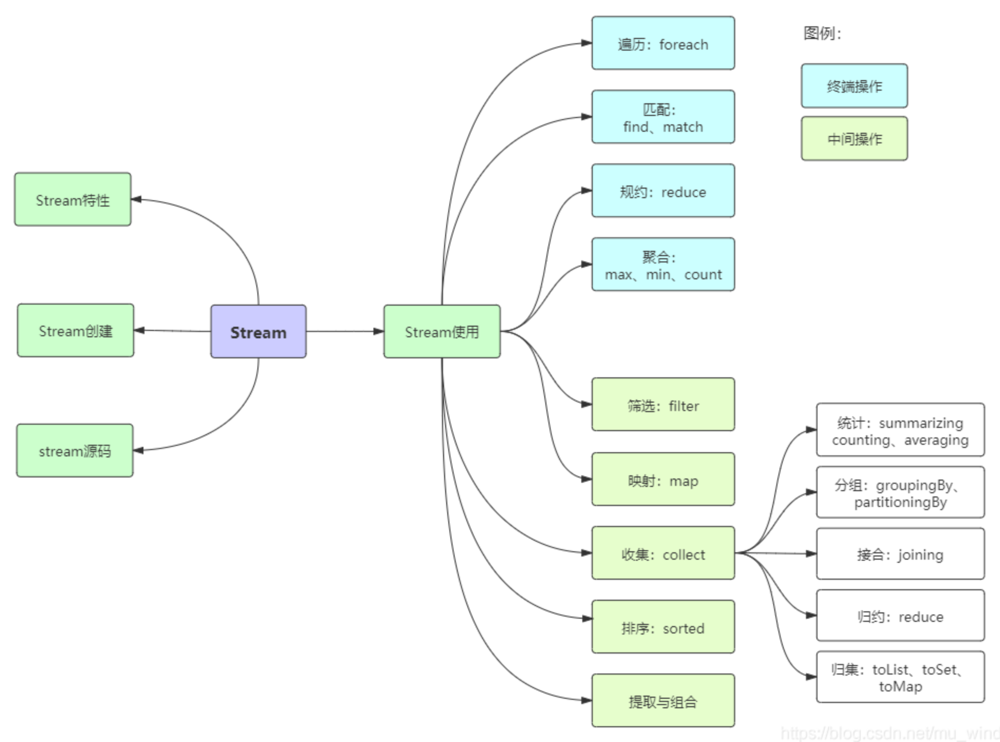

[TOC]


# Stream

> JDK1.8的新特性，结合Lambda表达式可以提高开发效率
>
> 1. 用于对集合**迭代**的增强处理。
> 2. 可以对集合数组进行更高效的聚合操作（分组、过滤、排序、追加）等。
> 3. 解决了传统开发过程中JDK对集合API不足的问题。

**示例**

```java
// 返回红色苹果的集合 List<Apple>
return appleStore.stream().filter(a -> "red".equals(a.getColor())).collect(Collectors.toList());

// 获取所有红色苹果的总重量
appleStore.stream()
	.filter(w -> "red".equals(w.getColor()))
    .mapToInt(Apple::getWeight).sum();
```


## 1 案例分析

### 1.1 排序-sorted

```java
package stream;

import java.util.ArrayList;
import java.util.Comparator;
import java.util.List;
import java.util.stream.Collectors;

/**
 * @description: Stream流 测试Demo-01 排序
 * @author: Komorebi
 * @time: 2021/8/31 16:47
 */
public class StreamDemo01 {
    public static void main(String[] args) {
        // 1 创建一个Category集合
        List<Category> categoryList = new ArrayList<>();
        categoryList.add(new Category(1L, "Java", "java", 0L, 1));
        categoryList.add(new Category(2L, "PHP", "PHP", 0L, 2));
        categoryList.add(new Category(3L, "JavaScript", "JavaScript", 0L, 3));
        categoryList.add(new Category(4L, "Python", "Python", 0L, 10));
        categoryList.add(new Category(5L, "Go", "Go", 0L, 8));
        categoryList.add(new Category(6L, "Ruby", "Ruby", 0L, 4));

        // 排序
        // categoryList.stream().sorted(((o1, o2) -> o1.getSort() - o2.getSort())).collect(Collectors.toList());
        categoryList = categoryList.stream().sorted(new Comparator<Category>() {
            @Override
            public int compare(Category o1, Category o2) {
                return o1.getSort() - o2.getSort();
            }
        }).collect(Collectors.toList());

        // 打印
        categoryList.forEach(System.out::println);
    }
}
```

### 1.2 过滤-filter

```java
package stream;

import java.util.ArrayList;
import java.util.List;
import java.util.stream.Collectors;

/**
 * @description: Stream流 测试Demo-02 过滤
 * @author: Komorebi
 * @time: 2021/9/9 23:52
 */
public class StreamDemo02 {
    public static void main(String[] args) {
        // 1 创建一个Category集合
        List<Category> categoryList = new ArrayList<>();
        categoryList.add(new Category(1L, "Java", "java", 0L, 1));
        categoryList.add(new Category(2L, "PHP", "PHP", 0L, 2));
        categoryList.add(new Category(3L, "JavaScript", "JavaScript", 0L, 3));
        categoryList.add(new Category(4L, "Python", "Python", 0L, 10));
        categoryList.add(new Category(5L, "Go", "Go", 0L, 8));
        categoryList.add(new Category(6L, "Ruby", "Ruby", 0L, 4));

        // 过滤
        categoryList = categoryList.stream().filter(category -> category.getId().equals(2L)).collect(Collectors.toList());

        // 打印
        categoryList.forEach(System.out::println);
    }
}
```

### 1.3 映射-map

```java
package stream;

import java.util.ArrayList;
import java.util.List;
import java.util.stream.Collectors;

/**
 * @description: Stream流 测试Demo-03 Map
 * @author: Komorebi
 * @time: 2021/9/9 23:57
 */
public class StreamDemo03 {
    public static void main(String[] args) {
        // 1 创建一个Category集合
        List<Category> categoryList = new ArrayList<>();
        categoryList.add(new Category(1L, "Java", "java", 0L, 1));
        categoryList.add(new Category(2L, "PHP", "PHP", 0L, 2));
        categoryList.add(new Category(3L, "JavaScript", "JavaScript", 0L, 3));
        categoryList.add(new Category(4L, "Python", "Python", 0L, 10));
        categoryList.add(new Category(5L, "Go", "Go", 0L, 8));
        categoryList.add(new Category(6L, "Ruby", "Ruby", 0L, 4));

        // Map改变集合中每个元素的信息
        categoryList = categoryList.stream().map(category -> {
            category.setSubTitle(category.getSubTitle().concat("_Test"));
            return category;
        }).collect(Collectors.toList());

        // 打印
        categoryList.forEach(System.out::println);
    }
}
```

### 1.4 去重-distinct

* **去重要求必须有hashCode相同，且equals返回true**

### 1.5 极值-max

```java
package stream;

import java.util.ArrayList;
import java.util.Comparator;
import java.util.List;
import java.util.Optional;

/**
 * @description: Stream流 测试Demo-04 Max、Min
 * @author: Komorebi
 * @time: 2021/9/10 09:54
 */
public class StreamDemo04 {
    public static void main(String[] args) {
        // 1 创建一个Category集合
        List<Category> categoryList = new ArrayList<>();
        categoryList.add(new Category(1L, "Java", "java", 0L, 1));
        categoryList.add(new Category(2L, "PHP", "PHP", 0L, 2));
        categoryList.add(new Category(3L, "JavaScript", "JavaScript", 0L, 3));
        categoryList.add(new Category(4L, "Python", "Python", 0L, 10));
        categoryList.add(new Category(5L, "Go", "Go", 0L, 8));
        categoryList.add(new Category(6L, "Ruby", "Ruby", 0L, 4));

        // max
        Optional<Category> optionalCategory = categoryList.stream().max((Comparator.comparingInt(Category::getSort)));
        optionalCategory.ifPresent(System.out::println);
    }
}
```


## 2 Arrays.stream

> https://blog.csdn.net/mu_wind/article/details/109516995



### 2.1 min、max、sum

```java
int[] nums = new int[]{1, 2, 3, 4, 5, 6, 7, 8};
int min = Arrays.stream(nums).min().getAsInt();
int max = Arrays.stream(nums).max().getAsInt();
int sum = Arrays.stream(nums).sum();
```

