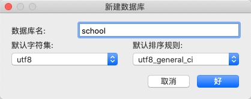

# MySQL笔记

* 安装教程：https://www.cnblogs.com/myxq666/p/7787744.html
* 配置Navicat：https://www.cnblogs.com/shenlaiyaoshi/p/8687105.html
	* 
	* 每一个操作，实际上对应一个SQL
	* 

* SQL = **Structured Query Language**
* 数据库作为一种专门管理数据的软件，应用程序不需要自己管理数据，而是通过数据库软件提供的接口来读写数据
* 数据库模型：
  * 层次模型
  * 网状模型
  * 关系模型：将数据看作是一个二维表格，任何数据都可以通过行号+列号来唯一确定


* 数据库分类
  
  * 关系型数据库（SQL）：
    * MySQL, Oracle, Sql Server, DB2, SQLlite
  * 非关系型数据库（NoSQL）：
  	* Redis, MongoDB
  * 商用数据库：Oracle, SQL Server, DB2
  * 开源数据库：MySQL, PostgreSQL
  * 桌面数据库：以微软[Access](https://products.office.com/access)为代表，适合桌面应用程序使用
  * 以[Sqlite](https://sqlite.org/)为代表，适合手机应用和桌面程序
  
* 

	* DCL: Data Control Language

* **DBMS**：数据库管理软件，科学有效的管理我们的数据，维护和获取数据

	

## 一、基本操作

### 1.1 连接数据库

* 命令行指令：

	```sql
	(base)  mysql -u root -p					--连接数据库
	Enter password:
	Welcome to the MySQL monitor.  Commands end with ; or \g.
	Your MySQL connection id is 60
	Server version: 5.7.19 MySQL Community Server (GPL)
	
	show databases;							--查询所有的数据库
	
	use school;									--切换数据库
	
	show tables;								--查看所有的表
	
	describe student;						--显示表中的所有信息
	
	create database school;			--创建一个数据库
	
	exit;												--退出连接
	```

* 创建表并添加数据

	```sql
	CREATE TABLE users(
			id INT PRIMARY KEY,
	  	`name` VARCHAR(40),
	  	`password` VARCHAR(40),
	  	email VARCHAR(60),
	  	birthday DATE
	);
	
	INSERT INTO users(id, `name`, `password`, email, birthday)
	VALUES(1, 'cx', '123456', 'a@qq.com', '2000-01-01');
	```


## 二、操作数据库

操作数据库-->操作数据库中的表-->操作数据库中的数据

### 2.1 数据库增删改查

* MYSQL关键字不区分大小写

* **创建**数据库

	```sql
	CREATE DATABASE [IF NOT EXISTS] school;
	```

* **删除**数据库

	```sql
	DROP DATABASE [IF EXISTS] school;
	```

* **使用**数据库

	```sql
	USE school
	```

* **查看**数据库

	```sql
	SHOW databases
	```

### 2.2 数据库数据类型

* 数值

	|   tinyint   |    十分小的数据    |    1个字节     |
	| :---------: | :----------------: | :------------: |
	|  smallint   |     较小的数据     |    2个字节     |
	|  mediumint  |   中等大小的数据   |    3个字节     |
	|   **int**   |      标准整数      |    4个字节     |
	|   bigint    |     较大的数据     |    8个字节     |
	|    float    |       浮点数       |    4个字节     |
	|   double    |       浮点数       |    8个字节     |
	| **decimal** | 字符串形式的浮点数 | 金融计算时使用 |

* 字符串

	| char        | 固定大小字符串 | 0-255   |
	| ----------- | -------------- | ------- |
	| **varchar** | 可变字符串     | 0-65535 |
	| tinytext    | 微型文本       | 2^8-1   |
	| **text**    | 文本串         | 2^16-1  |

* 时间日期

	* java.util.Date

		| date          | 日期格式     | YYYY-MM-DD             |
		| ------------- | ------------ | ---------------------- |
		| time          | 时间格式     | HH: MM: SS             |
		| **datetime**  | 日期时间格式 | YYYY-MM-DD HH: MM: SS  |
		| **timestamp** | 时间戳       | 1970.1.1带现在的毫秒数 |
		| year          | 年份         |                        |

* NULL：不要使用NULL进行运算

### 2.3 数据库字段属性（重点）

* 每个表必须存在的字段
	* id                         主键
	* version              乐观锁
	* is_delete           伪删除
	* gmt_create      创建时间
	* gmt_update     修改时间

* **Unsigned（无符号）**:
	* 无符号的整数
	* 不能声明为负数
* **Zerofill（零填充）**：
	* 0填充的
	* 不足的位数用0填充    int(3)    5 --> 005
* **自增**：
	* 自动在上一条记录的基础上+1
	* 通常用来设计唯一的主键 index，必须是整数类型
	* 可以自定义设计主键自增的起始值和步长
* **非空**：
	* 假设设置为not null，如果不给赋值，就会报错
	* NULL，如果不填写值，默认就是NULL
* 默认：
	* 设置默认的值
	* Sex，默认值为男，如果不指定该列的值，则会有默认的值

### 2.4 创建表

```sql
CREATE TABLE IF NOT EXISTS `student`(
	`id` INT(4) NOT NULL AUTO_INCREMENT COMMENT '学号',
	`name` VARCHAR(30) NOT NULL DEFAULT '姓名' COMMENT '姓名',
	`pwd` VARCHAR(20) NOT NULL DEFAULT '123456' COMMENT '密码',
	`sex` VARCHAR(2) NOT NULL DEFAULT '女' COMMENT '性别',
	`birthday` DATETIME DEFAULT NULL COMMENT '出生日期',
	`address` VARCHAR(100) DEFAULT NULL COMMENT '家庭住址',
	`email` VARCHAR(50) DEFAULT NULL COMMENT '邮箱',
	PRIMARY KEY(`id`)
)ENGINE=INNODB DEFAULT CHARACTER SET=utf8
```

* 查看创建的语句

	```sql
	SHOW CREATE DATABASE school
	SHOW CREATE TABLE student
	
	--显示表的结构
	DESC student						
	```

### 2.5 数据表的类型

* INNODB：默认使用，安全性高，支持事务处理，多表多用户操作
* MYISAM：早年使用，节约空间，速度较快

|              | MYISAM | INNODB        |
| ------------ | ------ | ------------- |
| 事务支持     | 不支持 | 支持          |
| 数据行锁定   | 不支持 | 支持          |
| 外键约束     | 不支持 | 支持          |
| 全文索引     | 支持   | 不支持        |
| 表空间的大小 | 较小   | 较大，约为2倍 |


### 2.6 数据表修改与删除

* **change**用来字段重命名，不能修改字段类型和约束
* **modify**不用来字段重命名，只能修改字段类型和约束

```sql
--修改表名		ALTER TABLE 旧表名 RENAME AS 新表名
ALTER TABLE teacher RENAME AS teacher1
--增加表的字段   ALTER TABLE 表名 ADD 字段名 列属性
ALTER TABLE teacher ADD age INT(11)

--修改表的字段（重命名，修改约束！）
--ALTER TABLE 表名 MODIFY 字段名 列属性[]
ALTER TABLE teacher MODIFY age VARCHAR(11)    --修改约束
--ALTER TABLE 表名 CHANGE 旧名字 新名字 列属性[]
ALTER TABLE teacher CHANGE age age1 INT(1)	 	--字段重命名

--删除表的字段
ALTER TABLE teacher DROP age

--删除表
DROP TABLE IF EXISTS teacher
```

* 注意点
	* `` 字段名，使用
	* 注释--
	* SQL关键字不敏感
	* 所有的符号用英文


## 三、MySQL数据管理

### 3.1 外键（了解）


物理外键，数据库级别的外键，不建议使用

* **法一**

```sql
--学生表的 gradeid 字段要去引用年级表的 gradeid
--定义外键key
--给这个外键添加约束（执行引用） references 引用
CREATE TABLE IF NOT EXISTS `student`(
	`id` INT(4) NOT NULL AUTO_INCREMENT COMMENT '学号',
	`name` VARCHAR(30) NOT NULL DEFAULT '姓名' COMMENT '姓名',
	`gradeid` INT(10) NOT NULL COMMENT '年纪',
	PRIMARY KEY(`id`),
  KEY `FK_gradeid` (`gradeid`),
  CONSTRAINT `FK_gradeid` FOREIGN KEY(`gradeid`) REFERENCES `grade`(`gradeid`)
)ENGINE=INNODB DEFAULT CHARACTER SET=utf8
```

* **法二**

```SQL
--先正常创建表
ALTER TABLE `student`
ADD CONSTRAINT `FK_gradeid` FOREIGN KEY(`gradeid`) REFERENCES `grade`(`gradeid`)
```

### 3.2 DML语言（熟记）

* DML语言：数据存储，数据管理
	* insert
	* update
	* delete

#### 3.2.1 添加

* 数据和字段必须一一对应
	* 字段和字段直接用英文逗号
	* 字段可以省略，但必须和所有的字段一一对应
	* 可以同时插入多条数据，VALUES后的值要用逗号隔开

```sql
--INSERT INTO 表名([字段1, 字段2, 字段3]) VALUES('值1'), ('值2'), ('值3')
INSERT INTO `teacher`(`gradeid`) VALUES('大一')

INSERT INTO `student`(`name`, `pwd`, `sex`) VALUES ('李四', 123, '男'),('王五', 123, '男')
```

#### 3.2.2 修改

#### 3.2.3 删除