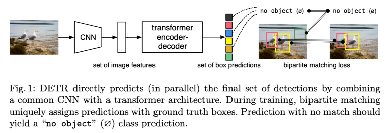
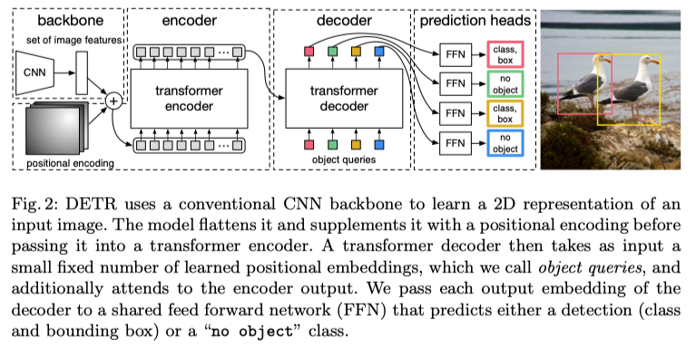

# End-to-End Object Detection with Transformers笔记

> Carion N, Massa F, Synnaeve G, et al. End-to-end object detection with transformers[C]//European Conference on Computer Vision. Springer, Cham, 2020: 213-229.

* 提出了一种**将目标检测视为直接集预测问题**的新方法。我们的方法简化了检测流程，有效地消除了对许多手工设计的组件（例如非最大抑制程序或锚点生成）的需求，这些组件明确地编码了我们对任务的先验知识。
* 新框架的主要成分称为DEtection TRANSformer或DETR，是基于集合的全局损耗，它通过二分匹配和变压器编码器-解码器体系结构来强制进行唯一的预测。给定一小部分学习过的对象查询，DETR会考虑对象与全局图像上下文之间的关系，以直接并行并行输出最终的预测集。与许多其他现代检测器不同，新模型在概念上很简单，并且不需要专门的库。 
* DETR与具有挑战性的COCO对象检测数据集上成熟且高度优化的Faster RCNN基线相媲美，证明了准确性和运行时性能。此外，可以很容易地将DETR概括为以统一的方式产生全景分割。

## 1 Introduction

* 文章将目标检测视为**直接设置的预测问题**，从而简化了培训流程。采用基于transformer的编解码器架构，这是一种用于序列预测的流行架构。transformer的自注意力机制可以显式地建模序列中元素之间的所有成对交互，因此这些体系结构特别适合于集合预测的特定约束，例如**删除重复的预测**。
* DETR可**一次预测所有对象**，并通过设置损失函数进行端到端训练，该函数执行预测对象与地面真实对象之间的二分匹配。 DETR通过删除多个手工设计的组件来简化检测baseline，这些组件对先验知识进行编码，例如空间锚点或非最大抑制。
* DETR的**主要特征**是双向匹配损耗和具有（非自回归）并行解码器的transformer的结合
* ==更准确地说，DETR证明了在大型物体上的显着更好的性能，这一结果很可能是由于变压器的非本地计算而实现的。但是，它在小物体上的性能较低==。

## 2 模型设计

如图2所示。它包含三个主要组件：

* 提取紧凑特征表示的CNN主干
* 编码器-解码器变换器和一个简单的前馈网络（FFN）
* 做出最终的检测预测。

**第一步**

* **匹配成本**：$\hat{\sigma}=\underset{\sigma \in \mathfrak{S}_{N}}{\arg \min } \sum_{i}^{N} \mathcal{L}_{\operatorname{match}}\left(y_{i}, \hat{y}_{\sigma(i)}\right)$**公式中的表述**：
	* 用$y$表示对象的地面真实集
	* $\hat{y}=\left\{\hat{y}_{i}\right\}_{i=1}^{N}$表示N个预测的集合。**假设N大于图像中的对象数**，我们也将y视为大小为N的集合，并用无对象填充。
	* 为了找到这两个集合之间的二分匹配，搜索具有最低成本的N个元素$\sigma \in \mathfrak{S}_{N}$的置换
	* 遵循先前的工作，可以使用**匈牙利算法**有效地计算出此最佳分配
	* $\mathcal{L}_{\operatorname{match}}\left(y_{i}, \hat{y}_{\sigma(i)}\right)=-\mathbb{1}_{\left\{c_{i} \neq \varnothing\right\}} \hat{p}_{\sigma(i)}\left(c_{i}\right)+\mathbb{1}_{\left\{c_{i} \neq \varnothing\right\}} \mathcal{L}_{\mathrm{box}}\left(b_{i}, \hat{b}_{\sigma(i)}\right)$

**第二步**

​		计算**损失函数**，即上一步中匹配的所有对的**匈牙利损失**。将损失定义为类似于常见对象检测器的损失，即，用于类别预测的负对数似然率和随后定义的盒损失的线性组合：

* $\mathcal{L}_{\text {Hungarian }}(y, \hat{y})=\sum_{i=1}^{N}\left[-\log \hat{p}_{\hat{\sigma}(i)}\left(c_{i}\right)+\mathbb{1}_{\left\{c_{i} \neq \varnothing\right\}} \mathcal{L}_{\text {box }}\left(b_{i}, \hat{b}_{\hat{\sigma}}(i)\right)\right]$
* $\hat{\sigma}$是第一步中计算出的最优分配
* 类似于“Faster R-CNN训练过程”如何通过二次抽样来平衡积极/消极的建议。请注意，对象和空目标之间的匹配成本并不取决于预测，这意味着在这种情况下，成本是恒定的。
* $\mathcal{L}_{\mathrm{box}}$使用了$L_1$和IoU的**线性组合**
	* $\mathcal{L}_{\mathrm{box}}\left(b_{i}, \hat{b}_{\sigma(i)}\right) = \lambda_{\text {iou }} \mathcal{L}_{\text {iou }}\left(b_{i}, \hat{b}_{\sigma(i)}\right)+\lambda_{\mathrm{L} 1}\left\|b_{i}-\hat{b}_{\sigma(i)}\right\|_{1}$

## 3 底层构造

**编码器**

* 首先，1x1卷积将高级激活映射f的通道维从C减小到较小的维d。创建一个新的特征图$z_{0} \in \mathbb{R}^{d \times H \times W}$。
* 编码器需要一个序列作为输入，因此我们将z 0的空间维度折叠为一个维度，从而生成d×HW特征图。
* 每个编码器层都有一个标准的体系结构，由一个多头自我关注模块和一个前馈网络（FFN）组成。由于变换器的体系结构是置换不变的，因此我们在其上**添加了固定的位置编码**，该编码被添加到每个关注层的输入中。

**解码器**

* 解码器遵循transformer的标准架构，使用多头自编码器和编码器-解码器注意机制转换大小为d的N个嵌入。
* 与原始转换器的不同之处在于，模型在每个解码器层并行解码N个对象。
* 使用自回归模型，一次预测一个元素的输出序列。由于解码器也是置换不变的，因此N个输入嵌入必须不同才能产生不同的结果。这些输入嵌入是学习的位置编码，将其称为对象查询，并且类似于编码器，我们将它们添加到每个关注层的输入中。 N个对象查询由解码器转换为嵌入的输出。然后，它们通过前馈网络（在下一个小节中进行描述）独立地解码为盒坐标和类标签，从而得出最终的N个预测。通过对这些嵌入的自编码器和解码器注意，模型可以使用它们之间的成对关系全局地对所有对象进行推理，同时能够将整个图像用作上下文。

**FFNs**

* 最终的预测是通过具有ReLU激活功能和隐藏尺寸d的3层感知器以及线性投影层来计算的。 
* FFN预测框的标准化中心坐标，高度和宽度w.r.t.输入图像，然后线性层使用softmax函数预测类标签。
* 由于我们预测了一组固定大小的N个边界框，其中N通常比图像中实际感兴趣的对象的数量大得多，因此使用了一个额外的特殊类别标签represent来表示在插槽内未检测到任何对象。此类在标准对象检测方法中与“背景”类具有相似的作用。

**Auxiliary decoding losses**

* 在训练过程中在解码器中使用**辅助损耗**很有帮助，特别是有助于模型输出正确的目标类别
* 在每个解码器层之后**添加预测FFN和匈牙利损失**。所有预测FFN均共享其参数。我们使用附加的共享层范数来归一化来自不同解码器层的预测FFN的输入。

