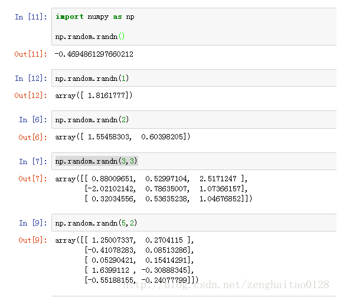
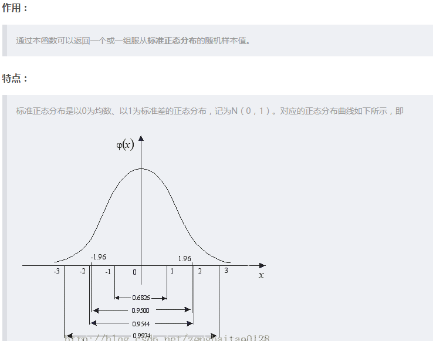
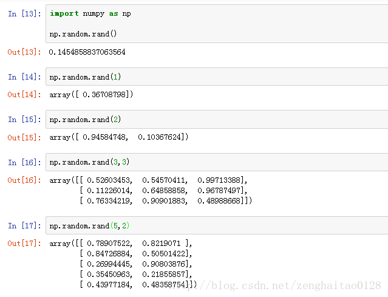
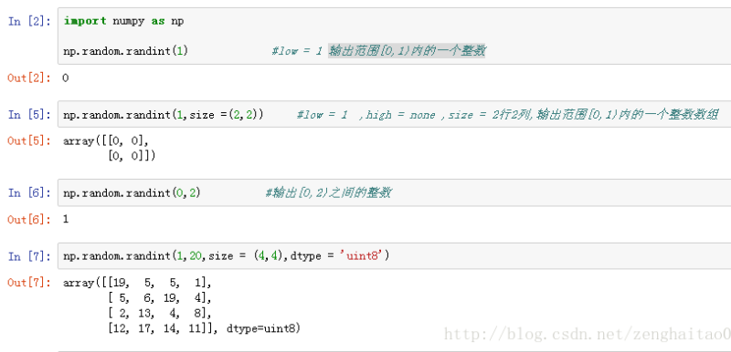
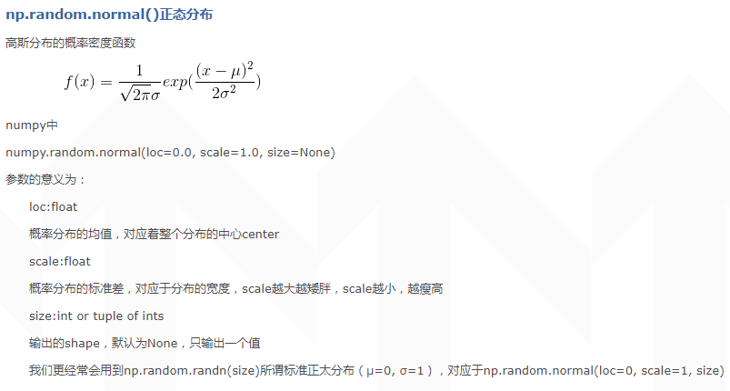
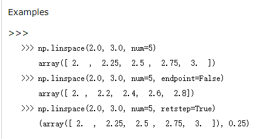

# Numpy语法

## np.random.randn

```python
np.random.randn(d0,d1,d2……dn) 
1)当函数括号内没有参数时，则返回一个浮点数； 
2）当函数括号内有一个参数时，则返回秩为1的数组，不能表示向量和矩阵； 
3）当函数括号内有两个及以上参数时，则返回对应维度的数组，能表示向量或矩阵； 
4）np.random.standard_normal（）函数与np.random.randn()类似，但是np.random.standard_normal（）
的输入参数为元组（tuple）. 
5)np.random.randn()的输入通常为整数，但是如果为浮点数，则会自动直接截断转换为整数。

```






## np.random.rand

```python
np.random.rand(d0,d1,d2……dn) 
注：使用方法与np.random.randn()函数相同 
作用： 
通过本函数可以返回一个或一组服从“0~1”均匀分布的随机样本值。随机样本取值范围是[0,1)，不包括1。 
应用：在深度学习的Dropout正则化方法中，可以用于生成dropout随机向量（dl），例如（keep_prob表示保留神经元的比例）：dl = np.random.rand(al.shape[0],al.shape[1]) < keep_prob

```




## np.random.randint

```python
numpy.random.randint(low, high=None, size=None, dtype=’l’) 
输入： 
low—–为最小值 
high—-为最大值 
size—–为数组维度大小 
dtype—为数据类型，默认的数据类型是np.int。 
返回值： 
返回随机整数或整型数组，范围区间为[low,high），包含low，不包含high； 
high没有填写时，默认生成随机数的范围是[0，low）

```



## np.random.normal()正态分布




## np.dot 和np.multiply


## **np.linalg.inv**


## np.linspace





