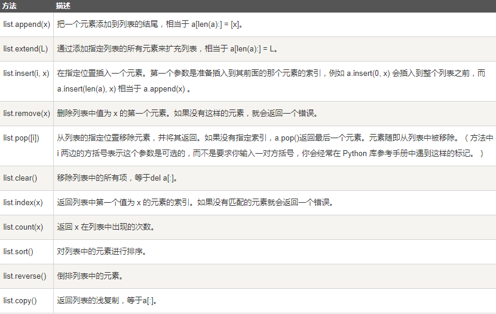
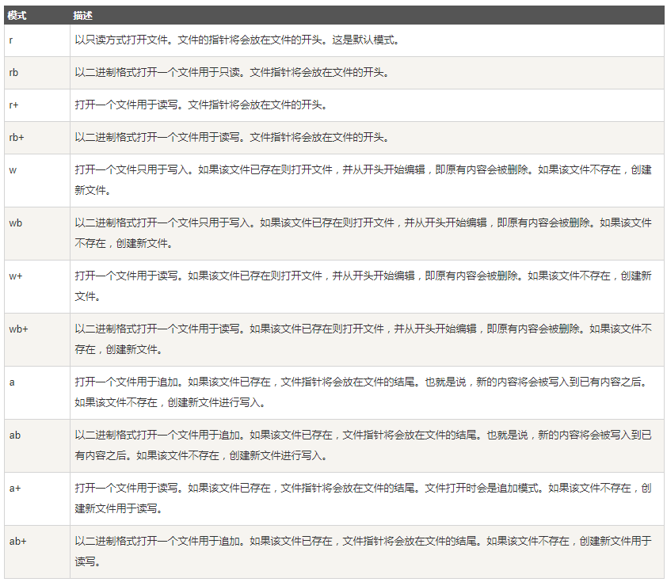
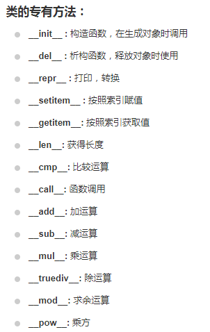
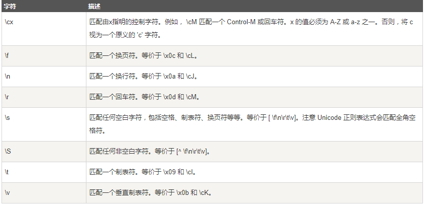
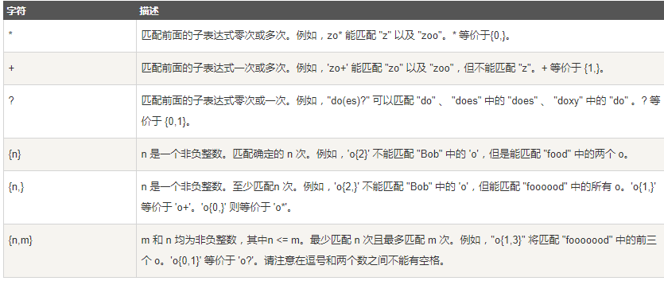

# Python笔记2

## 1. 迭代器和生成器

* 迭代器是一直可以记住遍历的位置的对象。
* 从集合的第一个元素开始访问，直到结束，**只能往前不能后退**。
* 两个基本方法：**iter()** 和 **next()**。

```python
list = [1,2,3,4]
a = iter(list)
>>> print (next(it))   # 输出迭代器的下一个元素
1
>>> print (next(it))
2

for x in a :
	print(x , end = " ")

```

### 1.1 创建迭代器

* 把一个类作为一个迭代器使用需要在类中实现两个方法 __iter__() 与 __next__() 。
* __iter__() 方法返回一个特殊的迭代器对象， 这个迭代器对象实现了 __next__() 方法并通过 StopIteration 异常标识迭代的完成。
* __next__() 方法会返回下一个迭代器对象。

```python
class MyNumbers:
  def __iter__(self):
    self.a = 1
    return self
 
  def __next__(self):
    x = self.a
    self.a += 1
    return x
 
myclass = MyNumbers()
myiter = iter(myclass)

print(next(myiter))
print(next(myiter))
print(next(myiter))
print(next(myiter))
print(next(myiter))
```

### 1.2 StopIteration

* StopIteration 异常用于标识迭代的完成，防止出现无限循环的情况，在 __next__() 方法中我们可以设置在完成指定循环次数后触发 StopIteration 异常来结束迭代。

  ```python
  class MyNumbers:
    def __iter__(self):
      self.a = 1
      return self
   
    def __next__(self):
      if self.a <= 20:
        x = self.a
        self.a += 1
        return x
      else:
        raise StopIteration
   
  myclass = MyNumbers()
  myiter = iter(myclass)
   
  for x in myiter:
    print(x)
  ```

### 1.3 生成器

* 使用了**yield**的函数被称为生成器。
* 生成器是**一个返回迭代器的函数**，只能用于迭代操作，更简单点理解生成器就是一个迭代器。
* 在调用生成器运行的过程中，每次遇到 yield 时函数会暂停并保存当前所有的运行信息，**返回 yield 的值**, 并在下一次执行 next() 方法时从当前位置继续运行。

```python
import sys
 
def fibonacci(n): 			 # 生成器函数 - 斐波那契
    a, b, counter = 0, 1, 0
    while True:
        if (counter > n): 
            return
        yield a
        a, b = b, a + b
        counter += 1
f = fibonacci(10) 			# f 是一个迭代器，由生成器返回生成
 
while True:
    try:
        print (next(f), end=" ")
    except StopIteration:
        sys.exit()
```

* 一个函数 f，f 返回一个 list，这个 list 是动态计算出来的（不管是数学上的计算还是逻辑上的读取格式化），并且这个 list 会很大（无论是固定很大还是随着输入参数的增大而增大），这个时候，我们希望每次调用这个函数并使用迭代器进行循环的时候一个一个的得到每个 list 元素而不是直接得到一个完整的 list 来节省内存，这个时候 yield 就很有用。


## 2. 函数

* 函数代码以**def**关键词开头，后接函数标识符名称和圆括号**（）**。
* 任何传入参数和自变量必须放在圆括号中间，圆括号之间可以用于定义参数。
* 函数的第一行语句可以选择性的使用文档字符串-用于存放函数说明。
* 函数内容以冒号开始，并且缩进。
* **return [表达式]** 结束函数，选择性的返回一个值给调用方，不带表达式的**return** 相当于返回**None**。

```python
# 计算面积

def area(width,height):
    return width * height

def print_wecome(name):
    print('Welcome',name)
    
print_welcome('My name')
w = 4
h = 5
print("width = " ,w,"height = ",h,"area = ",area(w.h))
```

### 2.1 参数传递

* 在python 中，类型属于对象，变量时没有类型的。

```python
a = [1,2,3]

a = "name"
```

​	**[1,2,3]** 是 List 类型，**"name"** 是 String 类型，而变量 a 是没有类型，她仅仅是一个对象的引用（一个指针），可以是指向 List 类型对象，也可以是指向 String 类型对象。

#### 2.1.1 可更改（mutable）和不可更改（immutable）对象

​	在python 中，**strings**,**tuples**和**numbers**是不可更改对象，**list**,**dict**是可更改的。

* **不可变类型：**变量赋值 **a=5** 后再赋值 **a=10**，这里实际是新生成一个 int 值对象 10，再让 a 指向它，而 5 被丢弃，不是改变a的值，相当于新生成了a。

* **可变类型：**变量赋值 **la=[1,2,3,4]** 后再赋值 **la[2]=5** 则是将 list la 的第三个元素值更改，本身la没有动，只是其内部的一部分值被修改了。

* 函数的参数传递：

  * **不可变类型：**类似 c++ 的值传递，如 整数、字符串、元组。如fun（a），传递的只是a的值，没有影响a对象本身。比如在 fun（a）内部修改 a 的值，只是修改另一个复制的对象，不会影响 a 本身。

  * **可变类型：**类似 c++ 的引用传递，如 列表，字典。如 fun（la），则是将 la 真正的传过去，修改后fun外部的la也会受影响。

    ```python
    # 不可变函数说明
    def ChangeInt( a ):
        a = 10
     
    b = 2
    ChangeInt(b)
    print( b ) # 结果是 2
    
    # 可写函数说明
    def changeme( mylist ):
       "修改传入的列表"
       mylist.append([1,2,3,4])
       print ("函数内取值: ", mylist)
       return
     
    # 调用changeme函数
    mylist = [10,20,30]
    changeme( mylist )
    print ("函数外取值: ", mylist)
    ```

#### 2.1.2 参数（必须参数，关键字参数，默认参数，不定长参数）

* **必需参数**须以正确的顺序传入函数。调用时的数量必须和声明时的一样。

* **关键字参数**和函数调用关系紧密，函数调用使用关键字参数来确定传入的参数值。使用关键字参数**允许**函数调用时参数的顺序与声明时不一致，因为 Python 解释器能够用参数名匹配参数值。

  ```python
  #可写函数说明
  def printinfo( name, age ):
     "打印任何传入的字符串"
     print ("名字: ", name)
     print ("年龄: ", age)
     return
   
  #调用printinfo函数
  printinfo( age=50, name="runoob" )
  ```

* 调用函数时，如果没有传递参数，则会使用默认参数。以下实例中如果没有传入 age 参数，则使用默认值：

* 默认参数必须放在最后面

  ```python
  #可写函数说明
  def printinfo( name, age = 35 ):
     "打印任何传入的字符串"
     print ("名字: ", name)
     print ("年龄: ", age)
     return
   
  #调用printinfo函数
  printinfo( age=50, name="runoob" )
  print ("------------------------")
  printinfo( name="runoob" )
  ```

* ```python
  # 可写函数说明
  def printinfo( arg1, *vartuple ):
     "打印任何传入的参数"
     print ("输出: ")
     print (arg1)
     print (vartuple)
   
  # 调用printinfo 函数
  printinfo( 70, 60, 50 )		#输出(60, 50)
  
  # 可写函数说明
  def printinfo( arg1, **vardict ):
     "打印任何传入的参数"
     print ("输出: ")
     print (arg1)
     print (vardict)
   
  # 调用printinfo 函数
  printinfo(1, a=2,b=3)		#输出{'a': 2, 'b': 3}
  ```

* 声明函数时，参数中星号 ***** 可以单独出现，如果单独出现星号 ***** 后的参数必须用关键字传入。

  ```python
  def f(a,b,*,c):
      return a+b+c
  
  >>> f(1,2,3)   # 报错
  >>> f(1,2,c=3) # 正常
  6
  ```

#### 2.1.3 匿名函数

**python**使用**lambda**来创建匿名函数，即不使用def这种形式定义函数

* **lambda**主体是一个**表达式**，而不是**代码块**。仅仅能做lambda表达式中封装有限的逻辑。
* lambda函数拥有自己的命名空间，且不能访问自己参数列表之外灬全局命名空间里的参数。
* 虽然lambda函数看起来只能写一行，却不等同于C或C++的内联函数，后者的目的是调用小函数时不占用栈内存从而增加运行效率。

##### 语法：

```python
# 可写函数说明
sum = lambda arg1, arg2: arg1 + arg2
 
# 调用sum函数
print ("相加后的值为 : ", sum( 10, 20 ))
print ("相加后的值为 : ", sum( 20, 20 ))
```

#### 2.1.4 Return语句

* **return [表达式]** 语句用于退出函数，选择性地向调用方返回一个表达式。不带参数值的return语句返回None。

### 2.2 变量作用域

- L （Local） 局部作用域
- E （Enclosing） 闭包函数外的函数中
- G （Global） 全局作用域
- B （Built-in） 内置作用域（内置函数所在模块的范围）

以 L –> E –> G –>B 的规则查找，即：在局部找不到，便会去局部外的局部找（例如闭包），再找不到就会去全局找，再者去内置中找。

```python
g_count = 0  # 全局作用域
def outer():
    o_count = 1  # 闭包函数外的函数中
    def inner():
        i_count = 2  # 局部作用域
```

​	Python 中只有模块（module），类（class）以及函数（def、lambda）才会引入新的作用域，其它的代码块（如 if/elif/else/、try/except、for/while等）是不会引入新的作用域的，也就是说这些语句内定义的变量，外部也可以访问

#### 2.2.1 global 和 nonlocal关键字

```python
num = 1
def fun1():
    global num  # 需要使用 global 关键字声明
    print(num) 
    num = 123
    print(num)
fun1()
print(num)		#输出123
```

如果要修改嵌套作用域（enclosing 作用域，外层非全局作用域）中的变量则需要 nonlocal 关键字了

```python
def outer():
    num = 10
    def inner():
        nonlocal num   # nonlocal关键字声明
        num = 100
        print(num)
    inner()
    print(num)
    
>>>outer()
```


## 3. 数据结构

### 3.1 列表



```python
>>> a = [66.25, 333, 333, 1, 1234.5]
>>> print(a.count(333), a.count(66.25), a.count('x'))
2 1 0
>>> a.insert(2, -1)
>>> a.append(333)
>>> a
[66.25, 333, -1, 333, 1, 1234.5, 333]
>>> a.index(333)
1
>>> a.remove(333)
>>> a
[66.25, -1, 333, 1, 1234.5, 333]
>>> a.reverse()
>>> a
[333, 1234.5, 1, 333, -1, 66.25]
>>> a.sort()
>>> a
[-1, 1, 66.25, 333, 333, 1234.5]
```

* 列表推导式：可以使用复杂表达式或嵌套函数

```python
>>> vec = [2, 4, 6]
>>> [3*x for x in vec]
[6, 12, 18]

>>> [[x, x**2] for x in vec]
[[2, 4], [4, 16], [6, 36]]

>>> [str(round(355/113, i)) for i in range(1, 6)]
['3.1', '3.14', '3.142', '3.1416', '3.14159']
```

### 3.2 元组和序列

```python
>>> t = 12345, 54321, 'hello!'
>>> t[0]
12345
>>> t
(12345, 54321, 'hello!')
>>> # Tuples may be nested:
... u = t, (1, 2, 3, 4, 5)
>>> u
((12345, 54321, 'hello!'), (1, 2, 3, 4, 5))
```

### 3.3 集合

* 集合是一个无序不重复元素的集。基本功能包括关系测试和消除重复元素。

```python
>>> basket = {'apple', 'orange', 'apple', 'pear', 'orange', 'banana'}
>>> print(basket)                      # 删除重复的
{'orange', 'banana', 'pear', 'apple'}
>>> 'orange' in basket                 # 检测成员
True
>>> 'crabgrass' in basket
False

>>> # 以下演示了两个集合的操作
...
>>> a = set('abracadabra')
>>> b = set('alacazam')
>>> a                                  # a 中唯一的字母
{'a', 'r', 'b', 'c', 'd'}
>>> a - b                              # 在 a 中的字母，但不在 b 中
{'r', 'd', 'b'}
>>> a | b                              # 在 a 或 b 中的字母
{'a', 'c', 'r', 'd', 'b', 'm', 'z', 'l'}
>>> a & b                              # 在 a 和 b 中都有的字母
{'a', 'c'}
>>> a ^ b                              # 在 a 或 b 中的字母，但不同时在 a 和 b 中
{'r', 'd', 'b', 'm', 'z', 'l'}
```

### 3.4 字典

* 序列是以**连续的整数**为索引，与此不同的是，字典以关键字为索引，关键字可以是任意不可变类型，通常用字符串或数值。

  ```python
  >>> tel = {'jack': 4098, 'sape': 4139}
  >>> tel['guido'] = 4127
  >>> tel
  {'sape': 4139, 'guido': 4127, 'jack': 4098}
  >>> tel['jack']
  4098
  >>> del tel['sape']
  >>> tel['irv'] = 4127
  >>> tel
  {'guido': 4127, 'irv': 4127, 'jack': 4098}
  >>> list(tel.keys())
  ['irv', 'guido', 'jack']
  >>> sorted(tel.keys())
  ['guido', 'irv', 'jack']
  >>> 'guido' in tel
  True
  >>> 'jack' not in tel
  False
  ```

### 3.5 遍历

* 字典遍历

```python
>>> knights = {'gallahad': 'the pure', 'robin': 'the brave'}
>>> for k, v in knights.items():
...     print(k, v)
...
gallahad the pure
robin the brave
```

* 序列遍历

```python
>>> for i, v in enumerate(['tic', 'tac', 'toe']):
...     print(i, v)
...
0 tic
1 tac
2 toe

# 遍历多个列表时
>>> questions = ['name', 'quest', 'favorite color']
>>> answers = ['lancelot', 'the holy grail', 'blue']
>>> for q, a in zip(questions, answers):
...     print('What is your {0}?  It is {1}.'.format(q, a))
...
What is your name?  It is lancelot.
What is your quest?  It is the holy grail.
What is your favorite color?  It is blue.
```


## 4. 模块


* 一个模块只会被导入一次
* from ... import ...（从模块中指定一个部分导入）
* from ... import *（导入模块整个）

### 4.1 __name__属性

* 一个模块被另一个程序第一次引入时，其主程序将运行。如果我们想在模块被引入时，模块中的某一程序块不执行，我们可以用__name__属性来使该程序块仅在该模块自身运行时执行。
* 每个模块都有一个__name__属性，当其值是'__main__'时，表明该模块自身在运行，否则是被引入。

```python
# Filename: using_name.py

if __name__ == '__main__':
   print('程序自身在运行')
else:
   print('我来自另一模块')

$ python using_name.py
程序自身在运行

$ python
>>> import using_name
我来自另一模块
>>>
```

### 4.2 dir()函数

* 内置的函数 dir() 可以找到模块内定义的所有名称。以一个**字符串列表**的形式返回。

### 4.3 输入和文件读写

```python
str = input("请输入：");
print ("你输入的内容是: ", str)
```

* 文件读写open(filename, mode)

  * filename：访问文件的字符串值
  * mode：决定打开文件的模式，默认为只读（r）

  

  


* 文件对象的方法（**http://www.runoob.com/python3/python3-file-methods.html**）

```python
#f.read(size)读取一定数目的数据
str = f.read()
print(str)


#f.readline从文件中读取单独的一行。换行符为 '\n'。如果返回一个空字符串, 说明已经读取到最后一行。
str = f.readline()
print(str)

f.readlines()	# 将返回该文件中包含的所有行。

# f.write(string) 将 string 写入到文件中, 然后返回写入的字符数。
num = f.write( "Python 是一个非常好的语言。\n是的，的确非常好!!\n" )
print(num)

f.tell() 		#返回文件对象当前所处的位置, 它是从文件开头开始算起的字节数。
```

### 4.4 OS文件、目录方法

* **http://www.runoob.com/python3/python3-os-file-methods.html**


## 5. 面向对象

* **类**：用来描述具有相同属性和方法的对象的集合。定义了集合中每个对象共有的属性和方法，对象是类的实例。
* **方法**：类中定义的函数。
* **类变量**：类变量在整个实例化的对象中是公用的。类变量定义在类中且在函数体之外，类变量通常不作为实例变量使用。
* **数据成员**：类变量或者实例变量用于处理类及其实例对象的相关数据。
* **方法重写**：从父类继承的方法不能满足子类的需求，进行改写，叫做方法的覆盖/重写。
* **局部变量**：定义在方法中的变量，只作用于当前实例的类。
* **实例变量**：在类的声明中，属性是用变量来表示的，是在类声明的内部但是在类的其他成员方法之外声明的。
* **继承**：一个派生类继承基类的字段和方法。
* **实例化**：创建一个类的实例，类的具体对象。
* **对象**：通过类定义的数据结构实例。对象包括两个数据成员（类变量和实例变量）和方法。

### 5.1 类定义

```python
class ClassName:
	<statement - 1>
	.
	.
	.
	<statement - N>
```

 类实例化后，可以使用其属性，实际上，创建一个类之后，可以通过类名访问其属性。

### 5.2 类对象

* 支持2种操作：**属性引用**和**实例化**

```python
class MyClass:
	'''一个简单的类实例'''
	i = 12345
	def f(self):
		return 'hello world'

# 实例化类
x = MyClass()

# 访问类的属性和方法
print('MyClass类的i值为：', x.i)
print(x.f())
```

* 类有一个名为 __init__() 的特殊方法（**构造方法**），该方法在类实例化时会自动调用，像下面这样：

  ```python
  class Complex:
      def __init__(self, realpart, imagpart):
          self.r = realpart
          self.i = imagpart
  x = Complex(3.0, -4.5)
  print(x.r, x.i)   # 输出结果：3.0 -4.5
  ```

* self代表类的实例，而非类

```python
class Test:
    def prt(self):
        print(self)
        print(self.__class__)
 
t = Test()
t.prt()
```

### 5.3 类的方法

* 在类的内部，使用 **def** 关键字来定义一个方法，与一般函数定义不同，类方法**必须包含**参数 self, 且为第一个参数，self 代表的是类的实例。

  ```python
  #!/usr/bin/python3
  #类定义
  class people:
      #定义基本属性
      name = ''
      age = 0
      #定义私有属性,私有属性在类外部无法直接进行访问
      __weight = 0
      #定义构造方法
      def __init__(self,n,a,w):
          self.name = n
          self.age = a
          self.__weight = w
      def speak(self):
          print("%s 说: 我 %d 岁。" %(self.name,self.age))
   
  # 实例化类
  p = people('runoob',10,30)
  p.speak()
  ```

### 5.4 继承

* python 支持类的继承

* ```python
  #!/usr/bin/python3
   
  #类定义
  class people:
      #定义基本属性
      name = ''
      age = 0
      #定义私有属性,私有属性在类外部无法直接进行访问
      __weight = 0
      #定义构造方法
      def __init__(self,n,a,w):
          self.name = n
          self.age = a
          self.__weight = w
      def speak(self):
          print("%s 说: 我 %d 岁。" %(self.name,self.age))
   
  #单继承示例
  class student(people):
      grade = ''
      def __init__(self,n,a,w,g):
          #调用父类的构函
          people.__init__(self,n,a,w)
          self.grade = g
      #覆写父类的方法
      def speak(self):
          print("%s 说: 我 %d 岁了，我在读 %d 年级"%(self.name,self.age,self.grade))
   
   
   
  s = student('ken',10,60,3)
  s.speak()
  ```

* 多继承

```python
#!/usr/bin/python3
 
#类定义
class people:
    #定义基本属性
    name = ''
    age = 0
    #定义私有属性,私有属性在类外部无法直接进行访问
    __weight = 0
    #定义构造方法
    def __init__(self,n,a,w):
        self.name = n
        self.age = a
        self.__weight = w
    def speak(self):
        print("%s 说: 我 %d 岁。" %(self.name,self.age))
 
#单继承示例
class student(people):
    grade = ''
    def __init__(self,n,a,w,g):
        #调用父类的构函
        people.__init__(self,n,a,w)
        self.grade = g
    #覆写父类的方法
    def speak(self):
        print("%s 说: 我 %d 岁了，我在读 %d 年级"%(self.name,self.age,self.grade))
 
#另一个类，多重继承之前的准备
class speaker():
    topic = ''
    name = ''
    def __init__(self,n,t):
        self.name = n
        self.topic = t
    def speak(self):
        print("我叫 %s，我是一个演说家，我演讲的主题是 %s"%(self.name,self.topic))
 
#多重继承
class sample(speaker,student):
    a =''
    def __init__(self,n,a,w,g,t):
        student.__init__(self,n,a,w,g)
        speaker.__init__(self,n,t)
 
test = sample("Tim",25,80,4,"Python")
test.speak()   #方法名同，默认调用的是在括号中排前地父类的方法
```

### 5.5 类属性和方法

* **类的私有属性**：**__private_attrs**：两个下划线开头，声明该属性为私有，不能在类的外部被使用或直接访问。在类内部的方法中使用时 **self.__private_attrs**。
* **类的方法**：在类的内部，使用 def 关键字来定义一个方法，与一般函数定义不同，类方法必须包含参数 **self**，且为第一个参数，**self** 代表的是类的实例。**self** 的名字并不是规定死的，也可以使用 **this**，但是最好还是按照约定是用 **self**。
* **类的私有方法**：**__private_method**：两个下划线开头，声明该方法为私有方法，只能在类的内部调用 ，不能在类的外部调用。**self.__private_methods**。

```python
class JustCounter:
    __secretCount = 0  # 私有变量
    publicCount = 0    # 公开变量
 
    def count(self):
        self.__secretCount += 1
        self.publicCount += 1
        print (self.__secretCount)
 
counter = JustCounter()
counter.count()
counter.count()
print (counter.publicCount)
print (counter.__secretCount)  # 报错，实例不能访问私有变量
```

* 


## 6. 标准库

### 6.1 os

```python
>>> import os
>>> os.getcwd()      # 返回当前的工作目录
'C:\\Python34'
>>> os.chdir('/server/accesslogs')   # 修改当前的工作目录
>>> os.system('mkdir today')   # 执行系统命令 mkdir 
0
```

### 6.2 文件通配符

* glob模块提供了一个函数用于从目录通配符搜索中生成文件列表:

```python
>>> import glob
>>> glob.glob('*.py')
['primes.py', 'random.py', 'quote.py']
```

### 6.3 命令行参数

* 通用工具脚本经常调用命令行参数。这些命令行参数以链表形式存储于 sys 模块的 argv 变量。例如在命令行中执行 "python demo.py one two three" 后可以得到以下输出结果:

```python
>>> import sys
>>> print(sys.argv)
['demo.py', 'one', 'two', 'three']
```

### 6.4 字符串正则匹配

* re模块为高级字符串处理提供了正则表达式工具

```python
>>> import re
>>> re.findall(r'\bf[a-z]*', 'which foot or hand fell fastest')
['foot', 'fell', 'fastest']
>>> re.sub(r'(\b[a-z]+) \1', r'\1', 'cat in the the hat')
'cat in the hat'
```

### 6.5 互联网

```python
>>> from urllib.request import urlopen
>>> for line in urlopen('http://tycho.usno.navy.mil/cgi-bin/timer.pl'):
...     line = line.decode('utf-8')  # Decoding the binary data to text.
...     if 'EST' in line or 'EDT' in line:  # look for Eastern Time
...         print(line)

<BR>Nov. 25, 09:43:32 PM EST

>>> import smtplib
>>> server = smtplib.SMTP('localhost')
>>> server.sendmail('soothsayer@example.org', 'jcaesar@example.org',
... """To: jcaesar@example.org
... From: soothsayer@example.org
...
... Beware the Ides of March.
... """)
>>> server.quit()
```

### 6.6 时间和日期

```python
>>> # dates are easily constructed and formatted
>>> from datetime import date
>>> now = date.today()
>>> now
datetime.date(2003, 12, 2)
>>> now.strftime("%m-%d-%y. %d %b %Y is a %A on the %d day of %B.")
'12-02-03. 02 Dec 2003 is a Tuesday on the 02 day of December.'

>>> # dates support calendar arithmetic
>>> birthday = date(1964, 7, 31)
>>> age = now - birthday
>>> age.days
14368
```


## 7. 正则表达式

* 正则表达式是一个特殊的字符序列，帮助检查一个字符串是否与某种模式匹配
* re模块是python语言拥有全部的正则表达式功能
* 功能：
  * 测试字符串内的模式，数据验证
  * 替换文本，识别文档中的特定文本，完全删除或用其他文本替代
  * 基于模式匹配从字符串中提取子字符串

### 7.1 语法

* **普通字符**：包括没有显式指定为元字符的所有可打印和不可打印字符。这包括所有大小写字母、数字、标点和一些其他符合

* **非打印字符**：

* **特殊字符**：

* **限定符**：用来指定正则表达式的一个给定组件必须出现多少次才能满足匹配。

  * 有 ***   +   ？   {n}   {n,}   {n,m}**  6种
  * 

* **定位符**：将正则表达式固定到行首或行尾

  * 
  * 不能将限定符与定位符一起使用。由于在紧靠换行或者单词边界的前面或后面不能有一个以上位置，因此不允许诸如 **^\*** 之类的表达式。
  * **实例**

  ```java
  var str = "http://www.runoob.com:80/html/html-tutorial.html";
  var patt1 = /(\w+):\/\/([^/:]+)(:\d*)?([^# ]*)/;
  arr = str.match(patt1);
  for (var i = 0; i < arr.length ; i++) {
      document.write(arr[i]);
      document.write("<br>");
  }
  ```

  * 第三行代码 **str.match(patt1)** 返回一个数组，实例中的数组包含 5 个元素，索引 0 对应的是整个字符串，索引 1 对应第一个匹配符（括号内），以此类推。
  * 第一个括号子表达式捕获 Web 地址的协议部分。该子表达式匹配在冒号和两个正斜杠前面的任何单词。
  * 第二个括号子表达式捕获地址的域地址部分。子表达式匹配 **:** 和 **/** 之后的一个或多个字符。
  * 第三个括号子表达式捕获端口号（如果指定了的话）。该子表达式匹配冒号后面的零个或多个数字。只能重复一次该子表达式。
  * 最后，第四个括号子表达式捕获 Web 地址指定的路径和 / 或页信息。该子表达式能匹配不包括 # 或空格字符的任何字符序列。

  将正则表达式应用到上面的 URI，各子匹配项包含下面的内容：

  - 第一个括号子表达式包含 **http**
  - 第二个括号子表达式包含 **www.runoob.com**
  - 第三个括号子表达式包含 **:80**
  - 第四个括号子表达式包含 **/html/html-tutorial.html**