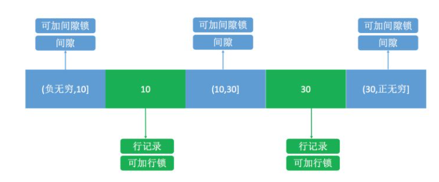
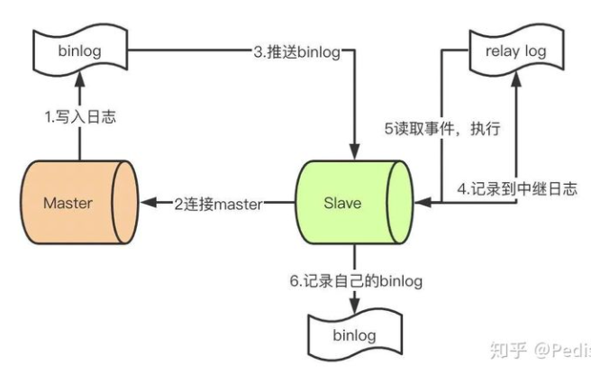

[TOC]

### 1 SQL索引

​		MySQL索引使⽤的数据结构主要有**BTree索引** 和 **哈希索引** 。对于哈希索引来说，底层的数据结构就是哈希表，因此在绝⼤多数需求为单条记录查询的时候，可以选择哈希索引，查询性能最快；其余⼤部分场景，建议选择BTree索引。MySQL的BTree索引使⽤的是B树中的B+Tree，但对于主要的两种存储引擎的实现⽅式是不同的。

​		**B+树**是左小右大的顺序存储结构，节点只包含id索引列，而叶子节点包含索引列和数据，这种数据和索引在一起存储的索引方式叫做聚簇索引，一张表只能有一个聚簇索引。假设没有定义主键，InnoDB会选择一个唯一的非空索引代替，如果没有的话则会隐式定义一个主键作为聚簇索引。

* **MyISAM**：B+Tree叶节点的data域存放的是数据记录的地址。在索引检索的时候，⾸先按照 B+Tree搜索算法搜索索引，如果指定的Key存在，则取出其 data 域的值，然后以 data 域的值为地址读取相应的数据记录。这被称为“**⾮聚簇索引**”。
* **InnoDB**：**其数据⽂件本身就是索引⽂件**。相⽐MyISAM，索引⽂件和数据⽂件是分离的，其表数据⽂件本身就是按B+Tree组织的⼀个索引结构，树的叶节点data域保存了完整的数据记录。这个索引的key是数据表的主键，因此InnoDB表数据⽂件本身就是主索引。这被称为“**聚簇索引**”。⽽其余的索引都作为辅助索引，**辅助索引的data域存储相应记录主键的值⽽不是地址**，这也是和MyISAM不同的地⽅。
	* 在根据主索引搜索时，直接找到key所在的节点即可取出数据；
	* 在根据辅助索引查找时，则需要先取出主键的值，再⾛⼀遍主索引。
* **为什么用B+树不用Hash**
	* **hash索引底层就是hash表**,进行查找时,调用一次hash函数就可以获取到相应的键值,之后进行回表查询获得实际数据.
	* **B+树底层实现是多路平衡查找树.**对于每一次的查询都是从根节点出发,查找到叶子节点方可以获得所查键值,然后根据查询判断是否需要回表查询数据.
* 数据库使用B+树而不是B树：B树在提高了IO性能的同时并没有解决元素遍历的我效率低下的问题，正是为了解决这个问题，B+树应用而生。**B+树只需要去遍历叶子节点就可以实现整棵树的遍历。**而且在数据库中基于范围的查询是非常频繁的，而B树不支持这样的操作或者说效率太低。
* **不同:**
	- hash索引进行等值查询更快(一般情况下),但是却无法进行范围查询.因为在hash索引中经过hash函数建立索引之后,索引的顺序与原顺序无法保持一致,不能支持范围查询.而B+树的的所有节点皆遵循(左节点小于父节点,右节点大于父节点,多叉树也类似),天然支持范围.
	
	- hash索引不支持使用索引进行排序,原理同上.
		- hash索引不支持模糊查询以及多列索引的最左前缀匹配.原理也是因为hash函数的不可预测.**AAAA**和**AAAAB**的索引没有相关性.
		- hash索引任何时候都避免不了回表查询数据,而B+树在符合某些条件(聚簇索引,覆盖索引等)的时候可以只通过索引完成查询.
		- hash索引虽然在等值查询上较快,但是不稳定.性能不可预测,当某个键值存在大量重复的时候,发生hash碰撞,此时效率可能极差.而B+树的查询效率比较稳定,对于所有的查询都是从根节点到叶子节点,且树的高度较低.

**创建索引**

1. `alter table`(ALTER TABLE用来创建普通索引、UNIQUE索引或PRIMARY KEY索引)

	```sql
	ALTER TABLE table_name ADD INDEX index_name (column_list)
	ALTER TABLE table_name ADD UNIQUE (column_list)
	ALTER TABLE table_name ADD PRIMARY KEY (column_list)
	```

2. `create index`（对表增加普通索引或UNIQUE索引）

	```sql
	CREATE INDEX index_name ON table_name (column_list)
	CREATE UNIQUE INDEX index_name ON table_name (column_list)
	```

**删除索引**

可利用ALTER TABLE或DROP INDEX语句来删除索引。类似于CREATE INDEX语句，DROP INDEX可以在ALTER TABLE内部作为一条语句处理，语法如下。

```sql
DROP INDEX index_name ON talbe_name
ALTER TABLE table_name DROP INDEX index_name
ALTER TABLE table_name DROP PRIMARY KEY
```


### 2 为什么说B+树比B树更适合数据库索引

1、 B+树的磁盘**读写代价**更低：B+树的内部节点并没有指向关键字具体信息的指针，因此其内部节点相对B树更小，如果把所有同一内部节点的关键字存放在同一盘块中，那么盘块所能容纳的关键字数量也越多，一次性读入内存的需要查找的关键字也就越多，相对IO读写次数就降低了。

2、B+树的**查询效率**更加稳定：由于非终结点并不是最终指向文件内容的结点，而只是叶子结点中关键字的索引。所以任何关键字的查找必须走一条从根结点到叶子结点的路。所有关键字查询的路径长度相同，导致每一个数据的查询效率相当。

3、由于B+树的**数据都存储在叶子结点**中，分支结点均为索引，方便扫库，只需要扫一遍叶子结点即可，但是B树因为其分支结点同样存储着数据，我们要找到具体的数据，需要进行一次中序遍历按序来扫，所以B+树更加适合在区间查询的情况，所以通常B+树用于数据库索引。


### 3 InnoDB和MyISAM的区别

1. **InnoDB 支持事务，MyISAM 不支持事务**。这是 MySQL 将默认存储引擎从 MyISAM 变成 InnoDB 的重要原因之一；

2. **InnoDB 支持外键，而 MyISAM 不支持**。对一个包含外键的 InnoDB 表转为 MYISAM 会失败；  

3. **InnoDB 是聚集索引，MyISAM 是非聚集索引**。聚簇索引的文件存放在主键索引的叶子节点上，因此 InnoDB 必须要有主键，通过主键索引效率很高。但是辅助索引需要两次查询，先查询到主键，然后再通过主键查询到数据。因此，主键不应该过大，因为主键太大，其他索引也都会很大。而 MyISAM 是非聚集索引，数据文件是分离的，索引保存的是数据文件的指针。主键索引和辅助索引是独立的。 

4. InnoDB 不保存表的具体行数，执行 select count(*) from table 时需要全表扫描。而MyISAM 用一个变量保存了整个表的行数，执行上述语句时只需要读出该变量即可，速度很快；    

5. **InnoDB 最小的锁粒度是行锁，MyISAM 最小的锁粒度是表锁。**一个更新语句会锁住整张表，导致其他查询和更新都会被阻塞，因此并发访问受限。这也是 MySQL 将默认存储引擎从 MyISAM 变成 InnoDB 的重要原因之一；

**如何选择：**

1. 是否要支持事务，如果要请选择 InnoDB，如果不需要可以考虑 MyISAM；

2. 如果表中绝大多数都只是读查询，可以考虑 MyISAM，如果既有读写也挺频繁，请使用InnoDB。

3. 系统奔溃后，MyISAM恢复起来更困难，能否接受，不能接受就选 InnoDB；

4. MySQL5.5版本开始Innodb已经成为Mysql的默认引擎(之前是MyISAM)，说明其优势是有目共睹的。如果你不知道用什么存储引擎，那就用InnoDB，至少不会差。


### 4 聚集索引与非聚集索引

**聚集索引**

> 定义：数据行的物理顺序与列值（一般是主键的那一列）的逻辑顺序相同，一个表中只能拥有一个聚集索引。

​		一个表就像是我们以前用的**新华字典**，聚集索引就像是**拼音目录**，而每个字存放的页码就是我们的**数据物理地址**，我们如果要查询一个“哇”字，我们只需要查询“哇”字对应在新华字典拼音目录对应的页码，就可以查询到对应的“哇”字所在的位置，而**拼音目录对应的A-Z的字顺序，和新华字典实际存储的字的顺序A-Z也是一样的**，如果我们中文新出了一个字，拼音开头第一个是B，那么他插入的时候也要按照拼音目录顺序插入到A字的后面。


​		第一列的地址表示该行数据在磁盘中的物理地址，后面三列才是我们SQL里面用的表里的列，其中id是主键，建立了聚集索引。

​		结合上面的表格就可以理解这句话了：数据行的物理顺序与列值的**顺序相同**，如果我们查询id比较靠后的数据，那么这行数据的地址在磁盘中的物理地址也会比较靠后。而且由于物理排列方式与聚集索引的顺序相同，所以也就只能建立一个聚集索引了。

**非聚集索引**

> 定义：该索引中索引的逻辑顺序与磁盘上行的物理存储顺序不同，一个表中可以拥有多个非聚集索引。

​		按照定义，**除了聚集索引以外的索引都是非聚集索引**，只是人们想细分一下非聚集索引，分成**普通索引，唯一索引，全文索引**。如果非要把非聚集索引类比成现实生活中的东西，那么非聚集索引就像新华字典的偏旁字典，他结构顺序与实际存放顺序不一定一致。

- 非聚集索引的二次查询问题

	​		非聚集索引叶节点仍然是索引节点，只是有一个指针指向对应的数据块，此如果使用非聚集索引查询，而查询列中包含了其他该索引没有覆盖的列，那么他还要进行第二次的查询，查询节点上对应的数据行的数据。

	```
	 select username, score from t1 where username = '小明'
	```

	解决方案：建立两列以上的索引，即可查询复合索引里的列的数据而不需要进行回表二次查询

**结论**

1. 使用聚集索引的查询效率要比非聚集索引的效率要高，但是如果需要频繁去改变聚集索引的值，写入性能并不高，因为需要移动对应数据的物理位置。
2. 非聚集索引在查询的时候可以的话就避免二次查询，这样性能会大幅提升。
3. 不是所有的表都适合建立索引，只有数据量大表才适合建立索引，且建立在选择性高的列上面性能会更好。


### 5 一条SQL语句如何执行

**客户端发出一条select指令**：

1. 连接器（身份认证和权限相关）
2. 查询缓存：执行前先查询缓存（8.0后舍弃）
	1. 查询缓存主要用来缓存我们所执行的 SELECT 语句以及该语句的结果集。连接建立后，执行查询语句的时候，会先查询缓存，MySQL 会先校验这个 sql 是否执行过，以 **Key-Value** 的形式缓存在内存中，Key 是查询预计，Value 是结果集。如果缓存 key 被命中，就会直接返回给客户端，如果没有命中，就会执行后续的操作，完成后也会把结果缓存起来，方便下一次调用。
	2. **MySQL 查询不建议使用缓存**，因为查询缓存失效在实际业务场景中可能会非常频繁，假如你对一个表更新的话，这个表上的所有的查询缓存都会被清空。对于不经常更新的数据来说，使用缓存还是可以的。
3. 分析器：没有查到缓存，SQL语句经过分析器，检查语法是否正确
	1. **第一步，词法分析**，一条 SQL 语句有多个字符串组成，首先要提取关键字
	2. **第二步，语法分析**，主要就是判断你输入的 sql 是否正确
4. 优化器：知悉MySQL认为最优的方案
5. 执行器：执行语句，从存储引擎返回数据


**客户端发出一条update语句**

​       基本上会沿着上一个查询的流程走，只不过执行更新的时候肯定要记录日志，这就会引入日志模块了，MySQL 自带的日志模块式 **binlog（归档日志）** ，所有的存储引擎都可以使用，我们常用的 InnoDB 引擎还自带了一个日志模块 **redo log（重做日志）**，我们就以 InnoDB 模式下来探讨这个语句的执行流程。

流程如下：

* 先查询到张三这一条数据，如果有缓存，也是会用到缓存。
* 然后拿到查询的语句，把 age 改为 19，然后调用引擎 API 接口，写入这一行数据，InnoDB 引擎把数据保存在内存中，同时记录 redo log，此时 redo log 进入 prepare 状态，然后告诉执行器，执行完成了，随时可以提交。
* 执行器收到通知后记录 binlog，然后调用引擎接口，提交 redo log 为提交状态。
* 更新完成。


### 6 为什么要用两个日志模块，用一个日志模块不行吗?

> redo log 是 存储引擎层(innodb)生成的日志，主要为了保证数据的可靠性；
>
> bin log 是 MySQL 数据库层面上生成的日志，主要用于 point in time 恢复和主从复制。它记录了所有的DDL和DML(除了数据查询语句)语句
>
> undo log 主要用于事务的回滚(undo log 记录的是每个修改操作的逆操作) 和 一致性非锁定读(undo log 回滚行记录到某种特定的版本---MVCC 多版本并发控制)

​		因为最开始 MySQL 并没与 InnoDB 引擎( InnoDB 引擎是其他公司以插件形式插入 MySQL 的) ，MySQL 自带的引擎是 MyISAM，但是 redo log 是 InnoDB 引擎特有的，其他存储引擎都没有，这就导致会没有 crash-safe 的能力(crash-safe 的能力即使数据库发生异常重启，之前提交的记录都不会丢失)，binlog 日志只能用来归档。

​		并不是说只用一个日志模块不可以，只是 InnoDB 引擎就是通过 redo log 来支持事务的。

* **先写 redo log 直接提交，然后写 binlog**，假设写完 redo log 后，机器挂了，binlog 日志没有被写入，那么机器重启后，这台机器会通过 redo log 恢复数据，但是这个时候 bingog 并没有记录该数据，后续进行机器备份的时候，就会丢失这一条数据，同时主从同步也会丢失这一条数据。
* **先写 binlog，然后写 redo log**，假设写完了 binlog，机器异常重启了，由于没有 redo log，本机是无法恢复这一条记录的，但是 binlog 又有记录，那么和上面同样的道理，就会产生数据不一致的情况。

​        如果采用 **redo log 两阶段提交**的方式就不一样了，先预提交redo log，写完 binglog 后，然后再提交 redo log 就会防止出现上述的问题，从而保证了数据的一致性。那么问题来了，有没有一个极端的情况呢？假设 redo log 处于预提交状态，binglog 也已经写完了，这个时候发生了异常重启会怎么样呢？ 这个就要依赖于 MySQL 的处理机制了，MySQL 的处理过程如下：

* 判断 redo log 是否完整，如果判断是完整的，就立即提交。
* 如果 redo log 只是预提交但不是 commit 状态，这个时候就会去判断 binlog 是否完整，如果完整就提交 redo log, 不完整就回滚事务。

这样就解决了**数据一致性**的问题。


### 7 事务四个属性

* A **原子性**：由undo log日志保证，它记录了需要回滚的日志信息，事务回滚时撤销已经执行成功的sql
	* `undo log`主要有两个作用：回滚和多版本控制(MVCC)在数据修改的时候，不仅记录了`redo log`，还记录`undo log`，如果因为某些原因导致事务失败或回滚了，可以用`undo log`进行回滚
* C **一致性**：redo log + bin log
* I **隔离性**：由锁 + MVCC来保证
* D **持久性**：由内存 + redo log来保证，mysql修改数据同时在内存和redo log记录这次操作，事务提交的时候通过redo log刷盘，宕机的时候可以从redo log恢复


### 8 事务的隔离级别

* **脏读**：脏读指的是读到了其他事务未提交的数据，未提交意味着这些数据可能会回滚，也就是可能最终不会存到数据库中，也就是不存在的数据。读到了并不一定最终存在的数据，这就是脏读。
* **可重复读**：可重复读指的是在一个事务内，最开始读到的数据和事务结束前的任意时刻读到的同一批数据都是一致的。通常针对数据**更新（UPDATE）**操作。
* **不可重复读**：对比可重复读，不可重复读指的是在同一事务内，不同的时刻读到的同一批数据可能是不一样的，可能会受到其他事务的影响，比如其他事务改了这批数据并提交了。通常针对数据**更新（UPDATE）**操作。
* **幻读**：幻读是针对数据**插入（INSERT）**操作来说的。假设事务A对某些行的内容作了更改，但是还未提交，此时事务B插入了与事务A更改前的记录相同的记录行，并且在事务A提交之前先提交了，而这时，在事务A中查询，会发现好像刚刚的更改对于某些数据未起作用，但其实是事务B刚插入进来的，让用户感觉很魔幻，感觉出现了幻觉，这就叫幻读。

SQL 标准定义了**四种隔离级别**，MySQL 全都支持。这四种隔离级别分别是：

1. 读未提交（`READ UNCOMMITTED`）
2. 读提交 （`READ COMMITTED`）
3. 可重复读 （`REPEATABLE READ`）**默认**
4. 串行化 （`SERIALIZABLE`）

​       从上往下，隔离强度逐渐增强，性能逐渐变差。采用哪种隔离级别要根据系统需求权衡决定，其中，**可重复读**是 MySQL 的默认级别。事务隔离其实就是为了解决上面提到的脏读、不可重复读、幻读这几个问题，下面展示了 4 种隔离级别对这三个问题的解决程度。


**MySQL 中执行事务**

​        事务的执行过程如下，以 begin 或者 start transaction 开始，然后执行一系列操作，最后要执行 commit 操作，事务才算结束。当然，如果进行回滚操作(rollback)，事务也会结束。

**读未提交**

```sql
set global transaction isolation level read uncommitted;	-- 设置全局隔离级别为”读未提交“
```

​       MySQL 事务隔离其实是依靠锁来实现的，加锁自然会带来性能的损失。而读未提交隔离级别是不加锁的，所以它的性能是最好的，没有加锁、解锁带来的性能开销。但有利就有弊，这基本上就相当于裸奔。。。所以它连脏读的问题都没办法解决。


**读提交**

```sql
set global transaction isolation level read committed;		-- 设置全局隔离级别为”读提交“
```

​       既然读未提交没办法解决脏数据问题，那么就有了读提交。读提交就是一个事务只能读到其他事务已经提交过的数据，也就是其他事务调用 commit 命令之后的数据。那脏数据问题迎刃而解了。

​		一个问题，在同一事务中(本例中的事务B)，事务的不同时刻同样的查询条件，查询出来的记录内容是不一样的，事务A的提交影响了事务B的查询结果，这就是**不可重复读**，也就是读提交隔离级别。


**可重复读**

```sql
set global transaction isolation level repeatable read;
```

​		可重复是对比不可重复而言的，上面说不可重复读是指同一事物不同时刻读到的数据值可能不一致。而可重复读是指，事务不会读到其他事务对已有数据的修改，即使其他事务已提交，也就是说，事务开始时读到的已有数据是什么，在事务提交前的任意时刻，这些数据的值都是一样的。但是，对于其他事务新插入的数据是可以读到的，这也就引发了幻读问题。


**串行化**

​		串行化是4种事务隔离级别中隔离效果最好的，解决了脏读、可重复读、幻读的问题，但是效果最差，它将事务的执行变为顺序执行，与其他三个隔离级别相比，它就相当于单线程，后一个事务的执行必须等待前一个事务结束。

​		串行化。读的时候加**共享锁**，也就是其他事务可以并发读，但是不能写。写的时候加**排它锁**，其他事务不能并发写也不能并发读。


### 9 MySQL实现可重复读

为了实现可重复读，MySQL采用了**多版本并发控制（MVVC）**的方式

* 在数据库表中看到的一行记录可能实际上有多个版本，每个版本的记录除了有数据本身外，还要有一个表示版本的字段，记为 row trx_id，而这个字段就是使其产生的事务的 id，事务 ID 记为 transaction id，它在事务开始的时候向事务系统申请，按时间先后顺序递增。
	

* **快照**：这也是可重复读和读提交的关键，可重复读是在事务开始的时候生成一个当前事务全局性的快照，而读提交则是每次执行语句的时候都重新生成一次快照。

	对于一个快照来说，它能够读到那些版本数据，要遵循以下规则：

	1. 当前事务内的更新，可以读到；
	2. 版本未提交，不能读到；
	3. 版本已提交，但是却在快照创建后提交的，不能读到；
	4. 版本已提交，且是在快照创建前提交的，可以读到；

	​        利用上面的规则，再返回去套用到读提交和可重复读的那两张图上就很清晰了。**还是要强调，两者主要的区别就是在快照的创建上，可重复读仅在事务开始是创建一次，而读提交每次执行语句的时候都要重新创建一次。**

* **并发写问题**：事务A执行 update 操作， update 的时候要对所修改的行加**行锁**，这个行锁会在提交之后才释放。而在事务A提交之前，事务B也想 update 这行数据，于是申请行锁，但是由于已经被事务A占有，事务B是申请不到的，此时，事务B就会一直处于等待状态，直到事务A提交，事务B才能继续执行，如果事务A的时间太长，那么事务B很有可能出现超时异常。

	* 有索引：有索引的情况，那么 MySQL 直接就在索引数中找到了这行数据，然后干净利落的加上行锁就可以了。
	* 无索引：MySQL 会为这张表中所有行加行锁。但是呢，在加上行锁后，MySQL 会进行一遍过滤，发现不满足的行就释放锁，最终只留下符合条件的行。虽然最终只为符合条件的行加了锁，但是这一锁一释放的过程对性能也是影响极大的。

* **幻读问题**：解决幻读用的也是锁，叫做**间隙锁**，MySQL 把行锁和间隙锁合并在一起，解决了并发写和幻读的问题，这个锁叫做 `Next-Key`锁。

	* 假设现在表中有两条记录，并且 age 字段已经添加了索引，两条记录 age 的值分别为 10 和 30。此时，在数据库中会为索引维护一套B+树，用来快速定位行记录。B+索引树是有序的，所以会把这张表的索引分割成几个区间。

	* 

	* 如图所示，分成了3 个区间，(负无穷,10]、(10,30]、(30,正无穷]，在这3个区间是可以加间隙锁的。

		之后，用下面的两个事务演示一下加锁过程。

	* 

	* **在事务A提交之前，事务B的插入操作只能等待，这就是间隙锁起得作用**。当事务A执行`update user set name='风筝2号’ where age = 10;` 的时候，由于条件 where age = 10 ，数据库不仅在 age =10 的行上添加了行锁，而且在这条记录的两边，也就是(负无穷,10]、(10,30]这两个区间加了间隙锁，从而导致事务B插入操作无法完成，只能等待事务A提交。不仅插入 age = 10 的记录需要等待事务A提交，age<10、10<age<30 的记录页无法完成，而大于等于30的记录则不受影响，这足以解决幻读问题了。


### 10 唯一索引和主键索引的区别

* 主键创建后一定包含一个唯一索引，唯一索引并不一定就是主键。
* 主键列不允许为空值，而唯一索引列允许空值。
* 主键列在创建时，已经默认为非空值 + 唯一索引了。
* 主键可以被其他表引用为外键，而唯一索引不能。
* 一个表最多只能创建一个主键，但可以创建多个唯一索引。


### 11 MySQL分页查询优化

1. 子查询：这种方式先定位偏移位置的 id，然后往后查询，这种方式适用于 id 递增的情况
2. 使用ID限定：这种方式假设数据表的id是**连续递增**的，则我们根据查询的页数和查询的记录数可以算出查询的id的范围，可以使用 id between and 来查询
3. 使用临时表优化：对于使用 id 限定优化中的问题，需要 id 是连续递增的，但是在一些场景下，比如使用历史表的时候，或者出现过数据缺失问题时，可以考虑使用临时存储的表来记录分页的id，使用分页的id来进行 in 查询。这样能够极大的提高传统的分页查询速度，尤其是数据量上千万的时候。


### 12 大表优化

https://segmentfault.com/a/1190000006158186

* 限定数据的范围：务必禁⽌不带任何限制数据范围条件的查询语句
* 读写分离：经典的数据库拆分⽅案，主库负责写，从库负责读；
* 垂直分区：根据数据库⾥⾯数据表的相关性进⾏拆分。简单来说垂直拆分是指数据表列的拆分，把⼀张列⽐较多的表拆分为多张表。
	
	* **缺点**： 主键会出现冗余，需要管理冗余列，并会引起Join操作，可以通过在应⽤层进⾏Join来解决。此外，垂直分区会让事务变得更加复杂
* 水平分区：保持数据表结构不变，通过某种策略存储数据分⽚。这样每⼀⽚数据分散到不同的表或者库中， 达到了分布式的⽬的。 ⽔平拆分可以⽀撑⾮常⼤的数据量。
	* **缺点**：分表仅仅是解决了单⼀表数据过⼤的问 题，但由于表的数据还是在同⼀台机器上，其实对于提升MySQL并发能⼒没有什么意义，所以⽔平拆分最好分库 。
	* 数据库分片的两种方案：
		* 客户端代理：分⽚逻辑在应⽤端，封装在jar包中，通过修改或者封装JDBC层来实现。
		* 中间件代理：在应⽤和数据中间加了⼀个代理层。分⽚逻辑统⼀维护在中间件服务中。
* **分表后的ID怎么保证唯一性**：
1. 设定步长，比如1-1024张表我们分别设定1-1024的基础步长，这样主键落到不同的表就不会冲突了。分布式ID，自己实现一套分布式ID生成算法或者使用开源的比如雪花算法这种
3. 分表后不使用主键作为查询依据，而是每张表单独新增一个字段作为唯一主键使用，比如订单表订单号是唯一的，不管最终落在哪张表都基于订单号作为查询依据，更新也一样。


### 13 数据库设计三大范式

**第一范式：确保每列保持原子性**

​		第一范式是最基本的范式。如果数据库表中的所有字段值都是不可分解的原子值，就说明该数据库表满足了第一范式。

**第二范式：确保表中的每列都和主键相关**

​		第二范式在第一范式的基础之上更进一层。第二范式需要确保数据库表中的每一列都和主键相关，而不能只与主键的某一部分相关（主要针对联合主键而言）。也就是说在一个数据库表中，一个表中只能保存一种数据，不可以把多种数据保存在同一张数据库表中。

**第三范式：确保每列都和主键列直接相关，而不是间接相关**


### 14 锁机制与InnoDB锁算法

**MyISAM和InnoDB存储引擎使⽤的锁**：

* MyISAM采⽤表级锁

* InnoDB⽀持⾏级锁(row-level locking)和表级锁,默认为⾏级锁

* mysql锁分为**共享锁**和**排他锁**，也叫做读锁和写锁。

	读锁是共享的，可以通过lock in share mode实现，这时候只能读不能写。

	写锁是排他的，它会阻塞其他的写锁和读锁。从颗粒度来区分，可以分为**表锁**和**行锁**两种。

**表级锁和行级锁对比**：

* 表级锁： MySQL中锁中粒度最⼤的⼀种锁，对当前操作的整张表加锁，实现简单，资源消 耗也⽐较少，加锁快，不会出现死锁。其锁定粒度最⼤，触发锁冲突的概率最⾼，并发度最低，MyISAM和 InnoDB引擎都⽀持表级锁。
* ⾏级锁： MySQL中锁定 粒度最⼩ 的⼀种锁，只针对当前操作的⾏进⾏加锁。 ⾏级锁能⼤⼤减少数据库操作的冲突。其加锁粒度最⼩，并发度⾼，但加锁的开销也最⼤，加锁慢，会出现死锁。

**InnoDB存储引擎的锁的算法有三种**

* Record lock：单个⾏记录上的锁
* Gap lock：间隙锁，锁定⼀个范围，不包括记录本身
* Next-key lock：record+gap 锁定⼀个范围，包含记录本身


### 15 MySQL主从同步

1. master提交完事务后，写入binlog
2. slave连接到master，获取binlog
3. master创建dump线程，推送binglog到slave
4. slave启动一个IO线程读取同步过来的master的binlog，记录到relay log中继日志中
5. slave再开启一个sql线程读取relay log事件并在slave执行，完成同步
6. slave记录自己的binglog




### 16 主键使用自增ID还是UUID?

​		在InnoDB存储引擎中,主键索引是作为聚簇索引存在的,也就是说,主键索引的B+树叶子节点上存储了主键索引以及全部的数据(按照顺序),如果主键索引是自增ID,那么只需要不断向后排列即可,如果是UUID,由于到来的ID与原来的大小不确定,会造成非常多的数据插入,数据移动,然后导致产生很多的内存碎片,进而造成插入性能的下降.

**⽣成全局 id ⽅式**

* UUID
* 数据库自增ID
* 利用Redis生成ID
* snowflake算法
	 
	* 41-bit的时间可以表示（1L<<41）/(1000L*3600*24*365)=69年的时间，10-bit机器可以分别表示1024台机器。如果我们对IDC划分有需求，还可以将10-bit分5-bit给IDC，分5-bit给工作机器。这样就可以表示32个IDC，每个IDC下可以有32台机器，可以根据自身需求定义。12个自增序列号可以表示2^12个ID，理论上snowflake方案的QPS约为409.6w/s，这种分配方式可以保证在任何一个IDC的任何一台机器在任意毫秒内生成的ID都是不同的。
* [Leaf——美团点评分布式ID生成系统](https://tech.meituan.com/2017/04/21/mt-leaf.html)
	* Leaf-Segment：利用proxy server批量获取，每次获取一个segment(step决定大小)号段的值。用完之后再去数据库获取新的号段，可以大大的减轻数据库的压力。 - 各个业务不同的发号需求用biz_tag字段来区分，每个biz-tag的ID获取相互隔离，互不影响。如果以后有性能需求需要对数据库扩容，不需要上述描述的复杂的扩容操作，只需要对biz_tag分库分表就行。
	* Leaf-Snowflake：Leaf-snowflake方案完全沿用snowflake方案的bit位设计，即是“1+41+10+12”的方式组装ID号。对于workerID的分配，当服务集群数量较小的情况下，完全可以手动配置。Leaf服务规模较大，动手配置成本太高。所以使用Zookeeper持久顺序节点的特性自动对snowflake节点配置wokerID。Leaf-snowflake是按照下面几个步骤启动的：
		1. 启动Leaf-snowflake服务，连接Zookeeper，在leaf_forever父节点下检查自己是否已经注册过（是否有该顺序子节点）。
		2. 如果有注册过直接取回自己的workerID（zk顺序节点生成的int类型ID号），启动服务。
		3. 如果没有注册过，就在该父节点下面创建一个持久顺序节点，创建成功后取回顺序号当做自己的workerID号，启动服务。


### 17 关系型数据库和非关系型数据库区别

**数据存储方式不同**

* 关系型和非关系型数据库的主要差异是数据存储的方式。关系型数据天然就是表格式的，因此存储在数据表的行和列中。数据表可以彼此关联协作存储，也很容易提取数据。
* 与其相反，非关系型数据不适合存储在数据表的行和列中，而是大块组合在一起。非关系型数据通常存储在数据集中，就像文档、键值对或者图结构。你的数据及其特性是选择数据存储和提取方式的首要影响因素。

**扩展方式不同**

* SQL和NoSQL数据库最大的差别可能是在扩展方式上，要支持日益增长的需求当然要扩展。要支持更多并发量，SQL数据库是纵向扩展，也就是说提高处理能力，使用速度更快速的计算机，这样处理相同的数据集就更快了。因为数据存储在关系表中，操作的性能瓶颈可能涉及很多个表，这都需要通过提高计算机性能来客服。虽然SQL数据库有很大扩展空间，但最终肯定会达到纵向扩展的上限。而NoSQL数据库是横向扩展的。
* 非关系型数据存储天然就是分布式的，NoSQL数据库的扩展可以通过给资源池添加更多普通的数据库服务器(节点)来分担负载。

**对事务性的支持不同**

* 如果数据操作需要高事务性或者复杂数据查询需要控制执行计划，那么传统的SQL数据库从性能和稳定性方面考虑是你的最佳选择。SQL数据库支持对事务原子性细粒度控制，并且易于回滚事务。


### 18 索引的使用规则

> select*from table where a=1 and b=2 and c=3，你知道不知道，你要怎么建立索引，才可以确保这个SQL使用索引来查询
>
> 如果要对一个商品表按照店铺、商品、创建时间三个维度来查询，那么就可以创建一个联合索引：shopid、product_id、gmt_create

`create index(shop_id, product_id, gmt_create)`

**（1）全列匹配**

这个就是说，你的一个sql里，正好where条件里就用了这3个字段，那么就一定可以用到

```sql
select*from product where shop_id=1 and product_id=1 and gmt_create=‘2018-01-01 10：00：0’
```

**（2）最左前缀匹配**

​		这个就是说，如果你的sql里，正好就用到了联合索引最左边的一个或者几个列表，那么也可以用上这个索引，在索引里查找的时候就用最左边的几个列就行了：

`select*from product where shop_id=1 and product_id=1`，这个是没问题的，可以用上这个索引的

**（3）最左前缀匹配了，但是中间某个值没匹配**

​		这个是说，如果你的SQL里，就用了联合素引的第一个列和第三个列，那么会按照第一个列值在索引里找，找完以后对结果集扫描一遍根据第三个列来过滤，第三个列是不走索引去搜索的，就是有一个额外的过滤的工作，但是还能用到索引，所以也还好。

`select*from product where shop_id=1 and gmt_create='2018-01-01 10:00:00'`

​		就是先根据shop_id=1在索引里找，到比如100行记录，然后对这100行记录再次扫描一遍，过滤出来gmt_create=‘2018-01-0110：00：00’的行

​		这个我们在线上系统经常遇到这种情况，就是根据联合索引的前一两个列按索引查，然后后面跟一堆复杂的条件，还有函数啥的,但是只要对索引查找结果过滤就好了，根据线上实践，单表几百万数据量的时候，性能也还不错的，简单SQL也就几ms，复杂SQL也就几百ms。可以接受的。

**（4）没有最左前缀匹配**

那就不行了，那就在搞笑了，一定不会用索引，所以这个错误千万别犯

`select*from product where product_id=1`，这个肯定不行

**（5）前缀匹配**

这个就是说，如果你不是等值的，比如=，>=，<=的操作，是like操作，那么必须要是likexx%'

这种才可以用上索引，比如说

`select*from product where shop_id=1 and product_id=1 and gmt_create like‘2018%'`

**（6）范围列匹配**

如果你是范围查询，比如=，<=，between操作，你只能是符合最左前缀的规则才可以范围，范围之后的列就不用索引了

`select*from product where shop_id>=1 and product_id=1`

这里就在联合索引中根据shop-id来查询了

**（7）包含函数**

如果你对某个列用了函数，比如substring之类的东西，那么那一列不用索引

`select*from product where shop_id=1 and 函数（product_id）=2`

上面就根据 shop_id在联合索引中查询


### 19 索引的缺点

1. 索引是有缺点的，比如常见的就是会**增加磁盘消耗**，因为要占用磁盘文件，同时高并发的时候频繁插入和修改索引，会导致性能损耗的。我们给的建议，尽量创建少的索引，比如说一个表一两个索引，两三个索引，高并发场景下还可以。十来个，20个索引，绝对不行。
2. 假如，你有个id字段，每个id都不太一样，建立个素引，这个时候其实用索引效果就很好，你比如为了定位到某个id的行，其实通过索引二分查找，可以大大减少要扫描的数据量，性能是非常好的。所以，在创建索引的时候，要注意一个选择性的问题，`select count（discount（col））/count（*）`，就可以看看选择性，就是这个列的唯一值在总行数的占比，如果过低，就代表这个字段的值其实都差不多，或者很多行的这个值都类似的，那创建索引几乎没什么意义，你搜一个值定位到一大坨行，还得重新扫描。**要一个字段的值几乎都不太一样，此时用索引的效果才是最好的**
3. 还有一种特殊的索引叫做前缀索引，就是说，某个字段是字符串，很长，如果你要建立素引，最好就对这个字符串的前缀来创建，比如前10个字符这样子，要用前多少位的字符串创建前缀索引，就对不同长度的前缀看看选择性就好了，一般前缀长度越长选择性的值越高。


### 20 高并发场景下的数据库连接池如何优化

**以Druid为例**

1. `maxWait`：表示从池里获取连接的等待时间，万一暂时没有可用的连接，就可能要等待别的连接用完释放，你再去使用
	1. 通常建议设置在1000以上，就是等待1s以上，比如你可以设置1200，因为有的时候要等待建立新的TCP连接，最多在1s内，那你就得等一会儿。如
	2. 果这个参数默认设置为0，意思就是无限的等待获取连接，在高并发场景下，可能瞬间连接池耗尽，大量的请求都卡死在这里等待获取连接，进而导致你 tomcat里没有可用的线程，服务就是一个假死的样子。
	3. 还会拖累调用你的其他服务，其他服务都卡死在调用你的请求上，可能会导致整体系统大量服务的雪崩。
	4. 设置一个靠谱点的参数，那么起码大量线程获取不到连接，1s左右快速就失败了，这个时候还不至于说拖死整个服务，也不至于说拖死其他调用你的服务，还不至于会发生服务雪崩的问题
2. `connectionProperties`：里面可以放 `connectionTimeout` 和`socketTimeout`，分别代表建立TCP连接的超时时间，以及发送请求后等待响应的超时时间，推荐 `connectionTimeout`设置为1200，`socketTimeout`设置为3000
	1. 之所以必须设置他们俩，是因为高并发场景下，万一遇到网络问题，可能会导致你跟数据库的Socket连接异常无法通信，此时你Socket可能一直卡死等待某个请求的响应，然后其他请求无法获取连接，只能是重启系统重新建立连接才行
	2. 设置一下超时时间，可以让网络异常之后，连接自动超时断开重连
3. `maxActive`：最大连接池数量，一般建议是设置个20就够了
	1. 如果确实有高并发场景，可以适当增加到3~5倍，但是不要太多，其实一般这个数字在几十到100就很大了，因为这仅仅是你一个服务连接数据库的数量，你数据库整体能承受的连接数量是有限的
	2. 而且连接越多不是越好，数据库连接太多了，会导致cpu负载很高，可能反而会导致性能降低的，所以这个参数你一般设置个0，最多加到个几十，其实就差不多了
	3. 更多的，你反而应该是优化你每个请求的性能，别让一个请求占用连接太长的时间


### 21 压测时不达标

> 如果发现TPS不达标，通常是说明你系统肯定是每个请求处理时间太长了，所以就导致你单位时间内，在有限的线程数量下，能处理的TPS就少了，这个时候往往要先优化性能，再提TPS

1. 既然说要优化性能，那就得通过打日志的方式，或者是监控的方式，检查你服务的每个环节的性能开销，通常来说用打日志方式会细化一些，要靠监控把每个细节摸清楚，也挺难的，毕竟很多是代码细节
2. 把你的系统里一个请求过来，每一次数据库、缓存、ES之类的操作的耗时都记录在日志里面，把你的每个请求执行链路里的每个耗时小环节，都给记录清楚他，比如说你一个请求过来一共500ms，此时你发现就是某个SQL语句一下子耗时了300多ms，其实其他的操作费都在正常范围内
	1. 优化一下SQL 语句呢？这个SQL语句搞了一个全表扫描，因为写SQL的时候没有考虑到使用索引，所以此时可以建立新的索引，或者是改写SQL语句，让他可以使用到你建立好的索引，SQL 语句优化到100ms。每个请求只要300ms就可以了，每个线程每秒可以处理3个请求，200个线程每秒可以处理600个请求
3. 可以检查你核心服务的每个环节的性能，针对性的做优化，把你每个请求的时间降到最低，这样你单位时间内的TPS绝对就提高了，这个很关键
4. 其次就是增加机器数量，线性扩容了，比如说服务层面，每个服务单机最多抗800请求，那扩容到部署10台机器，就可以抗8000请求，但是你又得考虑你依赖的数据库，MQ，Redis能不能抗下这么多的并发


### 22 MySQL索引失效

> 1. 条件中有or，即使其中有条件带索引页不会使用
> 2. 对于多列索引，不是使用的第一部分，则不会使用索引
> 3. like查询以%开头
> 4. 如果列类型是字符串，那一定要在条件中将数据使用引号引用起来,否则不使用索引
> 5. 如果mysql估计使用全表扫描要比使用索引快,则不使用索引

查看索引的使用情况：

`show status like ‘Handler_read%’;`

注意：
`handler_read_key`: 这个值越高越好，越高表示使用索引查询到的次数
`handler_read_rnd_next`: 这个值越高，说明查询低效


### 23 SQL调优

**创建索引**

1. 尽量避免全表扫描，先考虑在where及order by涉及的列上建立索引
2. 一个表的索引最好不超过6个，索引可以提高select效率，但也降低了insert和update的效率，因为insert或update有时会重建索引
3. 避免在索引上使用计算

**预编译（动态SQL）**

​		程序中通常是根据用户的输入来动态执行SQL，这时应该尽量使用参数化SQL,这样不仅可以避免SQL注入漏洞攻击，最重要数据库会对这些参数化SQL进行预编译，这样第一次执行的时候DBMS会为这个SQL语句进行查询优化并且执行预编译，这样以后再执行这个SQL的时候就直接使用预编译的结果，这样可以大大提高执行的速度。

**where代替having**

​		避免使用HAVING字句，因为HAVING只会在检索出所有记录之后才对结果集进行过滤，而where则是在聚合前刷选记录，如果能通过where字句限制记录的数目，那就能减少这方面的开销。HAVING中的条件一般用于聚合函数 的过滤，除此之外，应该将条件写在where字句中。

**使用表的别名**

​		当在SQL语句中连接多个表时，请使用表的别名并把别名前缀于每个列名上。这样就可以减少解析的时间并减 少哪些友列名歧义引起的语法错误。

