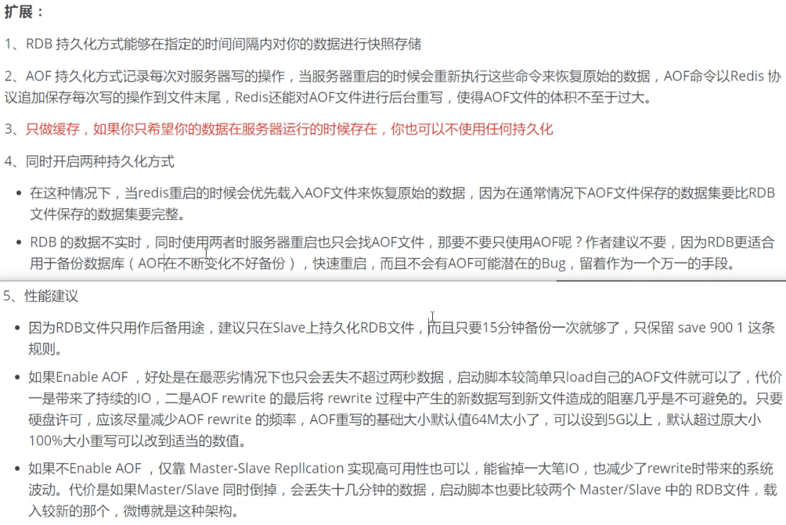
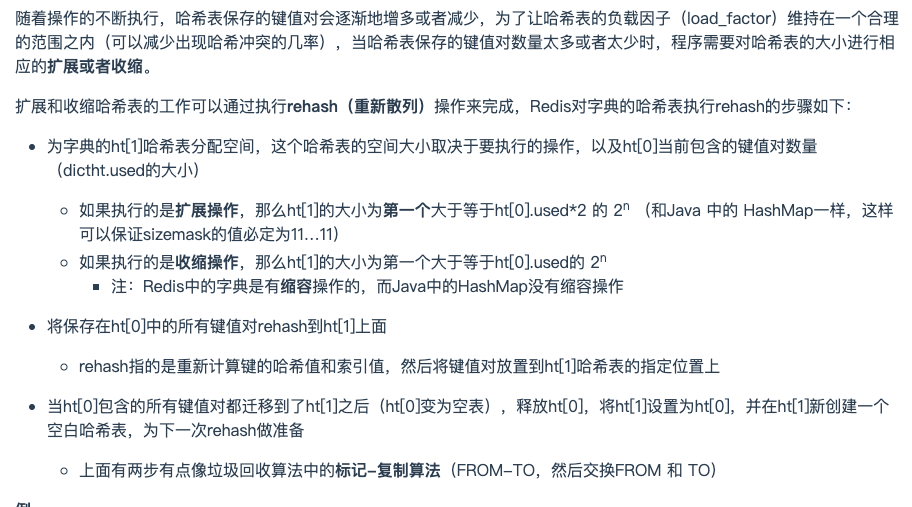
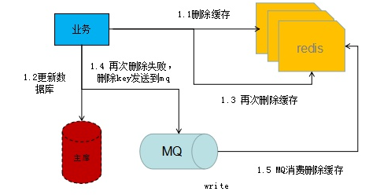
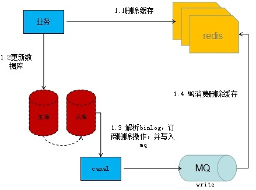

[TOC]

### 1 redis为什么这么快**（**三点）

* 纯内存操作

* 单线程操作，避免了频繁的上下文切换

	* 单线程编程容易并且更容易维护；
	* Redis 的性能瓶颈不再 CPU ，主要在内存和⽹络；
	3. 多线程就会存在死锁、线程上下⽂切换等问题，甚⾄会影响性能。
	3. **Redis6.0 引⼊多线程**主要是为了提⾼⽹络 IO 读写性能，因为这个算是 Redis 中的⼀个性能瓶颈 （Redis 的瓶颈主要受限于内存和⽹络）

* 采用了非阻塞I/O多路复用机制

	* 博主打一个比方：小曲在S城开了一家快递店，负责同城快送服务。小曲因为资金限制，雇佣了一批快递员，然后小曲发现资金不够了，只够买一辆车送快递。

	* 经营方式一
		客户每送来一份快递，小曲就让一个快递员盯着，然后快递员开车去送快递。慢慢的小曲就发现了这种经营方式存在下述问题：

		几十个快递员基本上时间都花在了抢车上了，大部分快递员都处在闲置状态，谁抢到了车，谁就能去送快递
		随着快递的增多，快递员也越来越多，小曲发现快递店里越来越挤，没办法雇佣新的快递员了
		快递员之间的协调很花时间
		综合上述缺点，小曲痛定思痛，提出了下面的经营方式

	* 经营方式二
		小曲只雇佣一个快递员。然后呢，客户送来的快递，小曲按送达地点标注好，然后依次放在一个地方。最后，那个快递员依次的去取快递，一次拿一个，然后开着车去送快递，送好了就回来拿下一个快递。

	* 对比
		上述两种经营方式对比，是不是明显觉得第二种，效率更高，更好呢。在上述比喻中:

		每个快递员------------------>每个线程
		每个快递-------------------->每个socket(I/O流)
		快递的送达地点-------------->socket的不同状态
		客户送快递请求-------------->来自客户端的请求
		小曲的经营方式-------------->服务端运行的代码
		一辆车---------------------->CPU的核数
		于是我们有如下结论
		1、经营方式一就是传统的并发模型，每个I/O流(快递)都有一个新的线程(快递员)管理。
		2、经营方式二就是I/O多路复用。只有单个线程(一个快递员)，通过跟踪每个I/O流的状态(每个快递的送达地点)，来管理多个I/O流。


*  dictEntry 内部包含数据存储的key和v变量，同时包含一个dictEntry的next指针连接落入同一个hash桶的对象。dictEntry当中的key和v的指针指向的是redisObject。

**为什么要使用缓存**

​		我们在碰到需要执行耗时特别久，且结果不频繁变动的SQL，就特别适合将运行结果放入缓存。这样，后面的请求就去缓存中读取，使得请求能够迅速响应。

​		简单来说，就是。我们的redis-client在操作的时候，会产生具有不同事件类型的socket。在服务端，有一段I/0多路复用程序，将其置入队列之中。然后，文件事件分派器，依次去队列中取，转发到不同的事件处理器中。


### 2 redis的数据类型，以及每种数据类型的使用场景

**(一) String**

* 最常规的set/get操作，value可以是String也可以是数字。
* 一般做一些复杂的计数功能的缓存。
* 底层结构，整个尝试编码转换的逻辑过程通过代码的注释应该是比较清楚了，过程如下：
	- 只对长度小于或等于 21 字节，并且可以被解释为整数的字符串进行编码，**使用整数存储**
	- 尝试将 RAW 编码的字符串编码为 EMBSTR 编码，**使用EMBSTR 编码**
	- 这个对象没办法进行编码，尝试从 SDS 中移除所有空余空间，**使用SDS编码**（简单动态字符串）

 **embstr和sds的区别在于内存的申请和回收**

- embstr的创建只需分配一次内存，而raw为两次（一次为sds分配对象，另一次为redisObject分配对象，embstr省去了第一次）。相对地，释放内存的次数也由两次变为一次。
- embstr的redisObject和sds放在一起，更好地利用缓存带来的优势
- 缺点：redis并未提供任何修改embstr的方式，即embstr是只读的形式。对embstr的修改实际上是先转换为raw再进行修改。

**sds**

​		在C语言中，字符串可以用'\0'结尾的char数组标示。这种简单的字符串表示，在大多数情况下都能满足要求，但是不能高效的计算length和append数据。所以Redis自己实现了**SDS（简单动态字符串）**的抽象类型。
​		 SDS的结构体数据结构如下，len表示sdshdr中数据的长度，free表示sdshdr中剩余的空间，buf表示实际存储数据的空间。
​		 sdslen的函数有一个细节需要我们注意，那就是通过(s-(sizeof(struct sdshdr)))来计算偏移量，之所以需要这么计算是因为sds的指针指向的是char buf[]位置，所以我们需要访问sdshdr的首地址的时候需要减去偏移量。


**(二) hash**
		这里value存放的是结构化的对象，比较方便的就是操作其中的某个字段。博主在做单点登录的时候，就是用这种数据结构存储用户信息，以cookieId作为key，设置30分钟为缓存过期时间，能很好的模拟出类似session的效果。

**底层存储可以使用ziplist（压缩列表）和hashtable**。当hash对象可以同时满足一下两个条件时，哈希对象使用ziplist编码。

- 哈希对象保存的所有键值对的键和值的字符串长度都小于64字节
- 哈希对象保存的键值对数量小于512个

**存储过程**

- 首先查看hset中key对应的value是否存在，hashTypeLookupWriteOrCreate。
- 判断key和value的长度确定是否需要从zipList到hashtab转换，hashTypeTryConversion。
- 对key/value进行string层面的编码，解决内存效率问题。
- 更新hash节点中key/value问题。
- 其他后续操作的问题


**(三) list**
		使用List的数据结构，可以做简单的消息队列的功能。另外还有一个就是，可以利用lrange命令，做基于redis的分页功能，性能极佳，用户体验好。

​		**list数据结构底层采用压缩列表ziplist或linkedlist两种数据结构进行存储**，首先以ziplist进行存储，在不满足ziplist的存储要求后转换为linkedlist列表。
 **当列表对象同时满足以下两个条件时，列表对象使用ziplist进行存储，否则用linkedlist存储。**

- 列表对象保存的所有字符串元素的长度小于64字节
- 列表对象保存的元素数量小于512个。

**存储过程**

- 创建list对象并添加到db的数据结构当中

- 针对每个待插入的元素添加到list当中

- list的每个元素的插入过程中，我们会对**是否需要进行转码**作两个判断：

	- 对每个插入元素的长度进行判断是否进行ziplist->linkedlist的转码。
	- 对list总长度是否超过ziplist最大长度的判断。

	

**(四) set**
		因为set堆放的是一堆不重复值的集合。所以可以做全局去重的功能。为什么不用JVM自带的Set进行去重？因为我们的系统一般都是集群部署，使用JVM自带的Set，比较麻烦，难道为了一个做一个全局去重，再起一个公共服务，太麻烦了。
		另外，就是利用交集、并集、差集等操作，可以计算共同喜好，全部的喜好，自己独有的喜好等功能。

​		set的底层存储结构特别神奇，**底层使用了intset和hashtable两种数据结构存储的**，intset我们可以理解为数组，hashtable就是普通的哈希表（key为set的值，value为null）。是不是觉得用hashtable存储set是一件很神奇的事情。

 set的底层存储intset和hashtable是存在编码转换的，使用**intset**存储必须满足下面两个条件，否则使用hashtable，条件如下：

- 结合对象保存的所有元素都是整数值
- 集合对象保存的元素数量不超过512个

**存储过程**

- 检查set是否存在不存在则创建一个set结合。
- 根据传入的set集合一个个进行添加，添加的时候需要进行内存压缩。
- setTypeAdd执行set添加过程中会判断是否进行编码转换。


**(五) zset**

​		sorted set多了一个权重参数score,集合中的元素能够按score进行排列。可以做排行榜应用，取TOP N操作。另外，参照另一篇《分布式之延时任务方案解析》，该文指出了sorted set可以用来做延时任务。最后一个应用就是可以做范围查找。

​		zset底层的存储结构包括ziplist或skiplist，在同时满足以下两个条件的时候使用ziplist，其他时候使用skiplist，两个条件如下

- ziplist：满足以下两个条件的时候
	- 元素数量少于128的时候
	- 每个元素的长度小于64字节
- skiplist：不满足上述两个条件就会使用跳表，具体来说是组合了map和skiplist
	- map用来存储member到score的映射，这样就可以在O(1)时间内找到member对应的分数
	- skiplist按从小到大的顺序存储分数
	- skiplist每个元素的值都是[score,value]对

**存储过程**

* 解析参数得到每个元素及其对应的分值
* 查找key对应的zset是否存在不存在则创建
* 如果存储格式是ziplist，那么在执行添加的过程中我们需要区分元素存在和不存在两种情况，存在情况下先删除后添加；不存在情况下则添加并且需要考虑元素的长度是否超出限制或实际已有的元素个数是否超过最大限制进而决定是否转为skiplist对象。
* 如果存储格式是skiplist，那么在执行添加的过程中我们需要区分元素存在和不存在两种情况，存在的情况下先删除后添加，不存在情况下那么就直接添加，在skiplist当中添加完以后我们同时需要更新dict的对象。


### 3 Redis持久化

​		Redis是内存数据库，如果不将内存中的数据保存到磁盘，那么一旦服务器进程退出，服务器中的数据库状态也会消失，所以Redis提供了持久化功能

**RDB（Redis DataBase）**


* 在指定的时间间隔内将内存中的数据集快照写入磁盘，也就是snapshot快照，它恢复时是将快照文件直接读到内存里
* Redis会单独创建（fork）一个子进程来进行持久化，会先将数据写到一个临时文件中，待持久化过程快结束了，再用这个临时文件替换上次持久化好的文件。
* **优点**：
	* 整个过程中，主进程是不进行任何IO操作的，确保了高性能。
	* 如果需要进行大规模数据的恢复，且对于数据恢复的完整性不是非常敏感，那rdb方式要比aof方式更加的高效。
* **缺点**：
	* 需要一定的时间间隔进行操作
	* fork进程的时候，会占用一定的内存空间
	* rdb最后一次持久化后的数据可能丢失
* 触发机制（生成dump.rdb）：
	* 1 save的规则满足的情况下，会自动触发rdb规则
	* 2 执行flushall命令
	* 3 退出Redis，也会产生rdb文件

**AOF（Append Only File）**

将我们的所有命令都记录下来，恢复的时候就把这个文件全部再执行一遍


* 以日志的形式记录每个**写**操作，将Redis执行过的所有指令记录下来，只许追加文件，但不可以改写文件

* Redis启动之初会读取该文件重新构建数据，换言之，Redis重启就会根据日志文件的内容从前到后执行一次来恢复

* 如果保存的aof文件有错误，那此时Redis是启动不起来的，需要修复

	```bash
	redis-check-aof --fix appendonly.aof
	```

* **优点**：

  * 每一次修改都同步，文件的完整性会更好
  * 每秒同步（写日志）一次，可能会丢失一秒的数据
  	* 解决方案：AOF的fsync设置成每写入一条数据，写一次日志，会导致redis的QPS大降
  * 从不同步，效率最高

* **缺点**：

	* 相对于数据文件来说，aof远远大于rdb，修复的速度也比rdb慢
	* aof运行效率也比rdb慢



* Redis 4.0 开始⽀持 RDB 和 AOF 的混合持久化（默认关闭，可以通过配置项开启）。`aof-use-rdb-peramble`

	​        如果把混合持久化打开，AOF 重写的时候就直接把 RDB 的内容写到 AOF ⽂件开头。这样做的 好处是可以结合 RDB 和 AOF 的优点, 快速加载同时避免丢失过多的数据。当然缺点也是有的， AOF ⾥⾯的 RDB 部分是压缩格式不再是 AOF 格式，可读性较差。


### 4 redis的过期策略以及内存淘汰机制

> 分析:这个问题其实相当重要，到底redis有没用到家，这个问题就可以看出来。比如你redis只能存5G数据，可是你写了10G，那会删5G的数据。怎么删的，这个问题思考过么？还有，你的数据已经设置了过期时间，但是时间到了，内存占用率还是比较高，有思考过原因么?

​		Redis 通过⼀个叫做过期字典（可以看作是hash表）来保存数据过期的时间。过期字典的键指向 Redis数据库中的某个key(键)，过期字典的值是⼀个long long类型的整数，这个整数保存了key所 指向的数据库键的过期时间（毫秒精度的UNIX时间戳）。

* slave不会过期key，只会等待master过期key。如果master过期了一个key，或者通过LRU淘汰了一个key，那么会模拟一条del命令发送给slave。

redis采用的是**定期删除+惰性删除策略**。

* 为什么不用定时删除策略?
	定时删除,用一个定时器来负责监视key,过期则自动删除。虽然内存及时释放，但是十分消耗CPU资源。在大并发请求下，CPU要将时间应用在处理请求，而不是删除key,因此没有采用这一策略.

* 定期删除+惰性删除是如何工作的呢?
	            定期删除，redis默认每个100ms检查，是否有过期的key,有过期key则删除。需要说明的是，redis不是每个100ms将所有的key检查一次，而是随机抽取进行检查(如果每隔100ms,全部key进行检查，redis岂不是卡死)。因此，如果只采用定期删除策略，会导致很多key到时间没有删除。
	        于是，惰性删除派上用场。也就是说在你获取某个key的时候，redis会检查一下，这个key如果设置了过期时间那么是否过期了？如果过期了此时就会删除。

* 采用定期删除+惰性删除就没其他问题了么?
	        不是的，如果定期删除没删除key。然后你也没即时去请求key，也就是说惰性删除也没生效。这样，redis的内存会越来越高。那么就应该采用**内存淘汰机制**。在redis.conf中有一行配置

	```conf
	maxmemory-policy volatile-lru
	```

* 该配置就是配**内存淘汰策略**
	
	* volatile-lru（least recently used）：从已设置过期时间的数据集（server.db[i].expires） 中挑选最近最少使⽤的数据淘汰
	2. volatile-ttl：从已设置过期时间的数据集（server.db[i].expires）中挑选将要过期的数据淘汰
	
	3. volatile-random：从已设置过期时间的数据集（server.db[i].expires）中任意选择数据淘汰
	
	4. allkeys-lru（least recently used）：当内存不⾜以容纳新写⼊数据时，在键空间中，移除 最近最少使⽤的 key（这个是最常⽤的）
	
	5. allkeys-random：从数据集（server.db[i].dict）中任意选择数据淘汰
	
	6. no-eviction：禁⽌驱逐数据，也就是说当内存不⾜以容纳新写⼊数据时，新写⼊操作会报 错。这个应该没⼈使⽤吧！
	
	4.0 版本后增加以下两种：
	
	7. volatile-lfu（least frequently used）：从已设置过期时间的数据集(server.db[i].expires)中 挑选最不经常使⽤的数据淘汰
	
	8. allkeys-lfu（least frequently used）：当内存不⾜以容纳新写⼊数据时，在键空间中，移 除最不经常使⽤的 key


### 5 渐进式ReHash

**原因:**
		整个rehash过程并不是一步完成的，而是分多次、渐进式的完成。如果哈希表中保存着数量巨大的键值对时，若一次进行rehash，很有可能会导致服务器宕机。

**步骤**

1. 为ht[1]分配空间，让字典同时持有ht[0]和ht[1]两个哈希表
2. 维持索引计数器变量rehash idx，并将它的值设置为0，表示rehash开始
3. 每次对字典执行增删改查时，将ht[0]的rehashidx索引上的所有键值对rehash到ht[1]，将rehashidx值+1。
4. 当ht[0]的所有键值对都被rehash到ht[1]中，程序将rehashidx的值设置为-1，表示rehash操作完成
5. 注：渐进式rehash的**好处**在于它采取分为而治的方式，将rehash键值对的计算均摊到每个字典增删改查操作，避免了集中式rehash的庞大计算量。



**和Java的区别**

  （1）Redis中有缩容，Java中没有 

  （2）Redis中的扩容不是一次完成的，可以分多次，是渐进式地，而Java的是一次完成的


### 6 缓存穿透

概念访问一个不存在的key，缓存不起作用，请求会穿透到DB，流量大时DB会挂掉。

* 解决方案：

	* 采用布隆过滤器，使用一个足够大的bitmap，用于存储可能访问的key，不存在的key直接被过滤；
* 访问key未在DB查询到值，也将空值写进缓存，但可以设置较短过期时间。


### 7 缓存雪崩

​		大量的key设置了相同的过期时间，导致在缓存在同一时刻全部失效，造成瞬时DB请求量大、压力骤增，引起雪崩。

* 解决方案:
	* 可以给缓存设置过期时间时加上一个随机值时间，使得每个key的过期时间分布开来，不会集中在同一时刻失效；
	* 采用限流算法，限制流量；
	* 采用分布式锁，加锁访问。
* 目前电商首页以及热点数据都会去做缓存，一般缓存都是定时任务去刷新，或者查不到之后去更新缓存的，定时任务刷新就有一个问题。举个栗子：如果首页所有Key的失效时间都是12小时，中午12点刷新的，我零点有个大促活动大量用户涌入，假设每秒6000个请求，本来缓存可以抗住每秒5000个请求，但是缓存中所有Key都失效了。此时6000个/秒的请求全部落在了数据库上，数据库必然扛不住，真实情况可能DBA都没反应过来直接挂了，此时，如果没什么特别的方案来处理，DBA很着急，重启数据库，但是数据库立马又被新流量给打死了。这就是我理解的缓存雪崩。
* 我心想：同一时间大面积失效，瞬间Redis跟没有一样，那这个数量级别的请求直接打到数据库几乎是灾难性的，你想想如果挂的是一个用户服务的库，那其他依赖他的库所有接口几乎都会报错，如果没做熔断等策略基本上就是瞬间挂一片的节奏，你怎么重启用户都会把你打挂，等你重启好的时候，用户早睡觉去了，临睡之前，骂骂咧咧“什么垃圾产品”。
* 面试官摸摸了自己的头发：嗯，还不错，那这种情况你都是怎么应对的？
* 我：处理缓存雪崩简单，在批量往Redis存数据的时候，把每个Key的失效时间都加个随机值就好了，这样可以保证数据不会再同一时间大面积失效。如果Redis是集群部署，将热点数据均匀分布在不同的Redis库中也能避免全部失效。或者设置热点数据永不过期，有更新操作就更新缓存就好了（比如运维更新了首页商品，那你刷下缓存就好了，不要设置过期时间），电商首页的数据也可以用这个操作，保险。


### 8 常见的限流算法


**计数器（固定窗口）算法**

* 计数器算法是使用计数器在周期内累加访问次数，当达到设定的限流值时，触发限流策略。下一个周期开始时，进行清零，重新计数。
* 此算法在单机还是分布式环境下实现都非常简单，使用redis的incr原子自增性和线程安全即可轻松实现。

**滑动窗口算法**

* 滑动窗口算法是将时间周期分为N个小周期，分别记录每个小周期内访问次数，并且根据时间滑动删除过期的小周期。

**漏桶算法**

* 漏桶算法是访问请求到达时直接放入漏桶，如当前容量已达到上限（限流值），则进行丢弃（触发限流策略）。漏桶以固定的速率进行释放访问请求（即请求通过），直到漏桶为空。

**令牌桶算法**

* 令牌桶算法是程序以r（r=时间周期/限流值）的速度向令牌桶中增加令牌，直到令牌桶满，请求到达时向令牌桶请求令牌，如获取到令牌则通过请求，否则触发限流策略


### 9 持久化对过期key的处理

**过期key对RDB没有任何影响**

- 从内存数据库持久化数据到RDB文件
	- 持久化key之前，会检查是否过期，过期的key不进入RDB文件
- 从RDB文件恢复数据到内存数据库
	- 数据载入数据库之前，会对key先进行过期检查，如果过期，不导入数据库（主库情况）

**过期key对AOF没有任何影响**

- 从内存数据库持久化数据到AOF文件：
	- 当key过期后，还没有被删除，此时进行执行持久化操作（该key是不会进入aof文件的，因为没有发生修改命令）
	- 当key过期后，在发生删除操作时，程序会向aof文件追加一条del命令（在将来的以aof文件恢复数据的时候该过期的键就会被删掉）
- AOF重写
	- 重写时，会先判断key是否过期，已过期的key不会重写到aof文件 


### 10 Redis命令执行过程

- nio层读取数据
- 解析数据到命令行格式
- 查找命令对应的执行函数执行命令
- 同步数据到slave和aof


### 11 主从复制

> 指将一台Redis服务器的数据，复制到其他的Redis服务器。前者称为主节点（master / leader），后者称为从节点（slave / follower）；**数据的复制是单向的，只能从主节点到从节点**。Master以写为主，Slave以读为主。
>
> 默认情况下，**每台Redis服务器都是主节点**，且一个主节点可以有多个从节点，但一个从节点只能有一个主节点

**作用：**

- **数据冗余**：主从复制实现了数据的热备份，是持久化之外的一种数据冗余方式。
- **故障恢复**：当主节点出现问题时，可以由从节点提供服务，实现快速的故障恢复；实际上是一种服务的冗余。
- **负载均衡**：在主从复制的基础上，配合读写分离，可以由主节点提供写服务，由从节点提供读服务（即写Redis数据时应用连接主节点，读Redis数据时应用连接从节点），分担服务器负载；尤其是在写少读多的场景下，通过多个从节点分担读负载，可以大大提高Redis服务器的并发量。
- **高可用基石**：主从复制还是哨兵和集群能够实施的基础，因此说主从复制是Redis高可用的基础。


**实现流程**：

1. 第一步，从服务器保存主服务器的配置信息（redis.conf里面的slaveof配置的），保存之后待从服务器内部的定时器执行时，就会触发复制的流程。（每秒检查是否有新的master node要连接和复制）

2. 第二步，从服务器首先会与主服务器建立一个socket套字节连接，用作主从通信使用。后面主服务器发送数据给从服务器也是通过该套字节进行。

3. 第三步，socket套字节连接成功之后，接着发送鉴权ping命令，正常的情况下，主服务器会发送对应的响应。ping命令的作用是为了，保证socket套字节是否可以用，同时也是为了验证主服务器是否接受操作命令。

4. 第四步，接着就是鉴权验证，判断从节点配置的主节点连接密码（requirepass）是否正确。

5. 第五步，鉴权成功之后，就可以开始复制数据了。主服务器此时会进行**全量复制**，将主服务的数据全部发给从服务器，从服务器保存主服务器发送的数据。（开始full resynchronization的时候，master会启动一个后台线程，开始生成一份RDB快照文件，同时还会将从客户端收到的所有写命令缓存在内存中。RDB文件生成完毕之后，master会将这个RDB发送给slave，slave会先写入本地磁盘，然后再从本地磁盘加载到内存中。然后master会将内存中缓存的写命令发送给slave，slave也会同步这些数据。**2.8开始支持断点续传**）

6. 接下来就是持续复制操作。主服务器会进行异步复制，一边将写的数据写入自身，同时会将新的写命令发送给从服务器。


**实现策略：**

**1. 全量复制。**全量复制用在**主从复制刚建立时或者从切主服务器**时，从服务器没有主服务器的数据，主服务器会将自身的数据通过rdb文件方式发送给从服务器，从服务器会清空自身数据，接着将主服务器发送的数据加载到自身中。

1. master执行bgsave，在本地生成一份rdb快照文件

2. master node将rdb快照文件发送给salve node，如果rdb复制时间超过60秒（repl-timeout），那么slave node就会认为复制失败，可以适当调节大这个参数
3. 对于千兆网卡的机器，一般每秒传输100MB，6G文件，很可能超过60s
4. master node在生成rdb时，会将所有新的写命令缓存在内存中，在salve node保存了rdb之后，再将新的写命令复制给salve node
5. client-output-buffer-limit slave 256MB 64MB 60，如果在复制期间，内存缓冲区持续消耗超过64MB，或者一次性超过256MB，那么停止复制，复制失败
6. slave node接收到rdb之后，清空自己的旧数据，然后重新加载rdb到自己的内存中，同时基于旧的数据版本对外提供服务
7. 如果slave node开启了AOF，那么会立即执行BGREWRITEAOF，重写AOF

**2. 部分复制。**部分复制用在一些异常情况下，例如**主从延迟、从服务宕机之后**重新启动接收主服务器发送的部分数据。

部分复制的实现主要依赖于**复制缓存区、主服务的runid、主从服务器各自的复制偏移量(offset)**。

* 复制缓存区：主服务在接收写命令时，会将命令写入缓存区，以便从服务器在异常情况下，减少数据的丢失。当从服务器正常连接之后，主服务器会将缓存区内的数据发送给从服务器。这里的缓存区是一个长队列。
* 主服务器runid：主服务器会在每次服务启动之后，会生成一个唯一的ID，作为自身标识。从服务器会将该标识保存起来，发送部分复制命令时，会使用该runid。
* 主从复制各自偏移量：主从服务在建立复制之后，都会有自身的偏移量。从节点会每秒钟发送自身复制的偏移量给从节点，主节点在发送写命令之后，从节点也会增加自身的复制偏移量。主节点在每次进行了写命令之后，也会增加自身的偏移量。这里的偏移量是通过命令的字节长度累加计算。

**3. 异步复制。**异步复制是针对主从建立复制关系之后，主从服务器持续保持复制关系。


**redis 复制的核心机制**

（1）redis采用异步方式复制数据到slave节点，不过redis 2.8开始，slave node会周期性地确认自己每次复制的数据量

（2）一个master node是可以配置多个slave node的

（3）slave node也可以连接其他的slave node

（4）slave node做复制的时候，是不会block master node的正常工作的

（5）slave node在做复制的时候，也不会打断对自己的查询操作，它会用旧的数据集来提供服务; 但是复制完成的时候，需要删除旧数据集，加载新数据集，这个时候就会暂停对外服务了

（6）slave node主要用来进行横向扩容，做读写分离，扩容的slave node可以提高读的吞吐量


### 12 MySQL和Redis数据一致性

**问题描述**

1. 如果删除了缓存Redis，还没有来得及写库MySQL，另一个线程就来读取，发现缓存为空，则去数据库中读取数据写入缓存，此时缓存中为脏数据。
2. 如果先写了库，在删除缓存前，写库的线程宕机了，没有删除掉缓存，则也会出现数据不一致情况。

**结论**

1. 懒加载模式缓存可采取双删+TTL失效来实现；
2. 双删失败情况下可采取重试措施，重试有业务通过mq重试以及组件消费mysql的binlog再写入mq重试两种方式；
3. 主动加载由于操作本身不具有幂等性，所以需要考虑加载的有序性问题，采取mq的分区机制实现串行化处理，实现缓存和mysql数据的最终一致，此时读和写操作的缓存加载事件是走的同一个mq。

**懒加载**

> 考虑前后双删加懒加载模式。就是当业务读取数据的时候再从存储层加载的模式，而不是更新后主动刷新，它涉及的业务流程如下如所示：


**为什么要双删？**

- db更新分为两个阶段，更新前及更新后，更新前的删除很容易理解，在db更新的过程中由于读取的操作存在并发可能，会出现缓存重新写入数据，这时就需要更新后的删除。

**双删失败如何处理？**

1、设置缓存过期时间

从理论上来说，给缓存设置过期时间，是保证最终一致性的解决方案。所有的写操作以数据库为准，只要到达缓存过期时间，则后面的读请求自然会从数据库中读取新值然后回填缓存。

结合双删策略+缓存超时设置，这样最差的情况就是在超时时间内数据存在不一致。

2、重试方案

重试方案有两种实现，一种在业务层做，另外一种实现中间件负责处理。

* 业务层

	1）更新数据库数据；

	2）缓存因为种种问题删除失败；

	3）将需要删除的key发送至消息队列；

	4）自己消费消息，获得需要删除的key；

	5）继续重试删除操作，直到成功。



* 中间件

	1）更新数据库数据；

	2）数据库会将操作信息写入binlog日志当中；

	3）订阅程序提取出所需要的数据以及key；

	4）另起一段非业务代码，获得该信息；

	5）尝试删除缓存操作，发现删除失败；

	6）将这些信息发送至消息队列；

	7）重新从消息队列中获得该数据，重试操作。



**主动加载**

> 主动加载模式就是在db更新的时候同步或者异步进行缓存更新


写流程：第一步先删除缓存，删除之后再更新DB，之后再异步将数据刷回缓存。

读流程：第一步先读缓存，如果缓存没读到，则去读DB，之后再异步将数据刷回缓存。

因为会出现并发问题，出现脏数据。解决方案：串行处理


写流程：

​		第一步先删除缓存，删除之后再更新DB，我们监听从库(资源少的话主库也ok)的binlog，通过分析binlog我们解析出需要需要刷新的数据标识，然后将数据标识写入MQ，接下来就消费MQ，解析MQ消息来读库获取相应的数据刷新缓存。

读流程：

​		第一步先读缓存，如果缓存没读到，则去读DB，之后再异步将数据标识写入MQ（这里MQ与写流程的MQ是同一个），接下来就消费MQ，解析MQ消息来读库获取相应的数据刷新缓存。


### 13 哨兵模式

* 主从切换技术的方法是：当主机宕机后，需要手动把一台服务器切换为主服务器，需要人工干预，不是一种推荐的方式。更多时候，我们优先考虑哨兵模式，Redis从2.8开始提供Sentinel架构来解决问题
* 哨兵模式是一种特殊的模式，首先Redis提供了哨兵的命令，哨兵是一个独立的进程，会自动运行。
* 原理：哨兵通过发送命令，等待Redis服务器响应，从而监控运行的多个Redis实例
* **作用：**
	* 通过发送命令，让Redis服务器返回运行状态，包括主服务器和从服务器
	* 当哨兵监测到master宕机，会自动将slave切换成master，然后通过**发布订阅模式**通知其他的服务器，修改配置文件，让它们切换主机
	* **选举算法**：（1）跟master断开连接的时长（2）slave优先级（3）复制offset（4）run id
		* 按照slave优先级进行排序，slave priority越低，优先级就越高
		* 如果slave priority相同，那么看replica offset，哪个slave复制了越多的数据，offset越靠后，优先级就越高
		* 如果上面两个条件都相同，那么选择一个run id比较小的那个slave
	* 
	* 
* **优点：**
	* 哨兵集群，基于主从复制模式，所有的主从配置模型优点都有
	* 主从可以切换，故障可以转移，系统的可用性更好
	* 哨兵模式就是主从模式的升级，手动到自动
* **缺点：**
	* Redis不好在线扩容，集群容量一旦到达上限，在线扩容就十分麻烦
	* 实现哨兵模式的配置很复杂
	* 哨兵至少需要3个实例，来保证自己的健壮性
	* **哨兵 + redis主从的部署架构，是不会保证数据零丢失的，只能保证redis集群的高可用性**

**哨兵需要三个节点的原因**

​		如果哨兵集群仅仅部署了个2个哨兵实例

​		master宕机，s1和s2中只要有1个哨兵认为master宕机就可以还行切换，同时s1和s2中会选举出一个哨兵来执行故障转移

 		同时这个时候，需要majority，也就是大多数哨兵都是运行的，2个哨兵的majority就是2（2的majority=2，3的majority=2，5的majority=3，4的majority=2），2个哨兵都运行着，就可以允许执行故障转移
 	
 		但是如果整个M1和S1运行的机器宕机了，那么哨兵只有1个了，此时就没有majority来允许执行故障转移，虽然另外一台机器还有一个R1，但是故障转移不会执行

**解决异步复制和脑裂导致的数据丢失**

```java
min-slaves-to-write 1
min-slaves-max-lag 10
```

* 异步复制：有了`min-slaves-max-lag`这个配置，就可以确保说，一旦slave复制数据和ack延时太长，就认为可能master宕机后损失的数据太多了，那么就拒绝写请求，这样可以把master宕机时由于部分数据未同步到slave导致的数据丢失降低的可控范围内

* 脑裂：如果一个master出现了脑裂，跟其他slave丢了连接，那么上面两个配置可以确保说，如果不能继续给指定数量的slave发送数据，而且slave超过10秒没有给自己ack消息，那么就直接拒绝客户端的写请求

	这样脑裂后的旧master就不会接受client的新数据，也就避免了数据丢失


### 14 设置过期时间的方式

- expire key seconds：设置 key 在 n 秒后过期；
- pexpire key milliseconds：设置 key 在 n 毫秒后过期；
- expireat key timestamp：设置 key 在某个时间戳（精确到秒）之后过期；
- pexpireat key millisecondsTimestamp：设置 key 在某个时间戳（精确到毫秒）之后过期；


### 15 Redis实现“附近的人”

```java
GEOADD key longitude latitude member [longitude latitude member ...]
```

将给定的位置对象（纬度、经度、名字）添加到指定的key。其中，key为集合名称，member为该经纬度所对应的对象。在实际运用中，当所需存储的对象数量过多时，可通过设置多key(如一个省一个key)的方式对对象集合变相做sharding，避免单集合数量过多。

成功插入后的返回值：

```
(integer) N
```


### 16 分布式锁

**分布式锁**——还是拿插入数据的例子，如果是分布式系统，构建全局唯一索引比较困难，例如唯一性的字段没法确定，这时候可以引入分布式锁，通过第三方的系统(redis或zookeeper)，在业务系统插入数据或者更新数据，获取分布式锁，然后做操作，之后释放锁，这样其实是把多线程并发的锁的思路，引入多多个系统，也就是分布式系统中得解决思路。要点：某个长流程处理过程要求不能并发执行，可以在流程执行之前根据某个标志(用户ID+后缀等)获取分布式锁，其他流程执行时获取锁就会失败，也就是同一时间该流程只能有一个能执行成功，执行完成后，释放分布式锁(分布式锁要第三方系统提供)；


### 17 Redis和Memcached的区别和共同点

**共同点** 

1. 都是基于内存的数据库，⼀般都⽤来当做缓存使⽤。

2. 都有过期策略。

3. 两者的性能都⾮常⾼。

**区别 ：**

1. Redis ⽀持更丰富的数据类型（⽀持更复杂的应⽤场景）。Redis 不仅仅⽀持简单的 k/v 类 型的数据，同时还提供 list，set，zset，hash 等数据结构的存储。Memcached 只⽀持最简 单的 k/v 数据类型。
2. Redis ⽀持数据的持久化，可以将内存中的数据保持在磁盘中，重启的时候可以再次加载进 ⾏使⽤,⽽ Memecache 把数据全部存在内存之中。
3. Redis 有灾难恢复机制。 因为可以把缓存中的数据持久化到磁盘上。
4. Redis 在服务器内存使⽤完之后，可以将不⽤的数据放到磁盘上。但是，Memcached 在服 务器内存使⽤完之后，就会直接报异常。
5. Memcached 没有原⽣的集群模式，需要依靠客户端来实现往集群中分⽚写⼊数据；但是 Redis ⽬前是原⽣⽀持 cluster 模式的.
6. Memcached 是多线程，⾮阻塞 IO 复⽤的⽹络模型；Redis 使⽤单线程的多路 IO 复⽤模 型。 （Redis 6.0 引⼊了多线程 IO ）
7. Redis ⽀持发布订阅模型、Lua 脚本、事务等功能，⽽ Memcached 不⽀持。并且，Redis ⽀持更多的编程语⾔。
8. Memcached过期数据的删除策略只⽤了惰性删除，⽽ Redis 同时使⽤了惰性删除与定期删除。


### 18 缓存的实际问题

**为什么要用缓存**

* 高性能：假设这么个场景，有个操作，一个请求过来，直接操作mysql，半天查出来一个结果，耗时600ms。但是这个结果可能接下来几个小时都不会变了，或者变了也可以不用立即反馈给用户。如果加上缓存，折腾600ms查出来的结果，扔缓存里，一个key对应一个value，下次再有人查，别走mysql折腾600ms了。直接从缓存里，通过一个key查出来一个value，2ms搞定。性能提升300倍。
* 高并发：有个系统，高峰期一秒钟过来的请求有1万，那一个mysql单机绝对会死掉。你这个时候就只能上缓存，把很多数据放缓存，别放mysql。缓存功能简单，说白了就是key-value式操作，单机支撑的并发量轻松一秒几万十几万，支撑高并发so easy。单机承载并发量是mysql单机的几十倍。


### 19 客户端和Redis的一次通信

* 在redis启动**初始化**的时候，redis会将连接应答处理器跟AE_READABLE事件关联起来，接着如果一个客户端跟redis发起连接，此时会产生一个AE_READABLE事件，然后由连接应答处理器来处理跟客户端建立连接，创建客户端对应的socket，同时将这个socket的AE_READABLE事件跟命令请求处理器关联起来。
* 当客户端向redis**发起请求**的时候（不管是读请求还是写请求，都一样），首先就会在socket产生一个AE_READABLE事件，然后由对应的命令请求处理器来处理。这个命令请求处理器就会从socket中读取请求相关数据，然后进行执行和处理。
* 接着redis这边准备好了给客户端的**响应数据**之后，就会将socket的AE_WRITABLE事件跟命令回复处理器关联起来，当客户端这边准备好读取响应数据时，就会在socket上产生一个AE_WRITABLE事件，会由对应的命令回复处理器来处理，就是将准备好的响应数据写入socket，供客户端来读取。
* **命令回复处理器**写完之后，就会删除这个socket的AE_WRITABLE事件和命令回复处理器的关联关系。

