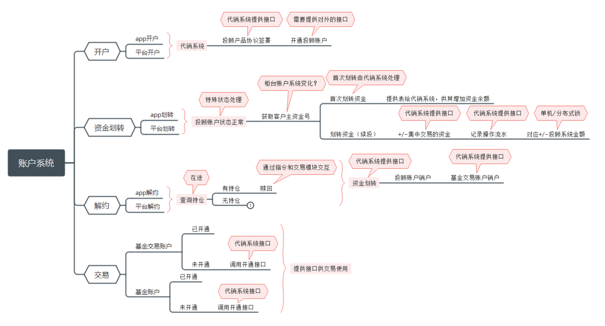

# 自我介绍

​		老师您好，我叫倪浩鹏。目前是南京邮电大学信号与信息处理专业的一名研究生。我应聘的岗位是 **后端工程师** ，我从两个角度谈一下自己的情况：

* 首先，在专业知识方面，我是在大学期间学习了Java和数据结构方面的课程，有一定的基础。另外我通过自学，目前能运用SpringBoot框架进行一些java的后台开发，也对MySQL、Redis这两种数据库有一定了解。
	* 我的个人博客是我独立完成的，其中前端运用Semantic UI框架，后端运用SpringBoot开发，数据库使用MySQL。
	* 另外，我模仿过一套高并发场景下的电商秒杀系统，在实现数据库设计、密码MD5处理、参数校验等功能后，用JMeter作为压测工具，从页面优化、接口优化、安全优化三个角度提高系统的抗压能力。
	* // 最后是我和同学合作完成的一个企业红包雨项目，以SpringCloud为核心，结合MySQL、Redis、RabbitMQ等中间件，实现一个企业年会的红包雨场景，在指定时间内随机发放不同的奖品。
* 其次，在工作经验方面，我有两次实习经历。
	* 第一次在中科院自动化所实习过三个月。实习的岗位是算法工程师，其中我主要负责的项目是ECCV2020 AIM比赛中的图像补全赛道。
	* 还有就是目前在东方财富实习，实习的岗位是服务端开发，负责辅助完成一些基金投顾项目的后端开发工作。
* // 最后呢，在校期间，我担任过科协的讲师，负责向学弟学妹讲解一些编程语言基础

我的自我介绍完了，谢谢。

**论文**

​		基于局部低秩模型的作品在增强检测过程中的可分辨性方面都非常成功。但是，这些方法通过遍历局部图像来构造补丁，而忽略了不同补丁之间的相关性。尽管简化了计算，但是目标的一些纹理信息被忽略了，并且不能准确地识别任意形式的目标。我们提出了一种基于非局部低秩模型和显着性滤波正则化的目标感知新方法，可以将新提出的检测框架定制为非凸优化问题，从而实现联合目标显着性在低维判别流形中学习。更具体地说，将非本地补丁构造应用于建议的目标感知低秩模型。通过组合相似的补丁，我们将它们重建在一起，以更好地概括非局部空间稀疏性约束。另外，为了鼓励目标显着性学习，我们提出的基于熵的显着性过滤正则化项被限制在背景和前景之间。显着性过滤的正则化在本地保留了目标和周围区域的上下文，并避免了低秩矩阵的近似偏差。最后，提出了一个统一的优化框架，并使用替代方向乘数法（ADMM）进行了求解。对真实红外图像的实验评估表明，与某些最新方法相比，该方法在不同复杂场景下的鲁棒性更高。

**AIM比赛**

​		我负责的是AIM比赛中的一个图像补全赛道，题目是对于存在缺陷的图像进行修复，数据集中所包含的缺陷有三种：块状丢失、斑状丢失和噪声类丢失。最主要的问题在于数据集中的部分图像太大，常规的深度学习模型因为显卡内存问题无法训练。并且，这部分如果对应的块状丢失，可能丢失的信息范围也很大，从边缘而言无法往内部学习到太多信息。

我们首先针对不同的缺陷类型：

​		对于斑状和噪声类丢失，我们是采取将图像切割，并将切割后的图像进行训练，在切割后的这部分修复完成后，拼接回原来的大小。同时，我们在另一条支线上将图像压缩成小图后，整体训练。最后将拼接后的图像经过这部分编码器，完成一个整体的色彩调整。

​		对于块状丢失，因为切割过后，可能存在一个部分是全白的，所以无法采取切割补全再拼接的方案，只能把图像进行一个压缩，分别压缩到500 200 100，在用不同的权重进行加权，合成最终的图像。

**投顾账户系统**

**华为**

* 第一代：华为Ascend P1

	华为在2012年1月举行的国际电子消费展（2012 CES）上发布了华为Ascend P1，这款机型是华为首批双核产品之一，综合性能在双核手机中表现十分强劲，拥有1650mAh不可拆卸电池。该机厚度仅为7.69毫米，非常纤薄。且该机在2012年就使用了极窄边框设计，设计理念极为超前。

* 第二代：华为Ascend P2

	相隔一年后，华为发布P系列第二款手机Ascend P2，而这款手机和之前P1不一样之处，就是P2开始**采用华为自家开发的Hisilicon处理器**，延续了该系列轻薄的特点，机身厚度8.4mm，正面采用了一块4.7英寸720p屏幕，像素密度315ppi。后置1300万像背照式素摄像头，支持HDR拍照及录像，配备了NFC模块。

* 第三代：华为Ascend P6

	2013年6月18日，华为正式发布了Ascend P6。**机身厚度仅6.18mm（双卡版为6.48mm），是当时全球最薄的智能手机**。华为Ascend P6的设计简洁、便捷、并且很纤薄。

* 第四代：华为Ascend P7

	2014年5月7日，华为在巴黎发布了2014旗舰机型P7。P7配置5英寸1080P全高清屏幕，**采用金属+双玻璃结构**，机身厚度仅6.5mm。采用主频1.8GHz海思Kirin 910T四核处理器，内置2GB 运行内存(RAM)+16GB机身存储(ROM)。

* 第五代：华为P8系列

	2015年4月15日，新旗舰P8亮相。搭载基于Android 5.0开发的EMUI 3.1系统，高配版采用麒麟935八核处理器，运行内存3GB，**有OIS光学防手震相机以及首创的4色RGBW感测器，拍照功能上内建“光绘”模式**。

* 第六代：华为P9系列

	华为P9搭载了麒麟955处理器，搭载了一组经由**徕卡调教的双摄**像头。

* 第七代：华为P10系列

	北京时间2017年2月26日，华为P10 & P10 Plus发布。华为P10搭载麒麟960处理器，辅以4GB RAM+64/128GB ROM，**适配的EMUI 5.1系统、Ultra Memory技术大幅提升应用启动速度**。正面为一块5.1英寸全高清屏幕，拥有极窄的边框；整机厚度仅为6.98mm，放入3200mAh电池，支持Super Charge快充，同时P10的双摄再次升级，达到了一定的高水准。

* 第八代：华为P20系列

	麒麟970处理器，P20采用“ProTriple-lens”三镜头设计，拥有4000万像素以及五倍混合变焦功能，同时还有全新的传感器，并且和全新进化的AI拍照助手。值得一提的是，**P20系列也拿下当年DxO总分第一的神迹**，也正式宣告了华为P系列手机拍照第一的时代正式到来。

* 第九代：华为P30系列

	2019年3月26日，华为在法国巴黎召开了新品发布会，发布了最新一代P系列旗舰——华为P30和P30 Pro。

	华为P30系列**支持RYYB的CMOS，RYYB可提升40%的进光量，体积大，尺寸比同类大125%，光圈提升到1.6光圈**，支持双光学防抖，暗光表现更为出色；同时华为P30 ISO值超过20万，华为P30 Pro ISO值超过40万。

	核心配置方面，华为P30系列均搭载麒麟980处理器，拥有8GB的内存，运行全新的EMUI9.1系统，并且**支持全新一代的GPU Turbo**技术。华为P30 Pro配备了一块4200mAh大电池，支持40W华为超级快充以及15W的无线快充，并且还拥有**反向无线充电技术**，为其它支持无线充电设备补充电量。华为P30则内置3650mAh电池，支持华为超级快充。

* 第十代：华为P40系列

	华为P40搭载麒麟990 5G处理器，采用6.1英寸直屏，搭载5000万像素三摄系统，**内置EMUI 10.1系统以及华为HMS服务**。

	P40系列分为P40、P40Pro、P40Pro+，共三款产品！

	机型方面，华为P40系列共有三款产品，分别是华为P40、P40 Pro和P40 Pro+；屏幕方面，华为P40采用6.1英寸OLED屏幕，屏幕分辨率为2340x1080；华为P40 Pro/华为P40 Pro+则采用是6.58英寸OLED屏，屏幕分辨率为2640x1200，支持90Hz屏幕刷新率。

* 第十一代：华为P50系列（明晚见）

**中兴**

​		全球领先的综合通信解决方案提供商，中国最大的通信设备上市公司。主要产品包括：2G/3G/4G/5G无线基站与核心网、IMS、固网接入与承载、[光网络](https://baike.baidu.com/item/光网络/6219507)、[芯片](https://baike.baidu.com/item/芯片/32249)、[高端路由器](https://baike.baidu.com/item/高端路由器/6620986)、[智能交换机](https://baike.baidu.com/item/智能交换机/742295)、政企网、大数据、云计算、数据中心、手机及家庭终端、[智慧城市](https://baike.baidu.com/item/智慧城市/9334841)、[ICT](https://baike.baidu.com/item/ICT/32270)业务，以及航空、铁路与城市轨道交通信号传输设备。

​		标志表达了ZTE的稳健、创新、务实、诚信的企业风格。标识图案由中英文两部分组成，“ZTE”是“Zhongxing Telecom Equipment”的缩写，与“中兴”汉字组成一个不可分割的标识整体。“中兴”二字在标识中可作为图案看待，标识中的蓝色称为“中兴蓝”。

**Vivo**

* “vivo” 源于古拉丁语。为表达对凯撒、屋大维等英雄功绩的崇敬，元老院前聚集的罗马公民情不自禁地在抛撒鲜花之时发出了“帷幄尔”的欢呼声，并出现对应的形容词格vivo。
* vivo是专为年轻、时尚的城市主流年轻群体，打造拥有卓越外观、专业级音质享受、极致影像的乐趣、惊喜和愉悦体验的智能产品，并将敢于追求极致创造惊喜作为vivo的持续追求，vivo为步步高旗下智能手机品牌。
* 全球首款屏幕指纹识别手机就是vivo X20 Plus DU，这款手机一经发布后，便赢得了行业的高度赞誉。vivo凭借屏幕指纹技术上的优势，在手机设计上完美避开了后置指纹带来的诟病，同时这项技术在2018年全面爆发，不得承认是vivo推动了手机的潮流设计。
* 18年，nex，第三代屏幕指纹。3D玻璃后盖+铝合金中框设计，后盖采用热弯成型工艺，采用升降式摄像头。采用了光电反射原理，使用上和早前的指纹识别几乎没有区别，同样支持熄屏解锁、同样可以保持按压瞬间解锁的体验（识别速度大约在0.6-0.7秒）
* 2020年11月18日，深圳 —— 今天，vivo在深圳举行OriginOS特别活动，正式发布全新的手机操作系统——OriginOS。全新系统从用户需求出发，致力于在设计、流畅、便捷等方面匹配用户对体验的期待，并希望通过全新的系统交互解决方案，解决用户数字生活中所面临的问题。
* 21年，蔡司联合影像系统超感光微云台双主摄：坐拥1亿像素模式、114°大视野，搭载5nm高通骁龙888旗舰芯片

