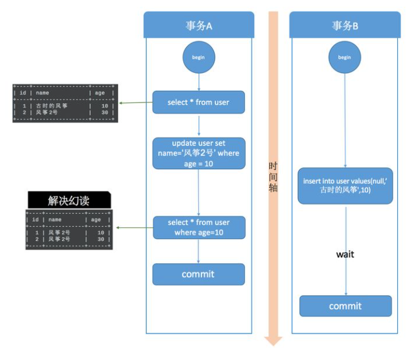

[TOC]

### 1 SQL索引

​		MySQL索引使⽤的数据结构主要有**BTree索引** 和 **哈希索引** 。对于哈希索引来说，底层的数据结构就是哈希表，因此在绝⼤多数需求为单条记录查询的时候，可以选择哈希索引，查询性能最快；其余⼤部分场景，建议选择BTree索引。MySQL的BTree索引使⽤的是B树中的B+Tree，但对于主要的两种存储引擎的实现⽅式是不同的。

* **MyISAM**：B+Tree叶节点的data域存放的是数据记录的地址。在索引检索的时候，⾸先按照 B+Tree搜索算法搜索索引，如果指定的Key存在，则取出其 data 域的值，然后以 data 域的 值为地址读取相应的数据记录。这被称为“**⾮聚簇索引**”。
* **InnoDB**：其数据⽂件本身就是索引⽂件。相⽐MyISAM，索引⽂件和数据⽂件是分离的，其表数据⽂件本身就是按B+Tree组织的⼀个索引结构，树的叶节点data域保存了完整的数据记 录。这个索引的key是数据表的主键，因此InnoDB表数据⽂件本身就是主索引。这被称为“聚簇索引（或聚集索引）”。⽽其余的索引都作为辅助索引，辅助索引的data域存储相应记录主 键的值⽽不是地址，这也是和MyISAM不同的地⽅。在根据主索引搜索时，直接找到key所 在的节点即可取出数据；在根据辅助索引查找时，则需要先取出主键的值，再⾛⼀遍主索 引。 因此，在设计表的时候，不建议使⽤过⻓的字段作为主键，也不建议使⽤⾮单调的字段 作为主键，这样会造成主索引频繁分裂。 


### 2 为什么说B+树比B树更适合数据库索引

1、 B+树的磁盘读写代价更低：B+树的内部节点并没有指向关键字具体信息的指针，因此其内部节点相对B树更小，如果把所有同一内部节点的关键字存放在同一盘块中，那么盘块所能容纳的关键字数量也越多，一次性读入内存的需要查找的关键字也就越多，相对IO读写次数就降低了。

2、B+树的查询效率更加稳定：由于非终结点并不是最终指向文件内容的结点，而只是叶子结点中关键字的索引。所以任何关键字的查找必须走一条从根结点到叶子结点的路。所有关键字查询的路径长度相同，导致每一个数据的查询效率相当。

3、由于B+树的数据都存储在叶子结点中，分支结点均为索引，方便扫库，只需要扫一遍叶子结点即可，但是B树因为其分支结点同样存储着数据，我们要找到具体的数据，需要进行一次中序遍历按序来扫，所以B+树更加适合在区间查询的情况，所以通常B+树用于数据库索引。

* 数据库使用B+树：B树在提高了IO性能的同时并没有解决元素遍历的我效率低下的问题，正是为了解决这个问题，B+树应用而生。B+树只需要去遍历叶子节点就可以实现整棵树的遍历。而且在数据库中基于范围的查询是非常频繁的，而B树不支持这样的操作或者说效率太低。


### 3 InnoDB和MyISAM的区别

1. **InnoDB 支持事务，MyISAM 不支持事务**。这是 MySQL 将默认存储引擎从 MyISAM 变成 InnoDB 的重要原因之一；

2. **InnoDB 支持外键，而 MyISAM 不支持**。对一个包含外键的 InnoDB 表转为 MYISAM 会失败；  

3. **InnoDB 是聚集索引，MyISAM 是非聚集索引**。聚簇索引的文件存放在主键索引的叶子节点上，因此 InnoDB 必须要有主键，通过主键索引效率很高。但是辅助索引需要两次查询，先查询到主键，然后再通过主键查询到数据。因此，主键不应该过大，因为主键太大，其他索引也都会很大。而 MyISAM 是非聚集索引，数据文件是分离的，索引保存的是数据文件的指针。主键索引和辅助索引是独立的。 

4. InnoDB 不保存表的具体行数，执行 select count(*) from table 时需要全表扫描。而MyISAM 用一个变量保存了整个表的行数，执行上述语句时只需要读出该变量即可，速度很快；    

5. **InnoDB 最小的锁粒度是行锁，MyISAM 最小的锁粒度是表锁。**一个更新语句会锁住整张表，导致其他查询和更新都会被阻塞，因此并发访问受限。这也是 MySQL 将默认存储引擎从 MyISAM 变成 InnoDB 的重要原因之一；

**如何选择：**

1. 是否要支持事务，如果要请选择 InnoDB，如果不需要可以考虑 MyISAM；

2. 如果表中绝大多数都只是读查询，可以考虑 MyISAM，如果既有读写也挺频繁，请使用InnoDB。

3. 系统奔溃后，MyISAM恢复起来更困难，能否接受，不能接受就选 InnoDB；

4. MySQL5.5版本开始Innodb已经成为Mysql的默认引擎(之前是MyISAM)，说明其优势是有目共睹的。如果你不知道用什么存储引擎，那就用InnoDB，至少不会差。


### 4 一条SQL语句如何执行

**客户端发出一条select指令**：

1. 连接器（身份认证和权限相关）
2. 查询缓存：执行前先查询缓存（8.0后舍弃）
	1. 查询缓存主要用来缓存我们所执行的 SELECT 语句以及该语句的结果集。连接建立后，执行查询语句的时候，会先查询缓存，MySQL 会先校验这个 sql 是否执行过，以 **Key-Value** 的形式缓存在内存中，Key 是查询预计，Value 是结果集。如果缓存 key 被命中，就会直接返回给客户端，如果没有命中，就会执行后续的操作，完成后也会把结果缓存起来，方便下一次调用。
	2. **MySQL 查询不建议使用缓存**，因为查询缓存失效在实际业务场景中可能会非常频繁，假如你对一个表更新的话，这个表上的所有的查询缓存都会被清空。对于不经常更新的数据来说，使用缓存还是可以的。
3. 分析器：没有查到缓存，SQL语句经过分析器，检查语法是否正确
	1. **第一步，词法分析**，一条 SQL 语句有多个字符串组成，首先要提取关键字
	2. **第二步，语法分析**，主要就是判断你输入的 sql 是否正确
4. 优化器：知悉MySQL认为最优的方案
5. 执行器：执行语句，从存储引擎返回数据


**客户端发出一条update语句**

​       基本上会沿着上一个查询的流程走，只不过执行更新的时候肯定要记录日志，这就会引入日志模块了，MySQL 自带的日志模块式 **binlog（归档日志）** ，所有的存储引擎都可以使用，我们常用的 InnoDB 引擎还自带了一个日志模块 **redo log（重做日志）**，我们就以 InnoDB 模式下来探讨这个语句的执行流程。

流程如下：

* 先查询到张三这一条数据，如果有缓存，也是会用到缓存。
* 然后拿到查询的语句，把 age 改为 19，然后调用引擎 API 接口，写入这一行数据，InnoDB 引擎把数据保存在内存中，同时记录 redo log，此时 redo log 进入 prepare 状态，然后告诉执行器，执行完成了，随时可以提交。
* 执行器收到通知后记录 binlog，然后调用引擎接口，提交 redo log 为提交状态。
* 更新完成。


### 5 为什么要用两个日志模块，用一个日志模块不行吗?

​		因为最开始 MySQL 并没与 InnoDB 引擎( InnoDB 引擎是其他公司以插件形式插入 MySQL 的) ，MySQL 自带的引擎是 MyISAM，但是 redo log 是 InnoDB 引擎特有的，其他存储引擎都没有，这就导致会没有 crash-safe 的能力(crash-safe 的能力即使数据库发生异常重启，之前提交的记录都不会丢失)，binlog 日志只能用来归档。

​		并不是说只用一个日志模块不可以，只是 InnoDB 引擎就是通过 redo log 来支持事务的。

* **先写 redo log 直接提交，然后写 binlog**，假设写完 redo log 后，机器挂了，binlog 日志没有被写入，那么机器重启后，这台机器会通过 redo log 恢复数据，但是这个时候 bingog 并没有记录该数据，后续进行机器备份的时候，就会丢失这一条数据，同时主从同步也会丢失这一条数据。
* **先写 binlog，然后写 redo log**，假设写完了 binlog，机器异常重启了，由于没有 redo log，本机是无法恢复这一条记录的，但是 binlog 又有记录，那么和上面同样的道理，就会产生数据不一致的情况。

​        如果采用 redo log 两阶段提交的方式就不一样了，写完 binglog 后，然后再提交 redo log 就会防止出现上述的问题，从而保证了数据的一致性。那么问题来了，有没有一个极端的情况呢？假设 redo log 处于预提交状态，binglog 也已经写完了，这个时候发生了异常重启会怎么样呢？ 这个就要依赖于 MySQL 的处理机制了，MySQL 的处理过程如下：

* 判断 redo log 是否完整，如果判断是完整的，就立即提交。
* 如果 redo log 只是预提交但不是 commit 状态，这个时候就会去判断 binlog 是否完整，如果完整就提交 redo log, 不完整就回滚事务。

这样就解决了数据一致性的问题。


### 6 事务四个属性


### 7 事务的隔离级别

* **脏读**：脏读指的是读到了其他事务未提交的数据，未提交意味着这些数据可能会回滚，也就是可能最终不会存到数据库中，也就是不存在的数据。读到了并不一定最终存在的数据，这就是脏读。
* **可重复读**：可重复读指的是在一个事务内，最开始读到的数据和事务结束前的任意时刻读到的同一批数据都是一致的。通常针对数据**更新（UPDATE）**操作。
* **不可重复读**：对比可重复读，不可重复读指的是在同一事务内，不同的时刻读到的同一批数据可能是不一样的，可能会受到其他事务的影响，比如其他事务改了这批数据并提交了。通常针对数据**更新（UPDATE）**操作。
* **幻读**：幻读是针对数据**插入（INSERT）**操作来说的。假设事务A对某些行的内容作了更改，但是还未提交，此时事务B插入了与事务A更改前的记录相同的记录行，并且在事务A提交之前先提交了，而这时，在事务A中查询，会发现好像刚刚的更改对于某些数据未起作用，但其实是事务B刚插入进来的，让用户感觉很魔幻，感觉出现了幻觉，这就叫幻读。

SQL 标准定义了**四种隔离级别**，MySQL 全都支持。这四种隔离级别分别是：

1. 读未提交（`READ UNCOMMITTED`）
2. 读提交 （`READ COMMITTED`）
3. 可重复读 （`REPEATABLE READ`）**默认**
4. 串行化 （`SERIALIZABLE`）

​       从上往下，隔离强度逐渐增强，性能逐渐变差。采用哪种隔离级别要根据系统需求权衡决定，其中，**可重复读**是 MySQL 的默认级别。事务隔离其实就是为了解决上面提到的脏读、不可重复读、幻读这几个问题，下面展示了 4 种隔离级别对这三个问题的解决程度。


**MySQL 中执行事务**

​        事务的执行过程如下，以 begin 或者 start transaction 开始，然后执行一系列操作，最后要执行 commit 操作，事务才算结束。当然，如果进行回滚操作(rollback)，事务也会结束。

**读未提交**

```sql
set global transaction isolation level read uncommitted;	-- 设置全局隔离级别为”读未提交“
```

​       MySQL 事务隔离其实是依靠锁来实现的，加锁自然会带来性能的损失。而读未提交隔离级别是不加锁的，所以它的性能是最好的，没有加锁、解锁带来的性能开销。但有利就有弊，这基本上就相当于裸奔。。。所以它连脏读的问题都没办法解决。


**读提交**

```sql
set global transaction isolation level read committed;		-- 设置全局隔离级别为”读提交“
```

​       既然读未提交没办法解决脏数据问题，那么就有了读提交。读提交就是一个事务只能读到其他事务已经提交过的数据，也就是其他事务调用 commit 命令之后的数据。那脏数据问题迎刃而解了。

​		一个问题，在同一事务中(本例中的事务B)，事务的不同时刻同样的查询条件，查询出来的记录内容是不一样的，事务A的提交影响了事务B的查询结果，这就是**不可重复读**，也就是读提交隔离级别。


**可重复读**

```sql
set global transaction isolation level repeatable read;
```

​		可重复是对比不可重复而言的，上面说不可重复读是指同一事物不同时刻读到的数据值可能不一致。而可重复读是指，事务不会读到其他事务对已有数据的修改，即使其他事务已提交，也就是说，事务开始时读到的已有数据是什么，在事务提交前的任意时刻，这些数据的值都是一样的。但是，对于其他事务新插入的数据是可以读到的，这也就引发了幻读问题。


**串行化**

​		串行化是4种事务隔离级别中隔离效果最好的，解决了脏读、可重复读、幻读的问题，但是效果最差，它将事务的执行变为顺序执行，与其他三个隔离级别相比，它就相当于单线程，后一个事务的执行必须等待前一个事务结束。

​		串行化。读的时候加**共享锁**，也就是其他事务可以并发读，但是不能写。写的时候加**排它锁**，其他事务不能并发写也不能并发读。


### 8 MySQL实现可重复读

为了实现可重复读，MySQL采用了**多版本并发控制（MVVC）**的方式

* 在数据库表中看到的一行记录可能实际上有多个版本，每个版本的记录除了有数据本身外，还要有一个表示版本的字段，记为 row trx_id，而这个字段就是使其产生的事务的 id，事务 ID 记为 transaction id，它在事务开始的时候向事务系统申请，按时间先后顺序递增。
	

* **快照**：这也是可重复读和读提交的关键，可重复读是在事务开始的时候生成一个当前事务全局性的快照，而读提交则是每次执行语句的时候都重新生成一次快照。

	对于一个快照来说，它能够读到那些版本数据，要遵循以下规则：

	1. 当前事务内的更新，可以读到；
	2. 版本未提交，不能读到；
	3. 版本已提交，但是却在快照创建后提交的，不能读到；
	4. 版本已提交，且是在快照创建前提交的，可以读到；

	​        利用上面的规则，再返回去套用到读提交和可重复读的那两张图上就很清晰了。**还是要强调，两者主要的区别就是在快照的创建上，可重复读仅在事务开始是创建一次，而读提交每次执行语句的时候都要重新创建一次。**

* **并发写问题**：事务A执行 update 操作， update 的时候要对所修改的行加**行锁**，这个行锁会在提交之后才释放。而在事务A提交之前，事务B也想 update 这行数据，于是申请行锁，但是由于已经被事务A占有，事务B是申请不到的，此时，事务B就会一直处于等待状态，直到事务A提交，事务B才能继续执行，如果事务A的时间太长，那么事务B很有可能出现超时异常。

	* 有索引：有索引的情况，那么 MySQL 直接就在索引数中找到了这行数据，然后干净利落的加上行锁就可以了。
	* 无索引：MySQL 会为这张表中所有行加行锁。但是呢，在加上行锁后，MySQL 会进行一遍过滤，发现不满足的行就释放锁，最终只留下符合条件的行。虽然最终只为符合条件的行加了锁，但是这一锁一释放的过程对性能也是影响极大的。

* **幻读问题**：解决幻读用的也是锁，叫做**间隙锁**，MySQL 把行锁和间隙锁合并在一起，解决了并发写和幻读的问题，这个锁叫做 `Next-Key`锁。

	* 假设现在表中有两条记录，并且 age 字段已经添加了索引，两条记录 age 的值分别为 10 和 30。此时，在数据库中会为索引维护一套B+树，用来快速定位行记录。B+索引树是有序的，所以会把这张表的索引分割成几个区间。

	* 

	* 如图所示，分成了3 个区间，(负无穷,10]、(10,30]、(30,正无穷]，在这3个区间是可以加间隙锁的。

		之后，用下面的两个事务演示一下加锁过程。

	* 

	* **在事务A提交之前，事务B的插入操作只能等待，这就是间隙锁起得作用**。当事务A执行`update user set name='风筝2号’ where age = 10;` 的时候，由于条件 where age = 10 ，数据库不仅在 age =10 的行上添加了行锁，而且在这条记录的两边，也就是(负无穷,10]、(10,30]这两个区间加了间隙锁，从而导致事务B插入操作无法完成，只能等待事务A提交。不仅插入 age = 10 的记录需要等待事务A提交，age<10、10<age<30 的记录页无法完成，而大于等于30的记录则不受影响，这足以解决幻读问题了。


### 9 唯一索引和主键的区别

总体来说：主键相当于一本书的页码，索引相当于书的目录。

* 主键是一种约束，唯一索引是一种索引，两者在本质上是不同的
* 主键创建后一定包含一个唯一性索引，唯一性索引并不一定就是主键。
* 唯一性索引列允许空值，而主键列不允许为空值。
* 主键列在创建时，已经默认为非空值 + 唯一索引了。
* 主键可以被其他表引用为外键，而唯一索引不能。
* 一个表最多只能创建一个主键，但可以创建多个唯一索引。


### 10 MySQL分页查询优化

1. 子查询：这种方式先定位偏移位置的 id，然后往后查询，这种方式适用于 id 递增的情况
2. 使用ID限定：这种方式假设数据表的id是**连续递增**的，则我们根据查询的页数和查询的记录数可以算出查询的id的范围，可以使用 id between and 来查询
3. 使用临时表优化：对于使用 id 限定优化中的问题，需要 id 是连续递增的，但是在一些场景下，比如使用历史表的时候，或者出现过数据缺失问题时，可以考虑使用临时存储的表来记录分页的id，使用分页的id来进行 in 查询。这样能够极大的提高传统的分页查询速度，尤其是数据量上千万的时候。


### 11 大表优化

* 限定数据的范围：务必禁⽌不带任何限制数据范围条件的查询语句
* 读写分离：经典的数据库拆分⽅案，主库负责写，从库负责读；
* 垂直分区：根据数据库⾥⾯数据表的相关性进⾏拆分。简单来说垂直拆分是指数据表列的拆分，把⼀张列⽐较多的表拆分为多张表。
	* **缺点**： 主键会出现冗余，需要管理冗余列，并会引起Join操作，可以通过在应⽤层进⾏Join来解决。此外，垂直分区会让事务变得更加复杂
* 水平分区：保持数据表结构不变，通过某种策略存储数据分⽚。这样每⼀⽚数据分散到不同的表或者库中， 达到了分布式的⽬的。 ⽔平拆分可以⽀撑⾮常⼤的数据量。


### 12 数据库设计三大范式

**第一范式：确保每列保持原子性**

​		第一范式是最基本的范式。如果数据库表中的所有字段值都是不可分解的原子值，就说明该数据库表满足了第一范式。

**第二范式：确保表中的每列都和主键相关**

​		第二范式在第一范式的基础之上更进一层。第二范式需要确保数据库表中的每一列都和主键相关，而不能只与主键的某一部分相关（主要针对联合主键而言）。也就是说在一个数据库表中，一个表中只能保存一种数据，不可以把多种数据保存在同一张数据库表中。

**第三范式：确保每列都和主键列直接相关，而不是间接相关**


### 13 聚集索引与非聚集索引

**聚集索引**

> 定义：数据行的物理顺序与列值（一般是主键的那一列）的逻辑顺序相同，一个表中只能拥有一个聚集索引。

​		一个表就像是我们以前用的**新华字典**，聚集索引就像是**拼音目录**，而每个字存放的页码就是我们的**数据物理地址**，我们如果要查询一个“哇”字，我们只需要查询“哇”字对应在新华字典拼音目录对应的页码，就可以查询到对应的“哇”字所在的位置，而**拼音目录对应的A-Z的字顺序，和新华字典实际存储的字的顺序A-Z也是一样的**，如果我们中文新出了一个字，拼音开头第一个是B，那么他插入的时候也要按照拼音目录顺序插入到A字的后面


​		第一列的地址表示该行数据在磁盘中的物理地址，后面三列才是我们SQL里面用的表里的列，其中id是主键，建立了聚集索引。

​		结合上面的表格就可以理解这句话了吧：数据行的物理顺序与列值的**顺序相同**，如果我们查询id比较靠后的数据，那么这行数据的地址在磁盘中的物理地址也会比较靠后。而且由于物理排列方式与聚集索引的顺序相同，所以也就只能建立一个聚集索引了。

**非聚集索引**

> 定义：该索引中索引的逻辑顺序与磁盘上行的物理存储顺序不同，一个表中可以拥有多个非聚集索引。

​		按照定义，**除了聚集索引以外的索引都是非聚集索引**，只是人们想细分一下非聚集索引，分成**普通索引，唯一索引，全文索引**。如果非要把非聚集索引类比成现实生活中的东西，那么非聚集索引就像新华字典的偏旁字典，他结构顺序与实际存放顺序不一定一致。

* 非聚集索引的二次查询问题

	​		非聚集索引叶节点仍然是索引节点，只是有一个指针指向对应的数据块，此如果使用非聚集索引查询，而查询列中包含了其他该索引没有覆盖的列，那么他还要进行第二次的查询，查询节点上对应的数据行的数据。

	```sql
	select username, score from t1 where username = '小明'
	```

	解决方案：建立两列以上的索引，即可查询复合索引里的列的数据而不需要进行回表二次查询

**结论**

1. 使用聚集索引的查询效率要比非聚集索引的效率要高，但是如果需要频繁去改变聚集索引的值，写入性能并不高，因为需要移动对应数据的物理位置。
2. 非聚集索引在查询的时候可以的话就避免二次查询，这样性能会大幅提升。
3. 不是所有的表都适合建立索引，只有数据量大表才适合建立索引，且建立在选择性高的列上面性能会更好。


### 14 锁机制与InnoDB锁算法

**MyISAM和InnoDB存储引擎使⽤的锁**：

* MyISAM采⽤表级锁
* InnoDB⽀持⾏级锁(row-level locking)和表级锁,默认为⾏级锁

**表级锁和行级锁对比**：

* 表级锁： MySQL中锁中粒度最⼤的⼀种锁，对当前操作的整张表加锁，实现简单，资源消 耗也⽐较少，加锁快，不会出现死锁。其锁定粒度最⼤，触发锁冲突的概率最⾼，并发度最低，MyISAM和 InnoDB引擎都⽀持表级锁。
* ⾏级锁： MySQL中锁定 粒度最⼩ 的⼀种锁，只针对当前操作的⾏进⾏加锁。 ⾏级锁能⼤⼤减少数据库操作的冲突。其加锁粒度最⼩，并发度⾼，但加锁的开销也最⼤，加锁慢，会出现死锁。

**InnoDB存储引擎的锁的算法有三种**

* Record lock：单个⾏记录上的锁
* Gap lock：间隙锁，锁定⼀个范围，不包括记录本身
* Next-key lock：record+gap 锁定⼀个范围，包含记录本身

