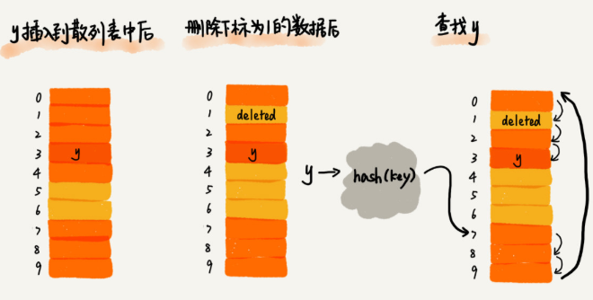

## 1. 时间复杂度

原地：空间复杂度为$O(1)$

稳定：相等元素先后顺序不变

|    算法    | 时间复杂度 | 原地 | 稳定 |             说明             |
| :--------: | :--------: | :--: | :--: | :--------------------------: |
|    冒泡    |  $O(n^2)$  |  √   |  √   |   最好$O(n)$，最差$O(n^2)$   |
|    插入    |  $O(n^2)$  |  √   |  √   |   最好$O(n)$，最差$O(n^2)$   |
|    选择    |  $O(n^2)$  |  √   |  ×   |  最好$O(n^2)$，最差$O(n^2)$  |
|    归并    | $O(nlogn)$ |  ×   |  √   |                              |
|    快排    | $O(nlogn)$ |  √   |  ×   | 最好$O(nlogn)$，最差$O(n^2)$ |
|     桶     |   $O(n)$   |  ×   |  √   |                              |
|    计数    |   $O(n)$   |  ×   |  √   |                              |
|    基数    |   $O(n)$   |  ×   |  √   |                              |
|    跳表    | $O(logn)$  |      |      | 空间复杂度$O(n)$，插入$O(n)$ |
| 二叉查找树 | $O(nlogn)$ |      |      |                              |
|   堆排序   | $O(nlogn)$ |      |      |          建堆$O(n)$          |

## 2. 散列冲突

解决方法：**开放寻址法**和**链表法**

**开放寻址法**

* **线性探测法**
	* **插入**数据：x经过hash函数后，被散列的位置已经有数据了，则按顺序往后一个一个找
		* 
	* **查找**数据：通过散列函数求出要查找元素对应的键值，比较数组中下标为散列值的元素和要查找的元素，若相等则最好，若不等，则按顺序往后依次查找。如果遍历到数组的**空闲位置**还没找到，就说明要查找的元素不在散列表中。
		* 
	* **删除**数据：将要删除的元素，标记为**deleted**。当线性探测查找的时候，遇到标记为deleted的空间，并不是停下来，而是继续往下探测。
		* 
* **二次探测法**：线性探测每次的步长为1，下标顺序每次加1，二测探测就是每次加上一个**平方数**
* **双重散列法**：简单说，就是用2个散列函数，若用第一个hash函数计算的存储位置已被使用，则使用第二个hash函数

### 3. 几种树的比较

* 平衡二叉查找树的**初衷**：解决普通二叉查找树在插入、删除等动态更新的情况下，出现时间复杂度退化的情况