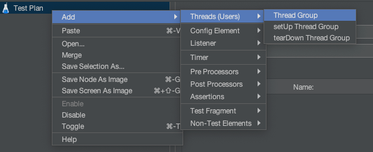
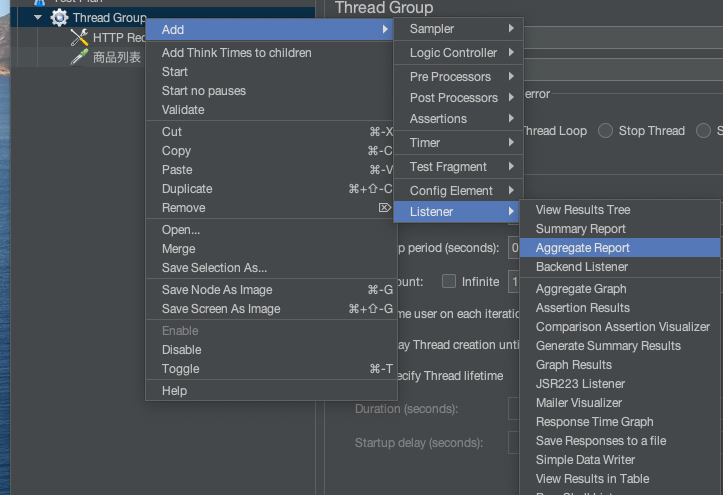
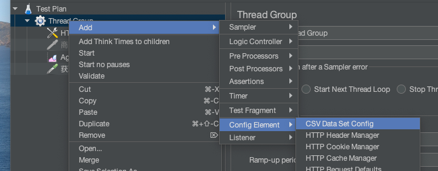

[TOC]

# 秒杀系统

## 一、项目框架

### 1.1 SpringBoot环境搭建

1. 新建Maven项目，添加依赖(父依赖SpringBoot，还有正常依赖web和thymeleaf)

	```xml
	<!--SpringBoot-->
	<parent>
	    <artifactId>spring-boot-starter-parent</artifactId>
	    <groupId>org.springframework.boot</groupId>
	    <version>2.4.2</version>
	</parent>
	
	<!--Web-->
	<dependency>
	    <groupId>org.springframework.boot</groupId>
	    <artifactId>spring-boot-starter-web</artifactId>
	</dependency>
	<!--thymeleaf-->
	<dependency>
	    <groupId>org.springframework.boot</groupId>
	    <artifactId>spring-boot-starter-thymeleaf</artifactId>
	</dependency>
	```

2. 构建项目结构
	

3. 编写测试类

	```java
	@Controller
	@RequestMapping("/demo")
	public class SampleController {
	    @RequestMapping("/thymeleaf")
	    public String thymeleaf(Model model) {
	        model.addAttribute("name", "komorebi");
	        return "hello";
	    }
	}
	```

	```html
	<!DOCTYPE HTML>
	<html xmlns:th="http://www.thymeleaf.org">
	<head>
	    <title>hello</title>
	    <meta http-equiv="Content-Type" content="text/html; charset=UTF-8" />
	</head>
	<body>
	<p th:text="'hello:'+${name}" ></p>
	</body>
	</html>
	```

4. localhost:8080/demo/thymeleaf测试

### 1.2 Result结果封装

result.java

```java
public class Result<T> {
	private int code;
	private String msg;
	private T data;

	/**
	 * 成功时候的调用
	 * */
	public static <T> Result<T> success(T data){
		return new  Result<T>(data);
	}
	
	/**
	 * 失败时候的调用
	 * */
	public static <T> Result<T> error(CodeMsg cm){
		return new  Result<T>(cm);
	}
	
	private Result(T data) {
		this.code = 0;
		this.msg = "success";
		this.data = data;
	}
	
	private Result(CodeMsg cm) {
		if(cm == null) {
			return;
		}
		this.code = cm.getCode();
		this.msg = cm.getMsg();
	}

	public int getCode() {
		return code;
	}
	public String getMsg() {
		return msg;
	}
	public T getData() {
		return data;
	}
}
```

CodeMsg.java

```java
public class CodeMsg {
	private int code;
	private String msg;
	
	//通用异常
	public static CodeMsg SUCCESS = new CodeMsg(0, "success");
	public static CodeMsg SERVER_ERROR = new CodeMsg(500100, "服务端异常");
	//登录模块 5002XX
	
	//商品模块 5003XX
	
	//订单模块 5004XX
	
	//秒杀模块 5005XX
	
	
	private CodeMsg(int code, String msg) {
		this.code = code;
		this.msg = msg;
	}
	
	public int getCode() {
		return code;
	}
	public String getMsg() {
		return msg;
	}
}
```

### 1.3 集成Mybatis+Druid

1. 导包

	```xml
	<!--Mybatis-->
	<dependency>
	    <groupId>org.mybatis.spring.boot</groupId>
	    <artifactId>mybatis-spring-boot-starter</artifactId>
	    <version>2.1.3</version>
	</dependency>
	<!--MySQL-->
	<dependency>
	    <groupId>mysql</groupId>
	    <artifactId>mysql-connector-java</artifactId>
	    <version>5.1.49</version>
	</dependency>
	<!--Druid-->
	<dependency>
	    <groupId>com.alibaba</groupId>
	    <artifactId>druid</artifactId>
	    <version>1.2.4</version>
	</dependency>
	```

2. 配置proerties

	```properties
	# mybatis
	mybatis.type-aliases-package=com.komorebi.domain
	mybatis.configuration.map-underscore-to-camel-case=true
	mybatis.configuration.default-fetch-size=100
	mybatis.configuration.default-statement-timeout=3000
	mybatis.mapperLocations = classpath:com/komorebi/dao/*.xml
	
	# Druid
	spring.datasource.url=jdbc:mysql://127.0.0.1:3306/spike?useUnicode=true&characterEncoding=utf-8&allowMultiQueries=true&useSSL=false
	spring.datasource.username=root
	spring.datasource.password=123456
	spring.datasource.driver-class-name=com.mysql.cj.jdbc.Driver
	spring.datasource.type=com.alibaba.druid.pool.DruidDataSource 
	spring.datasource.filters=stat
	spring.datasource.maxActive=2
	spring.datasource.initialSize=1
	spring.datasource.maxWait=60000
	spring.datasource.minIdle=1
	spring.datasource.timeBetweenEvictionRunsMillis=60000
	spring.datasource.minEvictableIdleTimeMillis=300000
	spring.datasource.validationQuery=select 'x'
	spring.datasource.testWhileIdle=true
	spring.datasource.testOnBorrow=false
	spring.datasource.testOnReturn=false
	spring.datasource.poolPreparedStatements=true
	spring.datasource.maxOpenPreparedStatements=20
	```

3. 实体类User+UserDao+UserService，最后Controller

	```java
	@RequestMapping("/db/get")
	@ResponseBody
	public Result<User> dbGet() {
	    User user = userService.getById(1);
	    return Result.success(user);
	}
	```

4. 测试

### 1.4 集成Redis+通用缓存Key封装

* 添加Jedis依赖

* 添加Fastjson依赖

	```xml
	<!--Jedis-->
	<dependency>
	    <groupId>redis.clients</groupId>
	    <artifactId>jedis</artifactId>
	    <version>3.2.0</version>
	</dependency>
	<!--fastjson-->
	<dependency>
	    <groupId>com.alibaba</groupId>
	    <artifactId>fastjson</artifactId>
	    <version>1.2.75</version>
	</dependency>
	```

	

## 二、实现登录功能

### 2.1 数据库设计


### 2.2 明文密码两次MD5处理

两次MD5：

* 用户端：Pass = MD5（明文+固定Salt）

* 服务端：Pass = MD5（用户输入+随机Salt）

	```java
	public class MD5Util {
	    public static String md5(String s) {
	        return DigestUtils.md5Hex(s);
	    }
	
	    private static final String salt = "1a2b3c4d";
	
	    public static String inputPassToFormPass(String inputPass) {
	        String s = "" + salt.charAt(0) + salt.charAt(2) + inputPass + salt.charAt(5) + salt.charAt(4);
	        return md5(s);
	    }
	
	    public static String formPassToDBPass(String formPass, String salt) {
	        String s = "" + salt.charAt(0) + salt.charAt(2) + formPass + salt.charAt(5) + salt.charAt(4);
	        return md5(s);
	    }
	
	    public static String inputPassToDBPass(String inputPass, String saltDB) {
	        String formPass = inputPassToFormPass(inputPass);
	        String dbPass = formPassToDBPass(formPass, saltDB);
	        return dbPass;
	    }
	
	    public static void main(String[] args) {
	        System.out.println(inputPassToFormPass("123456"));
	        System.out.println(formPassToDBPass(inputPassToFormPass("123456"), "1a2b3c4d"));
	        System.out.println(inputPassToDBPass("123456", "1a2b3c4d"));
	    }
	}
	```

### 2.3 JSR303参数检验+全局异常处理器

1. Controller参数前加上@Valid

2. LoginVo对象在需要校验的参数前加上注解

3. 编写IsMobile接口和IsMobileValidator实现类

	```java
	@Target({ METHOD, FIELD, ANNOTATION_TYPE, CONSTRUCTOR, PARAMETER })
	@Retention(RUNTIME)
	@Documented
	@Constraint(validatedBy = {IsMobileValidator.class })
	public @interface IsMobile {
		
		boolean required() default true;
		
		String message() default "手机号码格式错误";
	
		Class<?>[] groups() default { };
	
		Class<? extends Payload>[] payload() default { };
	}
	
	```

	```java
	public class IsMobileValidator implements ConstraintValidator<IsMobile, String> {
	
		private boolean required = false;
		
		public void initialize(IsMobile constraintAnnotation) {
			required = constraintAnnotation.required();
		}
	
		public boolean isValid(String value, ConstraintValidatorContext context) {
			if(required) {
				return ValidatorUtil.isMobile(value);
			}else {
				if(StringUtils.isEmpty(value)) {
					return true;
				}else {
					return ValidatorUtil.isMobile(value);
				}
			}
		}
	}
	```

4. 全局异常处理

	```java
	@ControllerAdvice
	@ResponseBody
	public class GlobalExceptionHandler {
	    @ExceptionHandler(value = Exception.class)
	    public Result<String> exceptionHandler(HttpServletRequest request, Exception e) {
	        if (e instanceof BindException) {
	            BindException ex = (BindException) e;
	            List<ObjectError> errors = ex.getAllErrors();
	            ObjectError error = errors.get(0);
	            String msg = error.getDefaultMessage();
	            return Result.error(CodeMsg.BIND_ERROR.fillArgs(msg));
	        }
	        else {
	            return Result.error(CodeMsg.SERVER_ERROR);
	        }
	    }
	}
	```

	```java
	public class GlobalException extends RuntimeException {
	    private static final long serialVersionUID = 1L;
	
	    private CodeMsg cm;
	
	    public GlobalException(CodeMsg cm) {
	        super(cm.toString());
	        this.cm = cm;
	    }
	
	    public CodeMsg getCm() {
	        return cm;
	    }
	}
	```

### 2.4 分布式Session

1. Service中生成cookie

	```java
	public void addCookie(HttpServletResponse response, SpikeUser user) {
	    String token = UUIDUtil.uuid();
	    redisService.set(SpikeUserKey.token, token, user);
	
	    Cookie cookie = new Cookie(COOKIE_NAME_TOKEN, token);
	    cookie.setMaxAge(SpikeUserKey.token.expireSeconds());
	    cookie.setPath("/");
	
	    response.addCookie(cookie);
	}
	```

2. Controller中读取cookie

	```java
	@RequestMapping("/to_list")
	public String list(Model model, 
	                   @CookieValue(value = SpikeUserService.COOKIE_NAME_TOKEN, required = false) String cookieToken,
	                   @RequestParam(value = SpikeUserService.COOKIE_NAME_TOKEN, required = false) String paramToken) {
	    if (StringUtils.isEmpty(cookieToken) && StringUtils.isEmpty(paramToken)) {
	        return "login";
	    }
	
	    String token = StringUtils.isEmpty(paramToken) ? cookieToken : paramToken;
	    SpikeUser user = spikeUserService.getByToken(token);
	    model.addAttribute("user", user);
	    return "goods_list";
	}
	```

3. 封装Controller中的功能，编写WebConfig和UserArgumentResolver

	```java
	@Configuration
	public class WebConfig extends WebMvcConfigurerAdapter {
	    @Autowired
	    UserArgumentResolver userArgumentResolver;
	
	    @Override
	    public void addArgumentResolvers(List<HandlerMethodArgumentResolver> argumentResolvers) {
	        argumentResolvers.add(userArgumentResolver);
	    }
	}
	```

	```java
	@Service
	public class UserArgumentResolver implements HandlerMethodArgumentResolver {
	    @Autowired
	    SpikeUserService spikeUserService;
	
	    @Override
	    public boolean supportsParameter(MethodParameter methodParameter) {
	        Class<?> clazz = methodParameter.getParameterType();
	        return clazz == SpikeUser.class;
	    }
	
	    @Override
	    public Object resolveArgument(MethodParameter methodParameter, ModelAndViewContainer modelAndViewContainer, NativeWebRequest nativeWebRequest, WebDataBinderFactory webDataBinderFactory) throws Exception {
	        HttpServletRequest request = nativeWebRequest.getNativeRequest(HttpServletRequest.class);
	        HttpServletResponse response = nativeWebRequest.getNativeResponse(HttpServletResponse.class);
	
	        String paramToken = request.getParameter(SpikeUserService.COOKIE_NAME_TOKEN);
	        String cookieToken = getCookieValue(request, SpikeUserService.COOKIE_NAME_TOKEN);
	
	        if (StringUtils.isEmpty(cookieToken) && StringUtils.isEmpty(paramToken)) {
	            return null;
	        }
	
	        String token = StringUtils.isEmpty(paramToken) ? cookieToken : paramToken;
	        return spikeUserService.getByToken(response, token);
	    }
	
	    private String getCookieValue(HttpServletRequest request, String cookieNameToken) {
	        Cookie[] cookies = request.getCookies();
	        for (Cookie cookie : cookies) {
	            if (cookie.getName().equals(cookieNameToken)) {
	                return cookie.getValue();
	            }
	        }
	        return null;
	    }
	}
	```

## 三、实现秒杀功能

### 3.1 数据库设计

* 设计四张表

```sql
DROP TABLE IF EXISTS `goods`;
CREATE TABLE `goods` (
  `id` bigint(20) NOT NULL AUTO_INCREMENT COMMENT '商品ID',
  `goods_name` varchar(16) DEFAULT NULL COMMENT '商品名称',
  `goods_title` varchar(64) DEFAULT NULL COMMENT '商品标题',
  `goods_img` varchar(64) DEFAULT NULL COMMENT '商品图片',
  `goods_detail` longtext COMMENT '商品详情',
  `goods_price` decimal(10,2) DEFAULT '0.00' COMMENT '商品单价',
  `goods_stock` int(11) DEFAULT '0' COMMENT '商品库存，-1表示没有限制',
  PRIMARY KEY (`id`)
) ENGINE=InnoDB AUTO_INCREMENT=3 DEFAULT CHARSET=utf8;

-- ----------------------------
-- Table structure for order_info
-- ----------------------------
DROP TABLE IF EXISTS `order_info`;
CREATE TABLE `order_info` (
  `id` bigint(20) NOT NULL AUTO_INCREMENT,
  `user_id` bigint(20) DEFAULT NULL COMMENT '用户ID',
  `goods_id` bigint(20) DEFAULT NULL COMMENT '商品ID',
  `delivery_addr_id` bigint(20) DEFAULT NULL COMMENT '收货地址ID ',
  `goods_name` varchar(16) DEFAULT NULL COMMENT '冗余过来的商品名称',
  `goods_count` int(11) DEFAULT '0' COMMENT '商品数量',
  `goods_price` decimal(10,2) DEFAULT '0.00' COMMENT '商品单价',
  `order_channel` tinyint(4) DEFAULT '0' COMMENT '1 PC 2 Android 3 IOS',
  `status` tinyint(4) DEFAULT '0' COMMENT '订单状态：0 新建未支付 1 已支付 2 已发货 3 已收货 4 已退款 5 已完成',
  `create_date` datetime DEFAULT NULL COMMENT '订单的创建时间',
  `pay_date` datetime DEFAULT NULL COMMENT '支付时间',
  PRIMARY KEY (`id`)
) ENGINE=InnoDB AUTO_INCREMENT=12 DEFAULT CHARSET=utf8;

-- ----------------------------
-- Table structure for spike_goods
-- ----------------------------
DROP TABLE IF EXISTS `spike_goods`;
CREATE TABLE `spike_goods` (
  `id` bigint(20) NOT NULL AUTO_INCREMENT COMMENT '秒杀的商品表',
  `goods_id` bigint(20) DEFAULT NULL COMMENT '商品ID',
  `spike_price` decimal(10,2) DEFAULT '0.00' COMMENT '秒杀价',
  `stock_count` int(11) DEFAULT NULL COMMENT '库存数量',
  `start_date` datetime DEFAULT NULL COMMENT '秒杀开始时间',
  `end_date` datetime DEFAULT NULL COMMENT '秒杀结束时间',
  PRIMARY KEY (`id`)
) ENGINE=InnoDB AUTO_INCREMENT=3 DEFAULT CHARSET=utf8;

-- ----------------------------
-- Table structure for spike_order
-- ----------------------------
DROP TABLE IF EXISTS `spike_order`;
CREATE TABLE `spike_order` (
  `id` bigint(20) NOT NULL AUTO_INCREMENT,
  `user_id` bigint(20) DEFAULT NULL COMMENT '用户ID',
  `order_id` bigint(20) DEFAULT NULL COMMENT '订单ID',
  `goods_id` bigint(20) DEFAULT NULL COMMENT '商品ID',
  PRIMARY KEY (`id`)
) ENGINE=InnoDB AUTO_INCREMENT=3 DEFAULT CHARSET=utf8;
```

* 实现基本的GoodsVo以及相应的dao-service-controller实现

	* 在联表查询时，可以将要查出来的数据封装成一个新的对象

		```java
		public class GoodsVo extends Goods {
		    private Double spikePrice;
		    private Integer stockCount;
		    private Date startDate;
		    private Date endDate;
		}
		```

	* 查询语句

		```java
		@Mapper
		public interface GoodsDao {
		    @Select("select g.*, sg.spike_price, sg.stock_count, sg.start_date, sg.end_date from spike_goods sg left join goods g on sg.goods_id = g.id")
		    public List<GoodsVo> listGoodsVo();
		}
		```

### 3.2 商品列表页

goods_list.html

```java
@RequestMapping("/to_list")
public String list(Model model, SpikeUser user) {
    model.addAttribute("user", user);

    // 查询商品列表
    List<GoodsVo> goodsList = goodsService.listGoodsVo();
    model.addAttribute("goodsList", goodsList);

    return "goods_list";
}
```

### 3.3 商品详情页

goods_detail.html

```java
@RequestMapping("/to_detail/{goodsId}")
public String detail(Model model, SpikeUser user, @PathVariable("goodsId")long goodsId) {
    model.addAttribute("user", user);

    GoodsVo goods = goodsService.getGoodsVoByGoodsId(goodsId);
    model.addAttribute("goods", goods);

    // 记录秒杀时间线的各种状态
    long startAt = goods.getStartDate().getTime();
    long endAt = goods.getEndDate().getTime();
    long now = System.currentTimeMillis();

    int spikeStatus = 0;
    int remainSeconds = 0;

    if (now < startAt) {            // 秒杀未开始
        spikeStatus = 0;
        remainSeconds = (int)(startAt - now) / 1000;
    }
    else if (now > endAt) {         // 秒杀已结束
        spikeStatus = 2;
        remainSeconds = -1;
    }
    else {                          // 秒杀进行中
        spikeStatus = 1;
        remainSeconds = 0;
    }
    model.addAttribute("spikeStatus", spikeStatus);
    model.addAttribute("remainSeconds", remainSeconds);
    return "goods_detail";
}
```

### 3.4 订单详情页

order_detail.html

## 四、JMeter压测

### 4.1 JMeter入门

* http://jmeter.apache.org/
* Apache JMeter是Apache组织开发的基于Java的压力测试工具。用于对软件做压力测试，它最初被设计用于Web应用测试，但后来扩展到其他测试领域。 它可以用于测试静态和动态资源，例如静态文件、Java 小服务程序、CGI 脚本、Java 对象、数据库、FTP 服务器， 等等。JMeter 可以用于对服务器、网络或对象模拟巨大的负载，来自不同压力类别下测试它们的强度和分析整体性能。另外，JMeter能够对应用程序做功能/回归测试，通过创建带有断言的脚本来验证你的程序返回了你期望的结果。为了最大限度的灵活性，JMeter允许使用**正则表达式**创建断言。
* 安装完成，直接sh 目录/bin/jmeter
* 步骤：
	* 1. 
		2. 
		3. 
		4. 
		5. 
		6. 
		7. 

### 4.2 自定义变量模拟多用户


1. 测试计划 --> 添加配置元件 --> CSV Data Set Config
	
	
2. 引用变量${}
	

### 4.3 JMeter命令行使用

1. 写好jmx（就4.2中的配置），就保存为jmx文件

2. ```bash
	sh jmeter.sh -n -t XXX.jmx -l result.jtl
	```

3. 把result.jtl导入jmeter

### 4.4 redis-benchmark

1. 100个并发连接，100000个请求

	```bash
	redis-benchmark -h 127.0.0.1 -p 6379 -c 100 -n 100000
	```

2. 存取大小为100字节的数据包

	```bash
	redis-benchmark -h 127.0.0.1 -p 6379 -q -d 100
	```

3. 只测试某些操作的性能

	```bash
	redis-benchmark -t set,lpush -n 100000 -q
	```

4. 只测试某些数值存取的性能

	```bash
	redis-benchmark -n 100000 -q script load "redis.call('set','foo','bar')"
	```

### 4.5 SpringBoot打war包

1. 添加Spring-boot-starter-tomcat的provided依赖

	```xml
	<!--Tomcat-provided-->
	<dependency>
	    <groupId>org.springframework.boot</groupId>
	    <artifactId>spring-boot-starter-tomcat</artifactId>
	    <scope>provided</scope>
	</dependency>
	```

2. 添加maven-war-plugin插件

	```xml
	<plugin>
	    <groupId>org.apache.maven.plugins</groupId>
	    <artifactId>maven-war-plugin</artifactId>
	    <configuration>
	        <failOnMissingWebXml>false</failOnMissingWebXml>
	    </configuration>
	</plugin>
	```

3. 修改main方法

	```java
	@SpringBootApplication
	public class MainApplication extends SpringBootServletInitializer {
	//public class MainApplication {
	    public static void main(String[] args) throws Exception {
	        SpringApplication.run(MainApplication.class, args);
	    }
	
	    @Override
	    protected SpringApplicationBuilder configure(SpringApplicationBuilder builder) {
	//        return super.configure(builder);
	        return builder.sources(MainApplication.class);
	    }
	}
	```

4. 放到tomcat路径下webapps里，运行即可

5. 若要打jar包，参考https://www.cnblogs.com/liumyblog/p/12982502.html，注意**pluginManagement**会对jar包打包有影响

## 五、页面优化技术

### 5.1 页面缓存+URL缓存+对象缓存

* 页面缓存：取缓存---手动渲染模板---结果输出

	* 重写GoodsController中的list方法

	```java
	@RequestMapping(value = "/to_list", produces = "text/html")
	@ResponseBody
	public String list(HttpServletRequest request, HttpServletResponse response, Model model, SpikeUser user) {
	    model.addAttribute("user", user);
	    // 页面缓存1：取缓存
	    String html = redisService.get(GoodsKey.getGoodsList, "", String.class);
	    if (!StringUtils.isEmpty(html)) {
	        return html;
	    }
	
	    // 查询商品列表
	    List<GoodsVo> goodsList = goodsService.listGoodsVo();
	    model.addAttribute("goodsList", goodsList);
	
	    //        return "goods_list";
	
	    // 页面缓存2：手动渲染
	    WebContext ctx = new WebContext(request, response, request.getServletContext(), request.getLocale(), model.asMap());
	    html = thymeleafViewResolver.getTemplateEngine().process("goods_list", ctx);
	    if (!StringUtils.isEmpty(html)) {
	        redisService.set(GoodsKey.getGoodsList, "", html);
	    }
	    // 页面缓存3：结果输出
	    return html;
	}
	```

* URL缓存：类似页面缓存，重写detail方法

	```java
	@RequestMapping(value = "/to_detail/{goodsId}", produces = "text/html")
	@ResponseBody
	public String detail(HttpServletRequest request, HttpServletResponse response, Model model, SpikeUser user, @PathVariable("goodsId")long goodsId) {
	    model.addAttribute("user", user);
	
	    // URL缓存1：取缓存
	    String html = redisService.get(GoodsKey.getGoodsDetail, "" + goodsId, String.class);
	    if (!StringUtils.isEmpty(html)) {
	        return html;
	    }
	
	    // URL缓存2：手动渲染
	    GoodsVo goods = goodsService.getGoodsVoByGoodsId(goodsId);
	    model.addAttribute("goods", goods);
	
	    long startAt = goods.getStartDate().getTime();
	    long endAt = goods.getEndDate().getTime();
	    long now = System.currentTimeMillis();
	
	    int spikeStatus = 0;
	    int remainSeconds = 0;
	
	    if (now < startAt) {            // 秒杀未开始
	        spikeStatus = 0;
	        remainSeconds = (int)(startAt - now) / 1000;
	    }
	    else if (now > endAt) {         // 秒杀已结束
	        spikeStatus = 2;
	        remainSeconds = -1;
	    }
	    else {                          // 秒杀进行中
	        spikeStatus = 1;
	        remainSeconds = 0;
	    }
	    model.addAttribute("spikeStatus", spikeStatus);
	    model.addAttribute("remainSeconds", remainSeconds);
	    //        return "goods_detail";
	
	    WebContext ctx = new WebContext(request, response, request.getServletContext(), request.getLocale(), model.asMap());
	    html = thymeleafViewResolver.getTemplateEngine().process("goods_detail", ctx);
	    if (!StringUtils.isEmpty(html)) {
	        redisService.set(GoodsKey.getGoodsDetail, "" + goodsId, html);
	    }
	    // URL缓存3：结果输出
	    return html;
	}
	```

* 对象缓存，SpikeUserService中的getById方法(**在有数据更新的时候，必须把缓存进行处理**)

	* service只能调自己的dao，别的都调service，因为别的service中可能是有缓存处理的

	```java
	public SpikeUser getById(long id) {
	    // 对象缓存1：取缓存
	    SpikeUser user = redisService.get(SpikeUserKey.getById, "" + id, SpikeUser.class);
	    if (user != null) {
	        return user;
	    }
	    // 对象缓存2：取数据库
	    user = spikeUserDao.getById(id);
	    if (user != null) {
	        redisService.set(SpikeUserKey.getById, "" + id, user);
	    }
	    // 对象缓存3：结果输出
	    return user;
	}
	
	public boolean updatePassword(String token, long id, String formPass) {
	    // 取user
	    SpikeUser user = getById(id);
	    if (user == null) {throw new GlobalException(CodeMsg.MOBILE_NOT_EXIST);}
	    // 更新数据库
	    SpikeUser toBeUpdate = new SpikeUser();
	    toBeUpdate.setId(id);
	    toBeUpdate.setPassword(MD5Util.formPassToDBPass(formPass, user.getSalt()));
	    spikeUserDao.update(toBeUpdate);
	    // 处理缓存
	    redisService.delete(SpikeUserKey.getById, "" + id);
	    user.setPassword(toBeUpdate.getPassword());
	    redisService.set(SpikeUserKey.token, token, user);
	    return true;
	}
	```

* 最终效果：QPS可以从1250 --> 2850

### 5.2 页面静态化，前后端分离

* AngularJS、Vue.js

* 步骤

	* 1 controller

		```java
		// 页面静态化
		@RequestMapping(value = "/detail/{goodsId}")
		@ResponseBody
		public Result<GoodsDetailVo> detail(HttpServletRequest request, HttpServletResponse response, Model model, SpikeUser user, @PathVariable("goodsId")long goodsId) {
		    GoodsVo goods = goodsService.getGoodsVoByGoodsId(goodsId);
		
		    long startAt = goods.getStartDate().getTime();
		    long endAt = goods.getEndDate().getTime();
		    long now = System.currentTimeMillis();
		
		    int spikeStatus = 0;
		    int remainSeconds = 0;
		
		    if (now < startAt) {            // 秒杀未开始
		        spikeStatus = 0;
		        remainSeconds = (int)(startAt - now) / 1000;
		    }
		    else if (now > endAt) {         // 秒杀已结束
		        spikeStatus = 2;
		        remainSeconds = -1;
		    }
		    else {                          // 秒杀进行中
		        spikeStatus = 1;
		        remainSeconds = 0;
		    }
		    GoodsDetailVo vo = new GoodsDetailVo();
		    vo.setGoodsVo(goods);
		    vo.setUser(user);
		    vo.setRemainSeconds(remainSeconds);
		    vo.setSpikeStatus(spikeStatus);
		    return Result.success(vo);
		}
		```

	* 2 将html完全改成静态页面，通过ajax进行渲染

* 静态化秒杀页面

	* 1 SpikeContorller

		```java
		@RequestMapping(value = "/do_spike", method = RequestMethod.POST)
		@ResponseBody
		public Result<OrderInfo> spike(Model model, SpikeUser user, @RequestParam("goodsId")long goodsId) {
		    model.addAttribute("user", user);
		    if (user == null) {return Result.error(CodeMsg.SERVER_ERROR);}
		
		    // 判定库存
		    GoodsVo goods = goodsService.getGoodsVoByGoodsId(goodsId);
		    int stock = goods.getStockCount();
		    if (stock <= 0) { return Result.error(CodeMsg.SPIKE_OVER); }
		
		    // 判定是否已经秒杀到了
		    SpikeOrder order = orderService.getSpikeOrderByUserIdGoodsId(user.getId(), goodsId);
		    if (order != null) {return Result.error(CodeMsg.REPEAT_SPIKE);}
		
		    // 减库存，下订单，写入秒杀订单
		    OrderInfo orderInfo = spikeService.spike(user, goods);
		    return Result.success(orderInfo);
		}
		```

	* 2 html修改

### 5.3 静态资源优化

* 配置静态资源浏览器缓存

```properties
# Static
spring.web.resources.add-mappings=true
spring.web.resources.cache.period=3600
spring.web.resources.chain.cache=true
spring.web.resources.chain.enabled=true
spring.web.resources.chain.compressed=true
spring.web.resources.chain.html-application-cache=true
spring.web.resources.static-locations=classpath:/static/
```

* 常见方式：
	* 1 JS、CSS压缩，减少流量（min.js）
	* 2 多个JS和CSS组合，减少连接数
	* 3 CDN优化（就近访问）


## 六、接口优化

思路：减少数据库访问

1. 系统初始化，把商品库存加载到Redis
2. 收到请求，Redis预减库存，库存不足，直接返回，否则进入3
3. 请求入队，立即返回排队中
4. 请求入队，生成订单，减少库存
5. 客户端轮询，是否秒杀成功

### 6.1 Redis预减库存，减少数据库访问

1. SpikeController实现InitializingBean接口

	```java
	// 1 系统初始化，把商品库存加载到Redis
	@Override
	public void afterPropertiesSet() throws Exception {
	List<GoodsVo> goodsVoList = goodsService.listGoodsVo();
	if (goodsVoList == null) {return;}
	for (GoodsVo goodsVo : goodsVoList) {
	redisService.set(GoodsKey.getSpikeGoodsStock, "" + goodsVo.getId(), goodsVo.getStockCount());
	}
	}
	```

2. spike函数中重写预减库存

	```java
	// 2.1 收到请求，Redis预减库存，库存不足，直接返回，否则进入3
	long stock = redisService.decr(GoodsKey.getSpikeGoodsStock, "" + goodsId);
	if (stock < 0) { return Result.error(CodeMsg.SPIKE_OVER);}
	
	// 2.2 判定是否已经秒杀到了
	SpikeOrder order = orderService.getSpikeOrderByUserIdGoodsId(user.getId(), goodsId);
	if (order != null) {return Result.error(CodeMsg.REPEAT_SPIKE);}
	```

### 6.2 内存标记，减少Redis访问

当秒杀库存为0的时候，实际上也不需要再去访问Redis查看是否还有库存


### 6.3 请求先入队缓冲，异步下单，增强用户体验

```java
// 3 入队
SpikeMessage spikeMessage = new SpikeMessage();
spikeMessage.setUser(user);
spikeMessage.setGoodsId(goodsId);
sender.sendSpikeMessage(spikeMessage);
return Result.success(0);
```

```java
// orderId：成功  -1: 秒杀失败  0：排队中
@RequestMapping(value = "/result", method = RequestMethod.GET)
@ResponseBody
public Result<Long> spikeResult(Model model, SpikeUser user, @RequestParam("goodsId")long goodsId) {
    model.addAttribute("user", user);
    if (user == null) {
        return Result.error(CodeMsg.SERVER_ERROR);
    }

    long result = spikeService.getSpikeResult(user.getId(), goodsId);
    return Result.success(result);
}
```

### 6.4 RabbitMQ安装与SpringBoot集成

rabbitmq交换器的**四种模式**：

**1.fanout**(一对多)：fanout类型的Exchange会把所有发送到该Exchange的消息路由到所有与它绑定的Queue中。 

**2.direct**：direct类型的Exchange会把消息路由到那些binding key与routing key完全匹配的Queue中。 

**3.topic**(多对一)：

​		topic类型的Exchange在匹配规则上进行了扩展，它与direct类型的Exchage相似，也是将消息路由到binding key与routing key相匹配的Queue中，但这里的匹配规则有些不同，它约定：routing key为一个句点号“. ”分隔的字符串（我们将被句点号“. ”分隔开的每一段独立的字符串称为一个单词），如“stock.usd.nyse”、 “nyse.vmw”、“quick.orange.rabbit”。

**4.header**：

​		headers类型的Exchange不依赖于routing key与binding key的匹配规则来路由消息，而是根据发送的消息内容中的headers属性进行匹配。在绑定Queue与Exchange时指定一组键值对；当消息发送到Exchange时，RabbitMQ会取到该消息的headers（也是一个键值对的形式），对比其中的键值对是否完全匹配Queue与Exchange绑定时指定的键值对；如果完全匹配则消息会路由到该Queue，否则不会路由到该Queue

1. 添加依赖spring-boot-starter-amqp

	```xml
	<!--amqp-->
	<dependency>
	    <groupId>org.springframework.boot</groupId>
	    <artifactId>spring-boot-starter-amqp</artifactId>
	</dependency>
	```

2. Application.properties

	```properties
	# RabbitMQ
	spring.rabbitmq.host=127.0.0.1
	spring.rabbitmq.port=5672
	spring.rabbitmq.username=guest
	spring.rabbitmq.password=guest
	spring.rabbitmq.virtual-host=/
	##消费者数量
	spring.rabbitmq.listener.simple.concurrency= 10
	spring.rabbitmq.listener.simple.max-concurrency= 10
	##消费者每次从队列中获取的消息数量
	spring.rabbitmq.listener.simple.prefetch= 1
	##消费者自动启动
	spring.rabbitmq.listener.simple.auto-startup=true
	##消费失败，自动重新入队
	spring.rabbitmq.listener.simple.default-requeue-rejected= true
	##启动发送重试
	spring.rabbitmq.template.retry.enabled=true
	spring.rabbitmq.template.retry.initial-interval=1000
	spring.rabbitmq.template.retry.max-attempts=3
	spring.rabbitmq.template.retry.max-interval=10000
	spring.rabbitmq.template.retry.multiplier=1.0
	```

3. MQConfig

	```java
	@Configuration
	public class MQConfig {
	
	    public static final String QUEUE = "queue";
	
	    @Bean
	    public Queue queue() {
	        return new Queue(QUEUE, true);
	    }
	}
	```

4. 创建消息接受者MQSender

	```java
	@Service
	public class MQSender {
	    @Autowired
	    AmqpTemplate amqpTemplate;
	
	    private static Logger log = LoggerFactory.getLogger(MQReveiver.class);
	
	    public void send(Object message) {
	        String msg = RedisService.beanToString(message);
	        log.info("send message" + msg);
	        amqpTemplate.convertAndSend(MQConfig.QUEUE, msg);
	    }
	}
	```

5. 创建消息发送者MQReceiver

	```java
	@Service
	public class MQReveiver {
	    private static Logger log = LoggerFactory.getLogger(MQReveiver.class);
	
	    @RabbitListener(queues = MQConfig.QUEUE)
	    public void receive(String message) {
	        log.info("receive message" + message);
	    }
	}
	```

### 6.5 访问Nginx水平扩展

反向代理

负载均衡

### 6.6 压测

1300 --> 2100


## 七、安全优化

### 7.1 秒杀接口地址隐藏

思路：秒杀开始之前，先去请求接口获取秒杀地址

1. 接口改造，带上PathVariable参数
2. 添加生成地址的接口
3. 秒杀收到请求，先验证PathVariable

```java
// 秒杀地址隐藏
public String createSpikePath(SpikeUser user, long goodsId) {
        String str = MD5Util.md5(UUIDUtil.uuid() + "123456");
        redisService.set(SpikeKey.getSpikePath, "" + user.getId() + "_" + goodsId, str);
        return str;
    }

public boolean checkPath(SpikeUser user, long goodsId, String path) {
    if (user == null || path == null) {
        return false;
    }
    String pathOld = redisService.get(SpikeKey.getSpikePath, "" + user.getId() + "_" + goodsId, String.class);
    return path.equals(pathOld);
}
```

### 7.2 数学公式验证码

思路：点击秒杀之前，先输入验证码，分散用户的请求

1. 添加生成验证码的接口
2. 在获取秒杀路径的时候，验证验证码
3. ScriptEngine使用

```java
// 生成图片验证码接口
@RequestMapping(value="/verifyCode", method=RequestMethod.GET)
@ResponseBody
public Result<String> getSpikeVerifyCode(HttpServletResponse response, SpikeUser user, long goodsId){
    if (user == null) {
        return Result.error(CodeMsg.SESSION_ERROR);
    }
    BufferedImage image = spikeService.createVerifyCode(user, goodsId);
    try {
        OutputStream out = response.getOutputStream();
        ImageIO.write(image, "JPEG", out);
        out.flush();
        out.close();
        return null;
    } catch (Exception e) {
        e.printStackTrace();
        return Result.error(CodeMsg.SPIKE_FAIL);
    }
}
```

### 7.3 接口防刷

思路：对接口做限流

* 可以用拦截器减少对业务侵入

1. 单个实现

	```java
	// 查询访问的次数
	String uri = request.getRequestURI();
	String key = uri + "_" + user.getId();
	Integer count = redisService.get(AccessKey.access, key, Integer.class);
	if (count == null) {
	    redisService.set(AccessKey.access, key, 1);
	} else if (count < 5) {
	    redisService.incr(AccessKey.access, key);
	} else {
	    return Result.error(CodeMsg.ACCESS_LIMIT_REACHED);
	}
	```

2. 拦截器

	1. ```java
		@AccessLimit(seconds=5,maxCount=5,needLogin=true)
		```

	2. 新建注解

		```java
		@Retention(RetentionPolicy.RUNTIME)
		@Target(ElementType.METHOD)
		public @interface AccessLimit {
		    int seconds();
		    int maxCount();
		    boolean needLogin() default true;
		}
		```

	3. ```java
		@Override
		public boolean preHandle(HttpServletRequest request, HttpServletResponse response, Object handler) throws Exception {
		    if (handler instanceof HandlerMethod) {
		        SpikeUser user = getUser(request, response);
		        UserContext.setUser(user);
		
		        HandlerMethod hm = (HandlerMethod)handler;
		        AccessLimit accessLimit = hm.getMethodAnnotation(AccessLimit.class);
		        if (accessLimit == null) {
		            return true;
		        }
		
		        int seconds = accessLimit.seconds();
		        int maxCount = accessLimit.maxCount();
		        boolean needLogin = accessLimit.needLogin();
		        String key = request.getRequestURI();
		
		        if (needLogin) {
		            if (user == null) {
		                render(response, CodeMsg.SESSION_ERROR);
		                return false;
		            }
		            key += "_" + user.getId();
		        }
		        else {
		            // do nothing
		        }
		
		        AccessKey ak = AccessKey.withExpire(seconds);
		        Integer count = redisService.get(AccessKey.withExpire(seconds), key, Integer.class);
		        if (count == null) {
		            redisService.set(ak, key, 1);
		        } else if (count < maxCount) {
		            redisService.incr(ak, key);
		        } else {
		            render(response, CodeMsg.ACCESS_LIMIT_REACHED);
		            return false;
		        }
		    }
		    return true;
		}
		```

	4. webconfig中注册注解